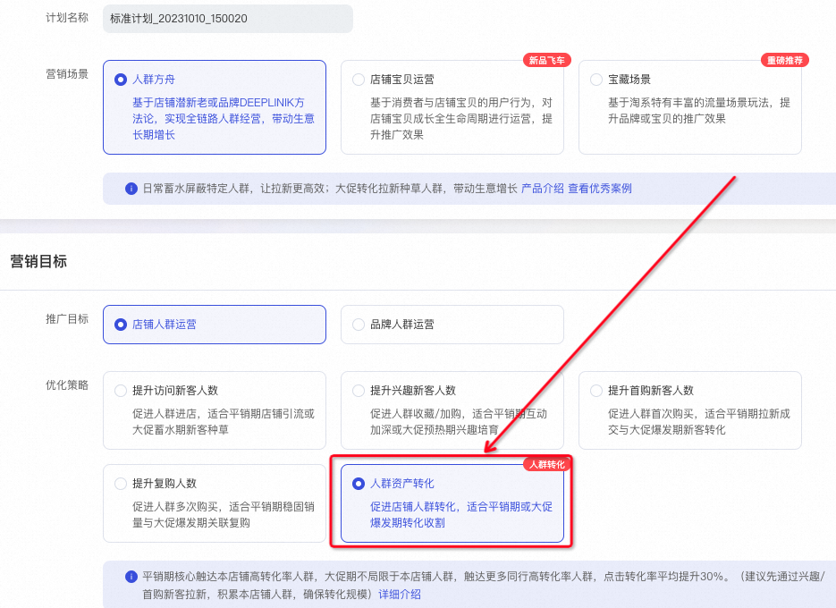
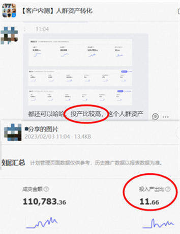
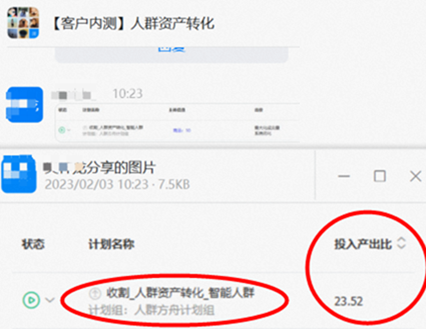
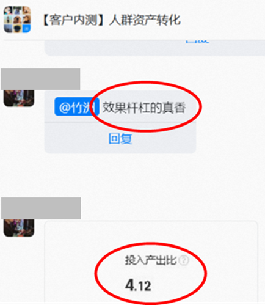

# 「人群资产转化」：大促利器，人群资产高效转化

> 来源：https://alidocs.dingtalk.com/i/nodes/QG53mjyd800agdlKHprgmG9A86zbX04v

**原语雀文档链接：**https://yuque.antfin.com/chenchun.chen/gqhty9/erc94o6rvraoszfv

---

# 一、产品背景

“人群方舟，拉新增长了人群，后面怎么转化呢”

**人群资产转化**火热来袭，**定向收割高转化人群，拉动生意爆发！**

1、收割宝贝高转化人群，**ROI提升30%（对比普通计划）**；

2、聚焦高转化猜你喜欢流量，**低转化**资源位过滤比例60+%**；

3、特别预告，双11大促期**限时开启，定向收割同行高转化人群**！

**产品路径：新建计划-人群方舟-人群资产转化**（其他计划设置同人群方舟其他计划）

# 二、客户好评

#原声截图

# 三、使用建议

定向人群，可以使用**智能定向与自定义定向，自定义定向建议使用目标人群扩展等大规模人群**

**（不建议单独使用小二推荐/喜欢我店铺/喜欢我宝贝/深度行为等人群，可能影响收割规模）**

出价预算，**最大化成交量出价长期ROI等转化效果较好**（短期PPC可能较高），**自定义出价短期PPC等可控性更强**

其他，投放主体建议使用店铺核心货品投放，资源位/创意同人群方舟其他计划

# 四、Q&A

更多问题欢迎进群咨询41936745
