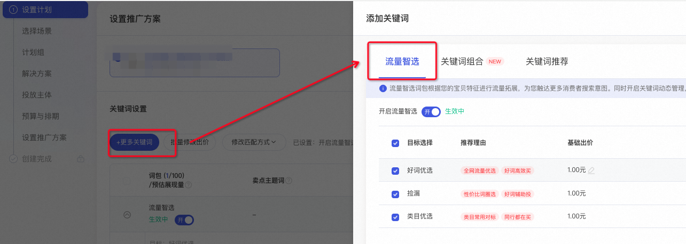
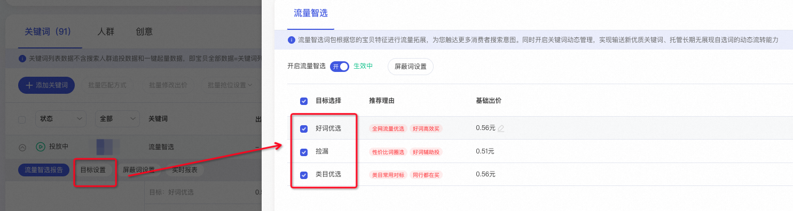
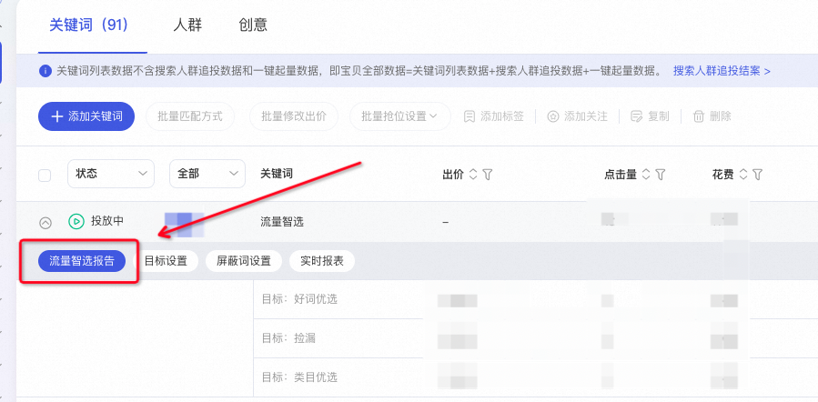
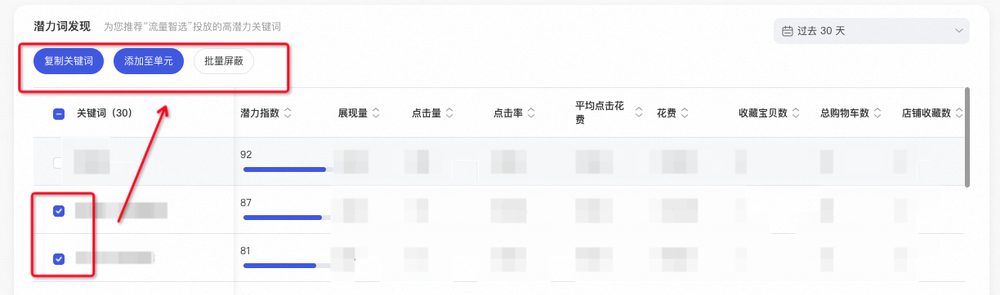
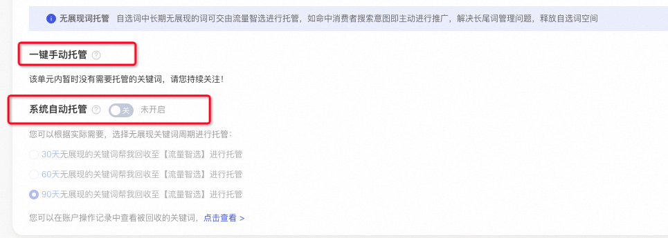
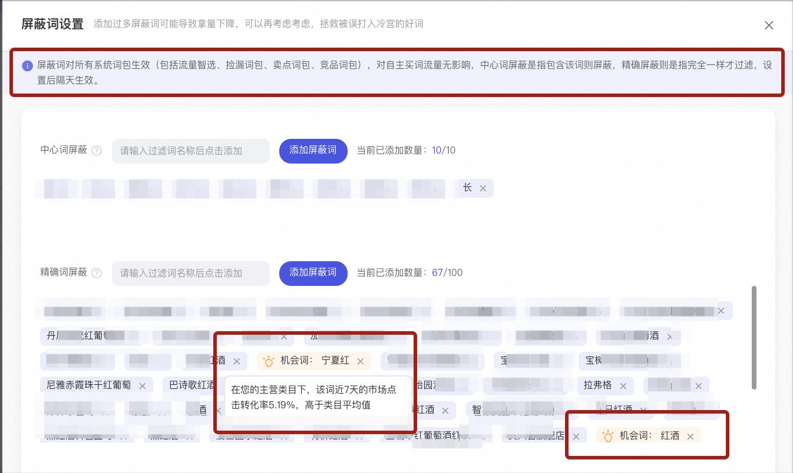
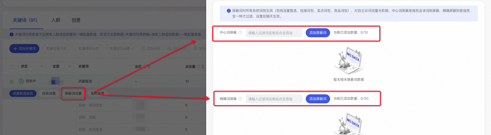
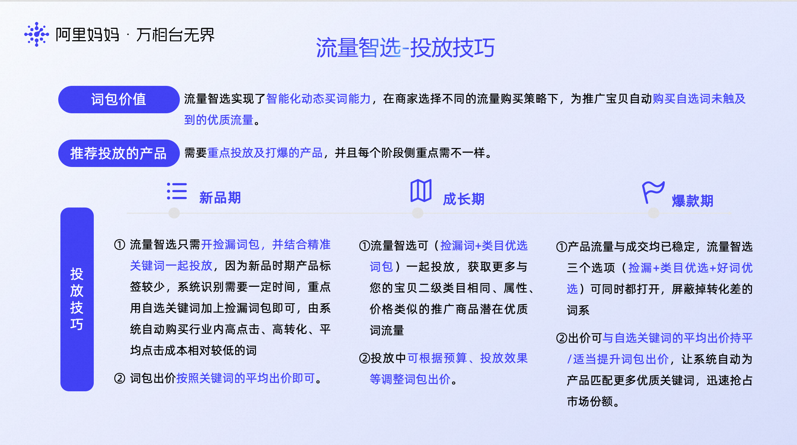

# 关键词推广-流量智选词包

> 来源：https://alidocs.dingtalk.com/i/nodes/QOG9lyrgJPPNL2rXI2RzAPapJzN67Mw4

**原语雀文档链接：**https://yuque.antfin.com/chenchun.chen/gqhty9/yy1kmlg0namg9vuo

---

# 一、功能入口

**操作路径：**万相台无界版-关键词推广-添加更多关键词-流量智选

# 二、目标设置

流量智选词包根据您的宝贝特征进行流量拓展，为您触达自选词未触及到的更多消费者搜索意图。同时开启关键词动态管理，实现输送新优质关键词，目标可选：好词优选、捡漏、类目优选。

### 1、捡漏

系统智能自动购买行业内高点击、高转化，平均点击成本相对较低的词，帮助商家捡漏。

### 2、类目优选

系统智能自动购买与您的宝贝二级类目相同，属性、价格类似的推广商品优质词，帮助商家流量争夺。

### 3、好词优选

系统根据宝贝特征进行流量拓展，并基于关键词优选的逻辑，为您触达更多高效的消费者搜索意图。

# 三、流量智选报告

### 1、操作路径

关键词列表-开启流量智选词包-点击【流量智选】即出现下图中的【流量智选报告】

### 2、潜力词发现

商家可将系统披露出的潜力词，复制到本单元进行广泛匹配或精准匹配投放、或者添加到其他单元投放、或进行批量屏蔽。

### 3、无展现词托管

自选词会占用买词的配额。交给系统托管后，如果这个词长期没有展现/用户搜索、就先不单独投放、占用自选词配额。等有用户搜索了命中有展现了、自动购买。

因此自选词中长期无展现的词可交由流量智选进行托管，如命中消费者搜索意图即主动进行推广，解决长尾词管理问题，释放自选词空间。

托管方式包括两种：手动托管、系统自动托管，如下图：

​

#

# 四、屏蔽词设置

## 屏蔽词升级

2024年1月，关键词场景对【流量智选】中的【屏蔽词】功能做了升级优化。

**升级内容**：透出屏蔽词的背后价值。

例如屏蔽了某个词后，系统开始计算商家近7天投放过程中，被屏蔽的该词的相关数据，包括点击率、点击转化率、引导成交笔数、引导收藏加购笔数、市场转化率、间接助攻价值等等。

**升级目的**：帮助广告主更好的理解词背后的价值。

·应对屏蔽词后导致整体投放效果下降、拿量减少等特殊情况的自查与优化处理。

·更精准的屏蔽质量差的词，优化买词&流量结构，提升投放单元的ROI。

**​**

**常见问题：**

**为什么有的屏蔽词不会出现背后的价值数据：**

数据主要统计店铺内近七天的投放数据，如果该词近七天都没有数据、则可能不透出数据。

如果出现屏蔽词数量很多、且近期都有数据的情况，由于计算量过大、暂时选取其中20%的词进行计算展示词背后的价值。如果想看更多词的价值，可以先删除部分屏蔽词进行查看

**为什么设置屏蔽了、这个词还有展现/流量：**

设置的屏蔽词**仅对该单元生效**。需要先查看其他计划单元内是否有投放该词。

设置屏蔽某词、**第二天才会正式生效**、屏蔽流量。屏蔽当天可能会有部分流量展示。

查看屏蔽的是中心词、还是精确词。中心词的屏蔽不等于词的广泛匹配逻辑。词的广泛匹配的流量范围大于中心词。

设置的屏蔽词在当前单元生效，系统词包（包括流量智选、卖点词包等）将于第二天停止屏蔽词的投放。中心词屏蔽是指包含该词就进行屏蔽，精确词屏蔽是指对完全一样的词进行屏蔽。

## 1、中心词屏蔽

含该词会进行屏蔽，举例：屏蔽【连衣裙】，那么【碎花连衣裙】【女式连衣裙】【短款连衣裙】【连衣裙新款】等均会屏蔽。

屏蔽词数量上限：10个

## 2、精准词屏蔽

等于该词或同义词会屏蔽，举例：屏蔽【女式连衣裙】，那么【女式连衣裙】【女连衣裙】会被屏蔽，逻辑等同于精准匹配。

屏蔽词数量上限：50个

## 2、精准词数量提升

**申请门槛**

如果近30天内关键词场景消耗超过2000元，可以申请屏蔽词数量上限提升至100个。

如果近30天内关键词场景消耗超过10000元，可以申请屏蔽词数量上限提升至200个。

**申请途径：**通过阿里妈妈后台提交客服工单。

# 五、投放技巧

