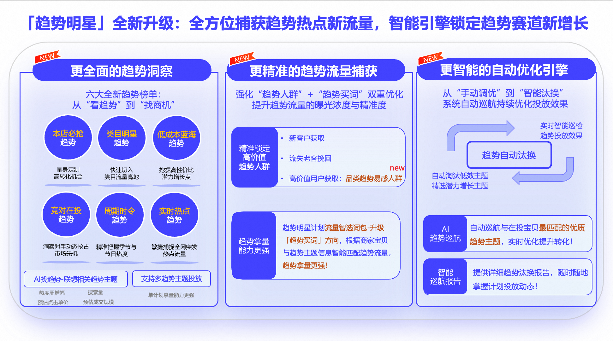
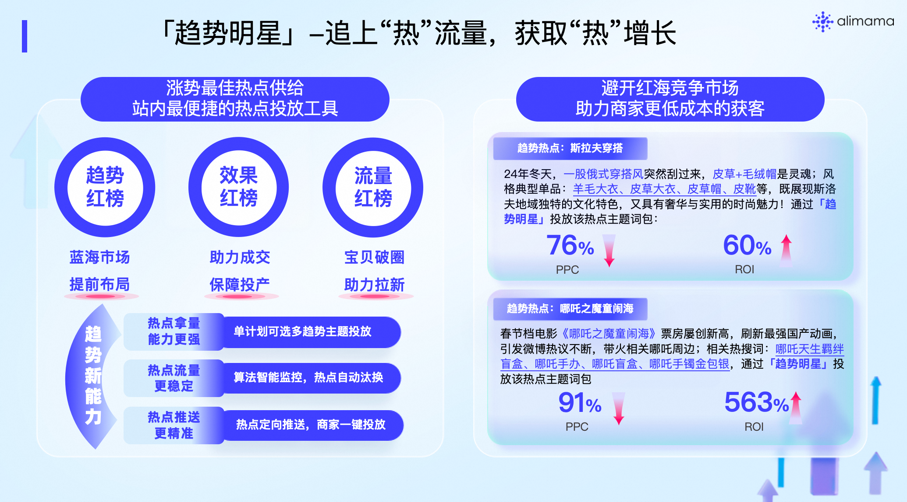
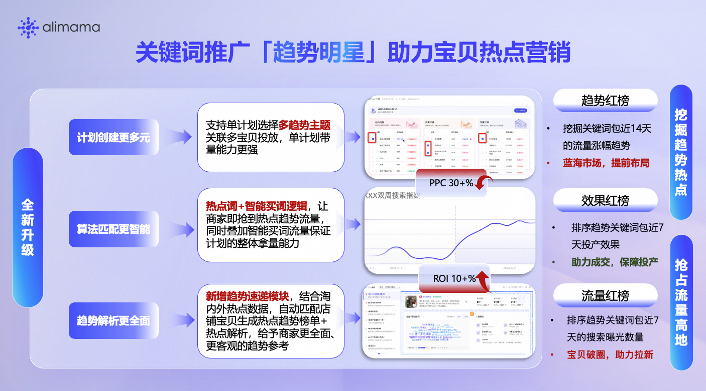
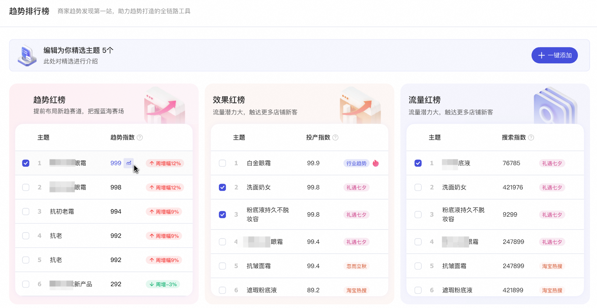
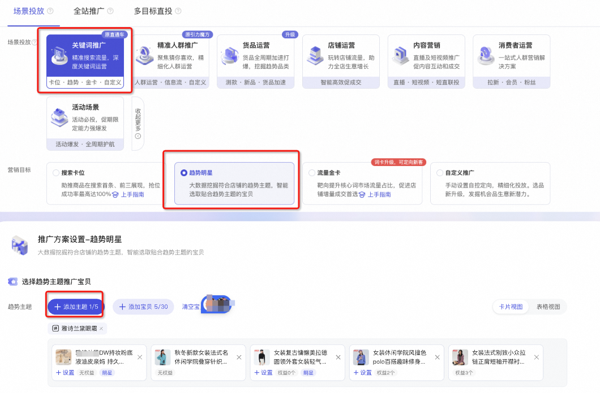
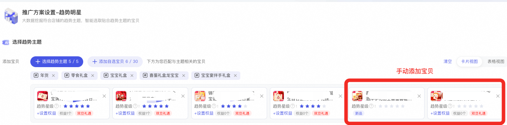

# 3-「趋势明星」追“热”流量，获取“热”增长

> 来源：https://alidocs.dingtalk.com/i/nodes/QOG9lyrgJPPNL2rXI2pQYY2RJzN67Mw4

# **一、趋势明星全新升级****内测招募中**

### **1、升级亮点**

**本次趋势明星全新升级：**

| **1、【更全面的趋势洞察】****全新趋势榜单升级，从“看趋势”到“找商机”**：从商家实际经营需求出发，重磅推出六大实战趋势榜单，全方位涵盖全网趋势热点，AI找趋势，支持商家自定义趋势词AI全网联想相关主题推荐,让机会清晰可见！支持多趋势主题同时投放，单计划拿量能力更强！ **2、【更精准的趋势流量捕获】****强化“趋势人群”+“趋势买词”双重优化，提升趋势流量的曝光浓度与精准度**：趋势人群-高价值用户获取新增【品类趋势易感人群】，精准锁定高价值趋势人群，趋势明星计划流量智选词包-升级「趋势买词」方向，根据商家宝贝与趋势主题信息智能匹配趋势流量，趋势拿量更强！ **3、【更智能的自动优化引擎】从“手动调优”到“智能汰换”系统自动巡航持续优化投放效果**：帮助商家自动巡航与推广单元最匹配最优质最时兴的趋势主题，稳定增强投放效果。 |
| --- |

### **3、操作说明**

| **升级点** | **商家价值** |
| --- | --- |
| **升级点1**： **趋势明星-选择趋势主题，新增六大趋势主题推荐榜单：** ①本店必抢趋势；②类目明星趋势；③低成本蓝海趋势； ④竞对在投趋势；⑤周期时令趋势；⑥实时热点趋势； **图例示意**： | **商家价值**：六大实战趋势榜单，全方位多角度涵盖全网趋势热点！ (效果) 本店必抢趋势：为您量身定制的高转化机会； (流量) 类目明星趋势：快速切入类目流量高地； (成本) 低成本蓝海趋势：高性价比的潜力增长点； (竞争) 竞对在投趋势：洞察对手动态，抢占市场先机； (时令) 周期时令趋势：精准把握季节与节日热度； (热点) 实时热点趋势：敏捷捕捉全网突发流量； |
| **升级点2：** **1、新增AI趋势联想能力**：支持通过关键词/本店宝贝/竞店宝贝联想相关趋势主题； **2、趋势洞察指标升级**：提供店铺商品数、热点周增速、搜索量、预估点击单价指标，助力商家多角度了解趋势主题数据表现，选择高价值趋势投放！ **图例示意**： | **商家价值**：从“找趋势”到“选对趋势”！ 只需输入关键词或宝贝信息，AI即可为您智能联想高相关性的趋势主题，提供源源不断的增长灵感与竞争策略。丰富洞察指标： 告别凭感觉投放，新增多维洞察数据，让您一眼看透趋势的“含金量”，轻松选出高价值、高性价比的投放目标！ |
| **升级点3**： **新建计划流程内新增趋势汰换能力**：默认选中，根据您的推广单元与所选趋势主题流量变化情况，做趋势主题汰换，并提供主题汰换详细数据； 汰换规则： **自动汰换规则**：实时监测趋势明星计划宝贝投放效果数据（CVR或ROI），当低于同类目同价格带商品的大盘均值*50%，将会汰换并增加和宝贝相关且预估效果好的趋势。 **图例示意**： | **商家价值**：智能巡航，效果永续！ 系统将自动监控并汰换已过时或效果衰退的趋势，无需您再手动调整，极大解放人力！ 通过动态捕捉最新、最优质的趋势，确保持续、稳定地增强投放效果，实现长效增长！ |
| **升级点4**： 趋势人群-高价值用户获取新增**【品类趋势易感人群】**，精准锁定类目高价值趋势人群。 **图例示意**： | **商家价值**：从“追趋势”到“找对人”！ 精准锁定品类趋势易感人群，精准聚合了对您所属类目趋势最敏感、消费意愿最强的核心增长客群，侧重对类目下被趋势“种草”的高意向用户进行投放，提升转化效果！ |
| **升级点5**： ①趋势明星计划提供专属**「趋势买词」投放能力**，基于所选趋势主题和宝贝特征，智能拓展相关趋势流量，提升趋势拿量能力！ ②同时提供**趋势明星专属结案报表**，查看**分主题详细投放数据和TOP关键词**，帮助商家详细了解投放效果，及时调优！ **图例示意**： | **商家价值**：智能拓量，精准引爆：全面释放趋势流量的增长潜力！ 趋势买词将根据您选择的趋势主题和宝贝特征，智能匹配及拓展相关趋势流量进行投放，提升流量相关性，趋势拿量更强！ |

---

**历史版本：**

# **一、产品能力概览**

**本次全新升级覆盖3大维度：****计划创建更多元-支持单计划选择多趋势主题创建、算法匹配更智能-热点词+智能买词逻辑、趋势解析更全面-全新趋势速递重磅上线****。**

升级点1-单计划多主题投放：本次升级打破了之前一个计划只能选择一个趋势主题的限制，支持单计划选择多趋势主题关联多宝贝投放，商家可以为一个宝贝选择多趋势主题投放，或者为多个宝贝选择多趋势主题投放，计划创建更简洁。

升级点2-算法更智能：区别于其他智能计划智能买词逻辑，趋势明星叠加了「趋势主题词」单独跑量通道，系统会优先围绕趋势主题词进行投放，让商家抢到热点趋势流量，同时叠加智能买词流量保证计划的整体拿量能力，新版趋势明星，拿量的精准度和拿量能力双提升。

升级点3-趋势速递全新上线：在洞察板块-新增趋势速递模块，结合淘内外热点数据，自动匹配店铺宝贝生成热点趋势榜单+热点解析，并融合趋势指数、搜索指数、竞争热度、关键词云、趋势画像相关数据，给予商家更全面、更客观的趋势参考。

# **二、具体升级详情与用户价值**

| **具体升级模块** | **价值** |
| --- | --- |
| **升级点** **新增：算法自动推荐精选趋势主题** **迭代：单计划支持选择多趋势主题** 图例示意 注：单计划最多选择5个趋势主题，绑定30个宝贝 | **商家价值** 避免趋势宝贝计划重复创建； 单计划拿量能力更强 |
| **升级点** **迭代：叠加热点词单独跑量通道+智能买词逻辑** | **商家价值** 热点词匹配助力商家抢到热点趋势流量； 智能买词叠加保证计划的整体拿量能力，新版趋势明星，拿量的精准度和拿量能力双提升 |
| **升级点** **迭代：榜单界面升级优化，全新榜单数据解读** 图例示意 1、趋势红榜增加：详细趋势热点增幅数据 2、点击图例可查看搜索词前周和本周数据对比 | **商家价值** 趋势主题数据对比更直观，方便商家对趋势主题增幅数据进行评估； 全新榜单界面升级，交互体验更优 |
| **升级点** **迭代：联想趋势主题推荐优化** **迭代：联想趋势主题数据查看体验优化** **新增：增加趋势主题选择与宝贝匹配汇总提示** 图例示意 1、选中趋势主题，算法自动推荐联想主题，联想趋势主题自动推荐关联宝贝数量 2、趋势主题选择界面，选择完趋势主题，系统自动提示选择的趋势主题数量和关联宝贝数量 3、数据解读优化，合并之前单个数据表，并增加双周数据对比 | **商家价值** 联想趋势主题帮助商家进一步对趋势关键词进行拓展； 联想趋势主题（搜索指数、竞争指数等）数据呈现合并，方便商家便捷对比各维度数据； 趋势主题选择页面总结提示商家趋势主题选择数量和宝贝绑定数量，优化商家使用体验 |
| **升级点** **新增：趋势速递趋势热点解读模版** 图例示意 | **商家价值** 结合淘内外热点数据，自动匹配店铺宝贝生成热点趋势榜单+热点解析，帮助商家更客观评估趋势热点和店铺宝贝的相关性； 一键创编计划，有合适的趋势热点可直接匹配宝贝创建计划，计划创建更便捷 |
| **升级点** **支持商家手动编辑趋势主题** **开启自动替换趋势主题功能，算法智能为推广宝贝替换最新最热趋势主题** **商家可以查看算法自动汰换趋势主题的记录** | **商家价值** 存量计划可以更换趋势主题，不用担心趋势热度消退，影响计划拿量！ 算法智能巡航，自动汰换，商家不用时刻紧盯计划，为商家投放减负 |
| **升级点** **支持根据宝贝查找趋势主题，实现从货品视角推荐趋势主题** | **商家价值** **帮助商家补足挖掘趋势思路** |

# **三、趋势明星-趋势榜单解读**

**趋势榜单释义**

**趋势红榜**：智能推荐店铺宝贝所在行业趋势红榜，根据趋势主题关键词包过去14天的流量涨幅趋势计算得出，倒序排列，排序越靠前，说明该趋势主题关键词包增长趋势越好，**属于蓝海赛场，商家可提前布局**；

**效果红榜**：智能推荐店铺宝贝所在行业效果红榜，根据趋势主题关键词包近7天投产效果进行倒序排列，趋势主题排序越靠前，表示该趋势主题关键词包投产越高。**商家如果想保投产效果或者店铺收割，可选择该趋势主题，可助力店铺带来更多的成交；**

**流量红榜**：智能推荐店铺宝贝所在行业流量红榜，根据趋势主题关键词包近7天的搜索词曝光数量进行数据倒排，趋势主题排序越靠前，说明该趋势主题词近一周的搜索量越大，该趋势主题关键词具有一定的流量潜力，**比较适用于店铺破圈、拉新。**

# **四、操作说明**

**1、在关键词推广场景下，选择趋势明星-趋势主题-找到匹配店铺的趋势热点主题，绑定宝贝投放**

# **五、****优质案例**

|  |  |  |
| --- | --- | --- |

# **六、常见问题**

**1、新版趋势明星单计划最多选择几个趋势主题绑定多少宝贝**

单计划最多选择5个趋势主题，绑定30个宝贝

**2、利用趋势查询，查询关键词，没有该关键词数据什么意思？**

利用趋势查询-查询关键词的数据，不是所有的关键词数据都有展现。当查询关键词昨日搜索PV>=500时，才会展现，可以选择该趋势主题绑定宝贝投放；当该关键词昨日搜索PV<小于500，说明近期搜索PV较低，即使绑定该趋势主题进行投放，结果可能也不会太好，则系统设置了展现限制。

**3、每日预算推荐和选择趋势主题数量的多少有关系吗？**

没有关系；每日预算推荐是根据绑定宝贝的数量来推荐的，和趋势主题选择的数量没有关系

**4、趋势明星和趋势速递要如何选择？**

当你有明确的关键词投放需求时，可直接通过趋势明星进行计划创建；当你想了解近期有哪些热点跟自己的店铺和类目相关，可通过「趋势速递」了解。不论是趋势明星还是趋势速递，都是创建「趋势明星」的计划。

**5、趋势明星升级后，会不会自动合并升级前创建的计划**

趋势明星升级后，不会自动合并和影响之前的计划，建议和之前的计划做对比，升级后新建计划稳定投产更好后，可以适当关停之前的计划

**6、趋势明星：系统精选主题推荐的逻辑是什么**

算法基于淘内外的数据，会依次从效果红榜和流量红榜挑选趋势增幅比较好的趋势主题作为精选主题推荐

**7、新建计划会不会影响历史计划**

算法逻辑上不影响，跑的是不同的流量池。如果新版趋势明星的新计划拿量能力更强，效果更好。原先历史趋势明星和新计划绑定同一宝贝的计划，可以暂停。原则上同一个广告产品下，不要建两个差不多完全相同的计划。

**8、新版趋势明星，单个计划选择了多趋势主题，跑的是主题词包还是主题词**

新版趋势明星，选择多趋势主题，跑的是热点**主题词包**，不是单个词

**9、****趋势明星计划里面，查看关键词结案：如何分辨哪些是趋势主题词包？哪些是手动添加的关键词？哪些是手动添加的词包？**

以“连衣裙”为例

趋势主题词包： *连衣裙*

手动添加的关键词：连衣裙

手动添加的词包：#连衣裙#

**10、新版趋势明星，计划单元-关键词*XXX*是什么意思，能关闭吗？**

*XXX*：是趋势热点词包，本次升级，趋势热点词包设置了单独的跑量通道，增强了热点拿量能力；但是如果热点消退造成拿量效果不好，可以关闭；下次迭代版本会新增热点趋势主题自动汰换的功能，防止因热点消退造成拿量效果变差的问题

**11、趋势明星，流量智选建议关闭吗？怎么关闭**

**趋势明星除了热点拿量，也会从宝贝标签维度**（展现、点击、收藏加购、历史成交数据等）**拿量**作为流量补充，计划建立一开始就关闭流量智选，肯定影响计划整体拿量能力，不建议关闭。

如果流量智选有些关键词拿量不精准，转化效率低，可以手动进行屏蔽；或者好词优选词包、捡漏词包、类目优选词包，某个词包跑量效果整体较差，也可以对某一个词包进行关闭

|  |  |
| --- | --- |

**12、趋势明星趋势榜单无推荐是什么原因**

出现这种情况可能是**该店铺是新店新宝贝链接**，宝贝无历史成交数据标签，趋势榜单根据宝贝的历史成交数据和标签进行推荐，无数据的话就没有推荐，可以通过趋势联想主题手动搜索趋势主题进行投放，积累一些数据就有推荐了

**13、趋势榜单的更新时间是多久**

趋势榜单正常更新时间是T+1，也就是**今日更新前一天最近历史趋势热点数据**

**14、趋势明星手动添加的宝贝，无宝贝趋势星级是什么原因**

没有星级的原因是因为**该宝贝是手动添加的宝贝**；趋势主题的推荐是前一天算好的，自动给宝贝打上星级，如果是商家自己添加的宝贝，无法实时计算星级，但是没有星级，并不代表该宝贝竞争力差哈，只是系统无法实时计算出来

| **趋势明星全新升级相关问题可以进群交流** 商家钉钉群号： 96330025358 |  |
| --- | --- |
