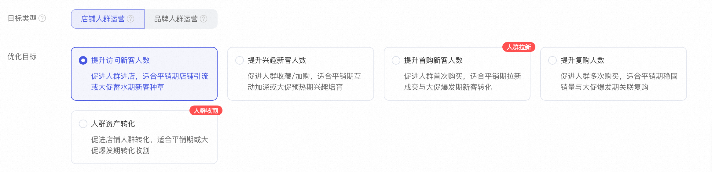
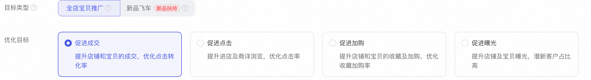
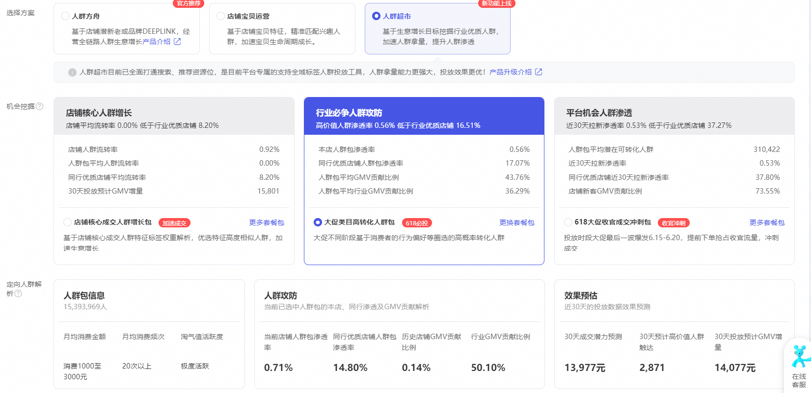
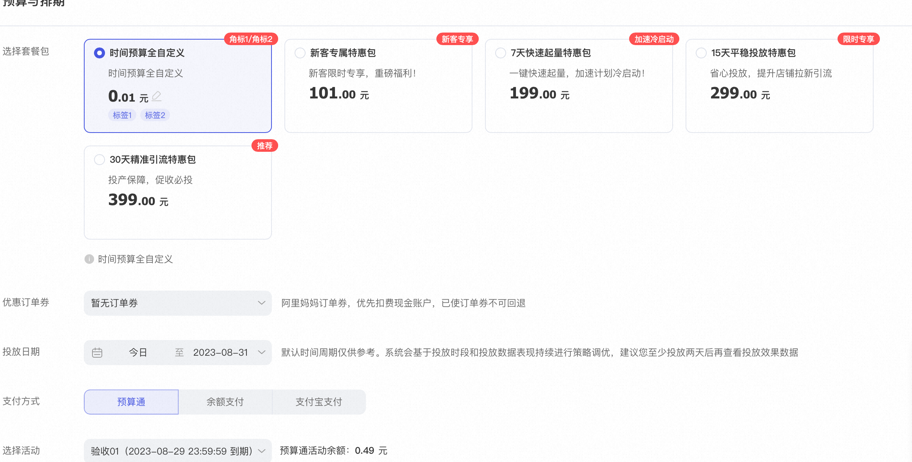

# 营销解决方案区别

> 来源：https://alidocs.dingtalk.com/i/nodes/Qnp9zOoBVBDEydnQU4mLj0Nv81DK0g6l

**原语雀文档链接：**https://yuque.antfin.com/chenchun.chen/gqhty9/evghyht2mqacegly

---

### 功能玩法介绍

人群方舟人群精准拉新，完成高效收割**优化目标多样**多种优化策略，提供拉新至转化全链路人群培育路径**大促高效转化**投放[人群资产转化]，核心触达高转化人群流量，完成收割**新享礼金特权**全链路透标权益产品助力商家提升转化率，高效获新客

**店铺宝贝运营**围绕宝贝特征，匹配兴趣人群**加速新品推广**投放[新品飞车]，获平台专属流量扶持，解决新品推广难题**挖掘潜在人群**链接相似宝贝人群、店铺人群，帮助获取宝贝潜在人群**促进效果提升**投放[促进点击]，支持成本保障机制，提升推广效果

**人群超市**全域标签人群渗透提升**多角度人群洞察**三个角度解析店铺与同行人群现状与价值，充分把握人群！**机会人群全面挖掘**细分人群，透视人群画像，全域精准锁定人群！**人群效果可视化**对投放人群贡献GMV及渗透提升预估，高效转化人群！

### 精准人群推广中各营销场景的区别

人群方舟是以店铺人群为链接去拓展推广，宝贝运营是以商品标签为链接去触达投放。

#### 人群方舟​

人群方舟是通过店铺行为人群进行链接扩展，计划链路的整体状态是流转承接，以增加新客人群作为计划的底层逻辑。

**拉新计划：**客单价较高且转化周期较长的商家建议使用**提升兴趣新客**为主。
客单价较低的商家可以试试**提升首购新客**为主。

**收割计划：**客单价较高且转化周期较长的商家建议使用**提升首购新客**为主，周期性使用**人群资产转化**。
客单价较低且转化周期较短的商家建议使用**人群资产转化**为主，适当使用**提升首购新客**。

#### 店铺宝贝运营

店铺宝贝运营的推广是通过消费者与商品宝贝的用户行为投放运营，逻辑原理是基于店铺商品标签去连锁相似宝贝、店铺人群。

**拉新计划：**拉新引流建议使用**促进点击搭配新品飞车**，两者配合加速新品获流，大幅度提升新品推广效率。

**收割计划：**客单价偏高，转化周期较长建议商家使用**促进加购计划**为主。
日消品等转化周期短，客单价低建议商家使用**促进成交计划**为主。
新品拉新转化建议**全店宝贝推广搭配新品飞车**设置计划，以新品飞车为主，两者搭配，实现商品快速获流、转化。

#### 人群超市

平台帮助商家在面对运营时所面对的不同场景、推广方向和商家需求，提供从店铺、行业以及平台三个维度进行分层。让商家可根据自己的计划目的去挑选合适的人群包，节省商家的时间成本、提升运营效率。

#### 特惠包

特惠包是平台针对新用户、对平台理解不够或者运营比较薄弱的商家提供的帮助。平台提供商家人群流量包，协助商家进行推广，减少商家运营成本的消耗。通过系统帮助商家高效率的获取流量，30天全周期系统智能优化托管，让商家投放无忧。

####
