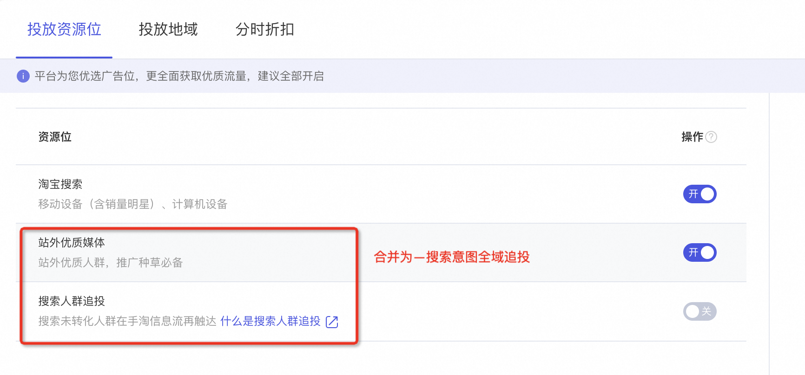
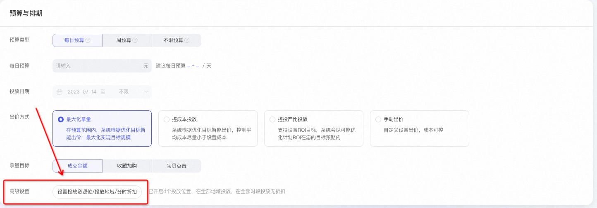
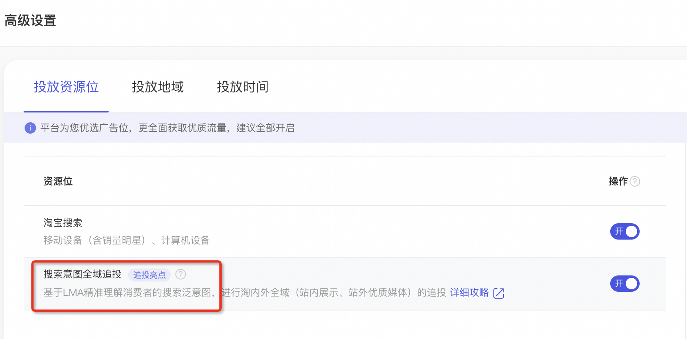
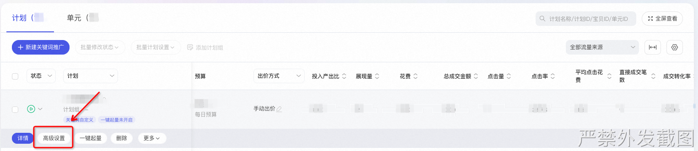
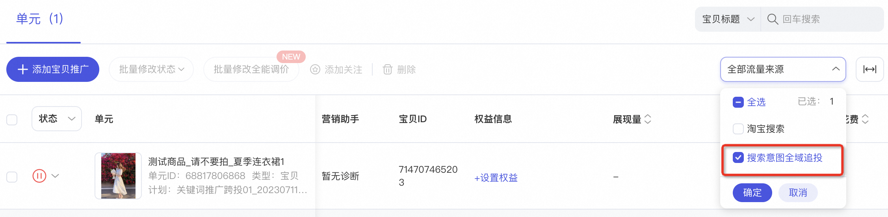
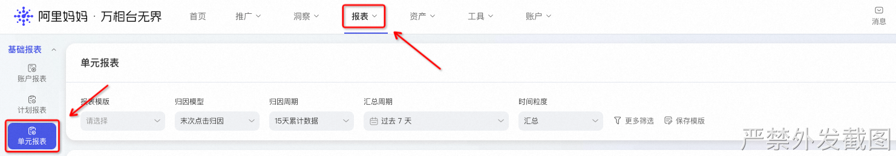
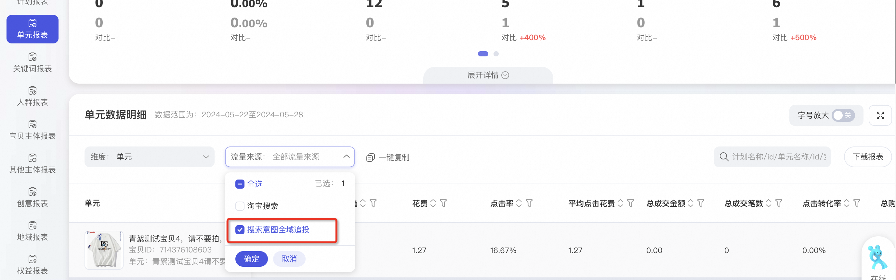
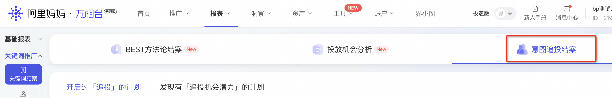
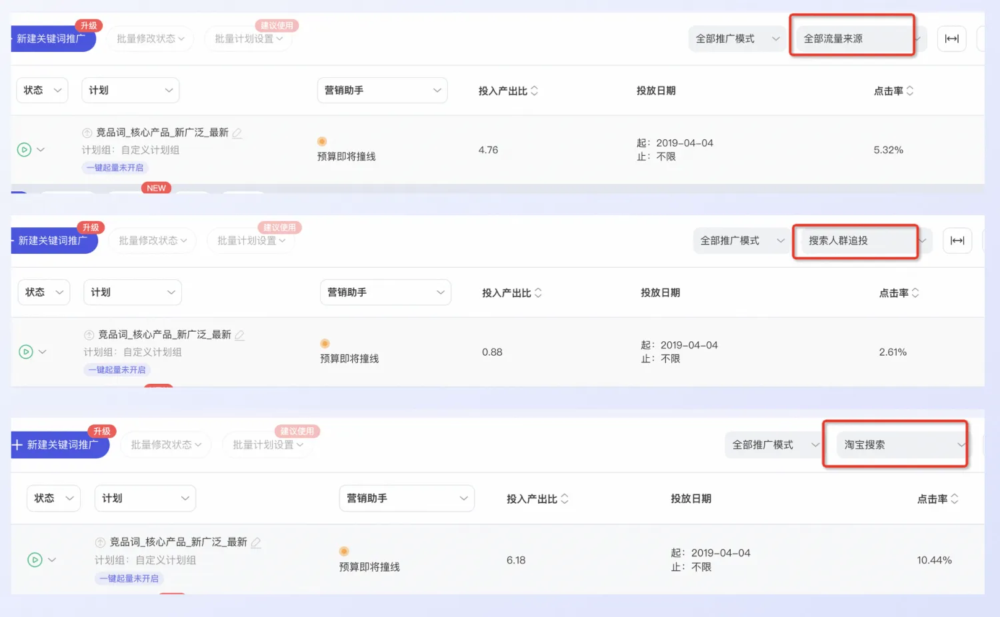

# 什么是搜索意图全域追投？

> 来源：https://alidocs.dingtalk.com/i/nodes/Qnp9zOoBVBDEydnQU4mLjEE381DK0g6l

**原语雀文档链接：**https://yuque.antfin.com/chenchun.chen/gqhty9/ca2ro3kmxgqg6g59

---

**⭐️⭐⭐**** **原搜索人群追投、站外优质媒体合并升级为：搜索意图全域追投。此次升级，暂不需要商家进行任何操作。

已经开通功能商家欢迎加入钉钉群反馈您遇到「搜索意图全域追投」功能的问题，小二及时解答～

## 1.1 升级内容

**【搜索意图全域追投】**（以下简称意图追投）是万相台无界关键词推广场景重磅升级功能，原搜索人群追投、站外优质媒体合并升级而来，助力商家低成本获得全域高性价比流量增量。以消费者搜索行为为基准，提前预判消费者搜索意图。基于阿里妈妈LMA大模型还原消费者真实生活场景，充分理解消费者商品偏好，对消费者特征和消费者选择进行精细的推理，对消费趋势归类、研判、预测，帮助商家把握趋势消费需求，给到消费者更加丰富且精准的跨品类商品选择。

### 1.1.1 升级亮点

**⭐️⭐⭐****低成本、全域触**达高搜索意图人群，**获得额外转化。**
**⭐️⭐⭐**操作简便，**实时追投，**LMA大模型为您智能追踪潜在消费者。

**⭐️⭐⭐****不挤压搜索预算**，只有当搜索渠道花不出去，或者在其他渠道拿到更具性价比的流量，才会投放。
**⭐️⭐⭐****不影响质量分，**追投的广告效果不影响在搜索渠道的投放。

### 1.1.2 对不同商家有何影响

合并资源位之前和之后，对商家到底有什么影响？（✅代表功能开启，❌代表功能未开启）

| **合并前** | **合并后** | **影响** | **建议** |
| --- | --- | --- | --- |
| 搜索人群追投❌ 站外优质媒体❌ | 搜索意图全域追投❌ | 不影响。 | 建议开启，“搜索意图全域追投”，获取更多高价值增量流量。 |
| 搜索人群追投❌ 站外优质媒体✅ | 搜索意图全域追投✅ | 获得更多站内优质推荐流量，ROI会提升。 在“站外资源优质媒体”基础上，帮助您在站内推荐流量（首页猜你喜欢与购后猜你喜欢）上选择优质、高性价的流量，带来流量增量，且ROI会有提升机会。 | 无需操作，ROI 有机会提升。 |
| 搜索人群追投✅ 站外优质媒体❌ | 搜索意图全域追投✅ | 获得更多更多站外优质媒体流量增量。 在“搜索人群追投”基础上，帮您在站外选择高性价流量，保持投放ROI稳定的情况下，带来流量增量。 | 无需操作，ppc有机会下降。 |
| 搜索人群追投✅ 站外优质媒体✅ | 搜索意图全域追投✅ | 基本不影响。 通过LMA的能力升级对消费者的意图识别更精准，投放效果更佳（部分商家拿量可能略有波动）。 | 无需操作。建议关注升级后投放情况。 |

### 1.1.3 什么是消费者搜索意图词？

—— 以消费者搜索行为为基准，利用LMA大模型还原消费者真实生活场景，充分理解消费者商品偏好，提前预判消费者搜索意图。基于对消费趋势归类、研判、预测，给到消费者更加丰富且精准的跨品类商品选择。

例如：

| ** 用户行为** **​** **​** | ** 算法预判意图类型** **（基于历史购买及浏览行为预判）** **​** | **触达内容** **​** **​** |
| --- | --- | --- |
| 搜索过年会穿什么（年会裙、年会礼服） | 同品类再次触达 | 年会裙、年会礼服、新中式礼服 |
| 近期搜索并购买了“年会礼服” | 关联品类触达 | 高跟鞋、配饰 |
| 收藏过猫爬架用品 | 未来需求品类触达 | 猫猫零食、猫猫玩具 |

（建议放大图片查看）

​

### 1.1.4 推广原理

| 消费者在手淘搜索 （图片仅供演示说明） | 站内信息流触达 （图片仅供演示说明） | 站外优质媒体触达 （图片仅供演示说明） |
| --- | --- | --- |
|  |  |  |
| 通过关键词推广计划投放 | 开启搜索意图全域追投，算法智能圈选搜索意图人群投放。 | 开启搜索意图全域追投，算法智能圈选搜索意图人群投放。 |

出价方式：延用计划的出价模式，即开启前计划为手动出价，则开启后意图追投部分也为手动出价；开启前为最大化拿量的出价方式，则开启后意图追投部分也采用最大化拿量的出价方式。

扣费方式：按点击扣费，展现不扣费。

投放资源位: 投放至首页猜你喜欢、购后猜你喜欢，站外优质媒体资源位。

创意: 开启搜索意图全域追投后自动生成的黑盒创意，仅投放到站内展示渠道。暂不支持编辑和解绑，如果创意被拒可能与创意素材过少或者特殊类目不允许投放有关。​

效果: 近一个月内，开启意图追投的计划对比开启追投前，展现量平均提升29%，点击量平均增加27%，平均点击成本下降11%，成交规模平均增长15%。（不同出价方式，不同货品类型表现会存在差异）。​

## 1.2 操作后台变化

​计划投放位置「投放资源位」，站外优质媒体、搜索人群追投资源位合并升级为搜索意图全域追投。

计划列表页「流量来源」，站外优质媒体、搜索人群追投资源位合并升级为搜索意图全域追投。

单元列表页「流量来源」，站外优质媒体、搜索人群追投资源位合并升级为搜索意图全域追投。

单元详情页-关键词&人群&创意列表页中，站外优质媒体、搜索人群追投资源位合并升级为搜索意图全域追投人群。

单元报表&关键词报表，站外优质媒体、搜索人群追投资源位合并

## **1.3 升级节奏 **

5.28：功能发布，平台通知此次升级内容、细节、及商家常见问题。

5.28-6.3 ：客户内测，走查整体投放链路。

6.3-6.17：平台逐步为商家后台进行升级，不需要商家额外进行任何操作。

# **二、如何操作？**

## **2.1 开启搜索人群追投**

### **2.1.1 新建计划如何打开？**

新建关键词推广>>>预算与排期>>>高级设置>>>投放资源位>>>搜索意图人群全域投放

投放资源位选择搜索意图全域追投即可

### **2.1.2 **已有计划如何打开？

关键词推广>>>计划列表>>>计划>>>高级设置>>>投放资源位>>>搜索意图全域追投​

投放资源位打开搜索意图全域追投即可

## **2.2 如何看**搜索意图人群全域投放**数据？**

目前搜索人群追投的数据**支持以下三种方式**查看，搜索意图全域追投的专属结案已上线。

### **2.2.1 **实时数据查询

操作路径：关键词推广>>>计划/单元列表下>>>全部数据来源>>>只勾选搜索意图全域追投

### **2.2.2 **报表数据查询

操作路径：报表>>>基础报表>>>单元报表>>>单元数据明细>>>流量来源>>>搜索人群追投

点击全部数据来源-下拉至最下方-勾选搜索意图全域追投。

### **2.2.3 **结案数据查看

操作路径：报表>>>关键词推广>>>关键词结案>>>意图追投结案

功能价值：获取到更为详细的系统追投数据，包括意图追投人群流转情况、特征人群、意向关键词、潜力好货。

**结案包含4个模块**

1. 【人群流转详情】

开启意图追投后，呈现追踪精准人群的全流转周期，了解推广过程中人群流转链路，核心经营数据的披露，帮助商家优化生意经营策略。

2. 【优质人群特征】

意图追投过程中，发现更多优质人群特征，帮助商家定位转化率最高的人群，助力精准营销。

3. 【好词发现】

意图追投过程中触达效率最高的意图词。

4. 【好货发现】

洞察店铺内宝贝在搜索流内的竞争激烈程度，及时开启搜索人群追投功能，避开激烈竞争，实现高效快速拿量。

​

# **三、高频疑难问题（FAQ）**

### **Q1. 此次升级会影响搜索质量分吗？**

不会，质量分的计算只会考虑在搜索流量的投放效果。

### **Q2. 此次升级会挤压搜索推广的预算吗？**

不会，只有当搜索渠道预算花不出去，才会投放。

### **Q3.**「搜索意图全域追投」流量和搜索流量有什么差异点，流量会更差么？

流量质量可以通过多个指标进行衡量，意图追投的流量相比较搜索的流量具有几个显著特点，规模大、点击成本低、ctr和cvr略低、ROI并不差。

| 流量规模 | 搜索 < 追投 |
| --- | --- |
| 点击率 | 搜索 > 追投 |
| 点击转化率 | 搜索 > 追投 |
| PPC | 搜索 > 追投 |
| 投入产出比 | 搜索 ≈ 追投 |

### Q4.为什么我单元/计划列表数据和汇总数据对不齐？

升级后数据归因到关键词，升级后新产出的数据完全对齐。

但是升级前的 关键词汇总数据 可能小于 单元汇总数据。

原因：历史上的追投数据无法进行关键词归属，所以升级前的 关键词汇总数据+追投汇总数据=单元汇总数据

### Q5.流量会归属到关键词吗？

会，意图追投的流量会归属到意图词 ，≈ 关键词，比如之前案例提到的爱猫女士收藏过猫爬架用品，猫猫玩具的流量也有可能归属到猫爬架的关键词。

### **Q6.开启搜索意图人群全域投放，好像我的搜索计划效果变差了，怎么回事？**

意图追投的效果整体上呈现**流量大、点击率&转化率相对偏低，点击成本低，投入产出比尚可**的特点，建议商家关注意图追投整体投放效果。

如果整体计划的点击率和转化率、ROI 受追投影响降低，无需担心，因为不会影响主计划质量分。 只是额外获得了高性价比的站内外优质流量，对搜索的投放并无影响。

举例：

- 整体效果不符合预期：如果长期投放看投产比确实不能接受，可以关停。

​

### **Q7.**搜索意图人群全域投放**的扣费方式和扣费逻辑是什么呢？**

扣费方式按照点击付费；扣费逻辑与开启搜索意图人群全域投放的主计划保持一致（主计划的出价方式决定了搜索人群追投的出价方式），但实际扣费金额是广告实时竞价决定的。（根据目前的商家反馈和数据可知，搜索意图人群全域投放的ppc是更低的，拿量能力是更强的。）同时开启后是利用计划未消耗完的预算投到展示域，因此花费增高，不代表关键词的出价提高。

### **Q8.我开启了**搜索意图人群全域投放**，但为什么效果不好？**

因展示域本身流量质量的原因，可能出现PV上涨，而成交较少情况，建议各位商家朋友们先观察数据情况，如果认为不符合预期，可在推广的“高级设置”处关闭搜索意图人群全域投放资源位。

同时也并非所有的计划都适合开启搜索意图人群全域投放，在智能化出价情况下（最大化拿量、控投产、控成本）可以发挥算法实时的能力，效果较优。目前算法持续优化中，搜索意图人群全域投放，结案报告已经上线，可在关键词结案--搜索人群追投中查看。

### **Q9. **搜索意图人群全域投放**的资源位在哪里？**

搜索人群追投的资源位有两类，站内：首页猜你喜欢和购后资源位；站外：主流视频、图文媒体优质流量。

### **Q10.**搜索意图人群全域投放**的依据是什么？主计划购买的词和人群会有影响吗？**

搜索意图人群全域投放人群会由两部分组成，一类是模型算法参考商家主计划设置的已有的关键词和人群进行投放，另一类算法提前预判消费者的搜索意图人群投放。主计划购买的词和人群不会受影响。

**如有疑惑可以咨询袋小蜜客服，或搜索钉钉群号“**** 32327894****”进入“****搜索意图全域追投内测群****”。**
