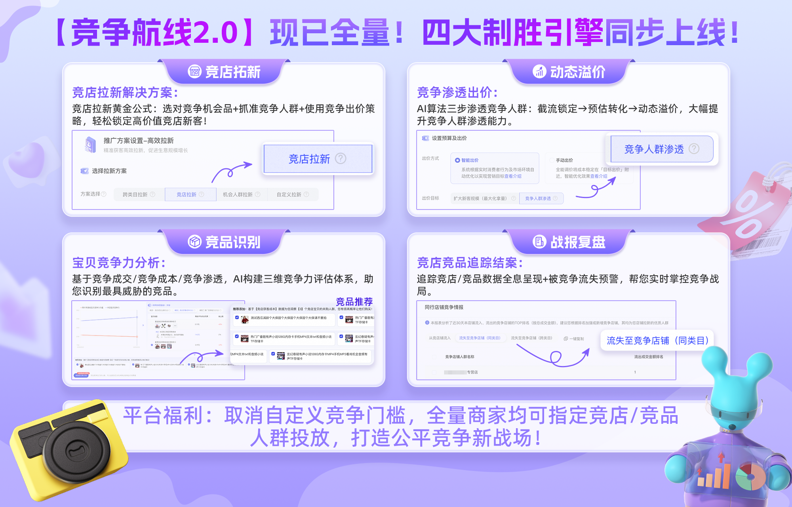

# 🛳️ 竞争航线1.0：促后极速启航！抢跑新一轮新客增长！

> 来源：https://alidocs.dingtalk.com/i/nodes/Qnp9zOoBVBDEydnQU4mLjg5G81DK0g6l

## **‼️****「竞争航线2.0」****现已全量开放****‼️**

*重点攻克以下1.0时期难题**：*

*· 我适合玩竞争吗？ · 怎么解锁自定义竞争？ · 我最应该和谁竞争？ · 竞争人群投放效果更好吗？*

👋 👋 👋

全新AI大模型驱动，打造**竞争专属****【解决方案-选品-选人-出价-报表】****投放链路**。

全量**取消自定义竞争门槛**，打造公平竞争新战场！

「竞争航线2.0：全链路竞争策略」助力您玩转竞争人群，市场竞争稳操胜券！

**📣「竞争航线2.0：全链路竞争策略」即日全量开放****！**

**🔍** **功能详情：**

---

## **「竞争航线1.0」能力简介：**

| **🧑🏻‍💻航线情报** 请加钉群： 112815000125 | **🤔**** ****竞争航线是什么？在哪里使用？****能力简介**：人群推广全新定向能力，**精准定向您竞争店铺/竞争宝贝的互动人群**。**投放路径**：人群推广——店铺人群运营——新增种子人群——选择竞争航线。**🤔 ****竞争航线的优势是什么？—— ****强势拉新！！****智能竞店/竞品：**智能实时竞争**与本店人群重叠率较高店铺或宝贝**的互动人群。**自定义竞店/竞品：**指定同类目竞争店铺/宝贝，渗透其互动人群；指定跨类目店铺/宝贝，辅助本店进行破圈拉新。 🙋** 我适合投 智能竞争 还是 自定义竞争？****「没有明确竞店 不想流失本店成交」**-> 智能竞争店铺，一键解决顾虑；**「非标店铺 有明确竞店」**-> 自定义竞争店铺，搜索相似风格店铺；建议同时竞争3个以上店铺。**「标品店铺 有明确竞品」**-> 自定义竞争宝贝，搜索相似价格带商品；建议同时竞争3个以上商品。**「行业头部 破圈拉新需求」**-> 参考航线情报，自定义选同跨类目店/品破圈高价值人群。🙋** 我解锁了自定义竞争能力，应该如何选择竞争店铺和宝贝？**通过**「竞争航线-竞争情报」**查看哪些竞店正在锁定我，对这些店铺/店内相似品进行反向加投。通过「策略中心/生意参谋/达摩盘」查看生意流入流出情况，选择合适的竞店/竞品投放。直接模糊搜索店铺，结合搜索结果下的「人群重合率」「消费者购买热度」「人群规模指数」选择合适的店铺。 |  |  |
| --- | --- | --- | --- |
| **🧑🏻‍💻投放线路** | **竞争宝贝****「宝贝人群提渗透」new** 通过算法实时追踪竞争宝贝深度行为人群（含浏览、点击、收藏、加购等）并择机在淘系内将您的宝贝**展示给此人群**。此维度提升竞争流量获取广度，可以广泛针对宝贝感兴趣人群进行追踪，快速起量。 优势：定向竞争宝贝兴趣人群 **精准竞争且拿量简单** 通用能力： **渗透智能竞争宝贝：****实时**圈选跟你宝贝相关的竞争宝贝，并择机将您的宝贝展现给它们的兴趣消费者，快速拉新访客转化。 **智能渗透 ****相似 ｜同款｜搭配**** 宝贝兴趣人群** 高阶能力： **渗透自定义竞争宝贝：**根据您选择的竞争宝贝的高成交概率人群，**实时**加深与您所投放商品的关联匹配度以提升转化效率。 支持宝贝「类目、价格带」选择，**建议参考消费者购买热度选择合适竞争对象。** | **竞争宝贝****「宝贝同屏抢焦点」** 通过算法实时商品定向追寻竞争宝贝深度行为人群（含浏览、点击、收藏、加购）并实时**同屏展现**在所选竞争宝贝的**附近资源位**。此维度提升竞争流量获取深度，提升高质量人群获取精准度。 优势：定向竞争宝贝附近流量位 **绝对精准 高质竞争** 通用能力： **智能竞争宝贝：**实时圈选与您宝贝的人群画像重合率高的同主营类目竞争商品出现在这些宝贝流量位附近。 **智能触达 ****相似 ｜同款｜搭配**** 宝贝附近流量** 高阶能力： **自定义竞争宝贝：**根据您选择商品实时定位竞争宝贝高成交概率人群，同屏定向竞争商品附近流量位争取高意愿下单人群。 支持宝贝「类目、价格带」选择，**建议参考消费者购买热度选择合适竞争对象。** | **竞争店铺 **** ****「店铺访客定向」** 通过算法实时追踪竞争店铺深度行为人群（含浏览、点击、收藏、加购）并择机在淘系内将您的宝贝展示给此人群。此维度提升竞争流量获取广度，降低高价值人群获客成本更具性价比。 优势：定向竞争店铺兴趣人群 **量大质优 全域可追** 通用能力： **智能竞争店铺：**实时圈选与本店兴趣人群重合率较高的同主营类目的相似店铺，定向潜在购买意向人群。 **智能****渗透**** ****全网重叠率较高 ****竞争店铺人群** 高阶能力： **自定义竞争店铺：**根据您选择店铺实时定位竞争店铺高成交概率人群，加深与本店商品的关联匹配度提升转化效率。 支持 同类目/跨类目 竞争店铺人群触达，**建议参考人群重合率选择合适竞争店铺。** |
|  |  |  |  |
| **🧑🏻‍💻竞争报表** | **投后全新竞争解读清晰 ** **报表-人群推广-竞争航线** **📍支持报表数据导出（****新增内测中****）：** **📍待成交人群竞争情报：周期时间内与同行同层重叠人群中未成交人群分析&成交进度提示** | **📍竞争店铺/宝贝人群数据：投放竞争航线后T+1产出投放结案，及时了解竞争进度** **支持流失至竞争店铺（同类目/跨类目）同行竞争本店数据查看****（****内测权益****）** |  |

|  |  |  |  |  |
| --- | --- | --- | --- | --- |

**>立即投放 实现竞争人群突破 <**

**FAQ**

搜不到我想要投放的竞争店铺？（建议您不确定竞店全称时，模糊搜索店铺关键词）

⚠️**针对店铺流量数据较小不足以被竞争的店铺进行了过滤，以防投放拿量困难。和生意参谋是否退出竞争无关！无关！辟谣！**

搜竞争宝贝没有结果？

⚠️**搜索无结果是使用顺序问题哦～ 请先搜索宝贝标题 再选类目和价格带 /****或者直接搜索竞争宝贝的id。****和生意参谋是否退出竞争无关！无关！辟谣！**

优化目标的搭配上有什么建议？

| ⚠️如果您 | 优化目标建议 | 出价建议 |
| --- | --- | --- |
| 没有目标 要爆品拉新 | 提升首购新客 + 智能竞争店铺 | 竞争航线为实时竞争人群 **建议使用最大化拿量/控投产比** 或 **手动出价时参考竞争提示出价** |
| 没有目标 要新品起量 | 促成交 + 智能竞争宝贝（同款/相似） |  |
| 有目标 要竞争同行新客 | 提升首购新客 + 自定义竞争店铺 |  |
| 有目标 减少本店摇摆流失 | 人群资产转化 + 自定义竞争店铺 |  |
| 商品力强 要同屏竞争宝贝 | 提升首购新客 + 自定义竞争宝贝 |  |

一个计划中需要投放几个自定义竞争人群？

⚠️**由于自定义竞争店铺/商品选择更加聚焦精准，为避免计划拿量受限，您需在一个计划中投放****3个以上的竞争店铺/商品****。**

自定义竞争店铺/宝贝中的「人群重叠率」是什么意思？

⚠️ **本店铺与竞争店铺 或 ****计划所选宝贝与竞争宝贝 的兴趣人群的重合度，高重合度代表适合抢夺收割，低重合度代表适合拉新客破圈。请注意：****若未手动给计划选择宝贝，重合率判定为0**

自定义竞争店铺/宝贝中的「消费者购买热度」是什么意思？

⚠️** 越高的星级代表消费者在竞争店铺/宝贝的成交GMV越高，处于行业的前列，其互动人群规模大且成交意愿度高。**

为什么我没有同款宝贝可以选择？

⚠️** 同款宝贝根据您自定义选择投放的宝贝进行匹配，请确认您选择了投放宝贝；如果选择了投放宝贝也没有同款则是因为您选择的宝贝在淘内积累数据较少，建议上架推广一段时间后再来匹配同款。**
