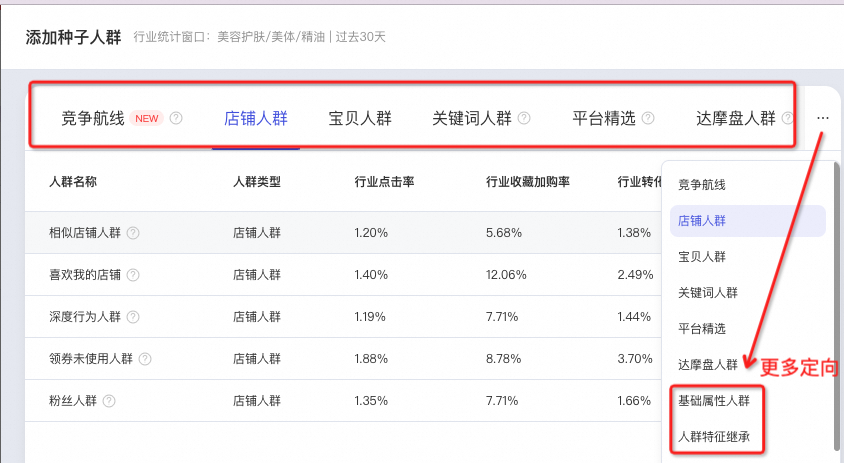
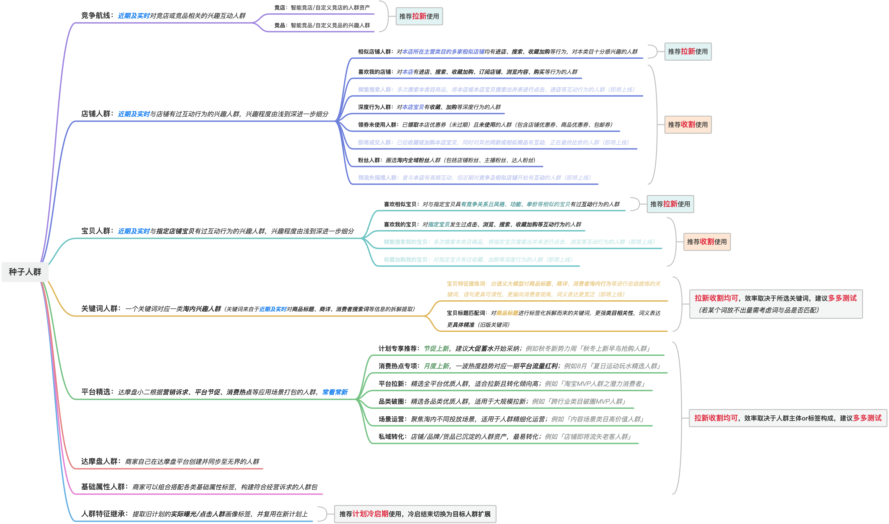
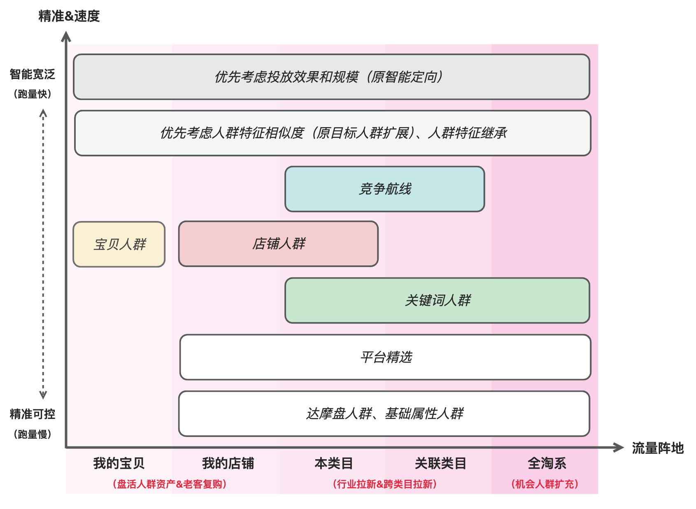

# 种子人群

> 来源：https://alidocs.dingtalk.com/i/nodes/Qnp9zOoBVBDEydnQU4mLq16981DK0g6l

### 种子人群分类与定位

人群推广当前有**8类**种子人群可供商家自主选择，您可根据各人群圈选逻辑与定位，多种人群搭配，组合成一条计划需要触达的人群。

**单计划**可添加人群上限为**100个**（其中宝贝人群上限**6个**、达摩盘人群上限**14个**、平台精选上限**10个****）**。

**1）人群圈选逻辑：**

**2）人群独有定位：**

