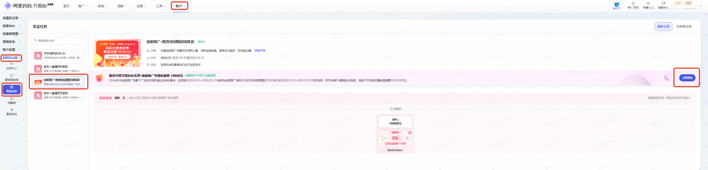
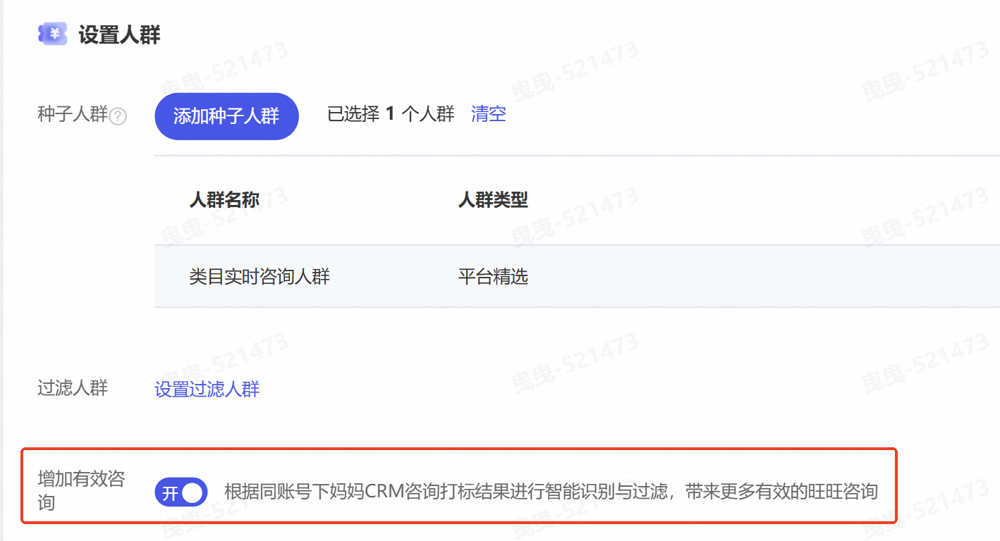
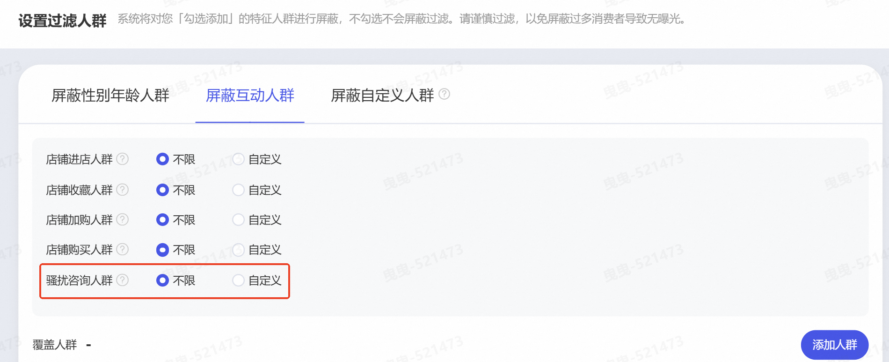
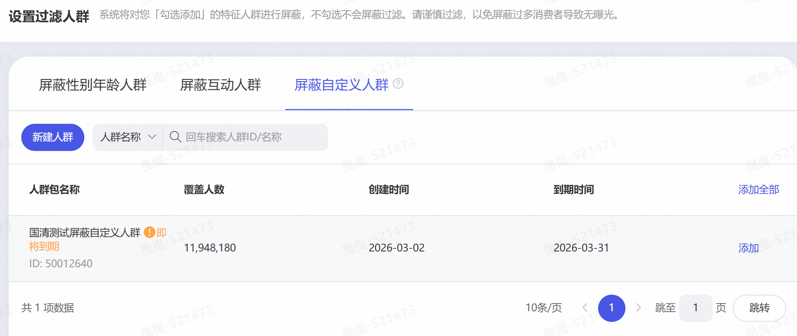
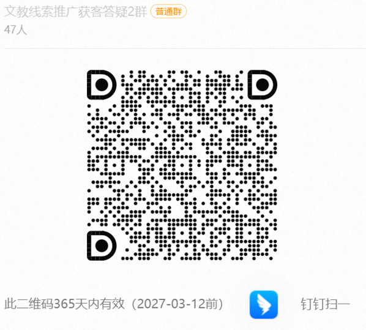

# 【文教专享】：「线索推广」产品能力升级及开工福利大放送

> 来源：https://alidocs.dingtalk.com/i/nodes/Qnp9zOoBVBDEydnQUnQ6xXvQ81DK0g6l

# **福利一：教育培训专享消耗达标即返券，最高可得10000元！**

**考核时间：**2026年3月1日00:00:00-2026年3月31日23:59:59，**名额有限，先到先得！！！**

**活动对象：**活动为【定向邀约制】，**以万相台AI无界·****赏金任务报名入口为准**，如无报名入口则默认无参与资格。

**推广范围：万相台AI无界****「线索推广」**

**考核激励：**商家在考核周期内，**线索推广实际消耗值**达到考核要求，则**依据消耗档位返还5%~10%**考核期实际线索消耗比例的**阿里妈妈线索推广优惠券「文教专享线索优惠券」**，本期返点激励至高可达1万。本期消耗返激励规则可见下表（根据规则享最高返点比例，不叠加返点比例）

| **商户分类** | **消耗要求** **（元）** |  | **返点比例** | **本期整体返点计划采用联合封顶** **单账户最多可获得激励优惠券面额（元）** |
| --- | --- | --- | --- | --- |
|  | **无界其他场景** | **线索推广场景** |  |  |
| 新商 | 2026年3月消耗≥2025年3月消耗(2025.03.01~2025.03.31) | 10000 | 5% | 1500 |
|  |  | 30000 | 10% | 10000 |
| 老客 |  | 因各商户过往营销投入情况不同，商家消耗门槛、 | 5% | 10000 |

活动详情请点击>>

**活动入口：**赏金任务入口

**商家操作路径：**万相台·无界版 首页-账户-妈妈CLUB-赏金任务—**线索推广·教育培训限时消耗返—立即报名**

# **福利二**：新客专享尝鲜券，首单满500返100元！

**1、考核时间：**2026年3月1日00:00:00-2026年3月31日23:59:59

**2、****活动对象：万相台AI无界·****线索推广首次消耗商家**。

**3、****推广范围：万相台AI无界****「线索推广」**

**4、****考核激励：**商家在考核周期内，在有效咨询产品能力或千牛APP端线索推广场景的**线索推广实际消耗值**达500元，即可获得**100元阿里妈妈线索推广优惠券「线索专享优惠券」**。

**5、判定条件：****在以下任一新产品能力上产生的线索消耗≥500元。**

增加有效咨询：投放计划需打开【增加有效咨询】开关，且消耗达标。

千牛-线索推广：在千牛APP的线索推广场景首次创建计划，且消耗达标。

**6、奖励发放：****优惠券在2026年4月30日23:59:59 前发放完成**，优惠券名称为「线索专享优惠券」，您可以关注万相台AI无界相关公告。优惠券有效期30日，过期将无法使用。

**7、商家操作指导：**

**增加有效咨询**：**增加有效咨询**开关目前只针对“优化旺资成本”目标开放。建议商家在这个目标上日预算至少设置100元，整体预算500元建议投放时间不超过7天（否则单日预算过低可能拿不到量）

| **行业解决方案-投放入口** | **自定义方案-投放入口** |
| --- | --- |
| 自定义获取旺咨方案 | 优化旺旺咨询成本 |
|  |  |

**千牛APP线索推广计划创建步骤：**

| **入口一** | **入口二** |  | **入口三** |  |
| --- | --- | --- | --- | --- |
| 点击边看边投-**线索推广**直接进入线索场域 | 点击首页中的“**+创建计划**” | 右滑找到**线索推广**点击进入 | 点击下方**创建** | 右滑找到**线索推广**点击进入 |
|  |  |  |  |  |

**活动详情请点击>>**

# **福利三：老客专属成本保障，留资控成本投放赔付活动**

**1、考核时间：**2026年3月1日00:00:00-2026年3月31日23:59:59

**2、活动对象：**

活动周期内（3.10~3.31），使用**线索推广·优化留资获客·控成本投放**出价能力的商家，均默认参与成本保障活动。

**参与门槛：**2026年3月线索推广场景日均消耗不得低于2026年1月日均消耗，且2026年3月线索推广场景消耗≥2000元。

**3、****推广范围：万相台AI无界****「线索推广」**

**4、成本保障说明：**若控线索成本计划周期内成本超出商家设置的1.2倍，则针对超出消耗给予保障激励，每个账户最多返一次，**单个商家投放保障金额上限500元。**

5、**成本保障期内计划要求：**

为保证计划投放稳定性，要求**优化留资获客·控成本投放**计划投放天数≥7天且计划累计转化线索量≥6。

**计划出价不得低于建议出价的80%**，计划每天不暂停、不删除、不切换出价方式

计划若修改线索出价，修改后出价不低于活动周期初始设置成本。

**6、****保障金额测算逻辑：
**活动保障金额=【计划实际消耗-计划预期消耗】，【计划预期消耗=设置线索成本*1.2*线索量】，计划在活动期间多次调成本的，系统按最高线索成本为保障目标。

示例：平台建议出价区间为[90,110]，商家设置线索成本100元，实际获取了10个线索，花费1400元，则活动保障金额=【计划实际消耗-计划预期消耗】=【1400元-100元*1.2*10】=200元

7、**保障券发放说明：**代金券类型为满折券，可50%比例抵扣线索推广费用，仅限于线索场景使用；**在2026年4月30日23:59:59 前发放完成**，优惠券有效期30日，过期将无法使用。

活动详情请点击>>

# **福利四：教育培训定制套餐包，****最高得20%优质流量反哺**

为高效应对3月文教行业销售旺季流量高峰，助力商家精准触达目标用户、提升转化效率，平台特推出教育培训行业专属定制套餐包，聚焦高价值人群与关键词，提供差异化投放策略支持。具体内容如下：

**定制化人群与关键词策略**
基于文教行业多赛道（如论文查重、论文辅导、学历提升、出国留学等）的用户行为数据，平台将：

筛选各细分赛道中高转化、高搜索热度的关键词；

识别具有明确咨询意向或兴趣偏好的高潜力人群标签；

结合商家产品特性，定制专属“词人组合”（即关键词+人群定向组合），实现更精准的流量匹配。

**双模式流量定投支持**
商家可根据自身营销目标灵活选择以下两种定向投放包：

【搜索-精准抢量包】：聚焦用户主动搜索场景，优先抢占高意图关键词流量，适用于新品曝光、爆款打造等强转化诉求；

【搜推-量效均衡包】：融合搜索+推荐双引擎，在保障转化效率的同时扩大覆盖人群，适用于品牌拉新与长效经营。

**教育培训专享流量反哺**：套餐包默认金额3000元，为激励商家率先布局旺季营销，特设以下超额返补激励政策：

**凡订购本套餐包且单笔订单金额 ≥ 3000 元的客户，可额外获得 20% 的平台流量补贴！下单推广后，流量补贴即时生效！**

示例说明：
若商家下单消耗 10,000 元，则平台将额外赠送 2,000 元等值推广流量，实际可用流量价值达 12,000 元！

💡 *注：流量补贴以平台推广资源形式发放，不可提现，有效期至2026年3月31日。*

---

活动详情请点击>>

# **福利五：全量客户****搜推流量加码！最高反哺25%搜推流量**

「**线索推广**」平台重磅推出「**开春早复工**」专属营销活动！为多行业商家量身定制高性价比套餐包，投放即享：**行业精准词人定制、核心搜推流量加码、限时搜索通知权益**。小预算维稳营销模型，低成本守住精准流量池，助您开年快人一步赢全局！

1、**活动时间：**2026年3月1日00:00:00-2026年3月31日23:59:59

2、**活动对象****：**所有具备线索全量权限的商家（含新客及活跃老客）均可参与。

3、**活动规则：**分层激励，投得越多，权益越多！根据您的历史或近期营销消耗水平，我们为您匹配专属套餐档位。**只需一次性投放指定金额套餐包，即可立即获得****对应比例的核心搜推流量补贴****及****实时线索通知权益**！

| **商家消耗分层** | **套餐选项一** **（15%流量补贴）** | **套餐选项二** **（25%流量补贴）** | **额外权益** |
| --- | --- | --- | --- |
| **历史未投放商家** | 投放 ¥500 | 投放 ¥1,000 | **成功下单任一套餐包，即可享受【线索实时通知】权益** |
| **月消耗 ¥200–¥1,000** | 投放 ¥1,000 | 投放 ¥1,500 |  |
| **月消耗 ¥1,001–¥2,000** | 投放 ¥2,000 | 投放 ¥2,500 |  |
| **月消耗 ¥2,001–¥3,000** | 投放 ¥3,000 | 投放 ¥3,500 |  |
| **月消耗 ¥3,001–¥4,000** | 投放 ¥4,000 | 投放 ¥4,500 |  |
| **月消耗 ¥4,001–¥5,000** | 投放 ¥6,000 | 投放 ¥7,000 |  |
| **月消耗 ¥5,001 及以上** | 投放 ¥20,000 | 投放 ¥30,000 |  |

**4、活动介绍文档：**

# **产品能力升级一：**增加有效咨询

##### **1、商家端能力：咨询明细打标**

“有效咨询打标”是**商家主动参与线索推广算法模型训练**的核心工具。商家可为每条旺旺咨询/留资打上“有效”、“无效”标签。按客服维度拆解接待量、有效咨询量、转化客资数，支持按计划ID、商品ID查询对应咨询，并且展示会话记录详情，完整还原**“旺旺咨询 → 客服承接 → 客资转化”**路径，帮助商家精准评估服务效能。

商家操作手册：

##### **2、平台端能力：有效咨询优化**

**增加有效咨询****上新！！！**：新增**「增加有效咨询」**能力开关，对应平台有效咨询优化产品能力升级！打开后，平台将依据同账号下妈妈CRM咨询打标结果实时学习正向高营销价值人群特征及负向无效人群特征（骚扰人群、空号、无意向用户），商家稳定打标数据可帮助算法模型精准放大优质咨询及线索，实现**“越打标，模型越懂你；越训练，线索越精准。”**

**自定义人群过滤：**依据商家需求自定义设置过滤人群，在原有能力上，**新增「骚扰咨询人群」及「达摩盘自定义人群」，**推广计划前置过滤无效/骚扰人群以减少预算浪费。

过滤性别年龄人群

**过滤互动人群****上新！！！****：**在原有店铺进店/收藏/加购/购买人群之外，**新增「骚扰咨询人群」，**

**过滤自定义人群****上新！！！****：**支持商家自定义圈选过滤人群，人群数据来源于达摩盘，包含商家通过达摩盘标签、一方标签圈选的人群。

（功能by行业放开中，家电行业尚未接入，可填写报名问卷线索推广·自定义人群屏蔽开白报名或联系报名测试）

# **产品能力升级二：****新增优化目标：提升高意向成交**

**产品能力上新：**针对高客单行业的线上成交营销需求，通过售前咨询+成交双目标优化，以及提升「售前咨询人群」浓度，带来更多高意向、高客单的成交人群与gmv，显著提升咨询人群后续的成交转化与客单价。

**2、产品介绍文档：**

**3、上线时间：**

| 【提升高意向成交】上线 2026.03.10 | 专属结案上线 2026.03.17 |
| --- | --- |
|  |  |

# **产品能力升级三：****千牛无线端新增线索推广入口**

**1、产品能力上新：**千牛无线端接入**「线索推广」**场景入口，支持商家在千牛APP中新增线索推广计划、管理线索推广计划及查询线索推广数据报表。

**2、商家操作路径：**

# **培训会FAQ**

旺资卡片如何开通：

线索明文如何开通：

阿里妈妈·客户工作台-隐私号码模式停用通知：

行业解决方案-专投白盒人群（可能影响拿量，建议小预算测试）：

培训文档：

文教线索推广获客答疑2群：108640008006

