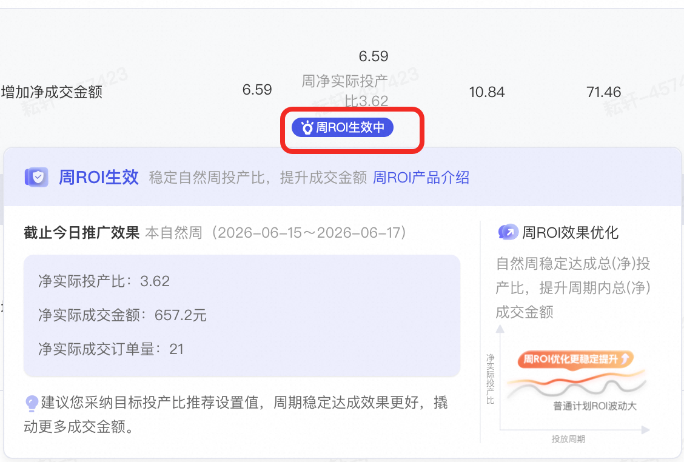
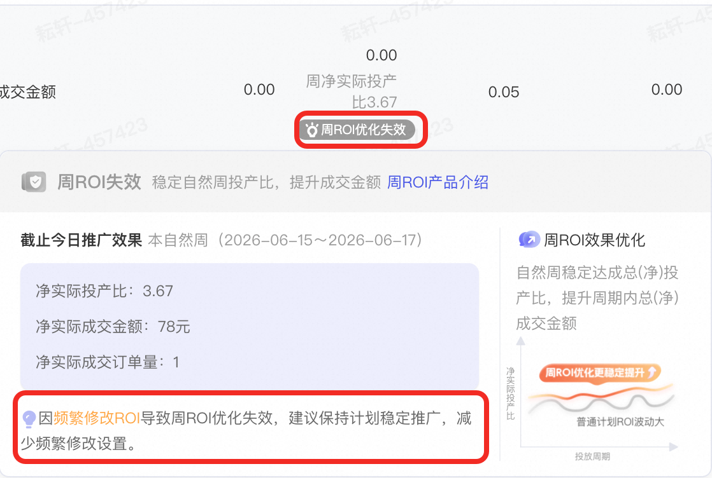
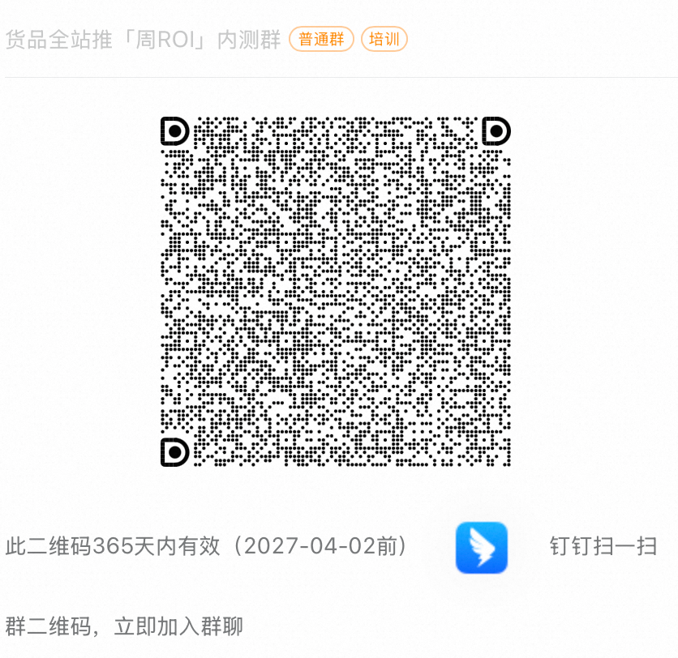

# 货品全站推广-周ROI优化（内测）

> 来源：https://alidocs.dingtalk.com/i/nodes/Qnp9zOoBVBDEydnQUnxNNRAQ81DK0g6l

**什么是周ROI**

周ROI是系统筛选过去一周**成交少**、**实际ROI交付较差、平台新品**的全站推商品推广控投产比投放计划，系统进行智能「周ROI」优化，**降低实际投产比波动，提升成交金额**的一项自动优化能力。

周ROI按过去一个自然周数据筛选，并按自然周（周一～周日）优化

即使处于「周ROI生效中」状态，**计划仍可能出现天级别效果波动的情况**，建议关注自然周整体数据表现，系统将尽可能降低自然周投产比波动，提升成交金额。

**在哪里看**

被系统选中「周ROI」优化的计划，可在全站推-商品推广-计划列表，设置ROI处看到「周ROI」标识，若为蓝紫色生效中状态，此时计划处于系统进行智能「周ROI」优化，鼠标悬停至「周ROI」标识可查看具体信息

被系统选中的计划，一般在**自然周的周三**开始展示「周ROI」标识（分生效中和失效两种状态）

若标识为灰色「周ROI优化失效」，则表示计划被系统筛选，但当前未生效周ROI优化，计划暂停/下线时间较长、修改出价方式至最大化拿量、频繁修改计划预算、频繁修改计划目标投产比等行为，都会触发周ROI优化失效。鼠标悬停至「周ROI」标识可查看具体原因，请您保持计划稳定投放，避免触发优化失效

若计划无「周ROI」标识，则表示计划当前未被系统筛选。计划成交丰富、实际投产比稳定、最大化拿量的计划等都不会被系统选中

**商家可以怎么做**

目前「周ROI」计划系统圈选，并智能优化，不支持商家主动选择或提报

「周ROI」生效中的计划，请保持稳定投放，**采纳系统推荐的目标投产比，设置充足的预算**，有助于系统「周ROI」优化，降低实际投产比波动，提升成交金额

「周ROI」失效中的计划，请关注失效原因，**停止负向行为**后，下一周期计划仍可能被系统选中

即使处于「周ROI生效中」状态，**计划仍可能出现天级别效果波动的情况**，建议关注自然周整体数据表现，并保持计划稳定投放（合理的出价和充足的预算）

