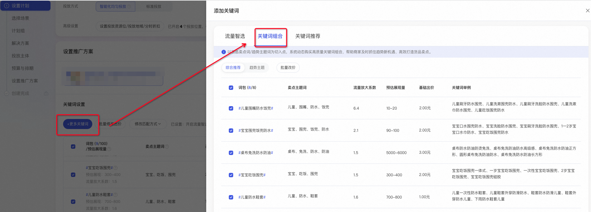
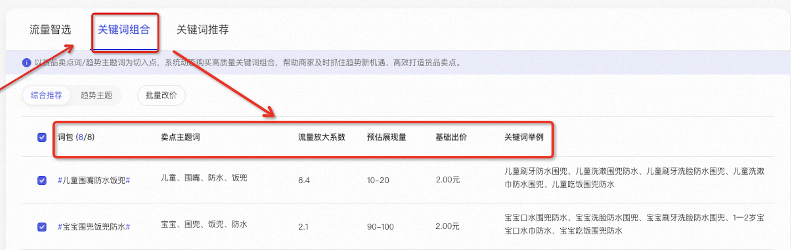
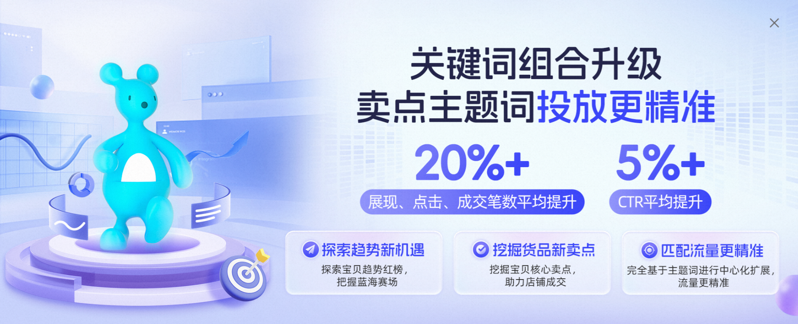
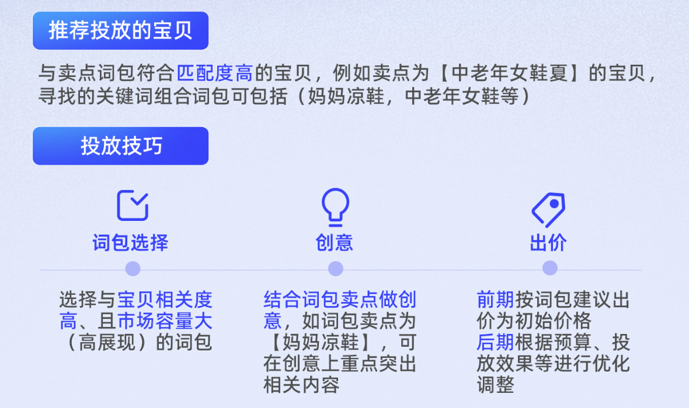

# 关键词推广-关键词组合|卖点主题词推荐更精准

> 来源：https://alidocs.dingtalk.com/i/nodes/R1zknDm0WR6XzZ4LtZyxYE9gWBQEx5rG

**原语雀文档链接：**https://yuque.antfin.com/chenchun.chen/gqhty9/dkfzphtdbh309nh7

---

# 一、功能入口

**操作路径：**万相台无界版-关键词推广-添加更多关键词-关键词组合

# 二、概念解释

### 1、词包

卖点词包基于商品卖点、主题或自选词生成词包，词包内的词基于效果动态调整。比如购买#小雏菊#卖点词包，系统自动在词包中购买如“小雏菊半身裙”、“小雏菊显瘦裙子”等关键词。点击词包会出现换一换图标，可在原位置展现替换后的新词包。

### 2、卖点主题词

词包所覆盖的流量的搜索词会包含这些关键词，帮助商家获得精准的流量。

### 3、流量放大系数

相较购买该卖点词的精确匹配，购买词包能获得的流量的放大倍数。即：流量放大系数=整个卖点词包的覆盖PV/卖点主题词精确匹配下的覆盖PV。

比如购买原词是保湿套装，卖点词包中围绕着保湿套装的卖点词加总覆盖的PV/保湿套装原词的PV，就是该卖点词包的流量放大系数。

### 4、预估展现量

参考词包中关键词的市场平均出价、大盘流量情况以及匹配程度，预估广泛匹配下全天投放的展现量，仅供不同词包之间对照参考。

### 5、关键词举例

关键词举例是词包内部分词的举例，不是全部词，系统会根据词包效果及市场变化动态调整词包内的关键词。

# 三、功能价值

### 1、词包完全基于卖点主题词进行中心词扩展，匹配流量更精准

系统围绕宝贝卖点词/趋势主题词，进行智能化买词，帮助商家抓住趋势新机遇、高效打造货品卖点。

买词逻辑对比如下：

### 2、卖点主题词推荐更精准，拿量能力更强，投放效果更优！

同一个宝贝，升级前后的卖点主题词及词包对比如下：

| 宝贝 | 儿童一次性围兜宝宝吃饭神器免洗防水围嘴口水巾小孩喂饭兜 |
| --- | --- |
| 升级前 |  |
| 升级后 |  |

# 四、投放技巧

# 五、联系方式

若有疑问，可加钉群反馈：
【关键词组合】升级商家群2”群的钉钉群号： 61290007009

1群已满：40005012154

