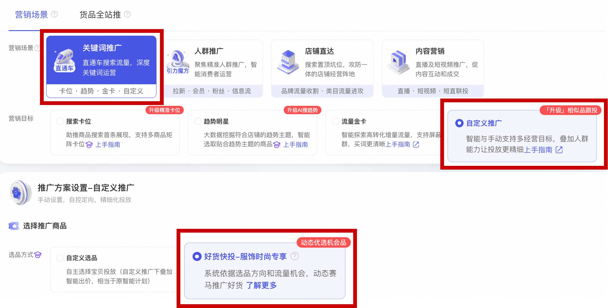
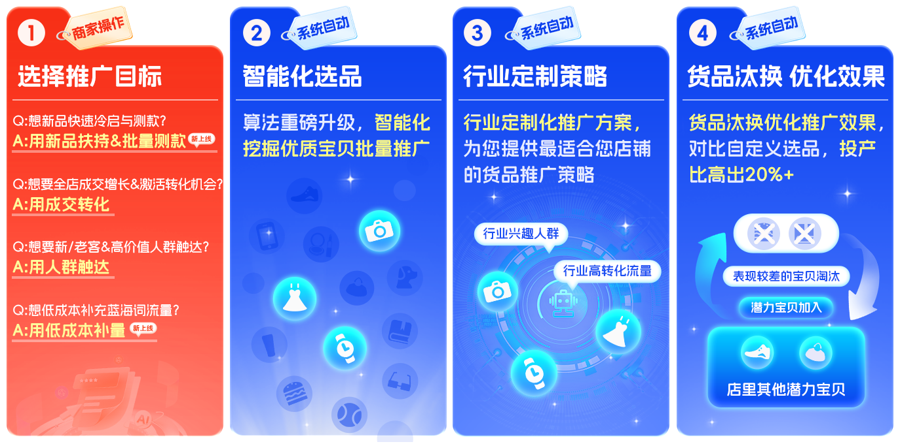
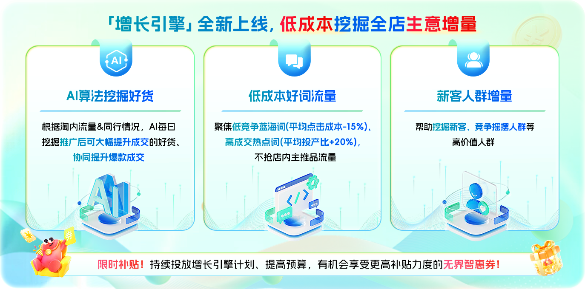

# 关键词推广 - 好货快投（智能选品）- 重磅升级智能货品推广方案

> 来源：https://alidocs.dingtalk.com/i/nodes/R1zknDm0WR6XzZ4LtZyxYp15WBQEx5rG

## **一、基础介绍**

**「好货快投（智能选品）」**是关键词场景下的一种选品能力 & 智能货品推广方案，可以通过淘系的海量大数据分析和算法智选能力，参考商家设置的选品方向（**批量测款 & 新品扶持****【新升级】**** / 成交转化 / 人群触达 / 低成本补量****【新升级】**）、行业数据，精准从商家店铺的全部宝贝中，选出符合要求的优质宝贝，达成商家对应的推广目标，对比自定义选品，**推广投产比高出20%+**

**一键直达功能**

## **二、升级内容总览**

好货快投全新升级！更智能，更全面的店铺货品解决方案

| **多目标可选** **四选品方向满足多诉求** | **新品扶持 & 测款** / 成交转化 / 人群触达 / **低成本补量**四大选品方向焕新上线，多种推广诉求全覆盖，定制化满足您的营销目标 |
| --- | --- |

| **智能化选品** **一键网罗全店货品机会** | **算法重磅升级**，海量历史数据分析，更加**智能化全店维度挖掘优质货品进行推广**，省去您的选品时间，一键建立高质量组合货品推广方案（**多类目店铺可筛选二级类目做选品限制！**） |
| --- | --- |

| **行业定制策略** **各行业差异化策略上线** | 根据各个行业特性，**好货快投上线行业定制化的推广方案**，在选品方向/推广偏好等方面差异化进行算法调优，为您提供最适合您店铺的货品推广解决方案 |
| --- | --- |

| **每日货品汰换** **算法智能优化推广效果** | 重磅能力依旧保留，系统每日根据推广数据、算法预估进行在投货品的汰换，**持续探索最优货品推广组合**，自动优化计划效果，对比自定义选品，**推广投产比高出20%+** |
| --- | --- |

**好货快投推广四部曲**

## **三、选品方向****焕新升级**

| **批量测款****（新增）** **(部分行业专享)** | 支持商家**手动批量选择测款对象**/或由算法优选店内新品进行测款： 测款时**结合同行相似新品数据作为测款标准**，以行业新品案例+算法协同锚定新品精准流量，最快3天完成测款。 同时**叠加新品扶持通道**，测款同时挖掘新品优质好词，方便后续推广、放大新品成交。 |
| --- | --- |

| **新品扶持****（新增）** **(部分行业专享)** | 算法优选**投放后可获得流量扶持的新品**、并结合店内/同类目数据，动态挖掘店内高打爆潜力的新品，送入新品扶持通道、快速成长、获得额外成交。 |
| --- | --- |

| **成交转化** | 选品方向更细分，选品算法更智能，高效探索最优全店推广货品组合方案 **优质货品提销量：**全店选品，交付整店铺成交转化 **潜力货品激活：**定向激活二梯队潜力品，补充主推品外的第二增长曲线 支持限制选品类目，精细化调控选品范围 |
| --- | --- |

| **人群触达** **(原目标人群触达)** | 升级支持定向设置**新客/流失老客/高价值客户获取**细分目标，全店范围内优选商品，定向触达目标人群，以货找人，积累全店各类人群资产 支持限制选品类目，精细化调控选品范围 |
| --- | --- |

| **低成本补量****（新增）** | **关键词首款专门探索长尾词/机会词/蓝海词流量的推广产品** 智能化优选店内命中机会流量最多的货品进行推广，回避红海竞争，定向抓取**长尾词/机会词/蓝海词流量**，以词破圈，较低成本为全店补充流量 |
| --- | --- |

### 增长引擎介绍

具体查看：

【增长引擎】属于关键词推广-自定义推广-好货快投下的一个选品方向，是一个智能选品的投放产品，操作简单，叠加定制化算法投放效果好。

在该计划中，大模型算法预估市场流量、店内货品情况，自动投放有推广价值的商品，挖掘低成本蓝海词、新客等多维度的增量流量，**帮助商家以较低的成本、轻松提升全店生意增长。**

## **四、使用指南**

### 【新增】使用指南 - **批量测款**

| **操作步骤** | **指引图** |
| --- | --- |
| **1、在关键词推广 - 自定义推广下， ** ** 选择 好货快投-行业专享 ****>>点击直达** |  |
| **2、选品方向选择「批量测款」** ** 根据情况自定义测款内容：** **测款目标**：设置新品的点击、加购等指标及对比同行情况，完成测款 **测款周期**：可选3 、7、15天 **人群探索**：根据测款新品的类目流量、同行投放情况，动态挖掘高转化关键词、人群。 *后续将开放自定义测款关键词、人群 **测款范围**：可手动设置需要测款的商品范围； 如果不设置，由算法智能选择店内新品、动态更新测款 *商品候选集内仅支持上传新品；非新品上传后会被过滤掉 *推广过程中会自动生效新品冷启扶持 |  |
| **3、设置出价、预算** ** 注意：计划每日预算需**≥**50元**，（若设置出价成本）**成交成本****≥****系统建议值**，**才有机会在新品测款时获得额外新品流量扶持。** |  |

### 使用指南 - 新品扶持

| **操作步骤** | **指引图** |
| --- | --- |
| **1、在关键词推广 - 自定义推广下， ** ** 选择 好货快投-行业专享 ****>>点击直达** |  |
| **2、选品方向选择「新品扶持」** **选品规则：**优先选择投放后可获得推广/自然流量扶持、且对比店内/同行同类目潜力较高的新品 如果新品已经有其他计划在推广中，好货快投-新品扶持计划将挖掘新品增量机会词、探索更多成交 |  |
| **3、设置出价、预算** ** 注意：计划每日预算需**≥**50元**，（若设置出价成本）**成交成本****≥****系统建议值**，**才有机会在新品测款时获得额外新品流量扶持。** |  |

### 使用指南 - 成交转化

| **操作步骤** | **指引图** |
| --- | --- |
| **1、在关键词推广 - 自定义推广下， ** ** 选择 好货快投-行业专享 ****>>点击直达** |  |
| **2、选品方向选择「成交转化」** **选品规则：** 在**全店范围内**优选成交转化潜力较高货品，**批量提升成交**； 仅从**非主推品中**批量优选成交潜力最强的货品，定向探索店内的**第二成长曲线** **适用场景：** 店铺货品较多，推广不知如何下手； 推广精力有限，希望一站式完成智能推广； 大促爆发期 / 日销售瓶颈期希望提升全店成交额； 主推品以外希望挖掘部分潜力货品做补充推广； |  |
| **3、设置出价、预算** 系统默认推荐您使用「**最大化获取成交**」的出价方式（**更多出价方式在完成计划创建后可以进行修改**），预计效果较好，您可以按店铺推广规划设置计划预算，建议您同时开启「**优质计划防停投**」，充分发挥计划潜力 |  |

### 使用指南 - 人群触达

| **操作步骤** | **指引图** |
| --- | --- |
| **1、在关键词推广 - 自定义推广下， ** ** 选择 好货快投-行业专享 ****>>点击直达** |  |
| **2、选品方向选择「人群触达」** 选品规则： 根据您勾选的触达人群类型（新客/流失老客/**高营销价值人群**），**系统将优选触达对应人群效率最高的货品进行推广**，以货找人，积累店铺人群资产 适用场景： **新客：**店铺破圈，定向寻求增长； **流失老客：**积极防守，维护老客人群资源； **高营销价值客户：**高价值高转化，补充拓展店铺人群资产 |  |
| **3、设置出价、预算** 系统默认推荐您使用「**最大化获取成交**」的出价方式（**更多出价方式在完成计划创建后可以进行修改**），预计效果较好，您可以按店铺推广规划设置计划预算，建议您同时开启「**优质计划防停投**」，充分发挥计划潜力 |  |

### 【新增】使用指南 - 低成本补量

| **操作步骤** | **指引图** |
| --- | --- |
| **1、在关键词推广 - 自定义推广下， ** ** 选择 好货快投-行业专享 ****>>点击直达** |  |
| **2、选品方向选择「低成本补量」** **选品规则：**优先选择**长尾词/机会词相关性高**的优质货品，能够避开红海词/热门词竞争的机会品 **适用场景：**店内货品**探索更多机会流量**打破增长瓶颈，或者需要系统**挖掘优质长尾词**指导推广选词 |  |
| **3、设置出价、预算** 系统默认推荐您使用「**最大化获取成交**」的出价方式，**（也支持您设置成交成本限制，更多出价方式在完成计划创建后可以进行修改）**，预计效果较好，您可以按店铺推广规划设置计划预算，建议您同时开启「**优质计划防停投**」，充分发挥计划潜力 |  |

## **五、优秀推广案例分享**

| **案例类型** | **案例内容** |
| --- | --- |
| **潜力货品定位** |  |
| **全店成交增长** |  |
| **新品冷启** |  |
| **新品打爆** |  |

## 六、常见问题：

**为什么我的好货快投卡片下有的选品方向是灰色的、不可选择？**

目前智能选品仅支持在**每个选品方向上建立一个计划**，如果您在某一选品方向上已经建立有一个计划，则无法再选择该选品方向进行新建计划，相同地，如果您在本次升级之前就有了老版本的「目标人群触达」计划，那么您也暂时无法新建新的「人群触达」计划；

**为什么我的好货快投计划每天推广的品会不一样？**

智能选品计划会根据您设置的选品方向和计划中在投商品的具体表现来**灵活汰换每日的在投货品**，每天最多从在投商品中选择1个效果相对较差的与未在计划内的品进行汰换，全面、动态地探索店铺内的货品机会（如店铺内有您不希望投放的货品，可以通过屏蔽宝贝来避免货品上车）；

若计划中在投的系统选品单元小于50个，系统会优先添加货品到计划中，直到添加至50个的上限后才会开始淘汰在投货品；

**为什么新建好货快投计划的时候，不可以切换出价方式？**

我们通过充分的数据分析和算法预估，为您推荐了在各个选品方向下预估效果最佳的出价方式，只为给您交付最好的推广产出，但如果您还是希望使用其他出价方式进行推广的话，您依旧可以在在投的关键词计划列表页内修改计划的出价方式；

**升级以后原本的「店铺引流」选品方向下线了怎么办？**

新升级的选品方案中，我们将原有的「店铺引流」方向进行了拆分/升级，如果您有明确的希望引流的人群，可以使用新上线的「人群触达」计划，如果您只是想拓展更多的店铺流量，您可以使用新上线的「低成本补量」计划去以更低成本探索更多的机会流量；此外，原本已经建立的「店铺引流」计划还将继续推广，不受影响；

**其他问题：**

与关键词推广货品、选品相关的问题可以进群交流：“关键词选品能力商家反馈群”群的钉钉群号： 91360003374

---
