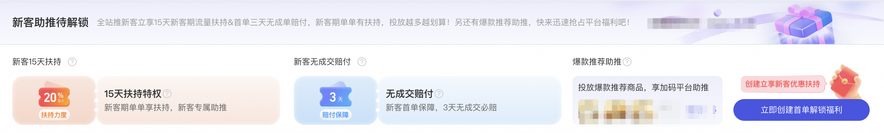

# 「货品全站推广」双11投放攻略&活动

> 来源：https://alidocs.dingtalk.com/i/nodes/R1zknDm0WR6XzZ4Ltnl0we5xWBQEx5rG

# ** 「货品全站推广」双11必赢投放建议 **

**亲爱的商家朋友：**

双11流量大战一触即发，怎么投，才能稳赢？

历史大促全站推**已助力生意双百万增长**，百万商家实现**流量增幅20%+、销量10%+、销售排名+10名，**实现全面增长，助力百万商品实现**大促销量增幅100%+**

**货品全站推广焕新升级，超多福利加码****：**速来查看双11投放攻略，掌握大促流量密码，让好货高效突围市场！

| **模块** | ** 双11预售期** **⏰10月15日20:00** | ** 双11现货开卖** **⏰10月20日20:00-11月14日23:59** |
| --- | --- | --- |

| **选品** | 围绕货品生命周期建设（内测）**新品、潜力品、机会爆品成长的能力**，助力各阶段商品在大促期间成交爆发更强！**建议锁定平台推荐商品，****优选「平台推荐」商品，可获取“专属流量扶持”、“成本保障权益”** **新品：**新品推荐使用「一键起量」+「多目标出价」，配合平台专属出价策略与流量扶持机制高效协同，全站助力新品快速破百；**潜力品：**通过商品的用户特征及商品属性，挖掘预测未来有GMV增长空间的商品进行推荐，通过「净成交出价」交付确收GMV，「多目标出价-直接成交」进行商品集中打爆，带动潜力品成交跃迁；**机会爆品：**通过「多目标出价」/「一键起量」等增量能力的运用，在爆品稳定销量的同时，进行roi 交付稳定， 提升拿量能力，撬动PV增长； |
| --- | --- |

| **出价建议** | **-****一键起量：**保障基础预算交付，进行灵活起量成交探索，可以**自定义时段及地域能力的起量能力；** **-****最大化拿量：**系统最大程度帮助优化转化价值的自动出价产品，最大化成交，满足**「充分跑量」「流量均衡」「最大化转化效果」**的投放诉求； **多目标出价-加购：**保障基础预算交付的同时，预热期加强对浅层加购积累，提升大促爆发；**多目标出价-直接成交：**开启多目标直接成交，增加计划整体竞争力，爆发期探索直接成交增量，加速活动单品的快速打爆； **全店模式：**建议采纳系统推荐的全店ROI及日预算，开启自动规则及时补充全店模式下的预算额度，选择有基础销量的爆品/次爆品/潜力品，助力全店GMV打爆；如当前全店计划跑量较差，冷启时间过长、对商品拿量有高诉求的情况下，建议开启**全店模式-一键起量****，**快速提升全店计划下「高预期拿量商品」的拿量能力； **-****净成交出价：**出价方式建议选择**增加净成交金额，**系统AI智能预判，最大化净成交金额，尽量降低退款订单影响； |
| --- | --- |

| **预算建议** | **基础预算：**预算建议不低于平台推荐预算（每天建议不要调整超过两次，同时每次调整的幅度不宜过大） **单独设置起量/多目标预算：**如开启一键起量/多目标出价能力，建议采纳平台推荐预算，投放效果更优，预算建议不低于基础预算值的**20%；** |
| --- | --- |

| ** ** **数据监控建议** | **基础计划**可在投放列表页跳转**「报表」**看多日投放数据，根据数据评估计划整体投放效果评估前提：尽量用**稳定投放期的数据**对比投放前的数据，同时建议多天均值对比，如投前7天对比投后7天，再结合生意参谋或者全站增长数据，分析投放商品投前投后变化情况，判断投放效果 **开启****「****一键起量/多目标出价****」****计划**点击「计划」下的**「投放调优」**页面->在投放调优右侧的投放调优数据进行查看一键起量/多目标效果增量效果（一键起量/加购/直接成交） |
| --- | --- |

# **「货品全站推广」新客护航计划**

### 新客有什么投放权益？优质好货享双重流量扶持！

#### **新客期专属流量扶持**

在15天新客期内，商家**创建优质好货****计划均可享至少20%流量扶持**，新客期内**计划创建越多，享受扶持越多，投放越划算**！ps：根据数据显示，新客期流量扶持后的计划ROI达成效果更优；

#### **平台推荐自然流量助推**

在货品全站推广场景下选择投放**「平台推荐」商品**，并采纳系统推荐出价，至高可享受**30%额外自然流量助推**！

### **达成效果不佳怎么办？****首单3天无成交享赔付保障！**

享受流量扶持还是不放心计划投产比的达成效果？别担心，货品全站推广创建计划首单将提供无成交赔付保障，首单前3天消耗满200元无成交，同时满足下述保障规则的，平台将返还商家**100元新客保障优惠券**，让您在货品全站推广的首次投放更安心！

# **「货品全站推广」福利活动**

待上线，敬请期待

| **百大QA分享****看这里****↓** | **百大案例分享****看这里****↓** | ** 货品全站推广详情****看这里** **↓** | **货品全站推广答疑****来这里** **↓** |
| --- | --- | --- | --- |
