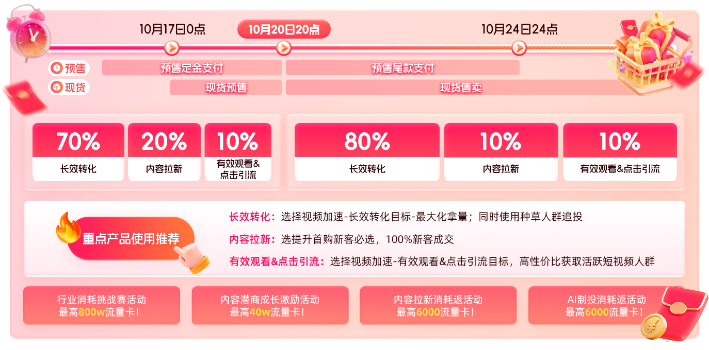
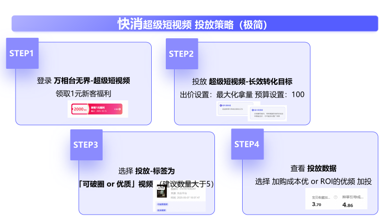
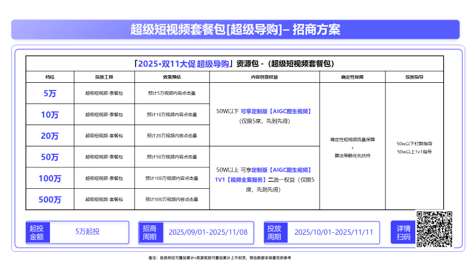

# 双11超级短视频·内容赋新·质赢双11

> 来源：https://alidocs.dingtalk.com/i/nodes/R1zknDm0WR6XzZ4LtnvbqPrlWBQEx5rG

# **一、双11超级短视频重点升级和投放指南**

## **1.1 内容拉新**

**提升首购新客必选，100%新客成交**，「内容拉新」全新升级！专注优化**内容首购新客数，为店铺带来更多的新成交。**

**新增「内容机会主题」功能**，按照市场的流量增速、流量规模、竞争蓝海等情况给到店铺视频的内容机会主题，**助您洞察内容主题趋势，把握内容投放机会**

**主题选择灵活**：支持同时选择1-5个不重复的内容主题，若需推广的视频不在当前主题下，可手动添加至对应主题。

**推理人群分级**：系统基于所选主题及视频，AI推理内容破圈机会，高效获取新客流量，提供「严谨-标准-探索」三重人群推广（推理越严谨，人群越精准；推理越广泛，新客潜力越大）

**优选策略**：建议选择5个主题，建议选择「探索式内容机会破圈」，最大化挖掘高潜力新客

详细查看：

**推广后台****（PC)：****一键直达内容拉新 开启高效拉新**

## **1.2 AI制投一体**

**免费生成AI视频，没视频也能投超短****。**超级短视频重磅推出一站式获取成片到投放，免费快速生成AI视频，创意主题混剪，实现视频量级快速扩充

**四大升级，重磅全新上线，快速生成最懂电商的短视频**

**新增数字人**，提供多种数字人形象及场景，支持自主选择

**新增内****容理解&人群破圈**，AI解析内容机会主题，内容脚本紧贴流量趋势和营销节点&行业热门话题，同时拓展破圈人群

**新增素材解析**，AI前置帮助分析素材的优劣，给出建议补充方向

**新增流量加速**，全面升级冷启动策略，并提供计划维度的算法支持

详细查看：

｜

## **1.3 视频起量&单品成交**

**指定视频和单品起量：优中择优，让每一分预算都花在最值得的视频或货品上**

视频精准放量：可指定计划下，指定视频额外加预算，打爆视频

详细查看：双11上线，敬请期待

视频直接成交：内测中，咨询

详细查看：

## **1.4大促全周期投放指南**

# **二、双11超级短视频活动政策**

### **2.0 **高阶权益解锁

| 活动周期：10.01-11.11 活动内容：🚀超级短视频对完成消耗门槛及活动规则的商家，限时解锁过滤进店&收藏&加购人群、计划数/视频数扩容（100→200→400/20→40）、分时消耗、购买力屏蔽等稀缺产品能力！ 活动文档： |
| --- |

### **2.1 内容潜商成长激励政策**

| 活动周期：10.1-12.31 活动内容：超级短视频面向账户有视频、视频有效率的内容高潜客户，完成相应消耗等级，至高40w流量卡 活动文档： |
| --- |

### ** 2.2 行业消耗挑战赛活动政策**

| 活动周期：10.1-11.11 活动内容：各行业根据超短消耗不同档位，取最高档达标激励8-800w流量卡 活动文档：分行业 快消： 家享生活： 服饰： 健康： 运动户外/文教香氛/宠物： 食品生鲜： 3c数码： |
| --- |

### ** 2.3 内容拉新活动政策**

| 活动周期：10.1-10.31 活动内容：在以上活动周期内，在超级短视频的「内容拉新」场景完成新建计划且计划消耗对应档位，至高获得6000观看流量卡 **任务：消耗门槛****任务奖励****奖励发放**新建内容拉新计划且消耗≥100元流量激励：流量卡1000观看活动结束后7个工作日内发放完毕届时关注站内信通知新建内容拉新计划且消耗≥3000元流量激励：流量卡3000观看新建内容拉新计划且消耗≥6000元流量激励：流量卡6000观看 活动文档： |
| --- |

### ** 2.4 AI制投活动政策**

| 活动周期：10.1-10.31 活动内容：新产品激励，在超级短视频「AI视频制作」场景完成新建计划且计划消耗对应档位，最低100元即返流量！至高获得6000观看流量卡 活动文档： |
| --- |

# **三、超级短视频新手投放SOP-四步骤**

完整新客权益及活动查看：

https://alidocs.dingtalk.com/i/nodes/G1DKw2zgV2KnvL4kF1xmX2ALJB5r9YAn

https://alidocs.dingtalk.com/i/nodes/20eMKjyp810mMdK4HYylNDQMJxAZB1Gv

# **四、行业商家投放案例**

## **4.1快消投放案例**

# **五、超级短视频高频问题Q&A**

**Q：超级短视频目前有哪些资源位，对投放的素材能展示对位置不清楚，我的作品会出现在哪里？**

A:超级短视频，目前会覆盖首页猜你喜欢、猜你喜欢-微详情视频、购后猜你喜欢、手淘短视频全屏页、手淘Tab2（逛逛）、手淘搜索、点淘(淘宝直播APP)、外投等核心渠道及优质消费者；所以淘内核心的资源位都会投放到，亿级流量供你使用，请放心投放。

**Q：超级短视频投放是如何扣费的，逻辑不太清楚，是观看一次就会扣吗，具体扣多少？**

A ：超级短视频扣费分两种情况，按点击扣费和按观看扣费都会有，下面是详情

促内容拉新&长效转化&促点击引流&商品收加这几种投放目标，-是按点击行为计费的，可以自己通过控成本价格或者最大化拿量（点击包含首猜点击、短视频页转赞评、关注、进直播、收藏、加购、进店等行为）

促进有效观看投放目标-是按视频3秒以上播放计费的，千次有效播放的价格 ，例：出价40元/cpm，相当于每次有效播放4分钱，一千次有效播放40元。

**Q：****投放短视频选择哪个方案更好？应该怎么选择优化目标？**

A：有效观看的推广目标：按照消费者3秒及以上的视频观看进行扣费，满足商家和达人通过短视频投放来给新客覆盖和视频观看，加速视频打爆的诉求。

侧重优化：视频有效观看，视频打爆

点击引流的推广目标：按照消费者实际点击进行扣费，点击含包括购买、加购、收藏、进店、转赞评、关注等行为，侧重优化视频组件和商品卡片的点击量，满足商家通过短视频投放提高短视频、店铺、直播间的互动的诉求。

侧重优化：视频组件，商品卡片的点击量

商品加购的推广目标：按照消费者实际点击进行扣费，点击含包括购买、加购、收藏、进店、转赞评、关注等行为，侧重优化通过视频带来的收藏加购量，更加直接的满足了商家视频种草的诉求。

侧重优化：视频种草引导的收藏量，加购量

长效转化的推广目标：按照消费者实际点击进行扣费，点击含包括购买、加购、收藏、进店、转赞评、关注等行为，满足商家通过短视频投放来给提高店铺短视频种草效率和种草转化的诉求，并且提供了短视频长效转化的相关报表数据。

侧重优化：消视频组件和商品卡片的点击量

**Q：超级短视频如何关闭智能人群？想自己圈选人群**

A：参考以下，有具体规则和要求，新商家建议还是用智能人群推荐哦

# **六、双11超级短视频套餐包超级导购**

淘宝内容化策略持续升级，短视频更是作为重中之重，阿里妈妈超级短视频-超级导购项目，为商家提供全链路确定性内容导购爆发解决方案！

**方案卖点：**确定性拿量+成本稳定+优质流量优先获取

**报名档位：**5万元 / 10万元 / 20万元 / 50万元 / 100万元 / 500万元

**招商要求**：可推广的短视频内容数量>10条，愿意分享投放经验及案例宣传

**报名方式&流程**

**仅针对报名的商家开放下单入口，报名方式：**

联系商家对应的阿里妈妈顾问，顾问代为提交报名

可联系小二（钉钉号zaichun6262）报名

商家自行报名——https://survey.taobao.com/apps/zhiliao/BSc7pcAdw

完整招商及报名文档查看：
