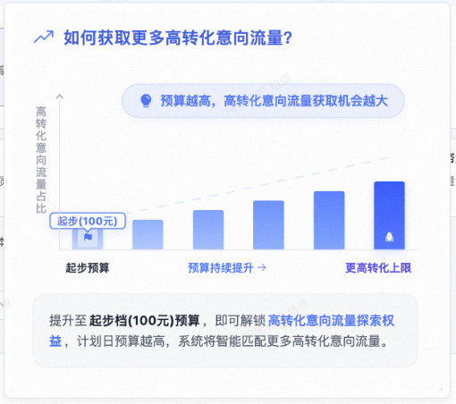
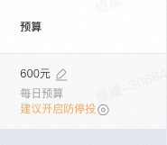
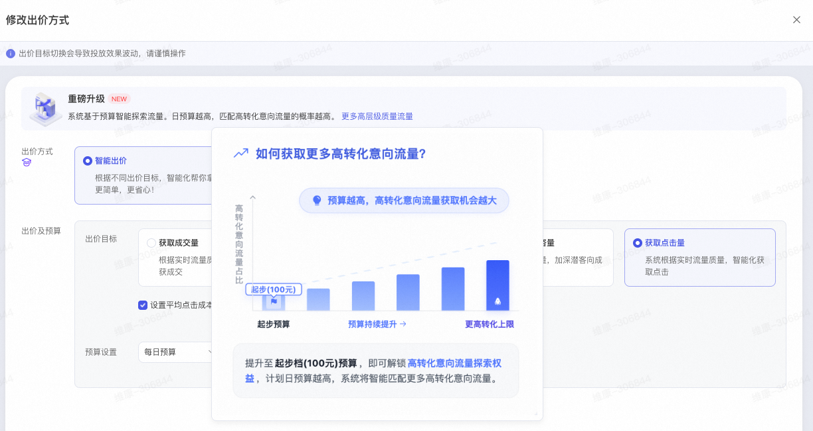

# 关键词场景「高转化意向流量探索权益」功能上线

> 来源：https://alidocs.dingtalk.com/i/nodes/R1zknDm0WR6XzZ4Ltxgmg9bOWBQEx5rG

**预算设高了怕“烧钱没效果”，设低了又拿不到稳定消耗？**

**计划展现、消耗忽高忽低，ROI难以平稳？**

**不用担心！关键词场景全新上线「高转化意向流量探索权益」**

**“日预算越高，计划获取高转化意向流量的比例越大”！计划日预算起步档门槛100元！**

## 核心权益与价值

预算不仅仅是“消耗上限”，而是“流量质量开关”。100元起步，越投越准。

✅计划日预算影响流量：计划日预算越高，系统匹配高转化意向流量的比例越大，系统探索半径越大，优先获取高转化意向流量

✅门槛低易参与：日预算 ≥100元 即可初步解锁权益

## 如何开启

第一步：查看功能入口，点击修改预算浮层，即可看到

第二步：**让计划获取更多的高转化意向流量，**计划日预算设置在**100元及以上**，即可初步解锁高转化意向流量探索权益；计划日预算越高，系统将智能匹配更多高转化意向流量

## **常见问题**

Q1：日预算设到100元，一定能拿到高转化流量吗？
A：100元是解锁权益的门槛，系统会智能匹配更多高转化意向流量，但实际获取比例受计划出价、行业竞争、素材质量、商品承接力等综合影响。

Q2：为什么我的计划看不到这个功能？
A：该功能正分阶段灰度开放，请耐心等待

Q3：100元之后的预算档位如何划分？
A：当前以100元为起步档，计划日预算设置越高，系统会给予更多的高转化意向流量，后续将根据实际效果明示阶梯档位，具体以产品页面提示为准。

Q4：预算设高了但花不完，系统还会给高意向流量吗？
A：会给，该权益与计划日预算相关
