# 04-1-超级短视频🔥🔥🔥

> 来源：https://alidocs.dingtalk.com/i/nodes/XPwkYGxZV347LdvpH0L3B6a9JAgozOKL

## 操作介绍

### 1.1 选择场景“内容营销——超级短视频

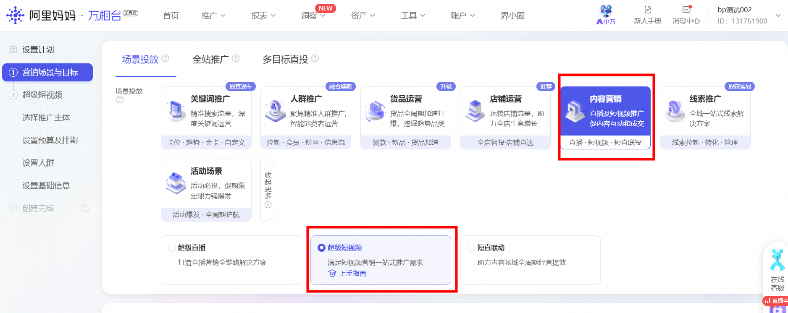

### 1.2 选择“视频加速”，选择新建推广计划——

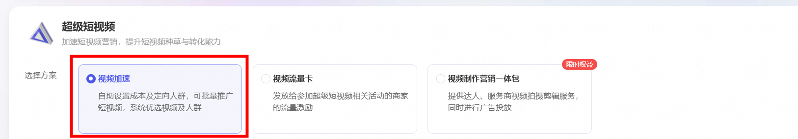

### 1.3 设置推广目标——

超级短视频有有效观看、点击引流、商品收加、长效转化的四个营销目标，分别满足商家视频拉新、视频引流、视频收加和视频转化四个诉求。

#### 有效观看

有效观看的推广目标：按照消费者3秒及以上的视频观看进行扣费，满足商家和达人通过短视频投放来给新客覆盖和视频观看，加速视频打爆的诉求。

侧重优化：视频有效观看，视频打爆

出价方式：分为2种

最大化拿量 ：**在预算范围内**，系统根据您选择的优化目标智能出价，尽可能优化目标效果

控成本出价：控有效观看成本，系统根据有效观看目标，尽量控制成本小于**设置的成本预期价格**

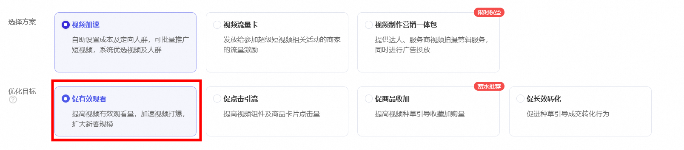

#### 点击引流

点击引流的推广目标：按照消费者实际点击进行扣费，点击含包括购买、加购、收藏、进店、转赞评、关注等行为，侧重优化视频组件和商品卡片的点击量，满足商家通过短视频投放提高短视频、店铺、直播间的互动的诉求。

侧重优化：视频组件，商品卡片的点击量

出价方式：分为2种

最大化拿量：**在预算范围内**，系统根据您选择的优化目标智能出价，尽可能优化目标效果

控成本出价：控点击成本，系统根据点击引流目标，尽量控制成本小于**设置的成本预期价格**

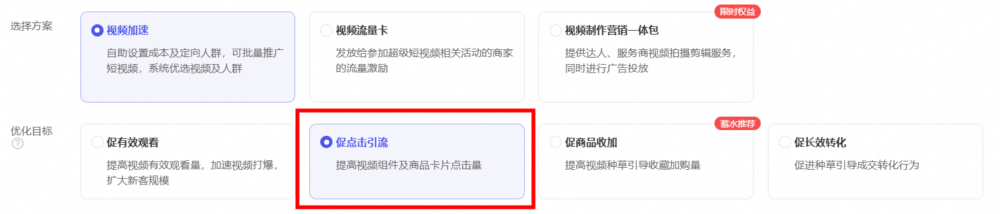

#### 商品收加

商品加购的推广目标：按照消费者实际点击进行扣费，点击含包括购买、加购、收藏、进店、转赞评、关注等行为，侧重优化通过视频带来的收藏加购量，更加直接的满足了商家视频种草的诉求。

侧重优化：视频种草引导的收藏量，加购量

出价方式：分为2种

最大化拿量：**在预算范围内**，系统根据您选择的优化目标智能出价，尽可能优化目标效果

控成本出价：控收藏加购成本，系统根据商品收加目标，尽量控制成本小于**设置的成本预期价格**

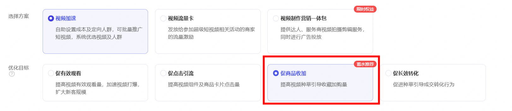

#### 长效转化

长效转化的推广目标：按照消费者实际点击进行扣费，点击含包括购买、加购、收藏、进店、转赞评、关注等行为，满足商家通过短视频投放来给提高店铺短视频种草效率和种草转化的诉求，并且提供了短视频长效转化的相关报表数据。

侧重优化消视频组件和商品卡片的点击量

出价方式：分为2种

最大化拿量：**在预算范围内**，系统根据您选择的优化目标智能出价，尽可能优化目标效果

控成本出价：控成交成本，系统根据长效转化目标，尽量控制成本小于**设置的成本预期价格**

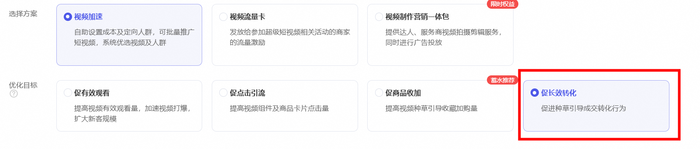

### 1.4 **选择推广主体并设置视频组件**

#### 选择推广主体

自定义选择：添加您想推广的视频，支持**千牛发布&光合发布**通过内容审核的短视频和超级短视频**后台本地上传**的智能选择：系统基于当前优化目标，对智选集合范围内的视频进行优选视频或探测视频

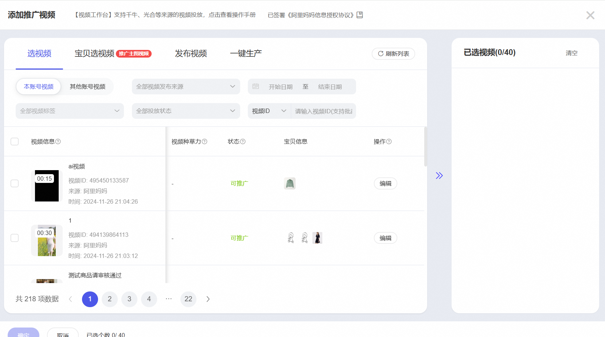

tips1：上传视频到投放视频的方式

**通过千牛或者光合平台上传；通过审核后，即可在超级短视频后台中直接选择**

**在超级短视频后台-视频工作台-本地上传视频**使用详解→https://www.yuque.com/yijiaoqu/vpgdoi/os8c4x

**tips2：视频创意越多，越容易跑出高效率视频，建议推广视频数量>10支。**

**tips3：视频审核常见问题**详解→https://www.yuque.com/yijiaoqu/vpgdoi/qq48md?spm=a2etp.23434838.0.0.1273340cdzxDen

#### 设置视频组件

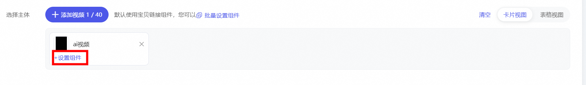

每个视频可以选择任一种视频组件，支持投中修改组件

### 1.5 **设置预算及排期**

选择推广模式：持续推广

持续推广：系统将基于您的投放实时扣费。投放开始后，您可以基于投放效果调整部分计划配置，也可以实时暂停、重启、结束投放计划。

固定套餐包：系统将一次性预扣除套餐包金额。投放开始后，将基于设置的投放目标及投放表现持续调优策略。由于策略迭代需要数据积累，因此投放过程中不支持暂停、编辑操作，同时建议至少投放两天后再查看投放效果数据。投放满五天或宝贝售罄下架后，可点击申请自助退款。

*以下操作截图为超级短视频持续推广投放流程示意图

设置预算：预算设置最低100元/天，可以投中暂停

设置出价：最大化拿量或控成本出价

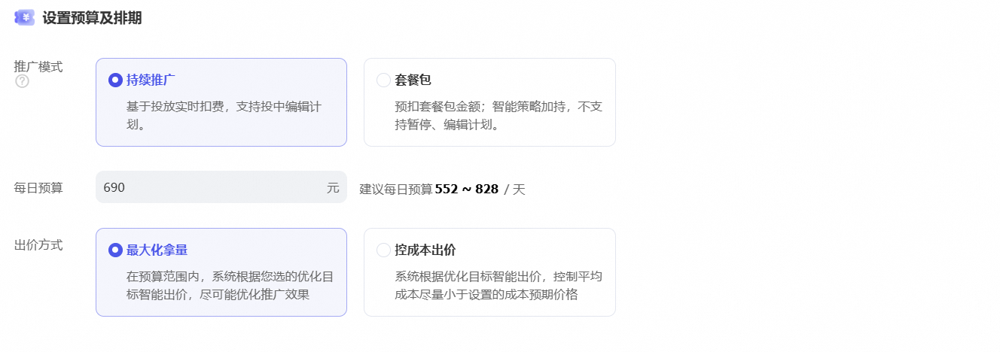

促进有效观看的出价：建议使用最大化拿量，或每千次观看成本出价＞25元

促进深度互动的出价：建议使用最大化拿量，或点击本出价＞0.6元

**促进商品加购&长效转化的出价：****建议使用最大化拿量****，支持控成本出价 **

tips:最低出价观看出价＞6元/千次观看，促进点击出价＞0.3元/次点击）

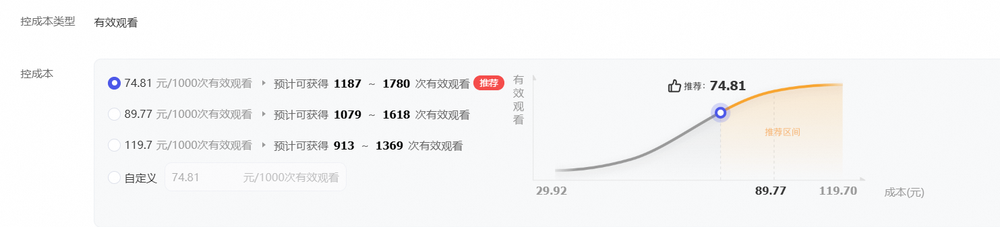

### 1.6 设置人群——

超级短视频有三类人群定向，您可设置广告将展现给哪些人群，目前超级短视频支持种子人群、智能人群和过滤人群的选择

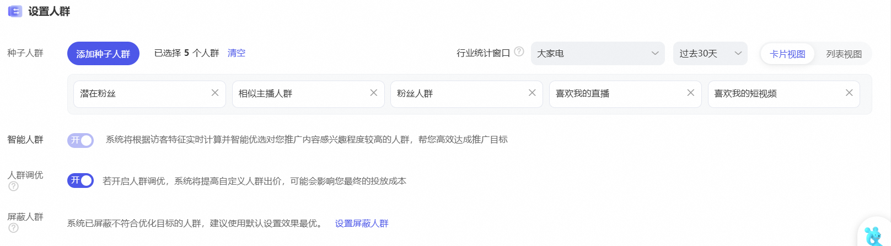

使用详解→https://www.yuque.com/yijiaoqu/vpgdoi/kx995l

种子人群：含系统推荐人群和自定义人群

系统推荐人群系统结合您的店铺、推广宝贝及所在行业的相关特征和属性，智能挖掘出对其感兴趣的一类人群标签；

自定义人群含内容破圈、内容偏好人群、店铺人群、关键词人群、达人偏好人群、平台精选基础属性人群和达摩盘人群（达摩盘已保存人群可投，建议人群规模大于1000万）；

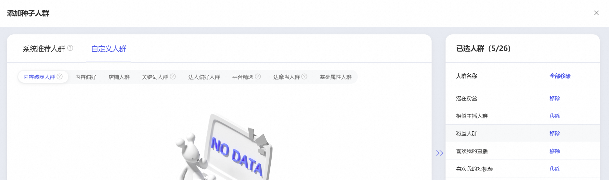

智能人群：系统将根据您选择的种子人群，进行相关人群的拓展，实时计算并拓展具有相同特征且对您推广内容感兴趣的人群

过滤人群：支持过滤非目标人群，如已购人群、性别、年龄

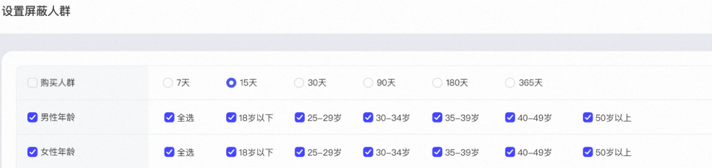

人群调优：在投前或投中可开启或关闭种子人群调优，开启后，系统提高种子人群出价，帮助商家更好的竞得种子人群，可能会带来一定程度得成本上浮

### 1.7 设置基础信息

投放日期：投放日期默认不限，建议使用系统默认设置效果最优

高级设置：投放地域及资源位预览

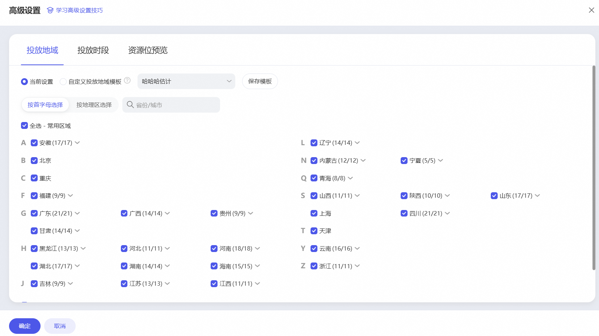

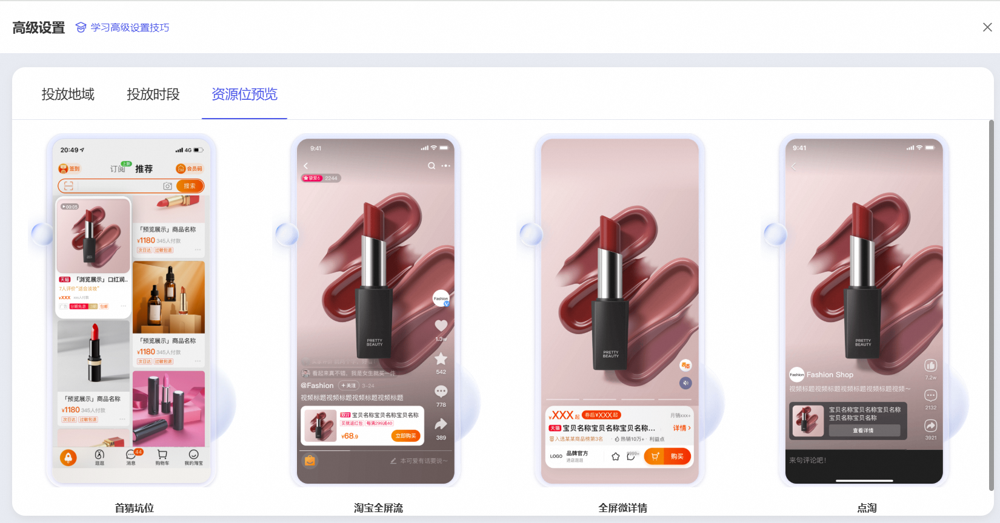

**完成创建并投放——**

## 计划管理与数据报表

计划管理页、数据报表页与旧版超级短视频均保持一致

### 2.1 计划管理

可以在实时计划列表下，修改投放状态，投放计划名称、投放日期、投放预算；新增推广视频、定向、开启人群调优等功能

### 2.2 数据报表

超级短视频给商家提供了两类报表，一个是推广效果数据报表、一个是种草潜在价值报表；前者可以查看整体汇总数据和分四大目标的数据情况,其中整体汇总包含基础效果、引导效果和即时互动4大基本指标。（关于报表的完整介绍→https://www.yuque.com/yijiaoqu/vpgdoi/drwln2）后者提供了种草溢出价值、新客引导价值和全店引流价值报表（关于报表的完整介绍→https://www.yuque.com/yijiaoqu/vpgdoi/wdqxnywr4vdqwna8）

​

商家针对不同的营销目标，应该重点关注的指标如下：

#### 一、促有效观看

目标：按照消费者3秒及以上的视频观看进行扣费，满足商家和达人通过短视频投放，给店铺引流、新客规模化覆盖、深度观看和提升有效观看量的诉求。

重点指标：

用户获取：新客触达量、新客触达成本

视频效率：有效观看量、有效观看率

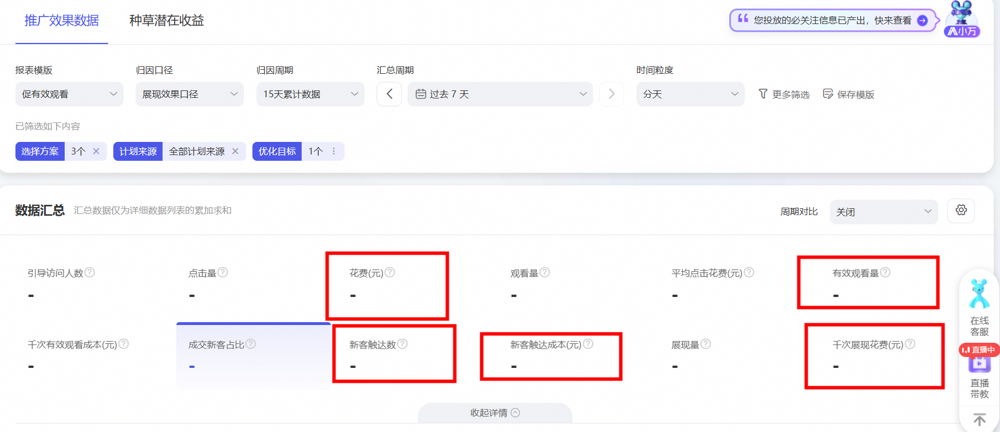

#### 二、促点击引流

目标：按照消费者实际点击进行扣费，点击包含用户购买、加购、收藏、进店、转赞评、关注等行为，促深度互动满足商家通过短视频投放来给提高短视频转评赞、直播间互动的诉求。

重点指标：

引导效果：进店成本、进店率

即时互动：互动率、直播观看量

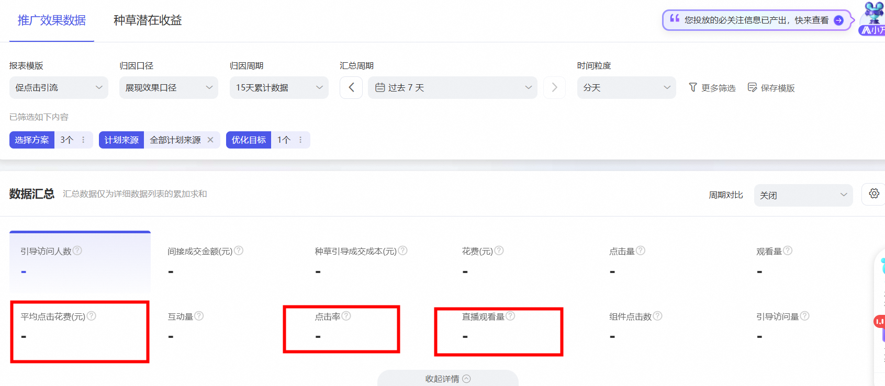

#### 三、促商品收加

目标：按照消费者实际点击进行扣费，点击含包括购买、加购、收藏、进店、转赞评、关注等行为，侧重优化通过视频带来的收藏加购量，更加直接的满足了商家视频种草的诉求。

重点指标：宝贝收藏加购成本

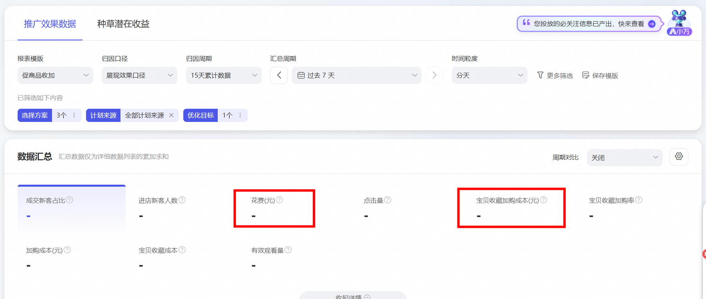

#### 四、促长效转化

目标：按照消费者实际点击进行扣费，点击包含用户购买、加购、收藏、进店、转赞评、关注等行为，满足商家通过短视频投放来给提高店铺短视频种草效率、种草长效转化的诉求。

重点指标：成交金额、ROI

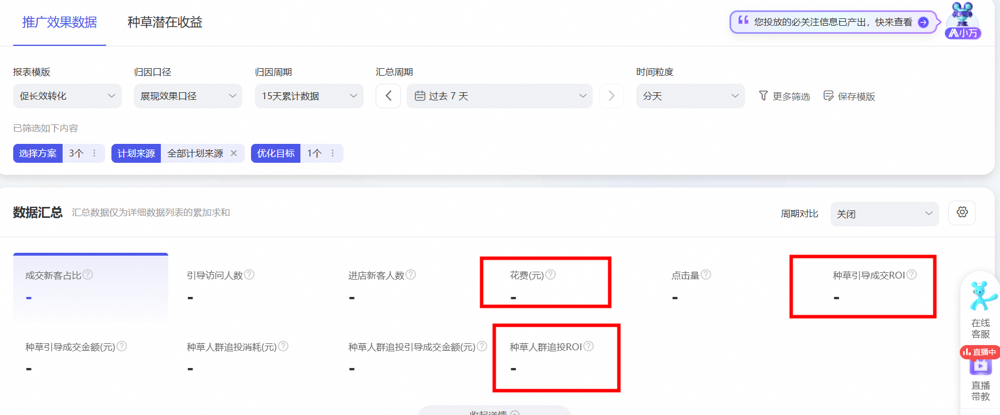

### 2.3 数据明细

新报表还支持查看分计划、分推广视频主体、分定向的数据情况含成交相关数据

报表下载新增日期列表，帮助商家更细致地分析数据。

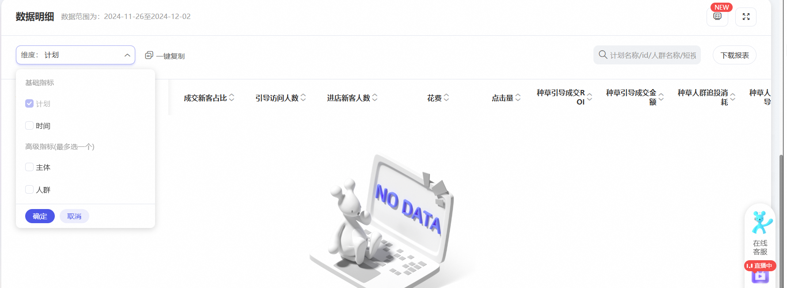

###

**有产品使用问题，可以入群反馈交流，钉钉群号：****1群-34207792（满）、2群-34909940（满）、3群-33128094、4群-32034597、5群-33498397、6群-33902990、8群-34719895、7群-31171675、9群-32708225、10群-3294193**1、11群-33502809**、新群-44550124**

申请入群请带店铺+名字，入群后请修改昵称店铺+名字
