# 06-线索推广（原获客易）

> 来源：https://alidocs.dingtalk.com/i/nodes/XPwkYGxZV347LdvpH0L3Bo2yJAgozOKL

**原语雀文档链接：**https://yuque.antfin.com/chenchun.chen/gqhty9/mvvlxsrypbsbqprp

---

**产品直达入口****：**

**新客玩法指南：**【线索推广】新客成长指南

如果您有留资需求，但是没有展示线索推广菜单，请填写报名问卷并加群 103525002171 **联系小二帮您开通。**** **《线索推广场景报名问卷》

🔥🔥为更好满足商家获取客资的诉求，线索推广特此推出**「优化留资获客成本」优化目标，该优化目标可直接交付线索，线索成本更确定**！

详情查看：

# **一、产品介绍**

## 1、无界「线索推广」是什么？

**「线索推广」是专门为线索行业商家（交易方式偏线上引导用户预留手机号，再引导线下成交/试驾/体验，或需根据客户定制化诉求提供专属方案的）提供的淘内一站式线索获取、线索经营、线索管理的解决方案。**

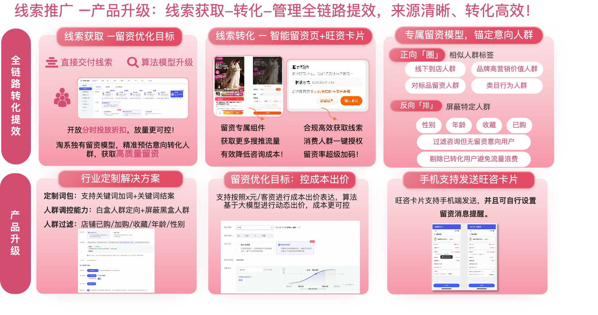

行业解决方案介绍：

控成本出价介绍：

**产品直达链接：**

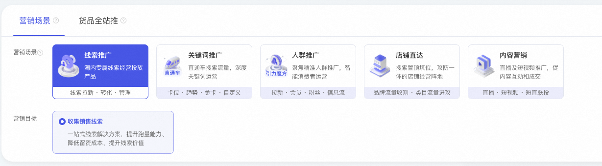

**准入行业：**针对家装、文教、企业服务、医美、汽车、本地生活、商业农业、数字生活等线索行业开放。

**玩法指南：**

**新建计划：****万相台无界版**（点击即可进入，首次登陆需主账号登陆，主子账号完成线索推广场景授权后，子账号才会展示菜单，没有展示的请进群96160013252联系小二）

**覆盖资源位：**包含手淘-关键词搜索、猜你喜欢、手淘焦点图、手淘互动城(芭芭农场/淘金币等)、手淘短视频全屏页上下滑、点淘(淘宝直播APP)等流量渠道，满足多种场景诉求。

**留资形态/优化目标：**支持旺旺在线咨询、下单成交、短视频表单留资3种承接形态。

| **旺旺在线咨询** 通过引导消费者进入旺旺咨询，客服可直接与消费者对话沟通，通过针对性介绍商品/服务，讲解服务权益的方式，引导消费者在留资卡片上留下手机号（扣费方式：CPC） 🔥**【控成本投放】按旺咨成本出价、按线索成本出价已全量开放，欢迎广大商家使用。** ​ | **0元下单** 以1元课、9.9元试听试驾等低客单宝贝，引导消费者直接下单，促成商家获取客资。（扣费方式：CPC） | **表单留资** 通过短视频内容种草，引导用户点击视频下方组件，在落地页中提交手机号。（扣费方式：CPC） |
| --- | --- | --- |

## 2、为何要选择线索推广？

**流量大：**覆盖淘内搜索场+推荐场+互动场+短视频场+展示场等全域流量，可实现一站式智能投放。

**心智强：**背靠卖获型流量场，人群购买力强，意向明确，在后链路质量上更具优势。

**数据全：**除了提供曝光、点击、收藏加购等营销指标以外，还会提供旺旺咨询量、旺旺咨询成本、线索量、线索成本等咨询指标，帮助线索行业商家更好的评估获客成本。

**模型优：**线索推广有专门针对线索行业旺旺咨询、商品下单、表单提交三种单独的算法模型预估，通过智能流量采买、智能算法调优、智能人群定向、智能出价方案等方式，帮您找到精准人群，完成曝光、种草到收割的全链路。

**效率高：**通过对消费者提供商品或者服务的权益，引导消费者进行旺旺咨询，专业客服给于表单、钩子品、代金券等形式转化，提升精准用户留下客资，有效过滤掉无意向用户，提升拿客资效率。

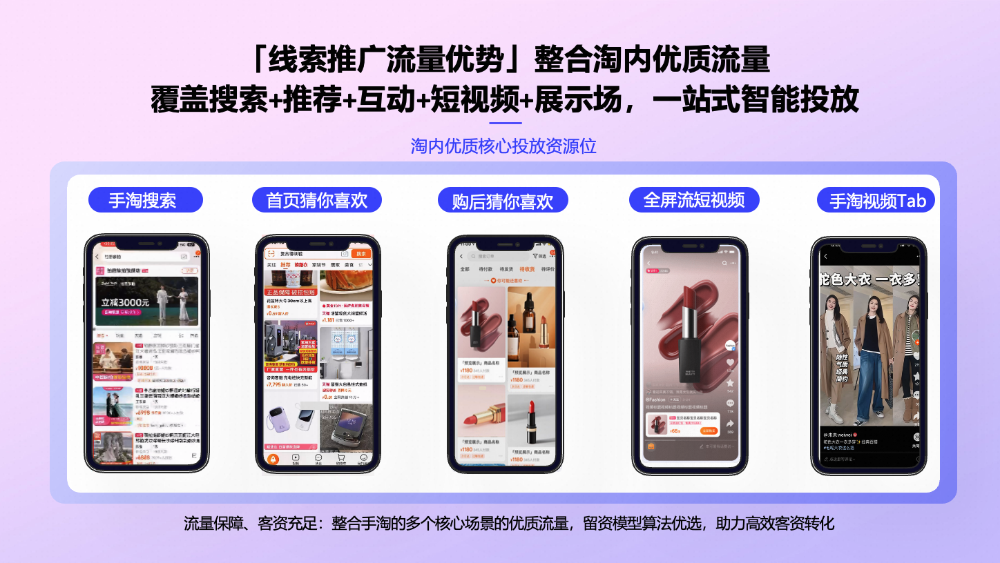

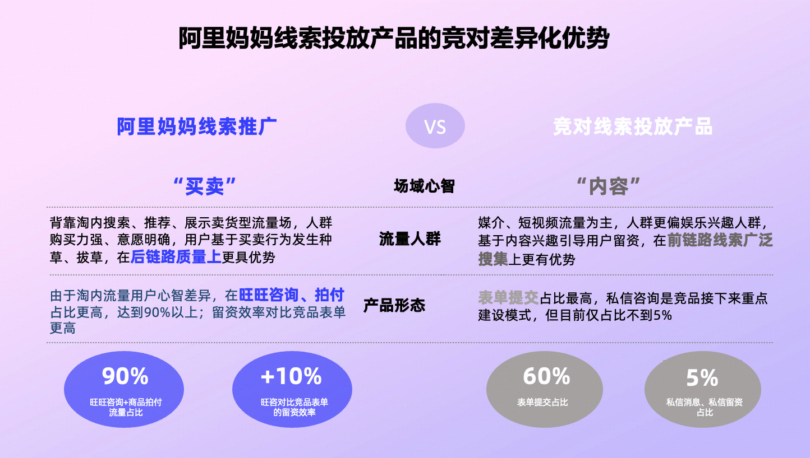

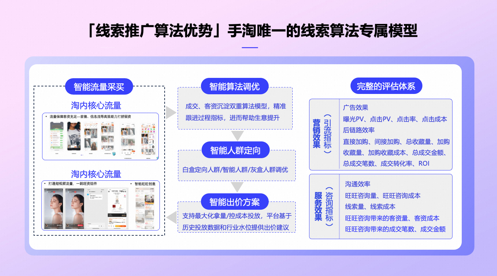

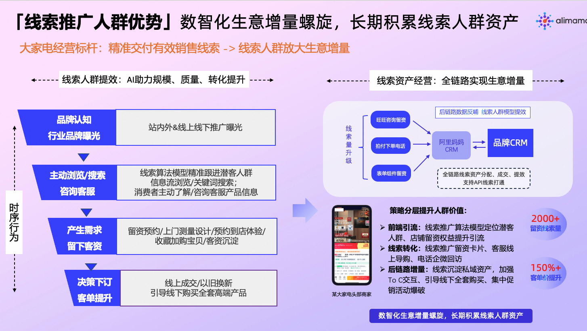

## 3、线索推广的准入条件和规则

**准入行业：**目前医美、本地生活、家装、汽车、教育、企业服务等线索行业才会展示线索推广入口。如果发现没有展示线索推广菜单，如果您有留资需求可进群联系小二进行加白，群号96160013252。

如果您有留资需求，但是没有展示线索推广菜单，请填写报名问卷并加群 103525002171 **联系小二帮您开通。**** **《线索推广场景报名问卷》

## 4、线索推广客户群

更多问题请加官方钉钉群：

线索推广客户群6群：103525002171（此群已满，请加7群）

线索推广客户群7群：96160013252

## 5、优质商家案例

| **家装行业** | **文教行业** | **家装行业** |
| --- | --- | --- |
|  |  |  |

|  |  |  |
| --- | --- | --- |

| **数字生活行业** | **汽车行业** | **汽车行业** | **文教行业** | **文教行业** |
| --- | --- | --- | --- | --- |
|  |  |  |  |  |

# 二、操作手册

## 创建计划

### （1）选择场景

万相台无界首页下拉进入线索推广场景，选择「新建计划」

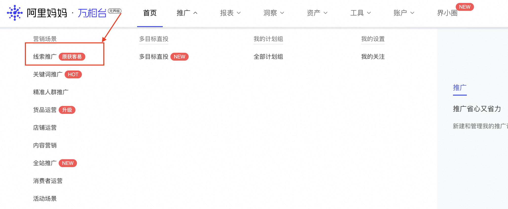

### （2）解决方案

商家可根据自身需求选择「旺咨下单」或「表单线索」解决方案。

| **解决方案** | **旺咨下单🔥🔥🔥** | **表单线索****（产品能力升级中，暂时下线）** |
| --- | --- | --- |
| **投放主体** | **商品（必选）**/短视频/淘积木 | **短视频** |
| **推广模式** | 持续推广/套餐包 | 持续推广 |
| **优化目标** | 旺旺咨询成本/下单获客成本 | 表单提交量 |
| **投放方式** | 最大化拿量/控成本投放（旺咨） | 最大化拿量 |
| **定向设置** | **黑盒人群：**打底通用逻辑 **侧重人群：**算法定制人群、小二精选人群 **白盒人群：**达摩盘自定义人群（推荐使用） | **黑盒人群：**打底通用逻辑 **侧重人群：**算法定制人群、小二精选人群 **白盒人群：**达摩盘自定义人群（推荐使用） |
| **方案差异** | **旺咨模型：**有专门的旺咨模型实时优选高转化人群，尤其适合商品价格较高、偏定制的客户，建议投放有咨询利益点的商品。 **成交模型：**在淘内有店铺、商品的客户，有钩子商品、能够提供免费试驾、低价体验等服务的客户 | **表单模型：**流量覆盖ND视频流、短视频，支持人群定向、表单提交优化模型加持，通过内容种草快速引导消费者填写表单，帮助线索行业商家快速获取更多优质客资，适合于擅长内容种草、有优质视频内容素材的客户。 |

​

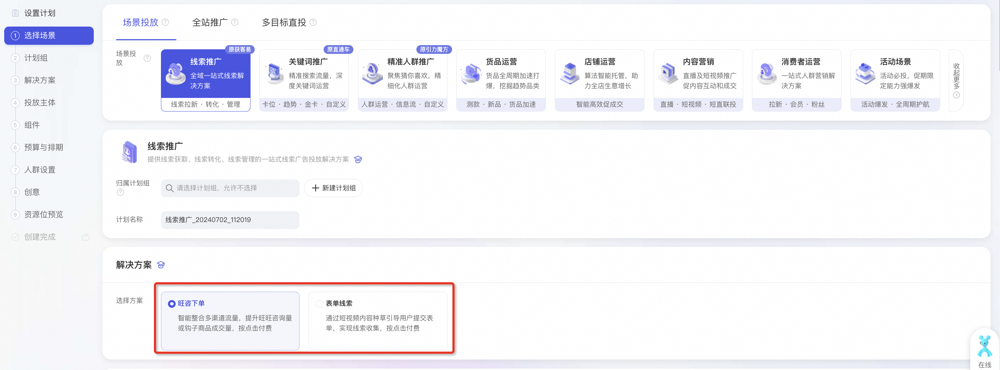

## A 旺咨下单

🔥🔥**请优先选择「旺咨下单」解决方案，**独立的旺咨算法模型支撑，**旺咨成本更低、旺咨效率更高！**「旺咨下单」场景目前无需开通，即可进入产品进行使用。

### （1）选择方案

选择「旺咨下单」解决方案

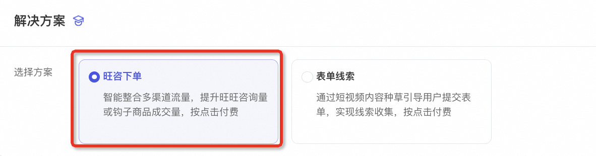

### （2）投放主体

**商品：**挑选一个商品，建议是同期在直通车推广热销的品，如果没有，建议挑选销量还不错的品。（必选）

**淘积木：**淘积木自定义制作页面，可参考钻展和超推使用的淘积木落地页（可选，也可不选）。

**视频：**配置视频，光合平台审核通过的视频，可多条！（可选，也可不选）

备注：如果是选了视频和自定义，素材就会投放到站内支持视频/自定义页面的流量里。

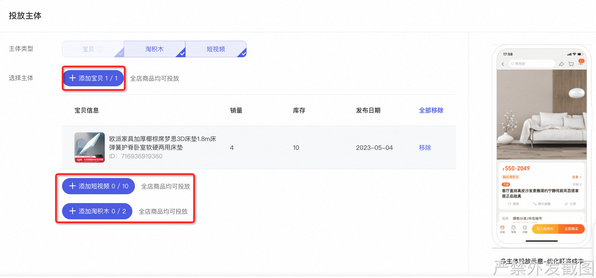

### （3）预算与排期

**预算方式：**建议选「持续推广」，基于广告投放实时扣费，支持投中编辑修改计划

**每日预算：**建议从200-500元日预算开始

**优化目标：**支持「优化旺旺咨询成本」、「优化下单获客成本」

建议：如优化目标选择的是旺咨成本，可在宝贝详情页上添加多个区域引导用户点击旺旺咨询，主图创意添加：咨询就送xxx的文案

**高级设置：**非必填项，系统默认全投。也可以参考实际需求设置地域，地域务必多城。

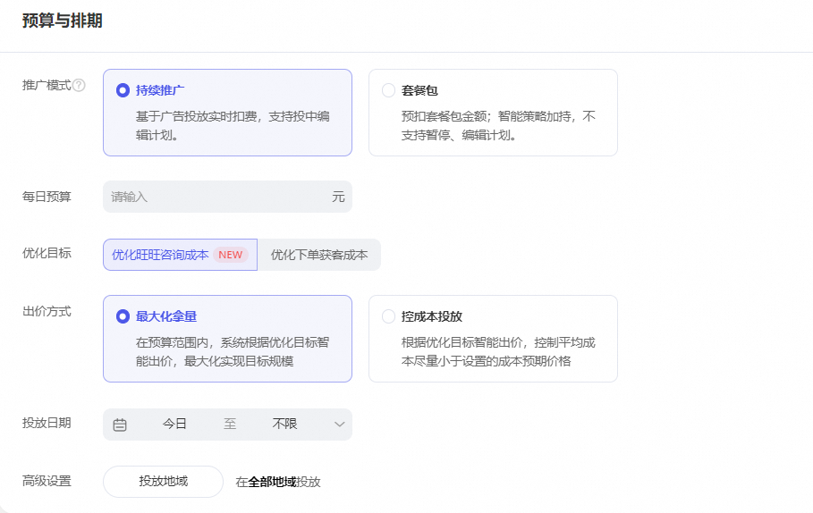

### （4）人群设置

**🔥🔥🔥****「达摩盘人群」**同时支持品牌上传达摩盘自定义人群包，有效过滤掉无意愿用户，提升留资效率（规模建议在500-1000w，一定要圈选上达摩盘人群，以便更好拿量！）

**「算法推荐人群」**万相台自动迭代人群为智能算法人群，

**「平台精选」**平台同时提供关联类目高转化潜力人群包让品牌圈选

注意：根据目前常规人群逻辑设置人群包即可，建议勾选多个人群3+来推广。

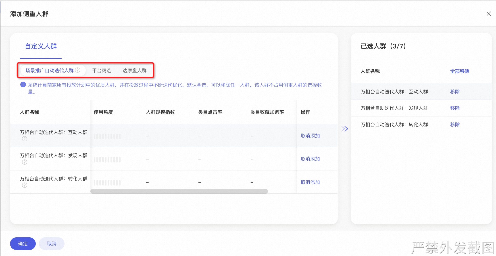

### （5）创意设置

**① 智能创意： **系统将根据您使用的商品主副图作为打底，或者基于自定义创意，生成多种创意效果，自动适配不同资源位（当商家选择主图+副图的时候，系统按CTR择优透出）。

**② 创意素材上传：**所有场景支持上传自定义创意，创意形式包括 方图、竖图、方视频、竖视频

注意：

两个尺寸（1:1，2:3）的白盒创意一定要上传，图片和视频都可；

点击自定义创意详情，可以查阅上传创意的审核状态及风控审核拒绝原因，所有场景支持创意预览

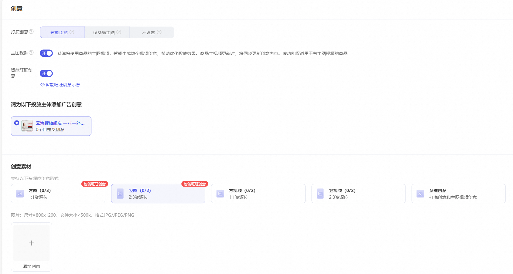

### （6）旺旺留资卡片

旺旺留资卡片是为投放阿里妈妈【线索推广】的商家提供的线索收集工具，商家已经开通了客户工作台「线索管理」功能，且近90天签署阿里妈妈线索推广准入协议并有投放消耗的商家可以使用该功能。功能当前还在灰度阶段，会基于上述条件向部分商家开放。不在开放范围内的商家将无法看到开通入口。

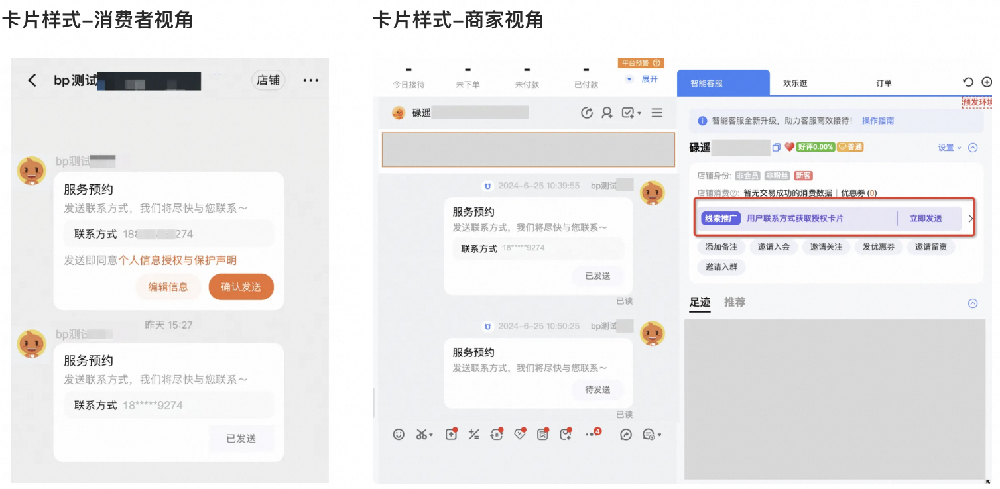

商家在阿里妈妈客户工作台和千牛工作台完成开通配置后，可以通过**商家手动触发****、****消费者手动触发**、**消费者语义识别**这3种方式，完成对消费者的卡片投送，提升旺旺咨询场景下的留资效率。

具体配置流程请看：https://www.yuque.com/tihrel/iug1p0/sqw2yblmssgz67i4?singleDoc# 《旺旺留资卡片介绍》

## B 表单线索

**由于内部表单能力升级，线索推广【表单线索】解决方案将自2024年9月13日起暂时下线，短期内将不再支持新建表单计划。在投计划将从9月13日开始减少放量，商家可提前关闭计划。待内部升级迭代后，后续将以更加高效、智能的全新版本重新上线，感谢您的理解与支持。**

**​**

**🔥🔥新增短视频种草+表单收集解决方案，目前灰度内测中，商家需报名参加（如您有旺咨下单需求，无需报名，系统自动开白）**

**报名入口：**https://survey.taobao.com/apps/zhiliao/VENIUcIwa

表单线索方案行业准入规则及违规行为规范：

https://rule.alimama.com/#!/product/index?type=detail&id=1074&categoryId=1125&knowledgeId=20004913

### （1）选择方案

选择「表单线索」解决方案

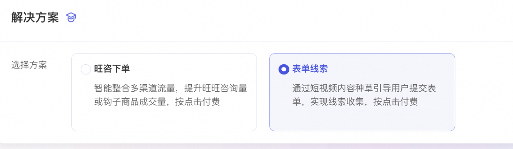

### （2）投放主体

表单线索支持投放短视频主体。支持投放来源包括光合平台和阿里妈妈商业平台的视频，建议选择时长较长的短视频进行投放（建议10s-60s）

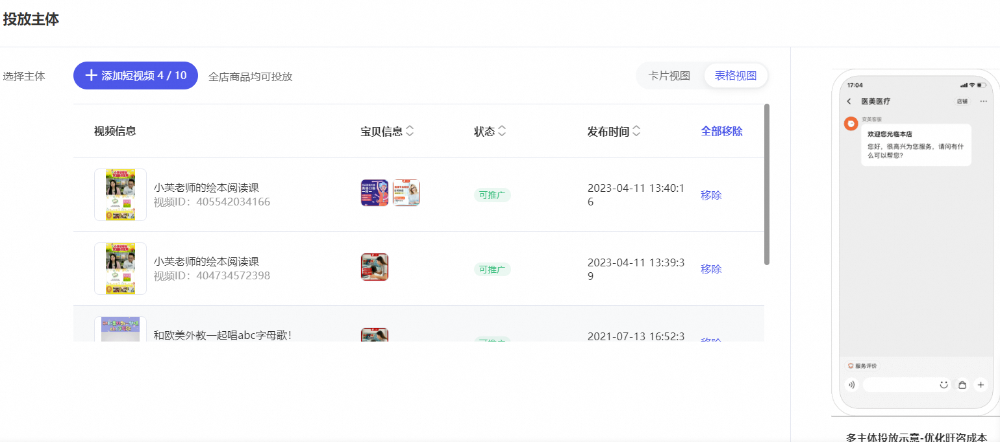

### （3）配置组件

视频组件选择留资组件，可在自定义组件设置中对表单组件进行配置

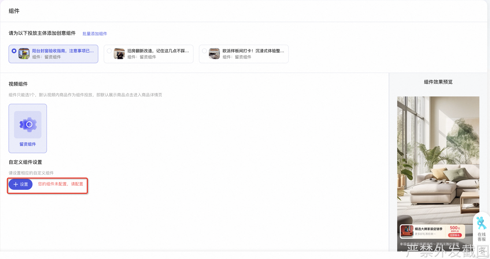

**①点击「自定义组件设置」，进入淘积木编辑器，进行组件图片（图片规格120x120px）、标题、副标题、按钮文字等设置。**

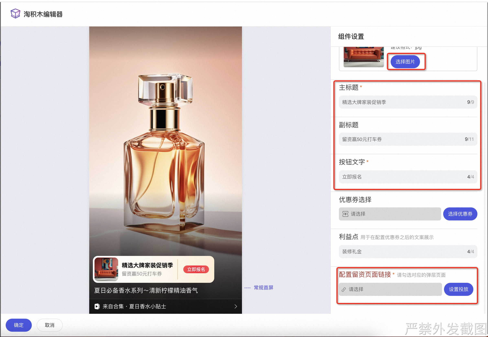

**②点击「配置留资页面链接」，进入表单编辑页面，进入淘积木广场，****选择「短视频留资浮层模版」****，进行图片和内容设置。**

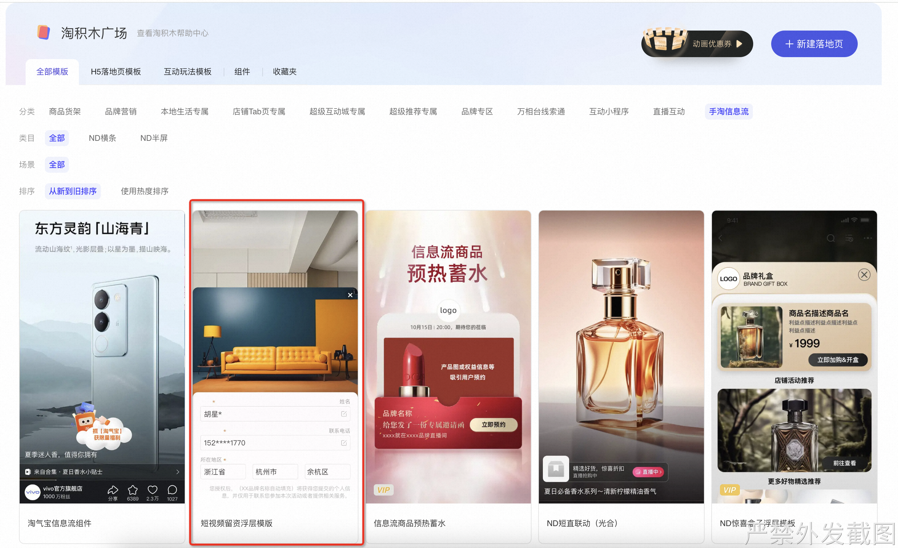

**③进入淘积木编辑器后，可以对「图片」和「智能表单」进行修改。**

目前图片支持宽度750px，长度不限，可在图片里放一些成功的样板间图片，同时告诉用户，现在留下电话号码，可以免费获取方案、获取礼品等。支持GIF图，但大小需小于1M。

智能表单中可以对用户需要填写的字段，如姓名、联系电话、地区进行自定义选择，表单标题和按钮文案均支持修改，建议改为「限时领取」、「免费领取」、「免费咨询」等更有吸引力。

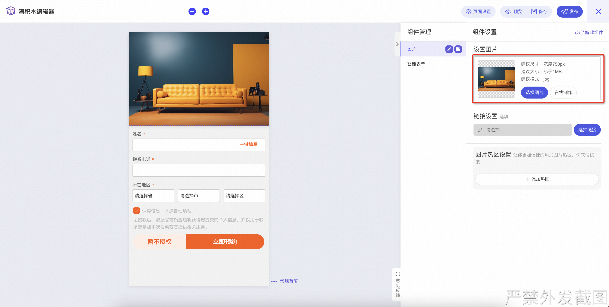

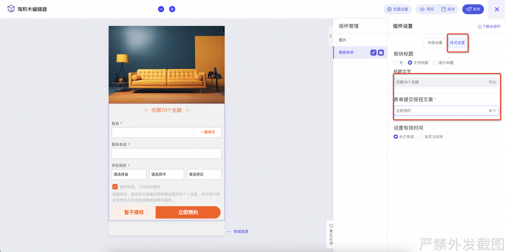

### （4）预算与排期

**① 推广模式：**仅支持“持续推广”，基于广告投放实时扣费，支持投中编辑修改计划；

**② 每日预算：**设置日预算，建议设置为200-500；

** ③ 优化目标：**选择“优化表单提交量”；

** ④ 高级设置：**非必填项，系统默认全投。也可以参考实际需求设置地域，目前支持按省、市选择，地域务必多城。

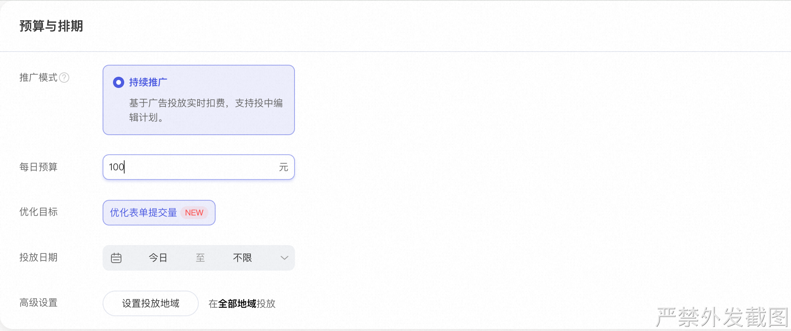

### （5）人群设置

**🔥****「达摩盘人群」**同时支持品牌上传达摩盘自定义人群包，有效过滤掉无意愿用户，提升留资效率（推荐）

**「算法推荐人群」**万相台自动迭代人群为智能算法人群

**「平台精选」**平台同时提供关联类目高转化潜力人群包让品牌圈选

### （6）创意设置

解决方案为表单线索时，无需填写创意

# 五、常见问题

**（1）优化目标旺旺咨询成本和下单获客成本有什么区别吗？**

答：旺旺咨询成本是以优化旺旺咨询成本为主要目标的模型，该模式下旺旺咨询量和成本会优于其他产品。下单获客成本是以优化roi为主要目标的模型。两者的流量来源一样。

​

**（2）计划开始后日限额可以随时修改吗？**

答：持续推广模式下，在计划开始后支持日限额的修改调整，日预算实时修改，修改后2-3小时滞后生效。

注意：为保证投放效果，不建议商家一天内频繁打开/关闭计划，不要频繁的修改日限额，每次打开和关闭都需要算法的冷启动，会影响最终的效果。

​

**（3）为什么今日消耗没有达到我设置的日预算呢？**

答：系统会尽量按您设置的日预算限额进行消耗，但由于大盘流量实时变化，最终消耗可能和您的日预算限额存在偏差，以实际为准。

注意：新建计划第一天的日预算会少于设置的日预算。例如，中午12点建立的计划，会根据算法计算其剩余的日预算，约为50%~70%的日预算。

**（4）可以选择套餐包计划类型吗？**

答：可以，但是不建议，不够灵活。

​

**（5）如何查看和处理用户留下的手机号码？**

新零售的客户可以在新零售的CRM上看到留资信息，非新零售的客户可以在妈妈客户工作台的销售线索里能看到所有的线索，包括线索跟进漏斗、线索列表、转化状态、归属人等信息。

妈妈CRM产品入口：https://mamabusiness.taobao.com/#/lead/pages/LeadChart

妈妈工作台操作手册：https://www.yuque.com/tihrel/iug1p0/rsvrkg#rrEfU

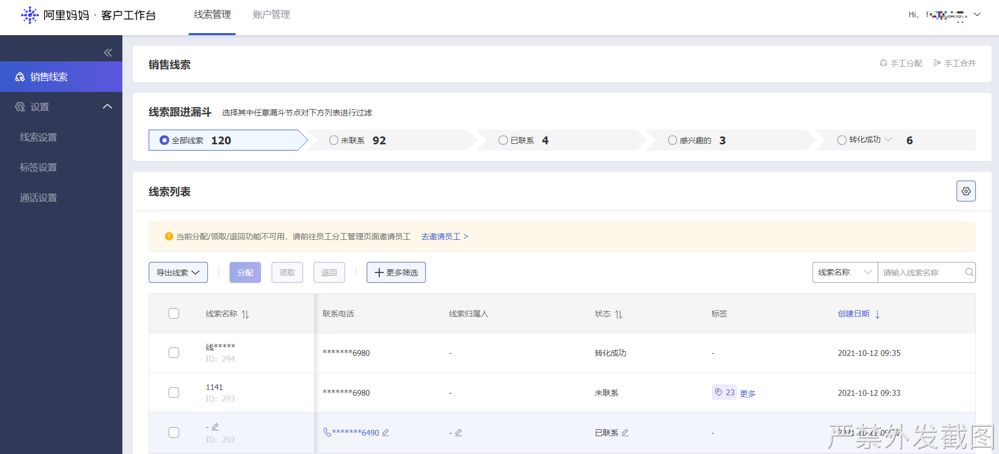

**（6）如何下载投放报表？**

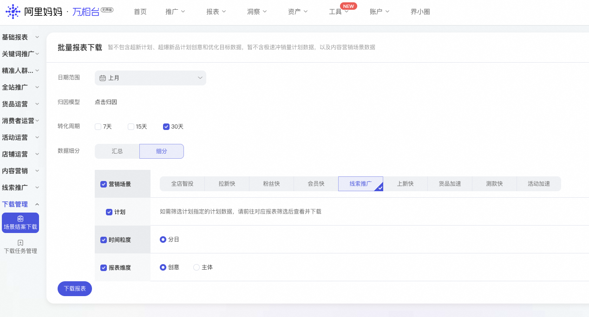

目前仅支持在报表-下载管理界面下载报表，下载时需要勾选上营销场景、计划、时间维度、报表维度，其他的下载能力产品将持续迭代。

​

**（7）通过阿里妈妈「线索推广」工具留资是否会触发天猫“诱导第三方”违规类型并受到处罚？**

只要您在使用「线索推广」投放场景时，完成了《线索推广功能安全使用承诺函》 的签署，并使用本场景提供的官方留资渠道（钩子商品下单、视频表单、旺旺留资卡片）获取消费者联系方式，不属于天猫违规处罚的类型。

消费者通过这些渠道留下的手机号，全部签署过消费者信息授权协议，均为合规获取。其他通过任何非官方留资方式（如通过外链引导到私域、发布其他付款方式，诱导消费者去第三方平台交易）将有可能命中天猫违规类型。

*注：您通过阿里妈妈「线索推广」获取到的消费者信息均需在合理范围内使用，对违规使用行为，平台将加严加重处置。*

*具体解答：**https://qn.taobao.com/headline/news/10711855?spm=a211vu.12026430.0.0.1fff3929jOT71h*

​

##### （8）如何邀请协作者/员工并分配线索？——阿里妈妈客户工作台协作SOP

首先，明确您是“协作者”还是“员工”：“外人线索归你管 → 用协作者；内部人力帮你干 → 用员工”。

其次，根据文档操作步骤进行权限申请及分配>>

| **您的业务场景** | **请选择 →** | **关键特征** |
| --- | --- | --- |
| 我要管理别人的线索 （如：品牌方管经销商、服务商产生的客资） | 👉 协作者 | • 对方必须有淘宝/天猫店铺 • 其线索自动同步到您账户 • 同一时间协作者只能归属1个组织 |
| 我要让别人帮我管我的线索 （如：销售A负责华东、客服B跟进售后） | 👉 员工 | • 对方无店铺（但需注册工作台） • 您主动分配线索给他 • 可同时为多个组织工作 |
| 我想分配线索给子账号 | ❌ 不支持！ 子账号无法单独接收线索分配 | • 子账号可见全部线索，但无“分配”功能 • 如需分责，请改用“员工”角色 |
