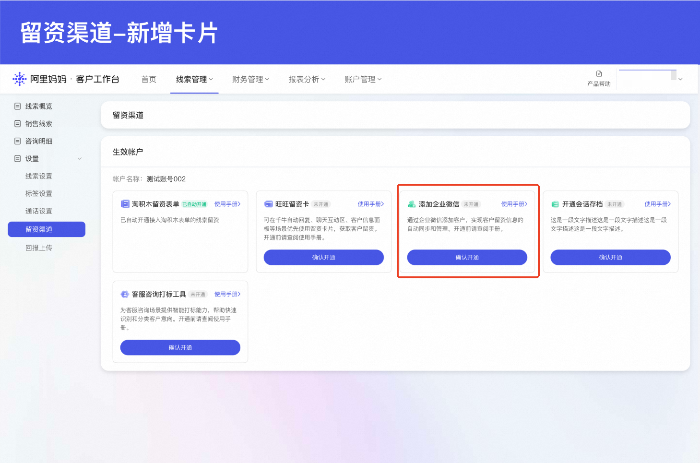
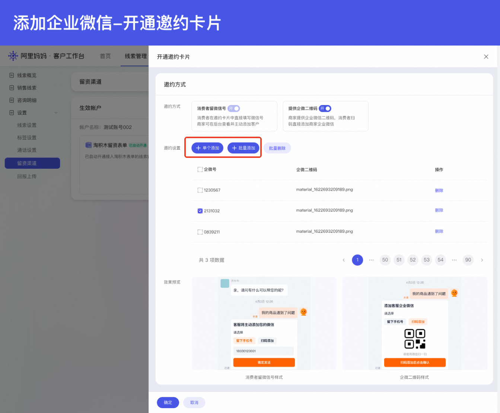
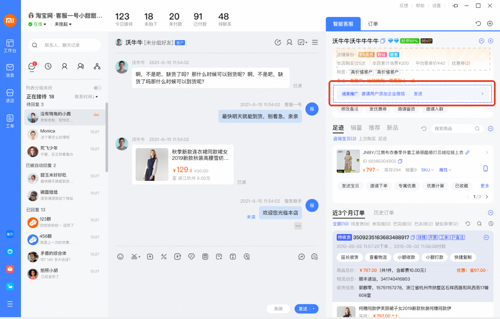

# 线索推广·企微邀约卡片权益放送

> 来源：https://alidocs.dingtalk.com/i/nodes/XPwkYGxZV347LdvpH901wKGeJAgozOKL

**企微邀约卡片重磅上线，线索推广全新旺旺获客方式**

**产品能力：**企微邀约卡片是阿里妈妈为投放线索推广产品的商家提供的线索收集工具。商家可在旺旺咨询中向消费者发送企微添加卡片，消费者可扫码添加店铺企业微信。本产品旨在为合规经营商家提供安全、规范的留资渠道，助力商家在合规前提下高效完成线索转化，提升客户跟进效率。

**限时福利：**为了让商家**更快用上这一新能力**，我们特别开启本次福利活动：**无需等待计划消耗达标，下单【企微卡片权益包】即可快速开通权限，更早拿到生意助力。**

## 活动规则

| **项目** | **内容** |
| --- | --- |
| 活动对象 | 全量拥有线索推广场景权限的商家 |
| 活动时间 | 2026年7月15日 ~ 2026年8月16日 |
| 活动权益 | 线索推广消耗达标 or 下单【企微卡片权益包】即可获得企微邀约卡片权限 |
| 达标门槛 | 无界账户在线索推广场景累计消耗 ≥ 500元 |

## 两种获取方式

商家可通过以下两种方式获得企微邀约卡片权限，二选一即可：

### 方式一：投放消耗达标

活动期内，商家无界账户在线索推广场景的累计消耗达到 500元及以上，次日自动获得企微邀约卡片权限。

**消耗统计范围：** 商家无界账户在线索推广场景的实际消耗金额，以系统统计为准。

**权限生效时间：** 消耗达标后次日自动开通，商家可登录阿里妈妈客户工作台查看并使用。

**权限有效期：** 开通后长期有效。若开通后连续30天线索推广消耗低于500元，卡片权限将暂时回收，待后续重新投放后可再次激活使用。

### 方式二：直接购买权益包（快速通道）

不想等待消耗达标？商家可直接在【线索推广 - 新建计划 - 行业解决方案】页面下单【企微卡片权益包】。**下单后务必进入【客户工作台-线索管理-留资渠道-企微邀约卡片】点击【确认开通】，即可越过消耗门槛验证，直接开通卡片功能！**

**一键下单：**https://one.alimama.com/index.html#!/main/index?bizCode=onebpAdStrategyLiuZi

| **第一步：下单权益包** | **第二步：点击确认开通，越过门槛验证** |
| --- | --- |
| **操作平台：万相台AI无界·线索推广** | **操作平台：阿里妈妈·客户工作台** |

| **项目** | **说明** |
| --- | --- |
| 起投金额 | 最低 500元 |
| 退款规则 | **不可退款！！！** |
| 权益发放 | 下单支付并开启投放后，直接满足任务目标，**次日准时发放卡片权益** |

## 企微邀约卡片是什么？

企微邀约卡片是阿里妈妈为投放线索推广产品的商家提供的线索收集工具。商家可在旺旺咨询中向消费者发送企微添加卡片，消费者通过以下两种方式完成企业微信添加：

| **添加方式** | **说明** |
| --- | --- |
| 留下手机号 | 消费者在卡片内填写个人微信号并提交，商家使用企业微信主动添加消费者 |
| 扫码添加 | 商家发送企业微信二维码，消费者扫码主动添加商家企业微信 |

### 产品优势一览

| **优势项** | **详细说明** |
| --- | --- |
| 合规经营 | 平台管控政策背景下提供合规留资渠道，有效降低违规风险 |
| 高效转化 | 支持手机号加微和扫码加微两种方式，灵活适配不同消费者加微需求 |
| 状态追踪 | 实时回显用户操作状态，便于商家及时跟进处理 |
| 团队协同 | 支持批量添加企业微信账号，实现多人协作跟进线索 |

## 使用三步走

### 第一步：确认开通状态

消耗达标或购买权益包后，登录阿里妈妈客户工作台，进入【线索管理】-【设置】-【留资渠道】页面，查看企微邀约卡片是否已显示【已开通】。

**注意事项：**

**回收规则：开通后若连续30天线索推广消耗不满足规定金额，卡片权限将暂时回收，待后续重新投放后可再次激活使用。**

**行业限制：新零售商家暂不支持开通企微邀约卡片。**

### 第二步：配置邀约方式

在邀约卡片配置页面，根据业务需求选择邀约方式：

| 方式 | 说明 |
| --- | --- |
| 手机号加微 | 系统默认开启，不可关闭 |
| 扫码加微 | 商家可自主选择开启或关闭 |

在邀约设置模块中，添加员工企业微信账号，支持批量添加操作，需上传以下信息：

企微号（必填）

企微二维码（必填）

⚠️ 请确保上传的是企业微信官方二维码且在有效期内。如发现上传非企微二维码、过期二维码或其他违规行为，平台将直接收回使用权限。

### 第三步：发送邀约卡片

客服人员登录千牛客户端，在线索推广功能栏区域选择需发送的企业微信账号，点击确认后系统将向消费者发送企微邀约卡片。

### **！！！【企微邀约卡片】开通后，客服首次使用前，务必刷新千牛客户端！！！**

## 常见问题

**Q：活动期间消耗未达到500元怎么办？**

A：可继续投放直至达标，也可直接购买【企微卡片权益包】快速获得权限。

**Q：权限开通后在哪里使用？**

A：登录阿里妈妈客户工作台，进入【线索管理】模块即可使用。客服人员在千牛客户端的线索推广功能栏中发送企微邀约卡片。

**Q：企微邀约卡片是否收费？**

A：企微邀约卡片作为线索推广附赠功能，卡片使用本身不收取费用。若需开通【企微会话回传】功能，则需额外付费，具体以阿里妈妈客户工作台页面为准。

**Q：权限开通后可以关闭吗？**

A：可以。商家可在【线索管理】-【设置】-【留资渠道】页面的邀约设置模块中，关闭扫码加微选项。手机号加微为系统默认开启，不可关闭。

**Q：如果开通后长时间不使用会怎样？**

A：开通后若连续180天无线索推广消耗，卡片权限将暂时回收，待后续重新投放后可再次激活使用。

## 活动说明

本活动由阿里妈妈主办，具体规则以【万相台AI无界·赏金任务】活动页面展示为准。

商家参与活动即视为同意本活动规则及相关协议。

阿里妈妈保留在法律允许范围内对本活动规则进行解释和调整的权利。

如发现商家存在违规行为，阿里妈妈有权取消其活动资格并收回相关权益。

如有疑问，请联系阿里妈妈官方客服或加入线索推广官方客户群（群号：159050038411）获取进一步支持。
