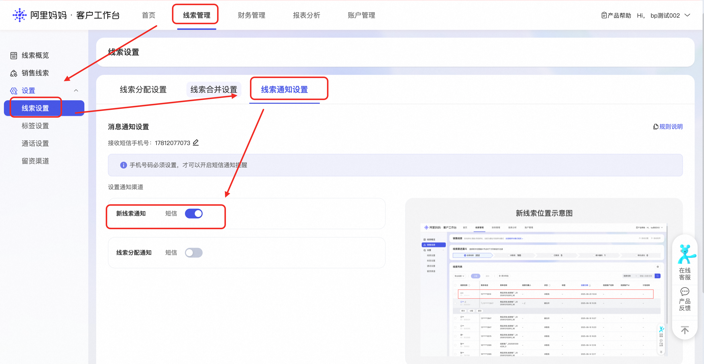
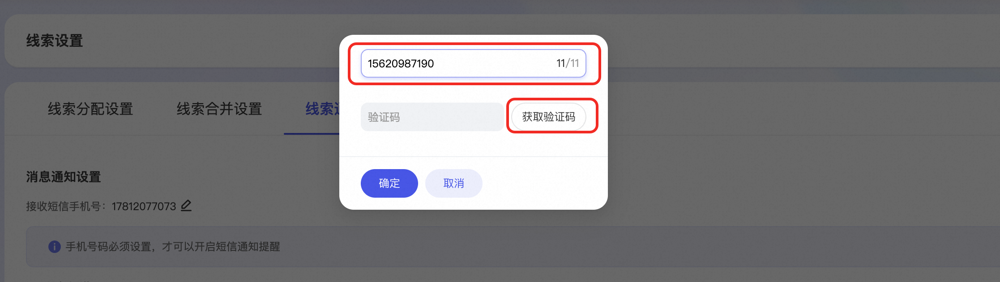
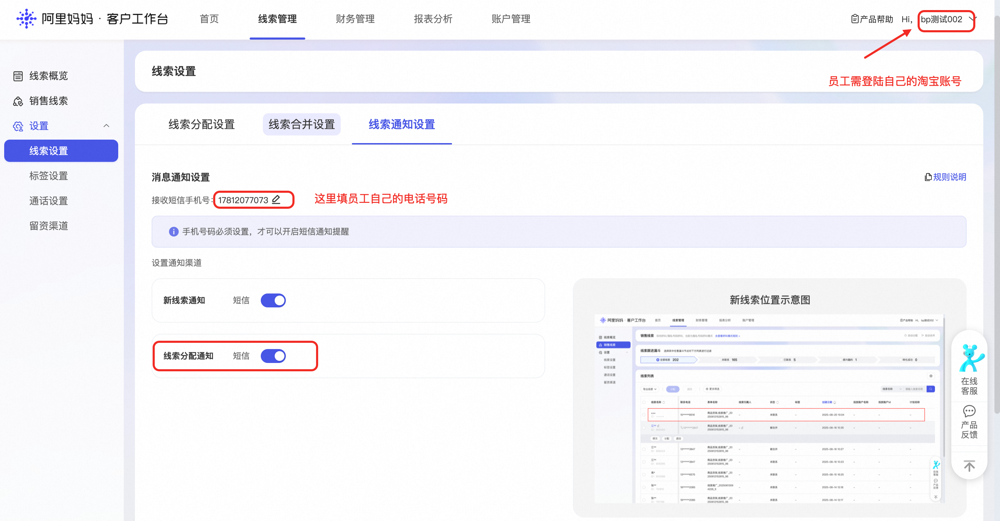
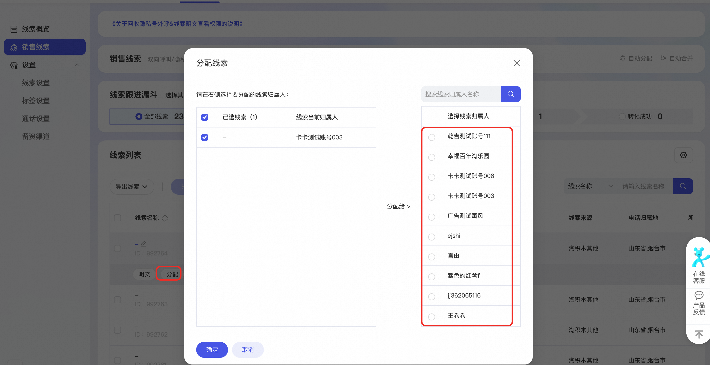

# CRM线索消息通知功能上线！加快客服响应速度！

> 来源：https://alidocs.dingtalk.com/i/nodes/XPwkYGxZV347LdvpHlyNz0KnJAgozOKL

亲爱的商家：

您好！您是否存在线索到达之后，由于没有收到通知，导致无法及时跟进线索的问题？线索推广推出全新「线索到达通知」和「线索分配通知」两大功能，助力您第一时间获取到留资信息！

### **如何开启线索通知？**

进入阿里妈妈客户工作台-线索管理-线索设置-线索通知设置 https://business.alimama.com/#/

填写接受短信的手机号并获取验证码（仅当其设置手机号时生效，未设置手机号不发送短信）

当通过「线索推广」广告投放获得一条线索时，系统将会及时推送到对应手机短信中。

通知内容：【妈妈CRM】您的妈妈CRM账户有一条新线索，请登陆妈妈CRMhttps://business.alimama.com/#/lead/pages/index查看并处理.

### **线索分配功能**

若您为员工，线索分配给您时，希望第一时间收到短信，可以登陆自己的淘宝账户并且打开线索分配通知按钮、设置接受短信的手机号

当线索被分配给您时，则会收到对应线索的短信通知。

通知内容：【妈妈CRM】有一条新线索被分配给您，请PC端点击链接https://business.alimama.com/#/lead/pages/index查看并处理。
