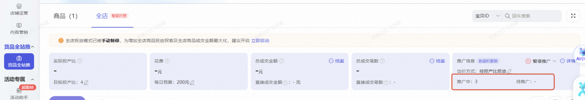
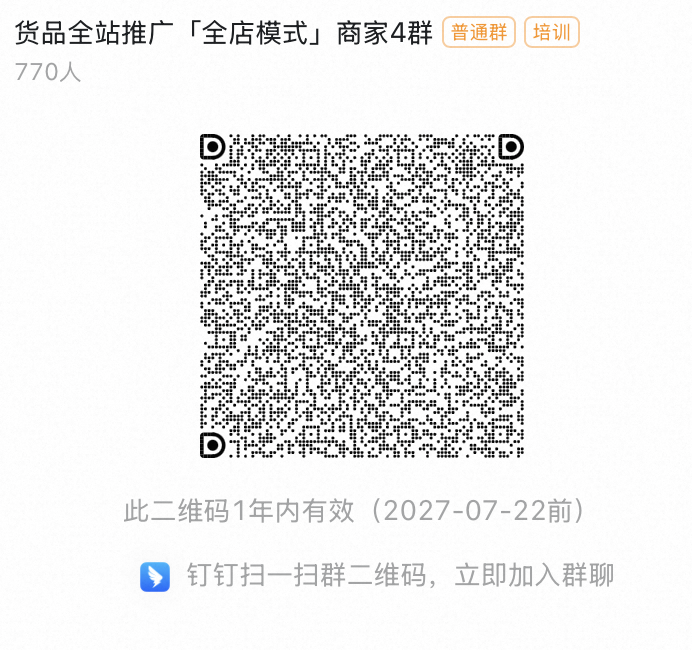

# 「全店模式」产品手册

> 来源：https://alidocs.dingtalk.com/i/nodes/Y1OQX0akWmzdBowLFEy9qAwGVGlDd3mE

## **new！****重要产品功能更新**

| **新增功能概述** | **日期** | **使用热度** | **备注** |
| --- | --- | --- | --- |
| 新增「成本保障」赔付机制 | 2026.07.06更新 |  | **已上线**，敬请期待，详见全站推保障文档 |
| 新增「净成交出价」 *注意全店模式 follow全站推 节奏切 到净成交出价，详见 | 2026.07.01更新 |  | **已上线**，敬请期待，详见全站推净成交 文档 |
| 新增「分组投放」计划组批量投 | 2026.06.08更新 |  | **已上线**，**详见****功能介绍**，建议**开启投放** |
| 新增「全店商品池汰换」 | 2026.04.21更新 |  | **已上线**，**详见****功能介绍**，建议**开启提高**投放ROI |
| 新增「最大化拿量」出价方式 | 2025.12.11更新 |  | **已上线****（接口投放业务除外）**，详见「产品使用介绍-投中」部分 |
| 新增全店/自定义商品「一键起量」 | 2025.8.27更新 |  | **已上线**，建议开启全店一键起量，加速店铺成交效率。 |

# **一、产品背景**

「货品全站推广-全店模式」是一款由AI大模型驱动的，致力于解放店铺人力，提升「全店铺」成交金额的产品。

| **产品核心优势** **选品更智能**：算法智能选品，AI 驱动付免联动效果升级，助力解决选品困扰； **投放更高效**：系统实时调优，对预估高成交品分配更多预算，出价能力进阶，突破店铺增长天花板； **操作更简单**：只需设置「全店 ROI」 及「全店预算」，即可一键开启投放，帮助商家经营聚焦。 | **推荐使用的商家类型** 付费推广基础薄弱的新手商家； 推广人力有限的中小商家； 有全店铺生意规模增长需求的商家； 需要提升行业影响力的商家*。* |
| --- | --- |

# **二、产品使用介绍**

## **投前**

| **操作步骤** | **图片示意** |
| --- | --- |
| 进入**「阿里妈妈万相台-推广-货品全站推广-全店」**标签页 |  |
| **手动剔除非投放品** *全店商品优选，您可手动剔除引流品、非主推品等不愿意投入推广预算投放的货品，剩余货品即可在全店实现一键投放，**免去一品一计划的困扰，极简操作**。 |  |
| **设置「全店目标投产比」** *建议选择**系统推荐**的全店铺目标投产比，优化全店投产比的同时最大化全店 GMV。 |  |
| **设置「全店日预算」** *建议开启**不限预算** 或者 采纳**系统推荐**的**预算建议值**，有效提升预算分配效率，给予系统更优的学习空间。 |  |
| **开启全店模式进行投放** 点击「开启全店模式」投放，系统将**暂停除屏蔽商品外的商品推广**，并**智能优选**店铺商品投放 |  |

## **投中**

| **操作步骤** | **图片示意** |
| --- | --- |
| 您可在投中对任意商品进行「开启投放」或者「暂停投放」操作，该操作支持批量多选； 在「全店-推广信息」模块，您可以查看全店模式下「推广中」和「待推广」的货品数量及货品详情； 「推广中」代表当前客户手动剔除后在全店模式下正在推广中的货品（不包括已暂停货品）；「待推广」代表当前可以投放全店模式但尚未进入推广中货品池的货品。 |  |

**new！****全店模式 已支持 一键起量（该产品功能****已全量****）**

| **操作步骤** | **图片示意** |
| --- | --- |
| **STEP1 **进入货品全站推广-「全店」计划页面，找到一键起量模块，点击**「去开启」**，进入「一键起量」设置浮窗 |  |
| **STEP2 **开启「一键起量」，选择「起量商品」，可选择**「全部推广中商品」**或**「自定义商品」** 全部推广中商品：不指定起量商品，系统将对进入全店待推广商品池的**所有商品**一键起量，提升所有全店待推广商品的拿量能力 **适配「全店计划跑量较差」、「全店计划冷启时间过长」、「大促周期对全店计划拿量有较高诉求」等场景** 自定义商品：最多支持自定义**20**个商品一键起量 **适配「对部分商品有更高拿量预期，但尚未被系统智能优选，当下消耗过低」的场景，快速提升全店计划下「商家高预期拿量商品」的拿量能力** | 选择「全部推广中商品」一键起量： 选择「自定义商品」一键起量： |
| **STEP3 **设置每日起量预算，**建议采纳系统建议预算值**，系统将用这部分预算更激进探索，以加快表达起量诉求的商品跑量，同时系统将展示起量预算带来的预估总成交金额提升情况 |  |
| **STEP4 ****设置起量时间、起量地域**，默认选中全部起量时间和起量地域，商家可按需调整 |  |
| **STEP5 **完成起量创编，在全店计划页面查看起量带来的**成交金额增量** |  |
| **STEP6 **全店商品起量期间，点击**「投放调优数据」标签页**，查看起量「**商品消耗、点击量、总成交金额、实际投产比**」等指标，支持分小时、分日粒度查看 |  |

**全店模式 已支持「最大化拿量」（****已全量****）**

| **操作步骤** | **图片示意** |
| --- | --- |
| **STEP1 **点击全店模式「出价方式」右侧的**「小铅笔」** |  |
| **STEP2 **选择**「最大化拿量」**出价方式**，**并选择**「系统推荐日预算」**或自定义日预算**，**点击确定，完成计划创建 |  |
| **投放要点**： 为保障全店模式投放效果稳定，**每天最多支持2次**出价类型切换（可从控投产比投放切换至最大化拿量，也可切回） 建议在最大化拿量模式下开启**「优质计划防停投」**，满足预算花费比率&投产比达标条件即可自动增加预算，防止因预算撞线而错过优质流量，极大程度节省人力。 |  |

## **投后**

| **操作步骤** | **图片示意** |
| --- | --- |
| 点击「更多数据」跳转 或者进入「报表-货品全站推广-货品全站推广结案-全站增长」模块，查看全店模式的成交增长和周期结案数据。 |  |

# **三、FAQ**

**自动选品机制问题**

Q：**开启全店模式后，商品是否会自动加入推广？还是需要手动添加？**

| **全店模式-智能托管下** | **投前：**开启「全店模式」后，**系统会自动优选商品投放，无需逐一手动添加**。您可**手动屏蔽剔除**引流品、非主推品等不愿意投入推广预算投放的商品，剩余商品即可在全店实现一键投放。 **投中：**您可在投放过程中，对任意商品执行 「开启投放」或「暂停投放」 操作，支持批量多选，灵活调整；在 「全店 - 推广信息」 模块，可查看两类商品状态： 「推广中」：指当前在全店模式下正常投放的商品（已剔除手动暂停或移除的商品）； 「待推广」：指符合投放条件、但尚未进入推广池的商品，可随时启用。 **以下情况商品会自动加入「全店模式」推广：** ☑️开启“自动汰换”功能（开启该功能即表示您授权系统，将店铺中新上架且未推广的商品天级转投至全店模式智能托管，并汰换在投商品中表现差的） ☑️开启“低效品安心托管”去转投（开启该功能，系统会定期把商品推广-控投产比投放计划中效果差的商品（成交少、投产比不稳定），转投至全店模式分组投放，开发中） |  |
| --- | --- | --- |
| **全店模式-分组投放下** | 支持手动添加商品至「分组托管」计划中（暂无“自动汰换”功能） | / |

Q：**"待推广"状态的商品何时会自动转为"推广中"？**

A：不会自动，需手动转入。

Q：**自动汰换功能是什么？多久淘汰一次商品？如何开启/关闭？**

| 自动汰换功能：**自动推广店铺中新上架且未推广的商品，并汰换表现差的商品**，系统将挖掘潜力商品，自动优化出价，动态分配预算，探索全店增长机会； 店铺中新上架且未推广的商品天级转投至全店模式智能托管，并汰换在投商品中表现差的； 货品全站推 -> 全店模式 -> 开启/关闭“自动汰换”（如图） |  |
| --- | --- |

Q：**全店模式的商品列表是实时自动更新，还是固定不变的？**

A：如开启以下功能，商品列表可能会存在自动更新情况；

开启“自动汰换”功能（开启该功能即表示您授权系统，将店铺中新上架且未推广的商品天级转投至全店模式智能托管，并汰换在投商品中表现差的）

开启“低效品安心托管托管”去转投（开启该功能，系统会定期把商品推广-控投产比投放计划中效果差的商品（成交少、投产比不稳定），转投至全店模式安心托管）

注意：计划预算**由商家设置**，系统不会每日更新和修改

Q：**全站推广，全店推广的自动汰换，昨天换了多少产品呢？**

A：开启“自动汰换”后，系统会每天自动将新上架未推广的商品加入投放，并替换掉表现较差的商品。**但具体替换数量不单独展示**，建议您通过商品投放列表对比前后变化来查看调整情况。

**Q：全店模式下，客户剔除选品后，系统实际投放货品 = 手动剔除后的全部商品吗？**

A：不一定。全店模式下，系统会基于您选择的商品做优选，以达成全店 GMV 效率最大化的优化目标，其中入选系统优选的货品池上限为 1000 个，系统根据每日实际的商品效率预估，选择当天被投放的选品集合（即每天实际被系统投放的商品可能不同）。

**Q：全店模式刚上架的新品在什么时候会开始自动推广？**

A11：需要在「全店模式-可推广商品列表」中，手动添加进全店投放池中推广。

**商品数量与范围问题**

Q：**货品全站推全店模式下能推广多少个商品？**

A：全店模式最多可创建**1个「智能托管」计划，10个「分组托管」计划**

全店模式-智能托管下，入选系统优选的货品池上限为** 1000 **个；为保障全店模式的投放优化空间，系统限制需要至少保留**3个**商品投放；

全店模式-分组托管下，一个分组计划最多添加**500个**商品，至少添加3个商品

Q：**货品全站推广全店计划商品是系统智能选品吗？**

A：全店模式最多可创建**1个「智能托管」计划，10个「分组托管」计划**

全店模式-智能托管下，系统会**基于您选择的商品做优选，以达成全店 GMV 效率最大化的优化目标**，其中入选系统优选的货品池上限为 1000 个，**系统根据每日实际的商品效率预估，选择当天被投放的选品集合**（即每天实际被系统投放的商品可能不同）。

全店模式-分组托管下，可创建10个「分组托管」计划（第一次新建时系统会默认创建推荐分组及推荐商品，可手动删除分组，修改分组内商品）一个分组计划最多添加500个商品，至少添加3个商品；注意，目前分组不支持手机端新建计划，商家需要登录无界全站推后台新建计划

Q：**全店模式推广，智能托管为什么不能添加商品？**

A：可以添加。智能托管下的货品池上限是1000个。在限额以内，您可在投中对任意商品进行「开启投放」或者「暂停投放」操作，该操作支持批量多选；可以通过“待推广”中选择商品进行添加，「待推广」代表当前可以投放全店模式但尚未进入推广中货品池的货品。

如“待推广”中未显示商品，可能是以下情况：

商品上架时间未超过24h，请商家等待24h后再进行添加；

被屏蔽的商品，需要手动解除屏蔽；操作：点击全店模式高亮条右侧已屏蔽右侧的垃圾箱图标，搜索商品-解除屏蔽-回到待推广中重新搜索，即可搜到，添加至全店模式推广；

初次开启全店后需给系统1-3天左右的冷启时间，冷启时间“待推广”中未显示商品；

Q：**开启全店模式后，新上架的商品会自动加入推广吗？**

A：需开启“自动汰换”功能，开启该功能即表示您授权系统，将店铺中新上架且未推广的商品天级转投至全店模式智能托管，并汰换在投商品中表现差的

Q：**为什么屏蔽了某些商品，找不到在哪里查看被屏蔽的列表？**

A：操作：货品全站推广-全店模式-点击“已屏蔽”小铅笔进行查看。

**Q：****全店模式的屏蔽商品数可以增加吗？**

A：全店屏蔽宝贝上限是根据店铺动销商品数进行动态调整更新的，不支持人工干预，商家可以提高动销商品数，或者加入全店后做暂停操作。

**Q：商品在全店模式中（推广中、待推广）搜不到是什么原因？**

| 此情况可能是因为您将该商品屏蔽了，所以搜不到，请您点击全店模式高亮条右侧已屏蔽右侧的垃圾箱图标，搜索商品-解除屏蔽-回到待推广中重新搜索，即可搜到，添加至全店模式推广 |  |
| --- | --- |

**全店与单品推广/其他场景关系问题**

Q：**同一个商品，既可以推单品模式，也能推全店托管全站吗？**

A：不可以。转投全店智能推广现在推广的全站单品推广会暂停。

Q：**我开的货品推广的单品模式商品，怎么早上起床就到货品推广全店里面来了？**

A：可能商家开启了“低效品安心托管托管”去转投（开启该功能，系统会定期把商品推广-控投产比投放计划中效果差的商品（成交少、投产比不稳定），转投至全店模式安心托管）

**Q：开启全店模式后，全店模式下的货品在AI无界其他场景还能投放吗？**

A：货品全站推广全店模式同单品模式一样，与AI无界其他场景存在互斥性。当客户在全店模式开启该商品投放，则会暂停该商品在无界其他场景的投放（在AI无界其他场景正在投放的货品，需要客户手动二次确认后方可暂停）；当客户在全店模式暂停了该品投放，同样也可以继续开启该品在AI无界其他场景的投放。

**预算分配与投放效果问题**

Q：**多个商品同时推广时，预算是如何分配的？是平均分配还是优选分配？**

A：全店模式优先交付「全店铺 GMV/ROI」达成，暂不支持客户对于单个货品的预算追加/减少。

Q：**全店模式下，店铺的每个商品一定会有曝光/消耗吗？会不会预算只投到某一个商品上，其他商品没有曝光？**

A：全店模式下，系统会基于「全店铺」效率优化目标智能优选当前在投品，且会根据商品投后效率指标分天汰换在投品，不保证全店铺的每个商品都可以被优选并投出。您可以拉长时间周期看单品投放效果指标，或者如有单品投放强诉求，可选择货品全站推广-商品模式对该品进行投放。

**Q：全店模式是否保证单个商品 ROI/GMV 的交付?**

A：全店模式下，系统会通过智能探索，基于客户设置的全店铺投产比和预算情况下，优先以「全店」GMV 效率最大化为目标进行投放，优化全店铺的投产比，因此不保证单个货品在全店模式下的 ROI/GMV 效率；如果对于单品投放有强诉求，可在全店模式下剔除该品，选择货品全站推广-商品模式对该品进行目标 ROI 设置。

**Q：全店模式下，是否可针对单个商品设置较多/较少预算？**

A：全店模式优先交付「全店铺 GMV/ROI」达成，暂不支持客户对于单个货品的预算追加/减少。

**其他操作问题**

Q：**我在后台尚未看到货品全站推广全店模式的入口，但希望赶紧开启该功能，有什么可以反馈开白的通路？**

A：目前能力已全量，如未找到可以咨询小袋鼠客服提工单处理。

**Q：从AI无界其他场景转投至货品全站推广-全店模式是否可享受流量助推？**

A：全店模式下，商家可享受从AI无界其他场景转投至货品全站推广-全店模式的流量助推，帮助店铺商品快速度过冷启阶段，提升商品拿量能力，请商家朋友们不要错过产品红利哦。

**Q：是否可以将全店模式下的所有品都暂停投放？全店模式如何暂停？**

| 不建议您这样操作。为保障全店模式的投放优化空间，系统限制需要至少保留**3个**商品投放。若您想暂停全店模式计划，可点击**全店模式推广页右上角计划状态「暂停推广」按钮**。全店模式计划暂停推广后，所有全店模式的商品都会不曝光（包括正在推广中的商品） |  |
| --- | --- |

**Q：全店模式下，在原有推广商品的基础上，我又添加了部分推广商品，系统推荐的目标投产比会有变化，这是正常的吗？**

A：属于正常情况。全店模式下，若您有「添加推广商品」等操作，系统就会根据您的最新选定的全店模式推广商品池重新进行全店目标ROI的预估和推荐，以驱动全店最优调控的投放效果。请知晓您的此类操作可能造成的ROI变动。后续我们也会新增全店模式下货品维度的操作记录，方便您进行操作追溯。

Q：**页面显示 ：全店模式生效中，正在将商品加入全店模式统一管理，商品列表更新中，请稍后查看？**

| 建议初次开启全店后给系统1-3天左右的冷启时间，冷启期间减少对全店模式下单品启停的操作，帮助系统快速度过冷启阶段。 |  |
| --- | --- |

# **四、优秀案例**

| **案例内容** | **优秀案例图示** |
| --- | --- |
| **汉草玖宝滋补养生旗舰店**作为天猫传统滋补营养品行业的商家，存在“**拓展店铺流量难，提升全店铺经营规模缓慢**”的痛点 商家应用： 为拓展店铺整体流量并提升全店经营规模，已将83%的商品切换至全店推广模式， 重点围绕有基础销量的爆品、次爆品及潜力品并持续投放，目前全店计划**已进入稳定投放阶段。** 商家打法： 先将店铺内其他的未开启计划的宝贝和潜力品创建全店模式进行测试，设置系统推荐roi，前三日计划**整体roi交付95%以上** 商家将次爆品放入全店模式测试，并加大日预算，当日计划产出roi达到89% 下一步将部分店铺爆品放入全店模式，计划产出roi仍符合预期 店铺专注货品研发和上新，上架后最大化拿量过冷启后切换至全店模式，并持续加大全店模式日预算 数据显示，该应用成功实现全店预算100%高效使用，ROI达标率更是达到了77%，并带动全店计划GMV规模突破15.7万元，实现了全店模式对传统滋补品类流量获取与店铺GMV的双重增长。 |  |
| **洁丽雅旗舰店**作为老牌知名度非常高的毛巾类产品的商家，存在着“**投放效果不稳定，sku单一且数量较多，每次投放货品全站推广单品需要耗费大量人力建计划**”的问题 商家应用： 店铺内95%的品已切换至全店模式，以有基础销量的爆品/次爆品/潜力品为主 采纳系统推荐的ROI进行投放 开启全店计划后，不频繁启停，持续投放 全店模式投放效果全面突破！数据显示：预算实现100%充分激活，全域流量覆盖下74%的计划超额完成预设ROI目标，单周期GMV规模突破11.6万元，全店模式开启后GMV环比增长超15%。成功以规模化运营降低了人力成本，同时稳定了投放效果。 |  |
| 商家痛点： 希望能批量化、智能化对全店商品保投产比投放，不需要对单个商品频繁调价/更改预算等复杂操作，解放店铺人力，聚焦店铺经营。 希望拓展流量边界，提升店铺经营规模。 全店模式核心打法： **选品类型广泛**：店铺内95%的品已切换至全站推-全店模式投放，以有基础销量的爆品/次爆品/潜力品为主，给系统最优的选品探索空间。 **ROI目标值设置合理**：初期采纳系统推荐的全店ROI，不频繁调价，保证账户度过冷启后再适当调高，ROI实际达成趋近目标值，不在全店冷启初期设置过高目标导致无法放量。 **不频繁操作**：开启全店计划后，不频繁做计划/商品维度的启停操作，并适当加入店铺新品进行测试，持续投放，当前全店计划已进入稳定投放期。 **日预算设置合理**：根据选品数量、目标GMV等店铺经营诉求，设置合理的日预算，而非仅按照系统最小预算值设置。 使用全店能力后核心增量数据： **ROI达标率提升**：全店7日ROI达标率89%，全店计划预算使用率90%以上。 **拿量能力提升，交付更多全店GMV增长**：6月21日开启全店模式，该场景下，日消耗环比增长46%，GMV环比增长31%。 **人效提升，快速锚定跑量&ROI双优货品**：在全站推全店模式「一计划多品」的产品能力下，客户通过系统探索，快速锚定跑量能力&ROI交付双优货品，暂停后验效果较差货品，同时增加全店预算，进而获得更多GMV增量。 |  |
| **商家背景** 贵人鸟是国内知名体育品牌之一，近年来积极布局童装市场，打造“贵人鸟童鞋”子品牌。在天猫平台，具有较高的品牌认知度与用户基础。 **品运营痛点** 店铺SKU数量多，新品频出，但流量难以覆盖所有商品；投放预算常集中在头部爆款上，忽视了中长尾商品的潜在价值 **详细打法** **全店模式放+控投产比投放** **全店模式只需设置「全店ROI」及「全店预算」**，即可一键开启投放，系统智能选品投放功能帮助运动户外类目商家极大简化操作流程，提升投放效率，防止遗漏潜力款。 **控投产比投放以roi为目标**，系统优先控制计划投产比达标，稳定成本下尽可能拿量，系统帮助运动户外类目自动调节出价和投放节奏，在保证每笔推广投入都能达到预设ROI的前提下，尽可能获取更多订单，实现“稳利润、拉销量”。 **选品：**将店铺未推广商品统一纳入全店计划，无需逐个设置单品计划，进一步提升平台对店铺商品的整体认知度与推荐权重，增加流量入口。 **预算：**根据店铺月均GMV及商品毛利空间，计算合理的日均推广预算，合理控制成本，保障正向盈利。 **出价：**选择「控投产比」投放模式，由系统自动调节出价，商家根据商品毛利设定合理的ROI目标，保障每一笔推广支出都有明确收益预期 **持续调整：**商品上新后立即加入对应全店计划，快速获取曝光与转化数据，若某商品连续7天无点击、无转化，则从全店计划中剔除，当计划7天整体roi满足预期，可适当加大预算 **商家原声** 最近我们上线了全站推的‘全店模式’，短短7天就带来了80.43%的新客成交占比，说明我们的推广正在触达大量新用户，这在儿童运动鞋这个竞争激烈的赛道上非常关键。全站推帮助我们实现了推广整体GMV的迅猛增长，我们已经顺势追投，进一步扩大优势，抢占市场先机。 80.43%新客成交占比 （近7日），成交ROI比其他产品高出2倍以上，全站推-全店模式带来广告整体GMV环比上涨迅猛，顺势追投，扩大竞争优势 |  |
| **商家背景** Topsports是一个专注于运动休闲或户外装备的品牌，主打性价比路线，面向大众消费者。定位偏向于年轻化、时尚化，注重产品设计和实用性结合。 **品运营痛点** 平台推广投放中，货品数量庞大，单品的预算有限，难以获得足够的曝光量，导致自然流量也难以积累。 **详细打法** **全店模式+全店分组投放+控投产比投放** **全店模式只需设置「全店ROI」及「全店预算」，**即可一键开启投放，系统智能选品投放功能帮助运动户外类目商家解决产品多、预算有限、需要批量高效投放的推广能力。 **全店分组投放：**商家按照同类货品，同客单价货品等去做全店分组计划的搭建，为每组商品制定差异化的投放计划。帮助计划更好的提升投放效率与资源利用率 **控投产比投放以roi为目标**，系统优先控制计划投产比达标，稳定成本下尽可能拿量，帮助运动户外类目获取以设置roi为目标，稳定高效的成交 **选品：**将店铺中所有可售商品（含新品、滞销品、潜力品）统一纳入全店计划，无需单独设置单品计划。 **分组投放：**商家按照同类货品，同客单价货品等去做全店分组计划的搭建，为每组商品制定差异化的投放计划。同类或相似属性的商品（如同客单价、同风格、同功能等）归为一组，平台可以更精准地识别目标人群，实现定向流量匹配，从而提高点击率和转化率。不同分组的商品在市场上的竞争强度、用户兴趣点、转化周期等方面可能存在较大差异。通过分组投放，商家可以根据各组商品的实际表现灵活调整预算分配，避免资源浪费，实现最优ROI。 **预算：**根据店铺月均GMV及利润空间，设定每组计划每日预算上限。初期可以采用“小步快跑”的方式，先用30%预算测试效果，再逐步加投。 **出价：**选择“控投产比”出价方式，让系统自动调节出价，保障每组计划中每笔投入都有明确收益预期。根据商品毛利计算合理ROI值，确保正向盈利。 **持续调整：**商品上新后立即将其加入对应全店计划，快速获取曝光与转化数据。若某商品7天内无点击、无转化，则从全店计划中剔除，单独开设“测款计划”进行定向投放。 **商家原声** 之前我们投广告老头疼了，单品预算低，根本打不动。后来听平台建议，把所有商品都加到全店计划里一起跑，还分了个组来管理。结果消耗和成交一下子都涨了不少，真的没想到！现在不用盯着每个宝贝去调预算了，整体一拉就上来了，省心又有效果，真的是降本增效的好办法。 分组后，全站消耗+222% |  |
| **商家背景** 安踏（Anta）是中国领先的体育用品品牌之一，拥有自主知识产权和完整产业链。在天猫平台上，安踏旗舰店属于运动户外类目头部商家，具有较高的品牌影响力和用户忠诚度。 **品运营痛点** 全店商品多，流量分散，全部单独新建计划太麻烦，直接创建全店模式部分商品难以获量 **详细打法** **全店模式+全店分组投放+控投产比投放** 全店模式只需设置「全店ROI」及「全店预算」，即可一键开启投放，系统智能选品投放功能帮助运动户外类目商家解决产品多、预算有限、需要批量高效投放的推广能力。 **全店分组投放：**商家按照同类货品，同客单价货品等去做全店分组计划的搭建，为每组商品制定差异化的投放计划。帮助计划更好的提升投放效率与资源利用率 **控投产比投放以roi为目标**，系统优先控制计划投产比达标，稳定成本下尽可能拿量，帮助运动户外类目获取以设置roi为目标，稳定高效的成交 **选品**：将店铺内所有商品统一纳入全店计划，覆盖所有可售商品，最大化曝光机会，提升整体GMV转化率 **分组投放**：按品类、客单价、风格进行精细化分组，实现精准投放，提高点击率与转化率。同类商品如（长裤、短裤、篮球鞋、休闲鞋等）归为一类进行投放，平台能更精准识别目标用户，提高定向流量匹配效率；不同组别可制定差异化的投放节奏与预算分配，减少资源浪费，避免高客单商品被低客单商品稀释流量 **预算**：基于GMV与利润空间设定每日预算上限，合理控制成本，保障正向盈利。 **出价**：选择“控投产比出价方式”，实现稳定可控的广告投放收益。 **持续调整：**动态优化商品结构与投放策略，商品上新后，立即加入对应全店计划，快速获取曝光与转化数据；每7天评估一次商品表现，重点关注点击率、转化率、ROI等核心指标；若某商品连续7天无点击、无转化，则从全店计划中剔除，转入“单品计划”进行定向投放测试。 **商家原声** 自从我们接入了全站推全店模式分组投放后，整体投放效果有了非常明显的提升。通过分组投放策略，我们实现了不同品类、不同价位商品的差异化运营，真正做到了‘低成本引流全店货品’，极大地提升了整体ROI和用户体验。 成交爆发系数比大盘高出8%，低成本引流全店货品 ，点击成本比大盘低约20%，开启全店净成交后，退款率大幅度下降 |  |
| **商家背景** 「拇指白小T官方旗舰店」是天猫平台商家，专注于男装基础款的设计与销售，尤其以“白小T”为明星单品。品牌定位清晰，主打高性价比+年轻时尚，目标客群为18-35岁男性消费者，注重穿着舒适性和日常穿搭场景。 **品运营痛点** 尽管商家具备一定的投放经验和资源，在竞争激烈的男装类目中，缺乏足够曝光和点击 **详细打法** **全店模式放+控投产比投放：优化净成交** **全店模式**只需设置「全店ROI」及「全店预算」，
即可一键开启投放，系统智能选品投放功能帮助**男装类目**商家**对于SKU数量庞大、新品频发的男装店铺，极大提升投放效率，避免漏掉潜力商品。** **控投产比投放**以roi为目标，系统优先控制计划投产比达标，稳定成本下尽可能拿量。同时，选择优化净成交出价的方式，系统针对**男装类目**价格敏感、竞争激烈的特点，帮助商家在稳定利润率的同时，降低仅退款风险，提升整体销售额。 **选品：**将店铺中所有未推广商品（尤其是新品）统一纳入全店计划中，无需逐个设置单品计划。系统自动识别潜力商品，提升平台对店铺商品的整体认知度；增加更多流量入口，提高新老商品被推荐的概率； **预算：**初期建议以保守预算试跑，待系统识别出高效商品后再逐步加投。中期根据店铺月均GMV及商品毛利率，计算合理的日均广告预算，控制广告成本在盈利区间内。后期切换不限预算 **出价：**选择「控投产比」投放模式，出价目标选择**增加净成交金额**，设定合理的ROI目标，系统会自动调节出价，优先保障投产达标，同时尽可能获取更多订单。出价不再依赖人工干预，避免因竞品波动导致ROI失控；在稳利润的前提下拉销量，特别适合白小T类高复购、低客单价商品； **持续调整：**商品上新后立即加入对应全店计划，快速获取曝光与转化数据。若某商品连续 7天无点击、无转化，则从全店计划中剔除。当全店计划整体连续7天ROI满足预期目标，可适当增加预算，进一步放大优质全店计划。 **商家原声** 我们去年用单品全站-店铺总成交-控ROI出价的方式来做全店全渠道的收割动作，当时单日ROI能突破5，但后续竞店也用全站后，ROI呈现下滑状态，后面我们提升了预设ROI值，尽管花费下滑但实际ROI并没有得到提升！再后来我们用了全店权限控净ROI的出价，同样的花费买了更多的点击，投产直接到达了6！ 点击巨大提升，全店roi6 |  |

注：**货品全站推广「全店模式」优秀案例持续征集中**，欢迎商家朋友通过投放全店模式成为行业优秀案例，近期我们会在已经开白的全店模式的客户中择取优秀案例，在阿里妈妈各媒介外宣场合露出。

# **五、问题反馈通路**

如您遇到产品使用问题，或有任何产品优化建议，请反馈至妈妈客服或者货品全站推广「全店模式」钉钉群中，耐心等待工作人员的处理。

