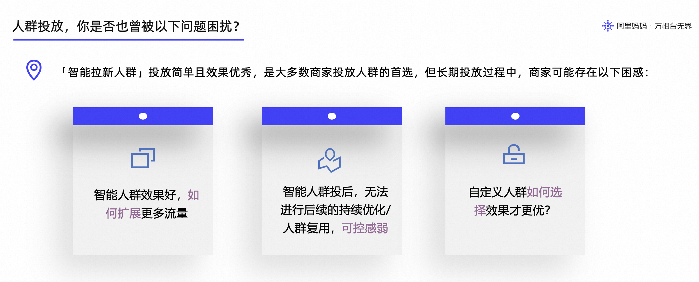
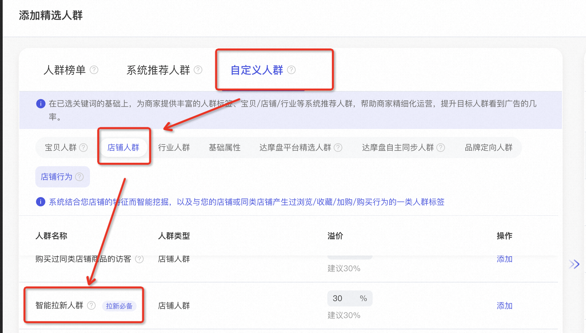
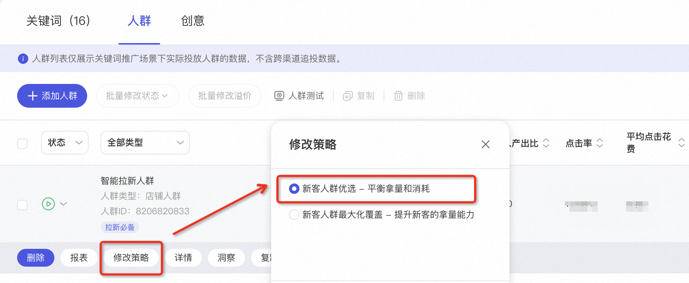
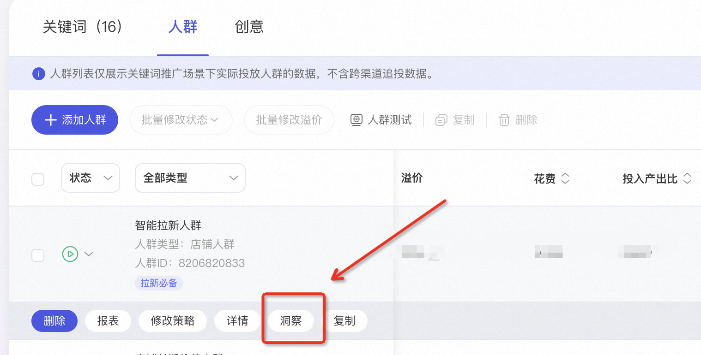
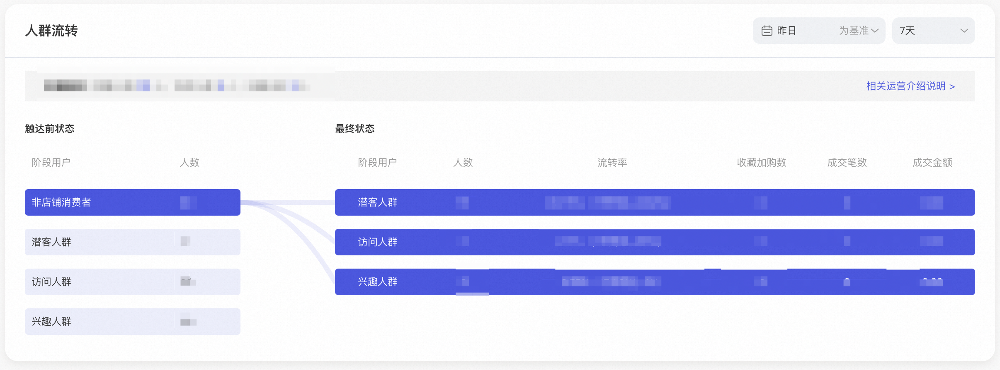
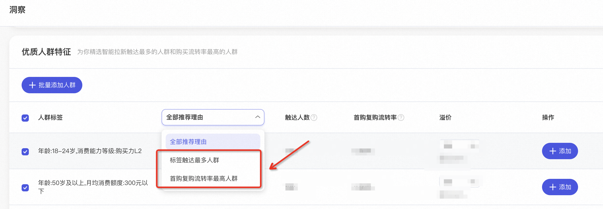
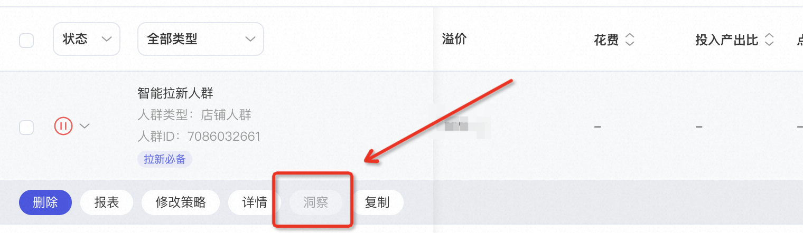

# 关键词推广-如何精细化运营「智能拉新人群」？

> 来源：https://alidocs.dingtalk.com/i/nodes/Y1OQX0akWmzdBowLFYO0Q5q0VGlDd3mE

**原语雀文档链接：**https://yuque.antfin.com/chenchun.chen/gqhty9/vg00eravs2z895g6

---

# 一、功能背景

# **二、智能拉新人群是什么？**

### 1、操作路径

万相台无界版-关键词推广-手动出价计划-添加人群-添加【智能拉新人群】

### 2、概念解释

| 名词 | 解释 |
| --- | --- |
| 智能拉新人群 | 系统根据店铺的消费者特征及所属类目的用户行为数据，智能挖掘潜在对您店铺有兴趣的访客，帮助您将非店铺消费者，高效流转为潜客/访问/兴趣人群，并最终转化为店铺购买人群。 |
| 非店铺消费者 | 未与店铺有任何交互行为的消费者 |
| 潜客人群 | 过去15天被店铺广告或内容渠道（包括直播、微详情、短视频和有好货等）曝光过，或店铺/单品浏览跳失的用户，排除新客和老客 |
| 访问人群 | 在过去365天未成交的用户中，且在过去15天内有过店铺意向搜索/内容互动/订阅关注/逛逛访问/聚划算曝光/进店浏览未跳失的用户，排除兴趣人群 |
| 兴趣人群 | 在过去365天未成交的用户中，且过去90天内有过商品收藏/加购/店铺订阅，或过去180天有过下单未支付的用户 |
| 首购人群 | 在过去365天内，有过仅1次店铺成交行为的用户 |
| 复购人群 | 在过去365天内，有过2次及以上店铺成交行为的用户 |

# **三、如何扩展更多流量？**

### 1、操作路径

操作路径：万相台无界版-关键词推广-手动出价计划-进入单元-人群列表-找到【智能拉新人群】-修改策略-选择【新客人群最大化覆盖 - 提升新客的拿量能力】

### 2、概念解释

（1）新客人群优选-平衡拿量和消耗：以【促成交】为目标，但系统会在考虑消耗成本的情况下，对只能匹配到的人群进行【优选】投放。

（2）新客人群最大化覆盖 - 提升新客的拿量能力：以【促成交+拿量】为目标，系统在考虑促成交的情况下，提升智能匹配人群的优选比例，扩大人群覆盖量，帮助商家提升拿量能力。

### 3、注意事项

当优质人群有限的情况下，比如新客优选模式已经可以拿到大部分的成交人群，再开最大化覆盖模式后，多拿到的这部分人的成交力可能就不如优选模式的好，可能会出现ROI下降的情况。

# 四、投后洞察及人群优化

### 1、操作路径

操作路径：万相台无界版-关键词推广-手动出价计划-进入单元-人群列表-找到【智能拉新人群】-点击【洞察】

注意：截至昨天的7天内累计点击量大于1000，才可查看【洞察】信息。

### 2、人群流转

**（1）功能价值**：可以查看 非店铺消费者、潜客人群、访问人群、兴趣人群 之间的流转情况，包括人数、流转率、收藏加购数、成交笔数、成交金额。

**（2）概念解释**

| 名词 | 解释 |
| --- | --- |
| 非店铺消费者 | 未与店铺有任何交互行为的消费者 |
| 潜客人群 | 过去15天被店铺广告或内容渠道（包括直播、微详情、短视频和有好货等）曝光过，或店铺/单品浏览跳失的用户，排除新客和老客 |
| 访问人群 | 在过去365天未成交的用户中，且在过去15天内有过店铺意向搜索/内容互动/订阅关注/逛逛访问/聚划算曝光/进店浏览未跳失的用户，排除兴趣人群 |
| 兴趣人群 | 在过去365天未成交的用户中，且过去90天内有过商品收藏/加购/店铺订阅，或过去180天有过下单未支付的用户 |

### 3、优质人群特征

**（1）功能价值**：可以查看 智能拉新投放了哪些人群？包括触达最多人群、首购复购流转率最高人群、触达人数、首购复购流转率。

**（2）商家建议**：

可从中选择数据表现优秀的人群，添加到单元中进行重点溢价投放，进而扩大这部分人群的消耗及投放效果。

建议自定义人群的溢价高于智能拉新人群溢价，以此提升自定义人群的拿量能力及投放效果。

**（3）概念解释**

| 名词 | 解释 |
| --- | --- |
| 触达人数 | 智能拉新在该标签下触达的人数，数据口径为展现uv |
| 首购复购流转率 | 该标签触达的人数中，流转到首购人群和复购人群的比例。 |

# 五、常见问题

Q：智能拉新人群的策略设置，选择【最大化覆盖】后，ROI出现下降的情况，原因是什么？

A：当优质人群有限的情况下，比如新客优选模式已经可以拿到大部分的成交人群，再开最大化覆盖模式后，多拿到的这部分人的成交力可能就不如优选模式的好，可能会出现ROI下降的情况。

​

Q：为什么我的【洞察】按钮是置灰的，无法点击查看洞察信息？如下图：

A：截至昨天的7天内累计点击量大于1000，才可查看【洞察】信息。

​
