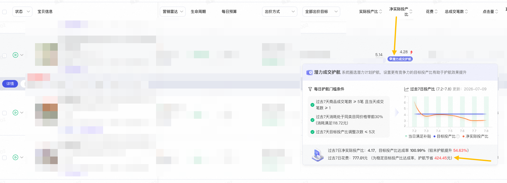

# 出价【潜力成交护航】内测中

> 来源：https://alidocs.dingtalk.com/i/nodes/Y1OQX0akWmzdBowLFb3qveb3VGlDd3mE

**什么是【潜力成交护航】**

【潜力成交护航】是系统会圈选具备推广潜力的计划进行最长15天的平台消耗补贴护航，设置更有竞争力的目标投产比有助于护航效果提升

**【潜力成交护航】需要做什么？**

算法会基于推广计划设置的ROI目标与实际达成的ROI进行实时补贴（需满足后台提示条件），因此设置更有竞争力的目标投产比有助于护航效果提升和补贴增加

**在哪里看**

被系统选中【潜力成交护航】优化的计划，可在全站推-商品推广-计划列表，净实际投产比处看到【潜力成交护航】标识，若为蓝紫色生效中状态，此时计划处于系统进行智能【潜力成交护航】优化，鼠标悬停至【潜力成交护航】标识可查看具体信息

