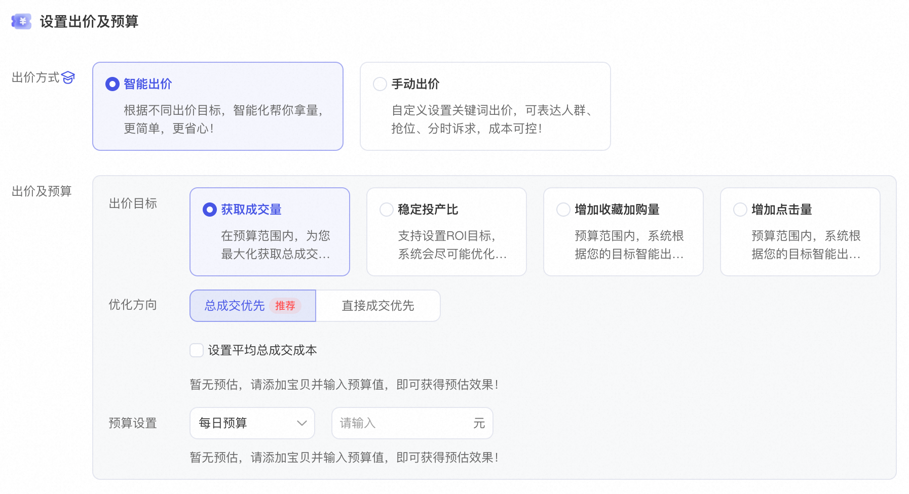
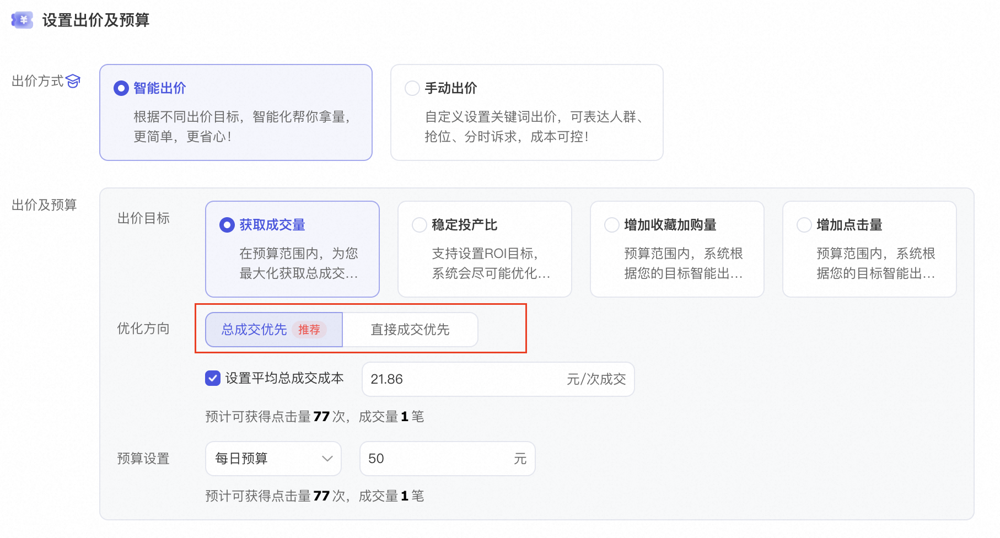
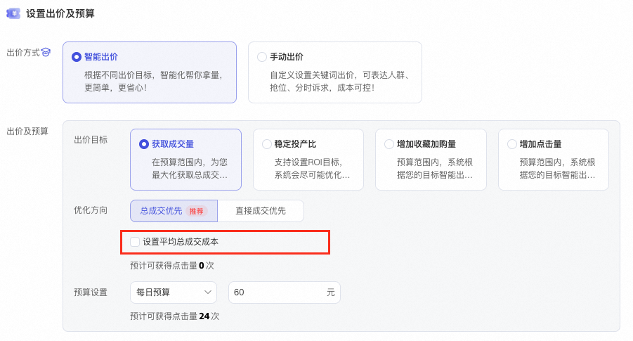

# 【内测中】智能出价升级：「获取成交量」目标全新上线双优化方向

> 来源：https://alidocs.dingtalk.com/i/nodes/Y1OQX0akWmzdBowLFvRjmDN1VGlDd3mE

****当前不支持报名，请商家关注产品后台更新动态**

# **一、背景与前言**

随着商家对精细化运营要求的提升，我们发现即便同属「获取成交量」这一目标，不同场景下的核心诉求仍存在显著差异：

有的商家在大促期间需要不惜代价抢量，追求成交总数的绝对最大化；

有的商家在日常销售中则希望在成本可控的前提下，尽可能多地获取订单。

原有的单一“获取成交量”目标虽能覆盖基础需求，但在应对上述差异化场景时，缺乏更精细的调控手段。

因此，本次升级将在现有的「获取成交量」目标框架下，进一步拆解出两个具体的优化方向：

**new**总成交优先：聚焦规模，全力冲刺成交总量。

**new**直接成交优先：聚焦效率，精准获取直接成交。

此次升级**旨在通过更细颗粒度的策略分发，让“获取成交量”这一目标既能满足爆发式增长的野心，也能兼顾稳健经营的底线，真正实现“千人千面”的智能投放。**

# **二、核心升级：「获取成交量」目标的两大****成交优化方向**

在“获取成交量”这一出价目标下，系统提供两种成交优化方向：总成交优先、直接成交优先

| **总成交优先** **定义公式**：**总成交 = 直接成交 + 间接成交** **详细释义**： 指推广内容引导用户产生的**所有支付宝交易的总成交**。 不仅包含用户点击推广宝贝后直接在宝贝详情页下单的订单，还包含用户点击推广宝贝后，通过店铺内其他路径（如首页、其他商品页、购物车等）最终完成的支付宝交易。 **核心价值**：最大化捕捉推广带来的**全店连带效应**和**长尾转化**，反映推广对店铺整体 GMV 的真实贡献。 **适用场景**： **强关联销售店铺**：用户习惯进店逛多件商品（如服饰搭配、家居套装）。 **新品/大促冲量**：需要快速积累全店销量权重，不局限于单品直接转化。 **品牌/店铺推广**：关注推广带来的整体生意增量，而非单一宝贝的直接产出。 | **直接成交优先** **定义公式**：**直接成交 = 推广宝贝详情页拍下并支付** **详细释义**： 指推广内容引导用户**直接在推广宝贝的详情页面**拍下并通过支付宝交易的成交。 **排除**用户点击推广宝贝后跳转到店铺其他页面再购买的行为，仅统计“所见即所得”的转化。 **核心价值**：聚焦于**单品转化率**和**流量精准度**，确保每一笔成交都直接归因于该宝贝的吸引力，便于核算单品的直接 ROI。 **适用场景**： **高退款率类目**（如部分服饰、生鲜）：需要过滤掉非理性浏览后的冲动消费，关注最确定的直接转化。 **单品打爆策略**：集中资源打造某一个特定 SKU，需要极致的单品转化数据。 **精细化的单品ROI策略**：严格区分单品直接贡献，不希望被连带销售数据干扰。 |
| --- | --- |

# **三、操作指引：两步走，轻松配置**

当您选择「获取成交量」目标后，只需简单两步，即可定制专属您的投放策略：

### 第1步：选方向 —— 你适合哪种“成交”？从经营模式、类目特性和经营目标选择适合的优化方向

| **选项** | **🎯 总成交优先** | **🎯 直接成交优先** |
| --- | --- | --- |
| 通俗解释 | “全店生意一起抓” | “专注单品直接卖” |
| 适合谁？ | ✅ 店铺连带率高：如服饰、家居，用户喜欢进店逛多件。 ✅ 大促冲 GMV：需要全店销量整体爆发。 ✅ 品牌/新店推广：希望广告带动全店流量和转化。 | ✅ 打造单一爆款：集中资源推某个特定 SKU。 ✅ 高退款/高犹豫类目：需要最精准的直接转化数据。 ✅ 单品独立核算：需要严格评估单品的直接 ROI。 |
| 一句话建议 | 如果希望推广宝贝能带动全店动销，请选它！ | 如果只关心这个宝贝直接推广效果，请选它！ |

### 第2步：选出价 —— 您想怎么控制成本？选好方向后，决定您愿意花多少钱去拿效果。

| **选项** | **⚡ 最大化拿量** | **🛡️ 控成本投放** |
| --- | --- | --- |
| 操作方式 | 不勾选成本：系统自动全力跑。 | 勾选成本：设置期望达成的单笔成交成本。 |
| 系统行为 | **全力冲刺**：系统在日预算范围内，不计较单次转化成本的波动，动态调整出价以最大化的捕捉所有符合该“优化方向”（总成交或直接成交）的机会。 | **稳健经营**：系统在尽可能达成您设定的“平均成本”前提下，去获取符合该“优化方向”的流量。成本会在设定值内小幅浮动。 |
| 组合效果示例 | **总成交 + 最大化**：不惜代价抢占全店所有可能的成交机会 🔥 适合大促最后几小时冲全店 GMV。 | **总成交 + 控成本**：在成本可控范围内，尽可能多拿全链路成交。 📈 日常销售：每天都要赚钱，成本不能超。 |
|  | **直接成交 + 最大化**：在不设成本上限的情况下，尽可能多拿详情页直接转化。 🆕 新品冷启动：急需第一波销量数据。 🔥适合高利润爆品快速扩量。 | **直接成交 + 控成本**：在保证单品直接成交成本可控的前提下，尽可能多成交。 💰 适合绝大多数单品日常销售场景。 |

**成本建议升级：**

成本建议从原本的3条 建议简化为 1 条；

预算建议增加了效果预估，为商家提供更直观的投放效果预估，让商家对自己的设置心中有数

成本和预算建议融合了更多行业、竞对和市场动向等数据，让商家在设置上更有依据

**tips：**

**预算充足**：无论是哪种方向，充足的日预算都是系统稳定探索的基础。

**阶梯提额**：当效果达标后，建议小幅度（如 10%-20%）提升日预算，避免大幅调整导致模型重新学习。

# **四、场景化推荐：直接抄作业！**

❓❓❓不知道该怎么组合？看看下面这些经典搭配，找到适合您的方案：

**场景 A：我是做女装的，从消费决策链路上喜欢进店逛一圈买好几件**

您的需求：希望推广宝贝带来的流量不仅能买这件衣服，还能顺便买点裤子、配饰。

推荐配置：

优化方向：总成交优先（捕捉连带销售）

出价方式：控成本投放（保证全店整体利润）

效果：系统会寻找那些喜欢逛店、购买力强的目标人群，提升全店 GMV。

**场景 B：我有一个超级爆款，只想让它销量疯狂增长**

您的需求：不管消费人群买不买别的，我只要这个爆款销量涨得快！

推荐配置：

优化方向：直接成交优先（聚焦单品转化）

出价方式：最大化拿量（短期不计成本冲量）

效果：系统会最大化地获取所有可能直接购买该爆款的机会，迅速拉升销量权重。

**场景 C：我是日常卖货，每单都要保证有利润**

您的需求：细水长流，不能亏本卖，且主要靠这个单品赚钱。

推荐配置：

优化方向：直接成交优先（数据纯净，方便算账）

出价方式：控成本投放（设定好您的盈亏平衡点）

效果：系统在您设置的成本内，尽可能多地获取直接订单，稳扎稳打。

# **五、常见问题解答 (FAQ)**

**Q1：什么是“间接成交”？为什么我要选“总成交优先”？**

A：间接成交是指用户点击您的推广宝贝后，没有直接买该商品，而是进了店铺买了其他商品，或者过了一段时间回来买的订单。总成交 = 直接成交 + 间接成交。如果您希望推广宝贝能带动全店生意，而不仅仅是卖这一个品，那么选择“总成交优先”能让系统帮您找到那些虽然不一定马上买这个品，但会对您店铺其他商品感兴趣的高价值人群。

**Q2：我是做女装的，用户喜欢进店逛很久才买，应该选哪个方向？**

A：这种情况非常适合选择「总成交优先」。因为用户的购买路径往往是“点击推广宝贝 -> 进店浏览 -> 搭配购买”，如果只选“直接成交优先”，系统可能会漏掉那些通过进店逛逛最终产生高连带率的高质量流量。

**Q3：我想严格控制单个宝贝的推广成本，不想被全店数据稀释，怎么选？**

A：请选择「直接成交优先」。这样系统只会统计用户在您推广的宝贝详情页直接拍下的订单，确保您看到的成本数据纯粹反映该宝贝的直接转化能力，便于您进行精准的单品盈亏核算。

**Q4：新品刚上架，没有销量数据，选“直接成交优先”会不会跑不动？**

A：新品期如果转化率尚未稳定，**「总成交优先」**可能是一个更好的起步选择。因为它可以利用店铺的原有流量基础，通过间接成交快速积累初始数据权重。待单品转化率稳定后，再切换至“直接成交优先”进行精细化成本控制。

**Q5：本次升级后，原有计划需要修改出价方式吗？**

A：无需修改，系统会自动更新出价目标，不影响原有计划投放效果

**Q6： 升级后的目标和优化方向越来越多了，如何区别选出最适合我的目标呢？**

| **出价目标** | **核心目的** | **适用阶段** | **⚠️误区预警！** |
| --- | --- | --- | --- |
| 获取点击量 | 引流与曝光 | 新店/新品冷启动：店铺没人知道，首先需要把人拉进来看看。 人群探索期：不知道谁喜欢您的产品？先用低价大量拿点击，让系统去测试哪类人会点。 活动预热初期：需要极大的曝光量来制造声势。 | ❌点击多不代表卖得多 |
| 获取收藏加购旺咨量 | 种草，为成交蓄水。 | 大促预热期：大促前两周，先把用户圈进来，等到大促当天再收割。 高客单/长决策商品：如家具、珠宝，用户不会马上买，需要先收藏对比。 新品测款期：还没确定好不好卖，先看有多少人感兴趣（收藏加购率高说明款好）。 | ❌≠立刻有成交！ |
| 获取成交量 | 直接带来销售额 | 日常销售期：店铺正常运营，追求稳定的订单量。 大促爆发期：双11、618等节点，需要快速抢占市场份额。 新品冲量期：急需积累基础销量和评价权重。 | ❌不要把它和“收藏加购”混淆。 |
| 稳定投产比 | 确保盈利的前提下卖货 | 成熟爆款维护：产品已经跑通，现在重点是稳利润，而不是盲目扩量。 预算有限的小卖家：每一分钱都要精打细算，绝不能亏本推广。 高客单价商品：转化周期长，需要严格把控投入产出效率。 | ❌设置 ROI 目标时不要过高，否则系统可能因为找不到符合要求的流量而导致计划跑不动。 |

**​**

​附：智能出价 商家交流群（群号： 141930045371）

**​**

**​**
