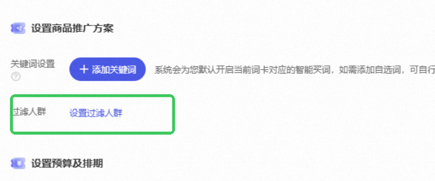

# 3- 全新升级！流量金卡人群过滤功能支持消费力层级&达摩盘打包人群过滤

> 来源：https://alidocs.dingtalk.com/i/nodes/Y1OQX0akWmzdBowLFvooaXl4VGlDd3mE

关键词场景如何精准圈人投放、如何在爆发期稳定拿下高效转化是决胜关键。为助力商家在大促期间冲击生意目标，在搜索渠道实现更精细化的人群运营，关键词推广场景-流量金卡全新升级投放能力——人群过滤功能升级！

首次在关键词推广实现搜索渠道精细化人群过滤，从“圈人”到“锚定成交”！

*“流量金卡商家内测群-人群过滤&核心资源位”群的钉钉群号： 156800035901*

**全新升级！人群过滤功能支持消费力层级&达摩盘打包人群过滤**

| **目前哪张金卡支持自定义过滤人群？** |
| --- |
| **全域人群精准转化卡：**点击直达投放 |
| 首次支持商家在搜索渠道自定义过滤人群，达成率可达99%+，新客成交占比大幅提升 |

## **能力介绍：**

| **Before** **只有一个tab，固定选择人群标签进行过滤** | **After** **过滤选项更灵活更多样，新增消费力层级、支持达摩盘人群标签自主圈选过滤** |
| --- | --- |

**核心升级点：**依据商家需求自定义设置过滤人群，在原有能力上，全新升级**「基础性别年龄人群」「店铺互动人群」「营销价值人群」、「自定义达摩盘人群」**4个tab的人群过滤能力，锚定目标人群、减少预算浪费。注意*：不同金卡会提供不同的过滤能力，以前端展示为准；4个tab之间的人群取并集。

**功能基础原理：**流量金卡设置过滤人群后，计划会在智能投放宝贝核心关键词搜索流量的基础上，过滤商家非目标人群，过滤成功率可高达99%+

| **过滤基础** **性别年龄人群** | 支持过滤性别、年龄基础属性人群，选择需要过滤的性别及用户年龄段，确定后点击添加人群 |
| --- | --- |

| **过滤互动人群** | 支持过滤店铺购买、加购、收藏、进店人群，**新增过滤365天购买人群，与生意参谋新客口径拉齐，**根据当前的经营需求，选择需要过滤的互动人群，确认后点击添加人群 |
| --- | --- |

| **过滤** **营销价值人群** | **支持过滤DMP营销价值人群，支持分消费力L1、L2、L3、L4、L5过滤，**选择需要过滤的营销价值人群，确认后点击添加人群 |
| --- | --- |

| **过滤达摩盘自定义人群** | 支持客户自定义圈选过滤人群，人群数据来源于达摩盘，包含商户通过达摩盘标签、一方标签圈选的人群。 **过滤能力：**可选择已同步到关键词推广的人群，点击添加进行过滤；也可点击新建人群，前往达摩盘后台，根据人群运营诉求，定制过滤人群。**同步步骤：**在**”我的人群“**选择需同步的人群点击**”选择渠道“**数据同步**“关键词过滤人群“**。**自定义人群过滤规模规则：** |
| --- | --- |

**注意事项：**流量金卡为套餐包模式，人群过滤设置*仅支持新建计划时设置，投中不支持修改*；请各位商家下单前妥善设置。

功能入口：新建->关键词推广->流量金卡->人群过滤->设置人群过滤（内测期仅有少量卡支持人群过滤，后续将逐渐扩展）

过滤人群可能影响拿量和点击成本：过滤过多人群可能放量慢、只投高营销价值人群竞争激烈可能导致CPC上涨哦，请按需设置哦～

**哪些金卡支持过滤人群？**——待更新

## **常见问题：**

**Q1：新功能上线后，我可以直接在正在跑的老计划上开启或者修改吗？
回答：** **不支持，流量金卡新能力只支持新建套餐包计划，不影响稳定运行的老计划**。

**Q2：为什么我设置了“自定义人群屏蔽”后，广告跑不动了（拿量困难）？
回答**： 这通常是因为过滤条件设置过于激进，导致符合投放条件的人群池过窄。**优化建议：**1）放宽屏蔽条件： 检查自定义屏蔽人群是否范围过大，尝试减少屏蔽包数量或缩小屏蔽范围；2）给予学习期： 新计划开启开关后需要 1-2 天的冷启动学习期，请耐心等待

**Q3：怎么查看计划跑的人群是否过滤成功了？为什么过滤老客的新客成交占比仍没有100%？**

**回答：**此前金卡的人群过滤能力基本可以过滤85%+的人群曝光，但是剩下15%的老客曝光在某些成交节点可能带来较高的成交转化，导致新客成交占比下降（举例：85个新客成交10单，15个老客成交15单，导致新客成交占比低于50%）目前金卡过滤能力升级中，预计618期间可以全量上线，过滤比例可达100%。

您可以在达摩盘圈选计划的曝光人群，查看过滤效果，后续我们将升级【金卡结案】，支持直接查看计划的过滤效果，敬请期待。
