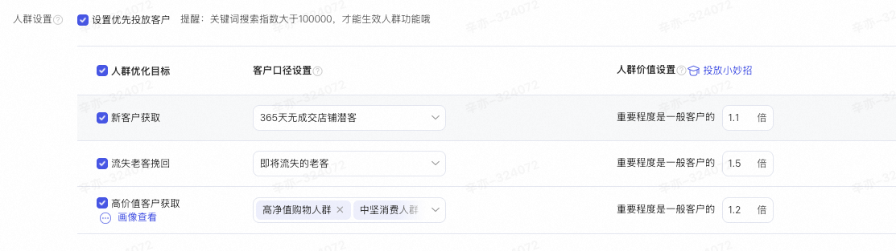
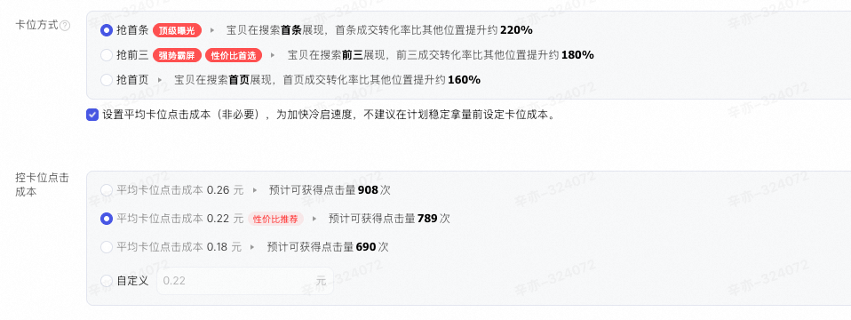
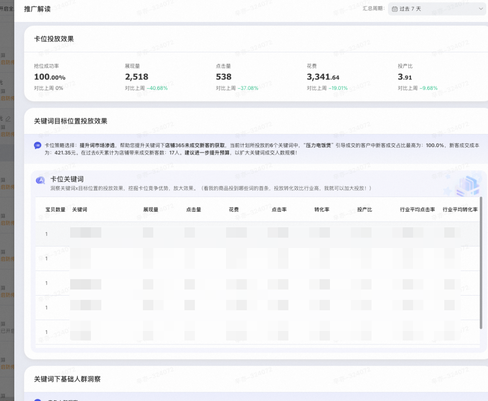
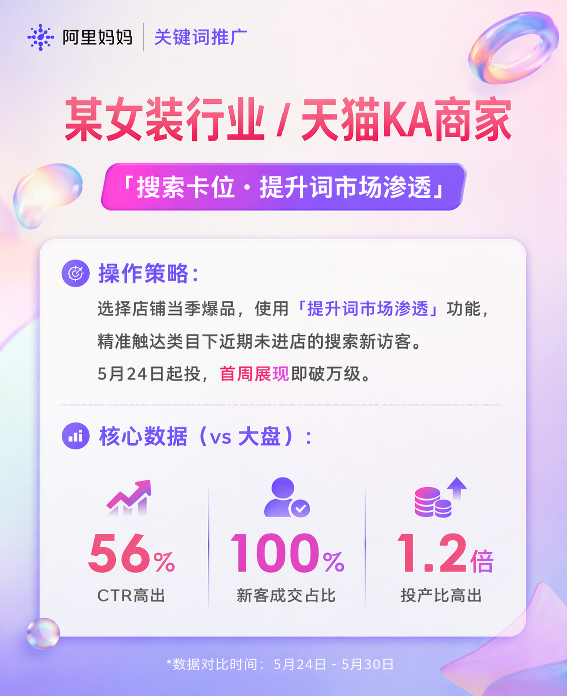
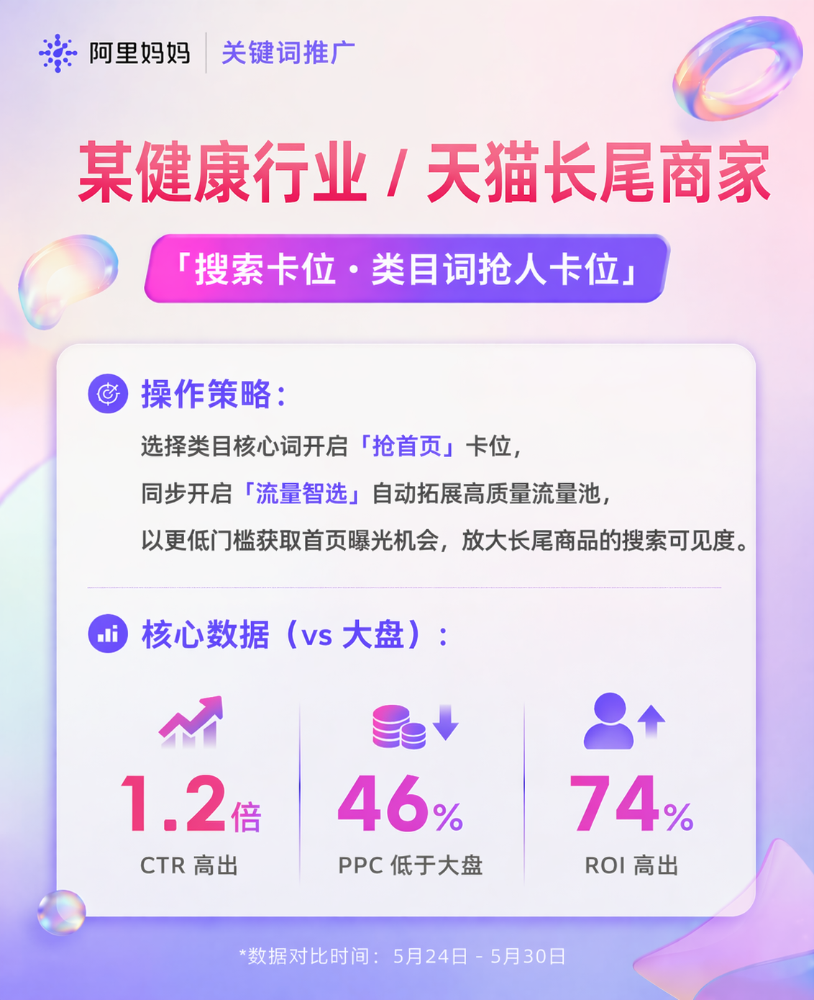
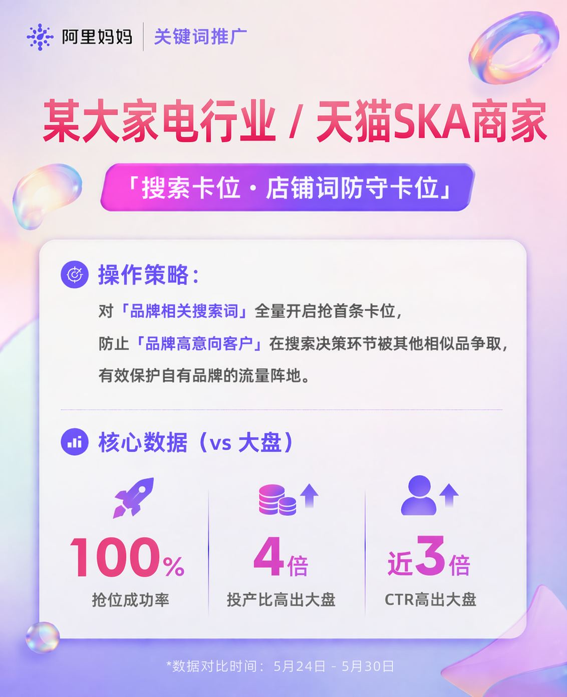

# 【重磅升级】搜索卡位：助推商品抢占首条展现，投搜索新客拓生意增量🚀🚀

> 来源：https://alidocs.dingtalk.com/i/nodes/Y1OQX0akWmzdBowLFvyM46P4VGlDd3mE

**📌 核心摘要**：搜索卡位全新升级，通过**「六大场景化玩法」+「精细化定向控本」**，助力商家在搜索结果页稳定占据首条流量入口。实测**抢位成功率高达 99%+**，对比关键词大盘，**点击率 (CTR) 提升 185%**，**转化率 (CVR) 提升 30%**，是商家获取确定性搜索流量的核心利器。

## 💡 一、 为什么选择「搜索卡位」？

在淘宝/天猫搜索场景中，“首条”意味着最高的曝光权重和最精准的流量承接。搜索卡位致力于解决商家在搜索投放中面临的“排名波动大”、“竞品截流多”、“新客获取难”、“成本控制难”四大痛点。

### 核心数据表现

⭐ **极高稳定性**：抢位成功率高达 **99%+**，确保广告稳定展现在搜索结果首位

📈 **超强转化力**：相比普通关键词投放，点击率 (CTR) 提升 **185%**，转化率 (CVR) 提升 **30%**

🛡️ **流量护城河**：有效拦截竞品流量，保护品牌资产，锁定高意向成交用户

---

## 🎯 二、 六大全新玩法，精准匹配经营场景

我们针对不同阶段商家的经营痛点，推出了六大场景化卡位玩法，实现从“防守”到“进攻”的全链路覆盖。

### 🔴 1. 类目词抢人卡位：锁定核心赛道，稳住流量基本盘

**核心逻辑**：类目词是行业流量的主动脉。在搜索结果页抢占首条，能建立类目流量护城河，防止核心流量被竞品蚕食。

**适用商家/场景**：大促或新品期排名不稳的头部商家；希望抢占细分赛道的腰部潜力商家。

**操作建议**：系统自动推荐行业高热度词及店铺强相关类目词。建议绑定店铺 GMV Top10 爆款商品承接流量，并开启基础人群溢价，确保在激烈竞争中仍稳占首条。

**预期收益**：核心类目词流量预计 3-7 天内回升并增长，稳定占据搜索结果首位，转化率保持稳定。

### 🟠 2. 店铺词防守卡位：保护品牌资产，防止高意向客户流失

**核心逻辑**：搜索品牌词的用户购买意图最强。若不占首条，极易被竞品广告截胡，导致获客成本被动升高。

**适用商家/场景**：发现搜品牌词时跳出竞品，担心官方正品认知被稀释的品牌商家。

**操作建议**：系统自动锁定流失成交笔数最多的 Top10 品牌词及变体词，支持一键添加。选择“首条抢位”模式，并根据近 7 日搜索量设置充足日预算。

**预期收益**：品牌词带来的成交笔数显著提升，综合获客成本降低，强化用户“官方正品”的心智认知。

### 🔵 3. 竞争截流卡位：定向竞品摇摆用户，从对手池中抢新客

**核心逻辑**：同类目、同体量竞店存在大量“浏览点击但未成交”的摇摆用户，这是最佳的增量来源。在用户比价决策期介入，抢夺效率最高。

**适用商家/场景**：竞店疯狂抢夺浏览/加购人群，希望直接从对手手中抢客的进取型商家。

**操作建议**：开启“竞对人群溢价”圈选竞店人群（如近 30-365 天访问/成交人群），搭配“类目泛词 + 功能场景长尾词”和店铺高性价比商品进行承接。

**预期收益**：直接从竞品手中抢夺潜在客户，避开红海大词的无效竞争，显著提升点击转化率。

### 🟢 4. 洼地词控成本卡位：智能匹配高潜词，集中资源打爆款

**核心逻辑**：当商品具备高评分、高转化潜力时，需要海量曝光来迅速拉升销量。此玩法能让好产品不被埋没，快速起量。

**适用商家/场景**：爆品需冲销量，追求极致性价比，希望让好产品低成本爆发的成长期商家。

**操作建议**：开启“流量智选”，系统根据商品属性实时匹配高转化洼地词汇。集中推广店铺 GMV Top 超级单品，可叠加“卡位成本设置”严格控制单次点击成本。

**预期收益**：短期内快速积累销量权重，助力商品冲入类目前列获得自然流量，同时有效控制投放成本。

### 🟣 5. 节促词限时卡位：抓住节日搜索高峰，集中爆发

**核心逻辑**：节日期间用户搜索词带有强烈的“礼物”、“优惠”、“套装”属性，购买决策极快。节日流量窗口期短，错过即失去全年最佳销售机会。

**适用商家/场景**：仅针对**天猫KA及以上**商家开通。双11、春节等强营销节点，配置节日专属词包，集中火力抢时效性 GMV 的商家。

**操作建议**：采用运营配置的节日专属词包（如“情人节礼物”），限定投放时间为节前预热至节日结束，推送适合节日场景的商品，确保“词-品-人”高度匹配。

**预期收益**：在节日高峰期快速获取搜索流量，直接命中用户节日需求，转化率显著提升。

### ⚪ 6. 提升词市场渗透：挖掘搜索未转化潜客，扩大新增量

**核心逻辑**：店铺现有流量趋于饱和，老客复购增长乏力。通过挖掘“搜索但未转化”的庞大潜客群体，可以打破增长瓶颈。

**适用商家/场景**：遇到老客复购瓶颈，希望挖掘“搜索未转化”潜客，精准拦截“搜了却没买”的高意向新客的商家。

**操作建议**：选择“搜索但未成交”、“搜索但未收加”或“搜索未进店”的新客人群，采用“实时关键词 + 历史行为排除”组合，确保每一分预算都花在纯新客身上。

**预期收益**：直接触达搜索潜客带来纯新客增长，缩短用户从搜索到购买的决策路径，为大促前有效积累高潜人群。

---

## 三、 精细化运营升级：灵活定向 & 成本控制

除了场景化玩法，本次升级还在底层能力上实现了三大突破，让投放更精准、更灵活、更透明。

### 🔹 升级一：投放人群更精准

**核心能力**：支持更细粒度的人群溢价设置。

**操作亮点**：

**人群优化目标**：可设置优先投放“高价值客户”或“新客”。

**关键指标门槛**：支持设置关键词搜索指数大于 100,000 才生效人群功能，确保在大流量词下人群包的有效性。

**精细化溢价**：针对“流失老客挽回”、“高价值客户获取”等不同标签，设置差异化溢价比例（如 1.1倍 - 1.5倍），实现千人千面的出价策略。

### 🔹 升级二：成本控制更灵活（逐步开放中）

**核心能力**：引入“平均卡位点击成本”控制，让预算花得更明白。

**操作亮点**：

**智能推荐**：系统根据历史数据，推荐“性价比最高”的平均点击成本（如 0.22元），并预估可获得点击量（如 867次）。

**自主调控**：商家可根据自身 ROI 要求，自定义平均点击成本上限，系统在保障抢位成功率的前提下，自动优化出价，避免无效高价竞争。

### 🔹 升级三：结案洞察更清晰

**核心能力**：新增多维度效果归因与人群洞察报表。

**操作亮点**：

**目标位置效果**：清晰展示关键词在“首条”等目标位置的投放效果数据。

**基础人群洞察**：深入分析关键词下基础人群的画像特征。

**高质量新客识别**：清晰洞察哪些词带来了高质量新客，帮助商家持续优化拉新策略，沉淀品牌资产。

---

## 四、 常见问题解答 (FAQ)

**Q1：搜索卡位和普通关键词投放有什么区别？**
A：普通关键词投放是竞价排名，位置不固定；搜索卡位是通过算法保障，以更高的确定性抢占搜索结果“首条”或特定高位，流量更精准，转化效率通常更高。

**Q2：如果抢位失败怎么办？**
A：系统会提供极高的抢位成功率（99%+）。若因极端竞争导致短暂未抢到首条，系统会自动调整出价策略尝试追回。您也可以通过提高“平均卡位点击成本”上限来提升竞争力。

**Q3：如何判断我的商品适合哪种玩法？**

**头部商家/爆款**：首选「类目词抢人」和「店铺词防守」，稳固地位。

**成长期商家/新品**：首选「洼地词控成本」和「竞争截流」，低成本获客。

**大促期间**：全员启用「节促词限时卡位」，抓住节日红利。

**遇到增长瓶颈**：尝试「提升词市场渗透」，挖掘未转化潜客。

**Q4：设置“平均卡位点击成本”会影响抢位成功率吗？**
A：会有一定影响。建议初期使用系统推荐的“性价比”成本，观察 3-7 天数据后，若抢位成功率稳定且 ROI 达标，可尝试微调降低成本；若抢位困难，则需适当提高成本上限。

---

#### **SHOWCASE**

