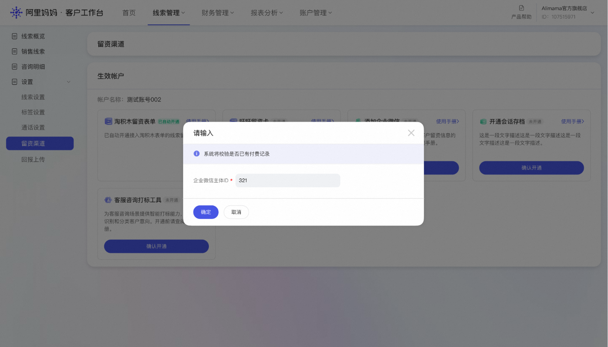
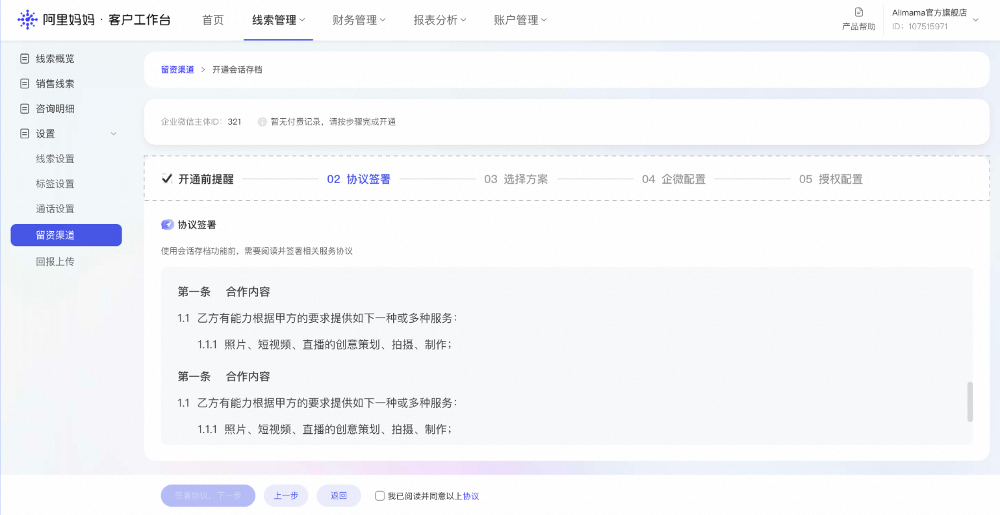
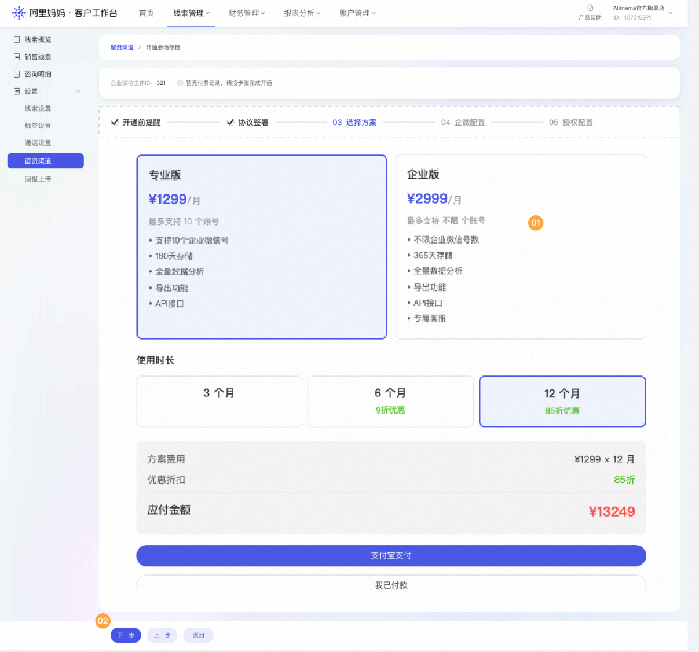
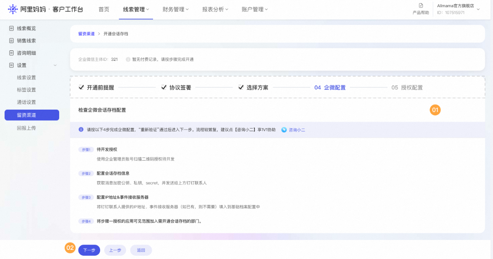
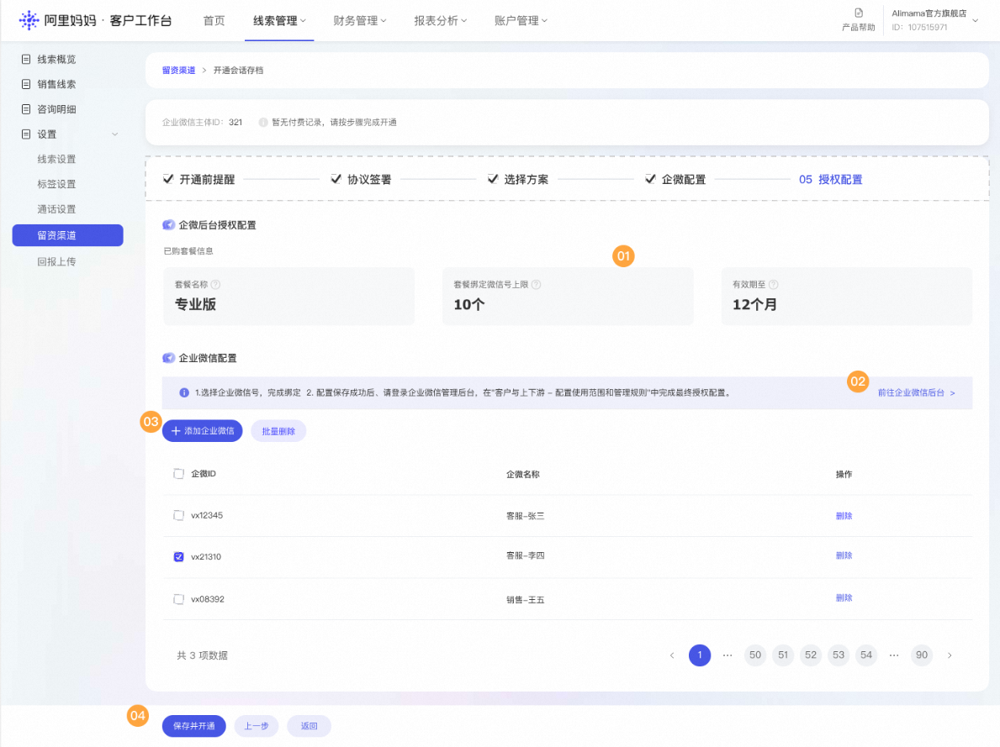
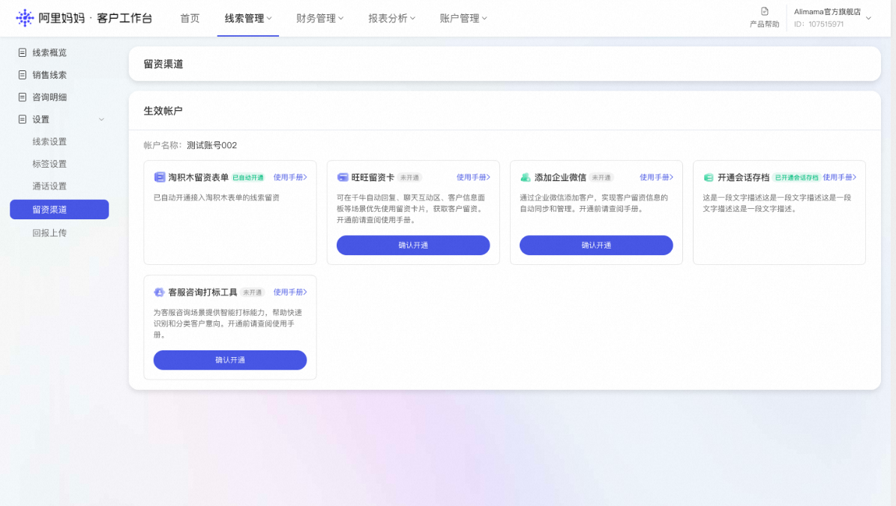

# 【线索推广-企微会话回传】使用指南

> 来源：https://alidocs.dingtalk.com/i/nodes/YMyQA2dXW7gYo6Mzc5LjeNGMWzlwrZgb

## 一、功能介绍

企微会话回传系阿里妈妈为投放【线索推广】产品的商家所提供的一项增值服务功能。

本功能由**企微会话存档**与**企微会话回传**两部分构成，旨在帮助商家规范员工管理、提升服务质量，并为三方服务纠纷提供有效举证依据，同时助力线索推广效果优化。

### 1.1 企微会话存档

**开通渠道**：企业微信管理后台开通并使用。

**功能介绍：**企微会话存档功能可帮助商家记录和存档员工与消费者之间的聊天记录，加强员工内部管理。**该功能是开通企微会话回传的前提。**

### 1.2 企微会话回传

**开通渠道**：阿里妈妈·客户工作台付费开通并使用

**功能介绍：**企微会话回传功能由平台将存档员工与消费者的聊天记录回拉至手淘，用于三方服务纠纷举证和线索推广效果优化。

**核心应用场景**：

**线索管理：**在商家授权范围内，将回传的企微会话数据存储于阿里妈妈客户工作台，供商家集中管理该部分线索资源。商家可在客户工作台内统一查看客资信息、标记跟进状态、分配线索流转，实现多渠道客资的高效归集与管理。

**线索分析：** 基于回传数据，为商家提供数据分析、经营洞察、会话质量打标及线索转化效果分析，帮助商家了解从消费者咨询到成交的转化路径，识别高价值沟通记录，辅助日常客资运营决策。

**线索优化：** 将回传数据应用于线索推广投放的人群模型及算法优化，帮助商家更精准地触达高意向用户，同时支持投放效果的多维度归因分析，为后续预算分配与出价策略提供参考依据，推动投放效率持续提升。

---

## 二、开通指南

### 2.1 前置条件

商家须完成以下前置条件方可开通企微会话回传功能：

**前置条件一**：商家须在企业微信管理后台开通【会话内容存档】功能

**前置条件二**：完成企业ID授权，将企业微信授权予阿里妈妈及瓴羊

### 2.2 开通流程

**第一步：输入企业ID校验付费状态**

商家需在阿里妈妈·客户工作台开通【会话回传功能】。开通时，商家需输入企业IDID，妈妈侧将自动校验付费状态。

*图1：输入企业微信主体ID进行付费状态校验*

**第二步：根据付费状态进入不同流程**

**情况A：若系统校验未付费，商家需依次完成以下四个步骤**

**步骤1：协议签署**

商家需签署《企微会话回传三方协议》。请仔细阅读协议条款，确认无误后勾选同意并点击【下一步】。

*图2：签署相关协议*

**步骤2：工具付费**

商家需按企业ID进行付费。单个企业ID下，不同规模的员工企微账号对应不同的收费标准，价格从低到高对应1至100个员工企微账号的绑定。

+《双方协议》

**特别说明**：若店铺需绑定不同企业ID的企业微信，则需为每个企业ID的企业微信分别购买方案。通过妈妈客户工作台绑定的企业微信，其主体若与妈妈侧店铺主体不一致，平台默认妈妈侧店铺主体已前置取得其申请绑定的企业微信主体的授权。

*图3：选择套餐方案及使用时长*

**步骤3：企微配置**

企微配置流程共4步，**操作建议！！！**因整体配置流程较为繁复，**建议商家点击【咨询小二】获取1V1专业指导**，确保配置准确无误。

**配置流程包含：**

待开发授权

配置会话存档信息

配置IP地址白名单或服务器域名

配置一级组织的会话存档范围及入离职同步事件

*图4：企微配置四步流程*

**步骤4：授权配置**

完成以上三步后，平台将展示已配置企业微信的套餐信息，并自动拉取企业微信下员工企微账号列表。商家可勾选需要用于企微会话存档与回传的员工账号。

**重要提示**：

商家添加的员工企微账号个数不能超出套餐上限。

保存确认后，同步点击【前往企业微信后台】跳转至企微后台完成授权配置。

*图5：勾选员工企微账号并前往企微后台完成授权*

**情况B：若系统校验已付费，则直接进入授权配置流程**

已付费商家可跳过协议签署、工具付费、企微配置步骤，直接进入授权配置环节，勾选员工账号并完成授权。

**第三步：确认开通状态**

完成企微配置后，客户工作台将隐去【开通会话存档】功能下【确认开通】按钮，表明已完成会话存档功能开通。

*图6：会话存档功能已开通状态*

---

## 三、收费方案

### 3.1 收费标准

企微会话回传功能采用**按企业ID套餐收费**模式，具体收费标准以支付页面为准。

### 3.2 收费说明

**注意一**：按企业ID进行付费，一个商家需要使用多个企业ID下的企业微信，则需给每个企业ID购买工具。

**注意二**：单个企业ID下，不同规模的员工企微账号对应不同的收费标准，价格从低到高对应1至100个员工企微账号的绑定。商家可根据实际需要的员工企微账号规模选择对应套餐，超过100个员工企微账号的头部商家可咨询行业小二，单独确认收费方案。

**注意三**：费用按年收取，支持多档套餐选择；当前仅支持【支付宝付款】。

---

## 四、产品优势

### 4.1 合规护航，降低风险

建立官方企微沟通链路，为商家提供合规举证依据。在合规经营基础上，保障账号安全，有效降低违规经营风险。

### 4.2 数据赋能，精准获客

利用企微交互数据训练算法模型，精准识别高/低意向及成交用户群体，迭代优化投放策略，提升广告投放效果。依托AI语义分析能力，深度追踪消费者加微的真实需求与转化意愿，沉淀独属于店铺的广告人群资产。

### 4.3 业绩归因，正向循环

实现线索闭环管理。以真实成交数据驱动广告投放优化，打造"投放-机会-成交-再投放"的业务增长飞轮，最大化商业价值。通过消费者最终成交结果回传至妈妈侧，辅助账户广告模型持续优化，为商家探索更多有效人群及高成交意向人群。

---

## 五、常见问题

**问题一：开通企微会话回传功能须满足何种前置条件？**

答：商家须同时满足以下两项前置条件：其一，在企业微信管理后台开通【会话内容存档】功能；其二，完成企业ID授权。满足条件后，方可在阿里妈妈·客户工作台付费开通会话回传功能。

**问题二：企微会话存档与企微会话回传有何区别？**

答：企微会话存档在企业微信管理后台付费开通，主要用于商家内部员工管理与绩效评估；企微会话回传在阿里妈妈·客户工作台付费开通，主要用于线索管理优化和线索推广效果优化。两者功能互补，需配合使用。

**问题三：收费是按什么标准收取？**

答：收费按企业ID套餐收取，分为A至E五档套餐，年费从2,000元至12,000元不等，分别对应1至100个微信账号。具体价格以系统页面显示为准。

**问题四：若店铺有多个企业ID，如何收费？**

答：按企业ID进行付费，一个商家需要使用多个企业ID下的企业微信，则需给每个企业ID分别购买工具。通过妈妈客户工作台绑定的企业微信，其主体若与妈妈侧店铺主体不一致，平台默认店铺主体已前置取得绑定企业微信主体的授权。

**问题五：企微配置流程复杂，如何获取帮助？**

答：企微配置流程共4步，建议商家点击【咨询小二】获取1V1专业指导，确保配置准确无误。

**问题六：如何选择需要进行会话存档的员工？**

答：完成企微配置后，平台将自动拉取企业微信下员工企微账号列表，商家可勾选需要用于会话存档与回传的员工账号。**注意**：添加的员工企微账号个数不能超出套餐上限。

**问题七：已付费商家如何开通？**

答：已付费商家可直接进入授权配置流程，跳过协议签署、工具付费、企微配置步骤，勾选员工账号并完成授权即可。

**问题八：如何确认功能已开通？**

答：完成企微配置后，客户工作台将隐去【开通会话存档】功能下【确认开通】按钮，表明已完成会话存档功能开通。

**问题九：超过100个员工账号如何收费？**

答：超过100个员工企微账号的商家可咨询行业小二，单独确认收费方案。

---

**更新日期**：2026年6月

**适用范围**：阿里妈妈线索推广产品商家

**如有疑问，请联系阿里妈妈官方客服或加线索推广官方客户群（群号：159050038411）获取进一步支持。**
