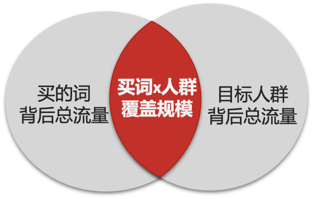
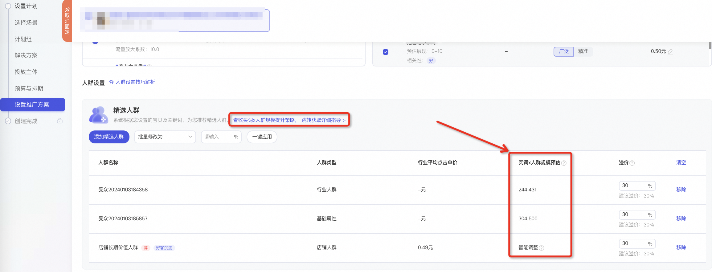
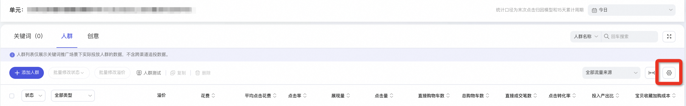
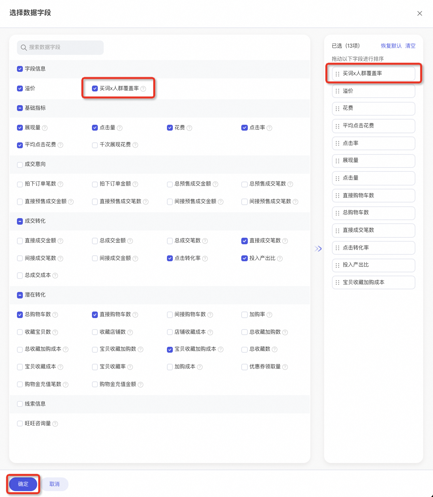
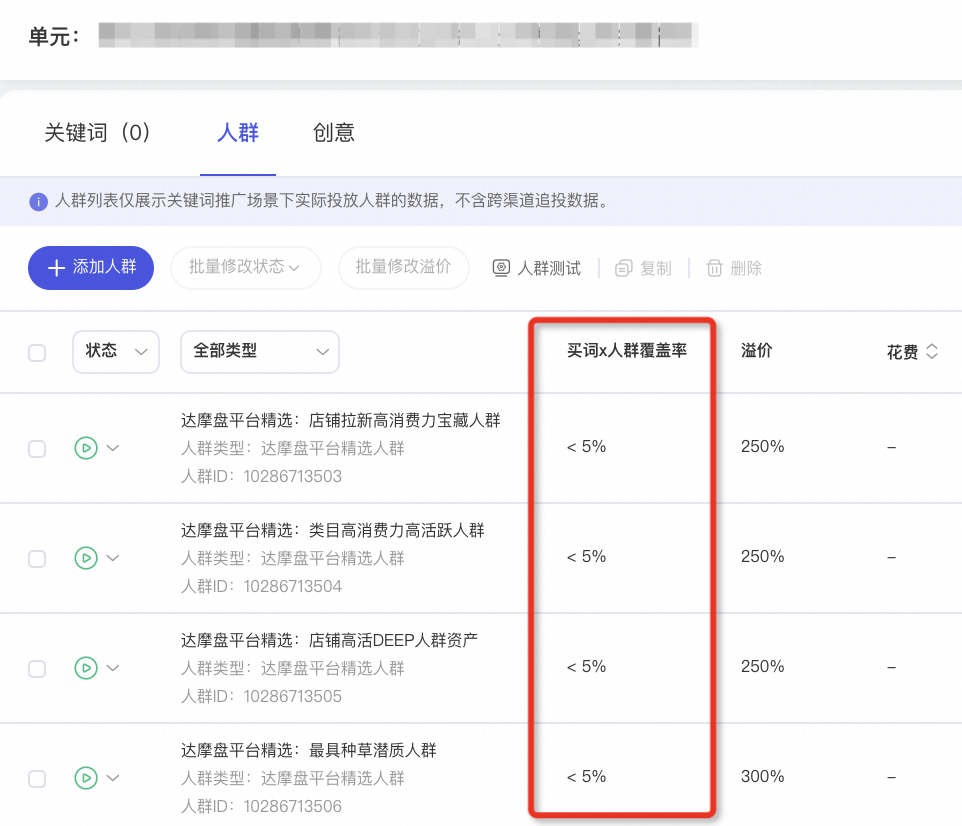

# 关键词推广-人群预估覆盖率：帮助商家「诊断」自定义人群拿量困难的原因！

> 来源：https://alidocs.dingtalk.com/i/nodes/YMyQA2dXW7gYo6Mzc6kjMPNXWzlwrZgb

**原语雀文档链接：**https://yuque.antfin.com/chenchun.chen/gqhty9/xvkq1xsus61ua2t7

---

功能内测中，初期内测申请需要关键词（原直通车）近30天月消耗大于22000。具体进群、群文件内填写信息申请。

商家钉钉群：62095000772

# 关键词投的人群拿不到量？

自定义人群拿量困难，如何优化投放？是人群覆盖量过窄？还是人群溢价过低抢不到量？

广告主买了一批词后，再选择重点人群包进行溢价、希望在推广过程中可以重点触达到目标人群、拿到对目标人群更多的流量。但过程中，涉及到买的词与目标人群的关联度。

**原理解释**：关键词流量和人群流量是交叉关系，词和人群的相关性会制约人群的拿量能力，只有中间重叠的部分才是能够拿到的人群流量；

判断关键词和人群的相关性，尽可能扩大「关键词叠加人群」预估覆盖规模（该数据字段已在新建页面中，目前仅支持自定义人群类型的预估，其他人群类型的预估，敬请期待）

根据人群的覆盖率（该数据字段已在推广页面的人群列表中），调整策略，判断是应该扩词，还是提高人群溢价，切忌盲目提高人群溢价

## 买词x人群规模预估

**功能解释：**买词x人群规模预估，即已选关键词和人群包，在淘内流量重合的预估最大覆盖规模。

**举例**：已选关键词是连衣裙，人群是18-24岁女，那么该预估覆盖量即为「昨日搜索过关键词连衣裙、且人群标签是18-24岁女」的淘内消费者UV规模。

因此如果希望能够触达到更多的目标人群，前提是「买的词」与「目标人群包」有关系：即这些人会去搜买的这些词； 其次是对目标人群的竞价过程中有优势。

## 【买词x人群覆盖率】指导提升目标人群的拿量&触达

通过查看【买词x人群覆盖率】，洞察词x目标人群的关系、了解词x目标人群的提升空间&方法。

**一、【买词x人群覆盖率】较高，需扩充买词 / 扩充人群**说明「买的词」与目标人群相关的流量都已经拿到，如果若想自定义人群拿更多的量，需扩词 或者 扩人群，以提升买词与人群的预估覆盖量。**扩词**：选择与人群相关性高、流量重合度高的关键词（后续将进行相关推词，敬请期待）「流量解析」查看词下人群画像、选择与目标人群关联度高的词开启「关键词组合」/「流量智选」，查看买词报告，挖掘精准/增量好词**扩人群**：选择与关键词相关性高、流量重合度高的人群（即「关键词叠加人群」预估覆盖规模大的人群）

**二、【买词x人群覆盖率】较低，需优化出价**说明买的词中，还有目标人群流量没有竞得，此时需提升人群溢价，提升对目标人群的拿量竞争力。开启「全能调价」，提高目标人群触达、分目标优化投放效果

# 二、功能入口

### 1、创建计划：「买词x人群覆盖率」预估覆盖规模

#### （1）操作路径

关键词推广→持续推广→自定义选品+手动出价→关键词设置→人群设置→添加商家自定义人群，即可查看「关键词叠加人群」预估覆盖规模

#### （2）概念解释

买词x人群规模预估，即已选关键词和人群包，在淘内流量重合的预估最大覆盖规模。

**举例**：已选关键词是连衣裙，人群是18-24岁女，那么该预估覆盖量即为「昨日搜索过关键词连衣裙、且人群标签是18-24岁女」的淘内消费者UV规模。

#### （3）数据更新周期

目前仅支持部分自定义人群的数据预估，若商家修改关键词，自定义人群的预估覆盖规模会实时变动，但因为预估量级大，偶尔会有点延迟。

因预估功能限制，修改人群溢价，不会影响人群预估覆盖规模，但会影响实际人群拿量！！！

### 2、单元详情页：人群预估覆盖率

#### （1）操作路径

关键词推广→计划详情→单元详情→人群列表，在设置中勾选「人群预估覆盖率」这个数据字段，点击确定

即可在人群列表中看到【买词x人群覆盖率】这个数据信息啦。

注意：

#### （2）概念解释

**买词x人群覆盖率**：买词x人群覆盖率=人群实际展现量/买词x人群规模展现量，预估展现量基于昨日数据进行预估。反映人群的拿量空间，覆盖率高但人群实际展现少说明词和人群匹配度低，建议扩展买词或调整人群。

**智能调整**：该人群包为实时更新的动态人群包，人群数量会实时结合关键词&商品进行动态调整，无具体预估规模。

#### （3）数据更新周期

买词x人群覆盖率中的分子【人群实际展现量】是随着今日投放实时变动的，分母【人群与关键词重合的预估展现量】是昨日数据预估

因预估功能限制，修改人群溢价，不会影响人群预估覆盖规模，但会影响实际人群拿量！！！

# 三、常见问题

1、商家钉钉群：62095000772

若有收获，就点个赞吧

​
