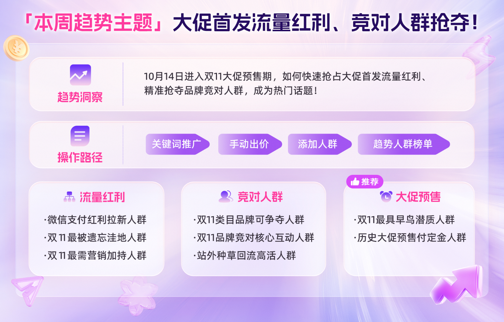
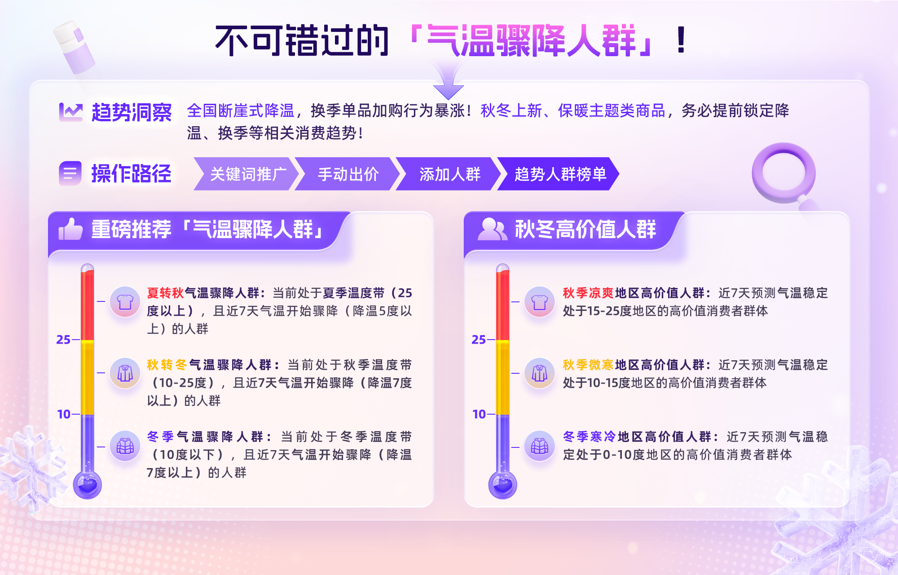
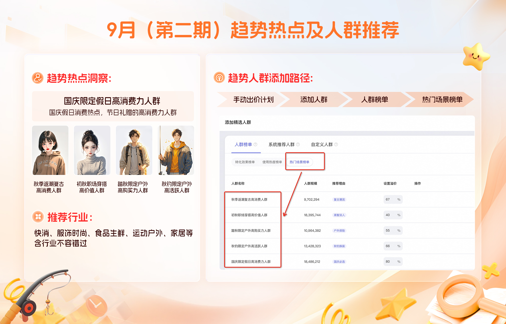
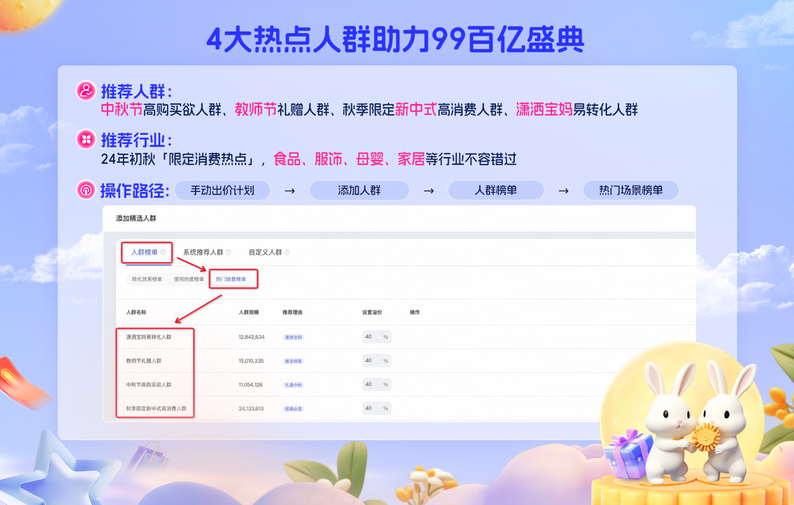
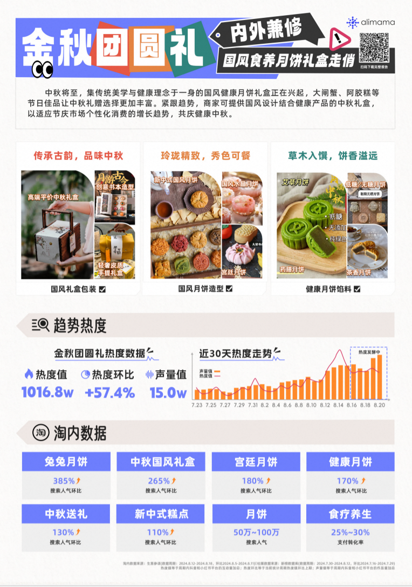
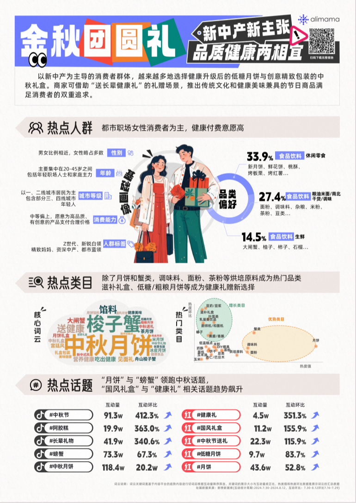
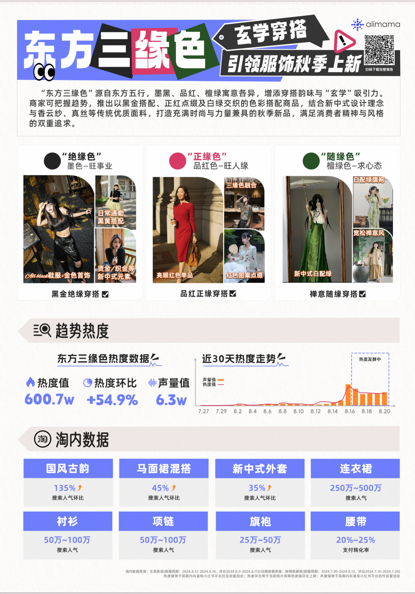
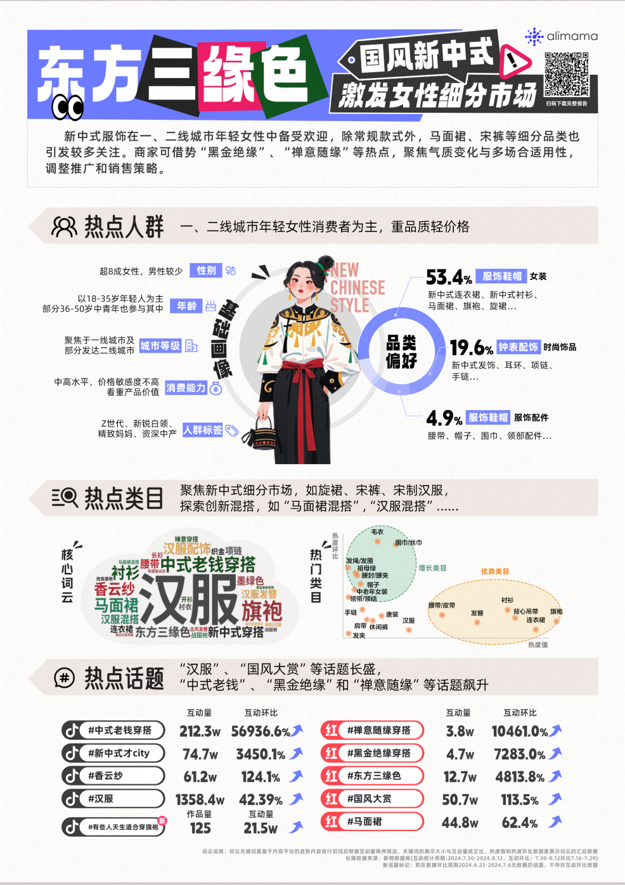

# 【关键词推广】趋势人群榜单

> 来源：https://alidocs.dingtalk.com/i/nodes/YMyQA2dXW7gYo6Mzc6kjMaoRWzlwrZgb

**原语雀文档链接：**https://yuque.antfin.com/chenchun.chen/gqhty9/mbotmk3ofzhi6pyg

---

注意：每周会更新一期趋势人群洞察，请大家关注~

# 10月12日推荐「双11大促预售红利」

# 9月24日推荐「气温骤降人群」

| **人群名称** | **人群逻辑解读** |
| --- | --- |
| **夏转秋**气温骤降人群 | 当前处于**夏季温度带（25度以上）**，且近7天**气温开始骤降（降温5度以上）**的人群，ta们对降温有很强的体感，在转秋的阵阵凉风中开始活跃于淘内搜寻适合秋季的服装配饰、家具用品等，且具有较高购买力！ |
| **秋转冬**气温骤降人群 | 当前处于**秋季温度带（10-25度）**，且近7天**气温开始骤降（降温7度以上）**的人群，ta们对降温有很强的体感，在转冬的阵阵寒风中活跃于淘内搜寻适合冬季的服装配饰、家具用品等，且具有较高购买力！ |
| **冬季**气温骤降人群 | 当前处于**冬季温度带（10度以下）**，且近7天**气温开始骤降（降温7度以上）**的人群，ta们对降温有极强的体感，在深冬寒风的萧瑟中活跃于淘内搜寻具有极强保暖性的服装配饰、家具用品等，且具有较高购买力。 |
| **秋季凉爽**地区高价值人群 | 近7天预测**气温稳定处于15-25度**地区的高价值消费者群体，ta们体感十分凉爽，逐渐收起了夏装和空调被，开始换上长袖。ta们当前在淘内十分活跃，且具有较高购买力，是秋季宝贝营销的必备人群！ |
| **秋季微寒**地区高价值人群 | 近7天预测**气温稳定处于10-15度**地区的高价值消费者群体，ta们体感开始微寒，出门需要穿上外套，在衣物的选择上开始关注保暖性。ta们当前在淘内十分活跃，且具有较高购买力，是保暖宝贝营销的必备人群！ |
| **冬季寒冷**地区高价值人群 | 近7天预测**气温稳定处于0-10度**地区的高价值消费者群体，ta们体感开始寒冷，出门需要穿上厚外套，在衣物的选择上愈发关注保暖性。ta们当前在淘内十分活跃，且具有较高购买力，是保暖宝贝营销的必备人群！ |

# 9月11日推荐「国庆假日+初秋人群」

| 人群名称 | 人群描述 | 热点洞察 |
| --- | --- | --- |
| 1、国庆限定假日高消费力人群 | 结合近期国庆节假日消费热点，精选居家生活，户外出游，节日礼赠的高消费力人群 | ​ |
| 2、秋钓限定户外高活跃人群 | 紧跟季节变换，钓鱼战场换季备战，优选对秋季保暖舒适钓鱼服和钓具有高需求和消费倾向的潜客人群 |  |
| 3、踏秋限定户外高购买力人群 | 金秋时刻，户外探险热情高涨！徒步越野登山等装备热销，把握户外穿搭商机，精选户外运动高价值人群 |  |
| 4、初秋职场穿搭高价值人群 | 结合高智淡人热议话题，精选初秋商务精英高价值人群，助您抓住高级感穿搭热点投放先机 |  |
| 5、秋季返潮复古高消费人群 | 秋季复古风潮来袭，结合复古时尚风格热点，精准锁定潮流复古风需求人群，引爆秋季服饰热销 |  |

# 9月5日推荐「中秋节+宝妈+新中式」

**1、中秋节高购买欲人群**

（1）人群圈选逻辑

近30天，浏览或搜索过中秋、送礼相关商品，并热衷于为庆祝重要节日而买买买的用户，是淘内核心具备高消费力、高淘气值、高活跃天数、高消费频次、高消费金额的“五高人群”。

（2）热点洞察

**2、教师节礼赠人群**

（1）人群圈选逻辑

近30天，搜索并浏览过教师节、老师礼物等相关商品，且基于用户在淘内的行为特征，预测出高相关一级类目下，在送礼场景热衷于买买买的优质人群。

（2）推荐行业：全行业

**3、秋季限定新中式高消费人群**

（1）人群圈选逻辑

结合近期国潮文化热点，精选追求高端品味与文化内涵的高消费力人群。

（2）热点洞察

**4、潇洒宝妈易转化人群**

（1）人群圈选逻辑

近30天，搜索并浏览过孕妇、婴儿、宝宝等相关商品，且基于用户在淘宝平台上长周期行为特征，预测家中有0到17岁小孩的用户（包括在孕期的用户），并经常为儿女疯狂购物的高潜母婴人群。

（2）推荐行业：母婴亲子

​

​

​
