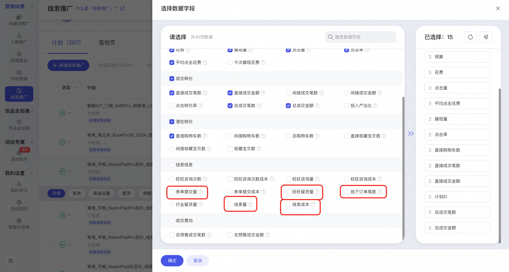
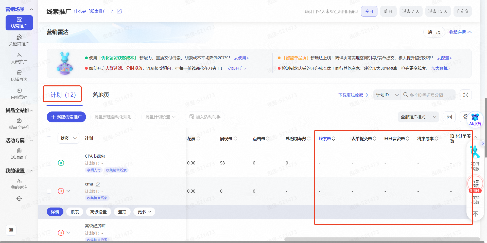

# 线索推广-实时线索数据上线

> 来源：https://alidocs.dingtalk.com/i/nodes/YMyQA2dXW7gYo6Mzckx7NZQxWzlwrZgb

尊敬的商家朋友们：

阿里妈妈线索推广 **【实时数据接入】** 功能现已正式上线！此功能旨在帮助您实现留资数据实时同步，营销模型秒级优化。无需商家操作，模型自动化学习，让投放越投越准、越跑越好！

## **一、能力介绍**

**功能说明：「线索推广」再进化！实时留资数据上线，商家可实时监控计划转化数据**

**实时展示指标**：*线索量、表单提交量、旺旺留资量、拍下订单笔数、线索成本。*

**如何查看实时数据：无界·线索推广场景——计划页面——支持实时转化数据查看**

**平台能力升级：**

**更快的模型优化：实时留资数据海量漫灌，货品营销模型秒级优化，**让系统即时感知转化信号，动态优化出价与定向，大幅提升线索获取效率与留资效果！

**更及时的效果监控：**适配底层营销算法能力升级，数据报表秒级更新留资数据，商家可即时追踪线索转化效果，精准评估投放ROI，快速调优策略，让每一分预算都花在刀刃上！

## **二、常见问题：**

**1、这个新功能需要我手动开启或设置吗？**

不需要！功能已默认生效。只要您使用「线索推广」，系统将自动接入实时留资数据，无需任何操作。

**2、实时数据和原来的数据有什么区别？准不准？**

实时数据可秒级展示咨询、留资、下单等转化行为，帮助您更快调优计划。因计算方式差异，实时数据与最终离线数据可能存在微小偏差，以T+1离线数据为准，但不影响实时决策参考。

**3、这对我的营销效果有什么实际好处？**

模型更准：基于全链路（咨询→留资→下单）训练，精准识别高营销价值的人群；

优化更快：秒级感知转化信号，动态调价定向，提升线索获取效率；

监控更及时：计划页面实时查看转化效果，快速判断ROI，灵活调整策略。

**4、我在哪里能看到这些实时数据？**

A：登录【万相台无界】→ 进入【线索推广】场景 → 打开任意计划 → 在计划报表中即可查看实时留资转化数据。
