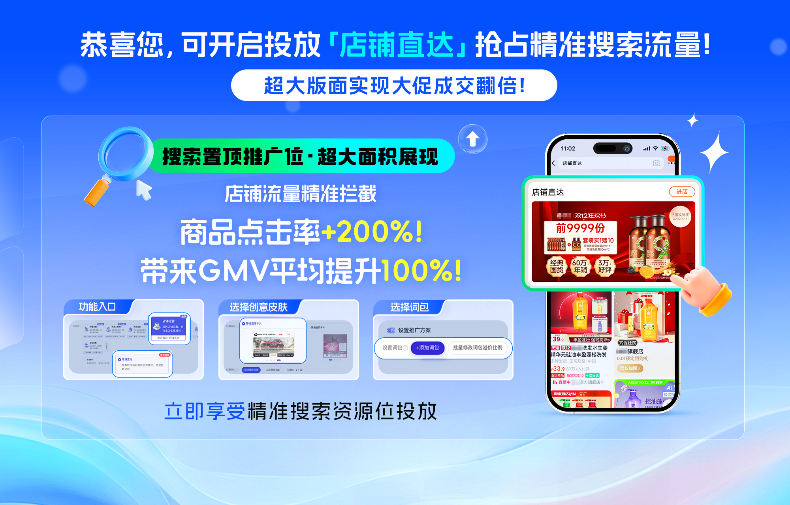

# 店铺直达最常见9大问题

> 来源：https://alidocs.dingtalk.com/i/nodes/YndMj49yWjlAYoxjt0vQKnD1J3pmz5aA

## **1、什么是店铺直达？**

**搜索页的“官网入口”——****0 坑置顶资源位**，快速高效的店铺流量收割中心。通过实时竞价、展现CPM扣费获取淘内优质展位，展现店铺品牌调性、打爆店铺单品。

## **2、店铺直达可以买的词包括哪些？可以自己设置关键词吗？**

1）可投放：品牌词、品牌品类词。系统根据商家上传的品牌资质自动生成词包，商家需要配合自己的创意创建不同的计划进行投放。

2）支持商家在现有品牌词包中，个性化添加品牌词/品牌品类词进行投放，实现**种草-搜索-购买**的高效转化联动。添加路径：** 在店铺直达后台极简弹窗下单：在首页或场景页通过极简弹窗下单，即可领取自助化加词权益**。操作详情：

## **3、店铺直达计划如何创建？**

勾选☑️词包——添加创意，一键投放。

## **4、店铺直达词包的品牌词不够用可以再添加吗？**

同问题2

## **5、为什么我的店铺直达没有词包可以购买？**

## 店铺直达现**已全量开客，若您没有店铺直达入口，请排查**：1、首次开通需主账号登陆万相台无界；2、店铺需满足DSR在4.4及以上，店铺综合体验分在4.1及以上，淘宝店铺信用分3星及以上；3、店铺需满足近1年无界消耗>0（新店重点关注）；4、暂不支持专营店、叉乘账号；5、部分类目暂不准入，具体类目请查询，若显示展示场景不准入，则无法准入投放：https://rule.alimama.com/#/detail?id=11005606

## **6、店铺直达和明星店铺的区别是什么，会冲突吗？**

目前可投放资源位是一样的，店铺直达可以在无界直接使用，整体链路更便捷、效果更精准。

后续店铺直达会结合无界的能力上线更多新功能，投放的词和资源位都会更新，推荐大家可以多多

使用！

## **7、为什么我没有店铺直达**

同问题5

## **8、店铺直达的扣费方式是什么**

按照千次展现成本扣费，价高者得。

## **9、店铺直达如何编辑创意**

店铺直达提供了丰富的创意模版，商家需要选择适合自己营销目标的卡片模版。更多详情：
