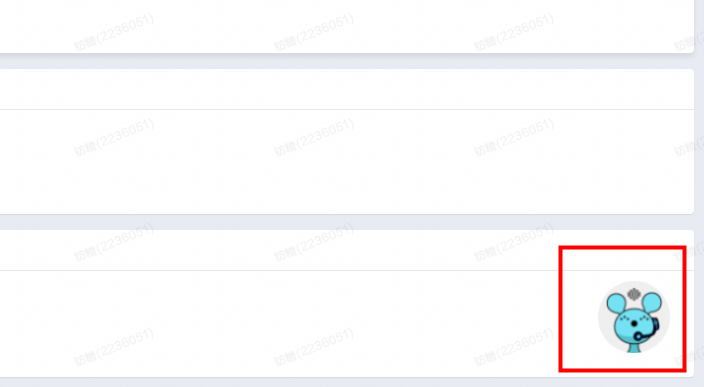

# 04-1-4 常见问题

> 来源：https://alidocs.dingtalk.com/i/nodes/YndMj49yWjlAYoxjtGywLRPeJ3pmz5aA

**原语雀文档链接：**https://yuque.antfin.com/chenchun.chen/gqhty9/dxmihwlqpga7n3q0

---

### 一、扣费逻辑

系统会根据您的投放计划来匹配与您营销目标相符合的人群，当流量通过超级直播的渠道点击进入直播间后，系统会对在您直播间停留3-5s以上的人群计费。此外，超级直播扣费遵循末次渠道归因，即转化周期内超级直播广告作为最后一个触点被消费者点击，该消费者才会算作被超级直播触达和扣费。

### 二、直播中控台数据不一致

直播中控台和超级直播数据后台的统计维度不一致：

**超级直播后台**记录的观看次数是有效观看，超级直播的很多资源位，比如猜你喜欢、直播广场的资源位是需要流量点击进入直播间才算一个有效观看，直播间上下滑动的资源位需要流量在直播间停留满5秒才算一个有效观看；

**直播中控台**统计的是所有的广告流量，包括「未被3秒计费」的上下滑流量。

建议投放超级直播的商家以超级直播后台报表数据为准。

### 三、消耗/成本异常

#### 一、计划跑不出去（即消耗过慢）

**先自查**
1检查余额和预算是否充足
2检查计划状态（如是否存在限制商品）
3尝试提高出价（建议提高至1.5元以上）
4尝试多勾选些平台精选人群

#### 二、计划消耗过快

**先自查**
1确认计划是否为均匀投放
2尝试降低出价（建议降低至0.8元）
3尝试少勾选一些平台精选人群

#### 三、成本异常

若商家发现照常投放，但观看成本显著提升，
**先自查**
1确认设置成本无误
2尝试提高单日预算（预算过少可能导致算法冷启动时间长，拿量成本高）

**若自查无问题，找客服提工单**
点击屏幕右下角，找客服，提交工单排查。

2 人点赞

2
