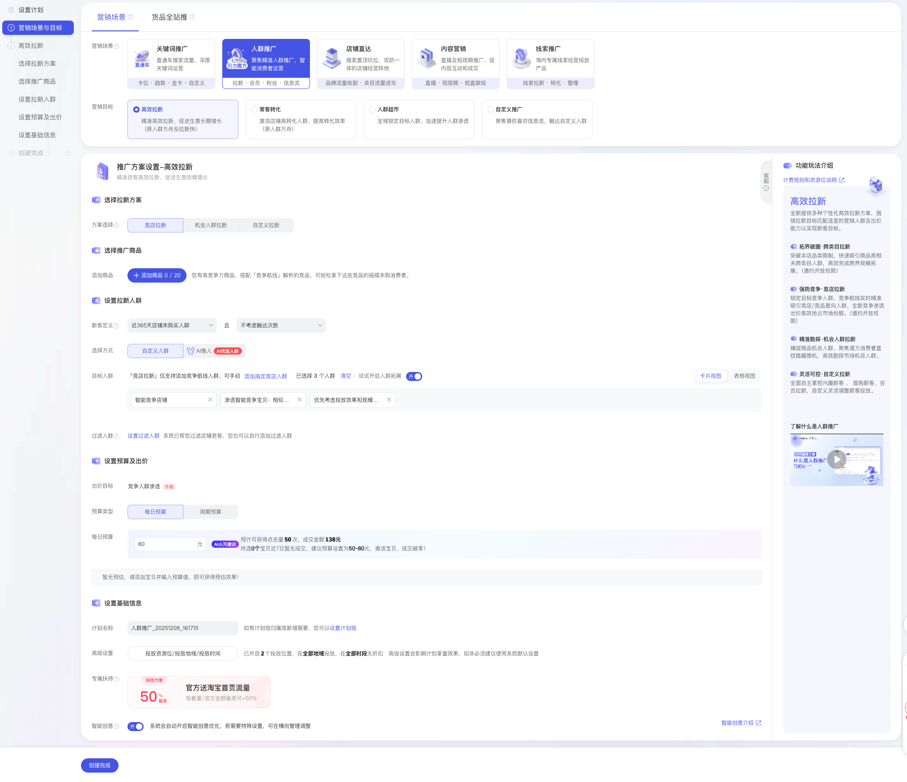
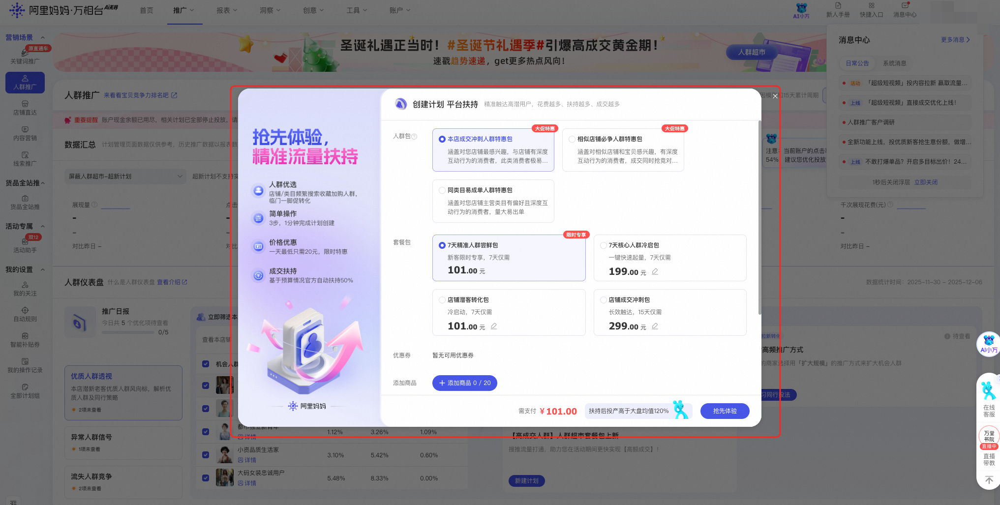
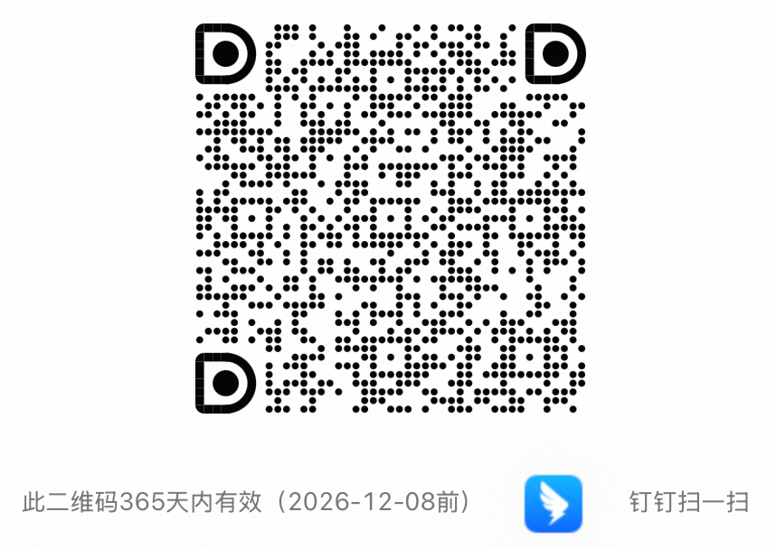

# 「专属扶持」人群推广新客及回归老客权益

> 来源：https://alidocs.dingtalk.com/i/nodes/YndMj49yWjlAYoxjtGywdEl9J3pmz5aA

为了帮助对于人群推广经验较少、投放效果不达预期的商家通过快速冷启动带来高效成交，我们特别推出了新客和回归老客的首单高额（消耗的 30%）流量扶持权益，同时围绕效果不佳的商家，在人群推广首页做了产品升级，支持您极简下单快速创编。

# 一、权益介绍

**覆盖商家类型**：人群推广新客户、回归老客户。主要包含以下商家：

从来没有使用过人群推广的商家

近 30 天未在人群场景有花费的商家

**核心权益详解**：

**30%流量扶持计划**：您可以在万相台 ai 无界版 PC 端--人群推广新建路径中创建计划，首单必得 30%流量扶持。（下方可查看流量扶持券，如属于上述商家范围，但并无扶持卡券可联系官方同学反馈）

**扶持生效**：上述商家在创建计划并产生花费后，平台将会自动针对您的推广计划发起流量扶持，无需手动领取扶持券，扶持情况您可在人群推广计划列表页面查看。

**特别权益**：上述商家在人群推广选择人群页面，可获得专属「关键词人群」定向能力，可定向本店、竞店、类目核心搜索词人群。

**惊喜权益**：平台针对上述商家进行首单流量扶持之后，如判断您的计划/商品/店铺有成交潜力，还会给您在人群推广首页触发「首单/第二单/第三单」惊喜人群套餐包流量扶持极简下单弹窗。

# 二、操作路径

| 权益 | 路径 | demo |
| --- | --- | --- |
| **首单流量扶持** | 进入万相台 AI 无界版电脑端，点击左上角「新建计划」或点击「推广-人群推广-创建计划」进入【人群推广新建计划流程】，即可在最下方看到扶持权益说明。 扶持计划不限优化目标和出价类型。无论是拉新还是转化计划均可生效，您可以自由选择人群推广不同的营销目标和解决方案。 快捷链接：<点击此处> |  |
| **专属人群权益** | 进入万相台 AI 无界电脑端，在人群推广选择人群页面，可获得专属平台精选人群-核心搜索关键词人群权益。 |  |
| **惊喜人群包权益** | 进入万相台 AI 无界版电脑端，点击「推广-人群推广-创建计划」进入【人群推广首页（计划管理页面）】，即可自动触发流量扶持极简弹窗。 平台会根据您的店铺/商品/推广情况随机发放首单、二单、三单权益，请及时查看。 快捷链接：<点击此处> |  |
| **查看扶持情况** | 在人群推广首页计划列表，即可查看。 |  |

# 三、沟通更多

##### 如有其他问题可进群沟通

——钉钉扫码进群

