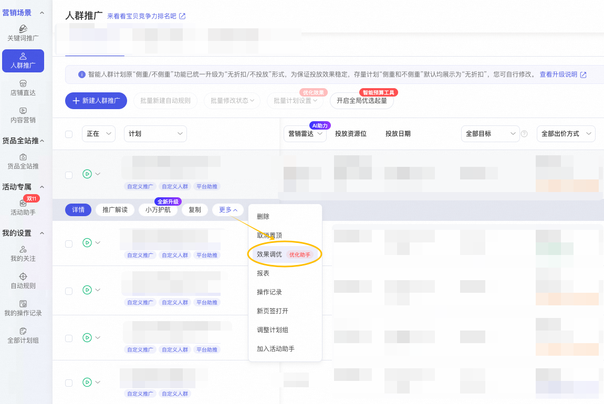
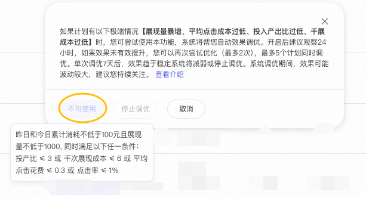
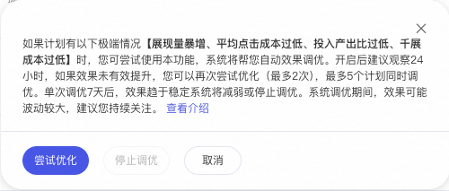

# 智能计划“流量校准”升级介绍

> 来源：https://alidocs.dingtalk.com/i/nodes/YndMj49yWjlAYoxjtMlawdRAJ3pmz5aA

**担心计划“首猜、购中、购后”的核心流量偏低？**

**智能出价“千展成本”偏低，计划跑偏？**

**智能出价“点击成本”偏低，计划跑偏？**

**智能出价“ROI”偏低，计划跑偏？**

**担心计划投放不稳定，“展现”突然暴涨？**

**不用担心！智能计划的“流量校准”能力来啦！**

# **功能入口（****注意：需按计划并点击“更多”按钮进入弹窗，查看能否调整****）**

1、在人群推广的计划横向页面的“智能计划”下**“更多”**按钮中寻找**“效果调优”**入口

2、在人群推广的计划横向页面的“智能计划”下**“更多”**按钮中寻找**“效果调优”**入口

若该计划未达到条件（*条件：昨日**和今日累计消耗不低于100元且展现量不低于1000, 同时满足以下任一条件：投产比 ≤ 3 或 千次展现成本 ≤ 6 或 平均点击花费 ≤ 0.3 或 点击率 ≤ 1%*），则**按钮置灰，功能不可用**

若**按钮为蓝色可用**，您就可以为该计划开启“流量校准”啦

# **FAQ**

本次升级的基础原理是什么？

若目标计划可被调整优化，平台会从计划的流量维度进行整体优化，例如：**增加核心场景拿量（如首猜、购后、全屏微详情）**

本次升级使用范围如何？

一个店铺**最多可以有20条计划**参与调控，一条计划**最多可调控2次**（若首猜调控效果不及预期，可再调控一次）

哪些计划可参与调整优化？

本次升级覆盖所有“智能出价“的计划，**当计划效果符合要求才可参与调控**，请以后台展示为准
