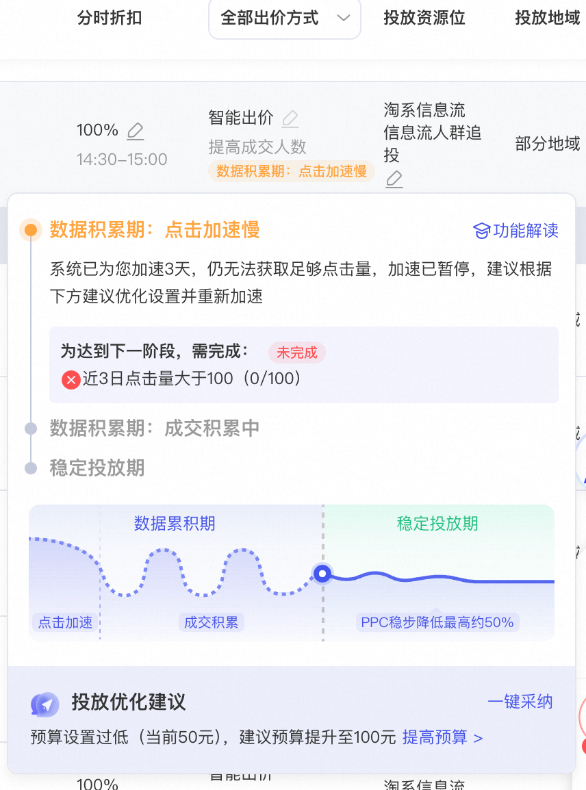
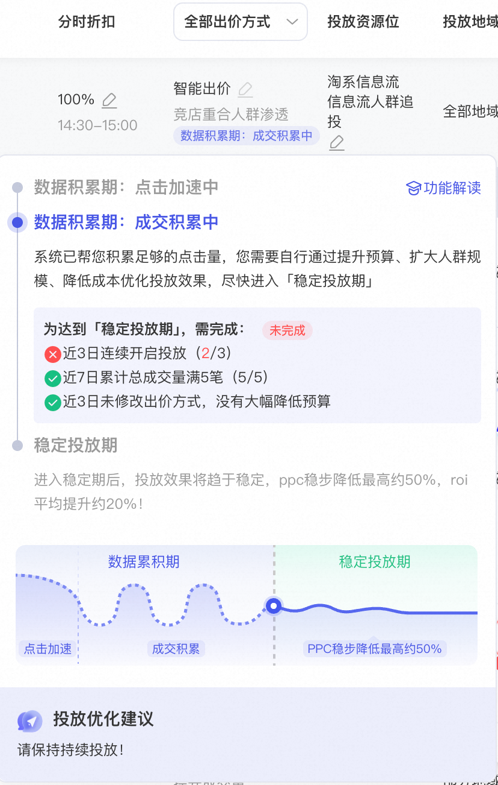
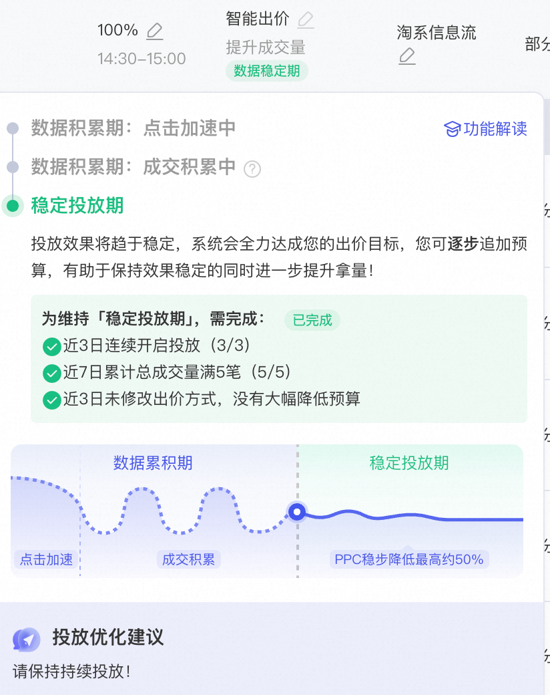

# 人群推广“投放阶段”详细解读

> 来源：https://alidocs.dingtalk.com/i/nodes/YndMj49yWjlAYoxjtXjj5j6oJ3pmz5aA

为了帮助商家更好的了解计划当前投放阶段，判断和调整投放，新建或者在投的人群推广计划，平台会透出计划投放阶段，目前分三个阶段：**数据积累期（点击加速中）、数据积累期（成交积累中）、稳定投放期**。

同时，本次升级已覆盖所有“持续推广”计划，只要该计划保持推广状态且有消耗即可获得平台“投放阶段”的解读

# **各阶段解读**

**数据积累期（点击加速中）**

当计划处在图示阶段（数据积累期，点击加速中），**完成该阶段需完成“近3/7日点击量大于100”的要求（最大化/手动出价为3天，控成本/控ROI为7天）**；当本阶段要求完成的次日，状态会转换；当本阶段的状态超3/7天未转换，则进入“点击加速慢”，同时平台会给出相应提升建议

同时该阶段会有**“平台冷启动”策略**助力，帮助新建计划快速度过冷启动期

**数据积累期（成交/加购/点击 积累中）**

当计划处在图示阶段（数据积累期，成交/加购/点击 积累中），**完成该阶段需完成平台图示的要求**；当本阶段要求完成的次日，状态会转换；当本阶段的状态超7天未转换，则进入“积累慢”，同时平台会给出相应提升建议；具体要求如下

|  | **成交** | **加购** | **点击** |
| --- | --- | --- | --- |
| **进入下一状态** **门槛** | 过去7天成交量 >= 5 | 过去7天加购量 >=15 | 过去7天点击 >=100 |

**稳定投放期**

当计划处在图示阶段（稳定投放期），表明计划已达到稳定期，保持投放即可

