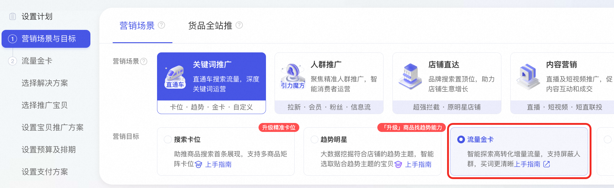
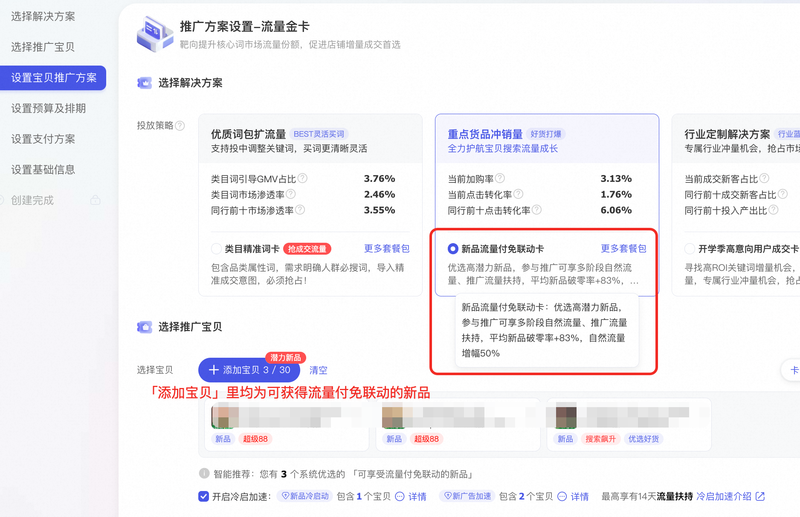

# 新品流量付免联动卡

> 来源：https://alidocs.dingtalk.com/i/nodes/ZX6GRezwJlzeYoPLFk5OE6owWdqbropQ

**一句话了解：流量金卡-新品流量付免联动卡**

优化新品流量机制，针对高潜力的新品，投放新品流量付免联动卡，可获得**多阶段自然流量扶持**，自然流量平均增幅50%+；同时默认开启冷启加速、获得推广流量扶持，更快获取新品成交量

### **使用指南**

**投放门槛：**选择「新品流量付免联动卡」，「添加宝贝」tab里的宝贝新品，投放后均可获得自然流量扶持。

**投放入口：****>>点击投放**

**如何获得自然扶持：**

投放该金卡，系统会**自动报名「潜力新品冷启」自然流量扶持**

金卡投放5天后，可**手动报名「主推新品打爆」自然流量扶持** **>点击报名** *需选择商业化方式报名

金卡投放结束后，如果新品处于上架21天内，且搜索渠道GMV达标等，可报名「搜索冲顶」自然流量扶持 >点击报名

### **常见疑问**

疑问：为什么「新品流量付免联动卡」没有可选宝贝/我没有这张金卡的权限？
**回答**：目前仅部分高潜力的新品才可投放、获得自然流量扶持。建议选择其他投放方式培养宝贝、加大上新力度，并定期关注「新品流量付免联动卡」进行投放

疑问：流量金卡支持投放期间修改/暂停/退款吗？
**回答**：金卡结合商品、流量情况做了定制、创建后会算法会提前预估情况做匹配机制、中途不支持修改预算、暂停推广。如果特殊情况需要退款、需要等投放48小时后才可以操作。且投放中算法会逐步优化投放策略、建议投放2-3天后再观察投产情况。

​

疑问：为什么金卡的出价比较高？

**回答**：因为金卡底层基于其他在投计划的投放拿量情况(看其他计划看买了哪些关键词、覆盖哪些出价段的流量)，去拓展未买的词、未覆盖的出价段流量，拿到额外增量。

因此商家无需担心金卡比其他计划cpc高的问题，因为金卡带来的增量ROI基本不会低于其他已投计划。

疑问：为什么一天内计划的消耗拿量不太均匀？
**回答**：因为金卡基于其他在投计划的投放拿量情况、大盘流量变化情况、去找增量。存在其他计划拿量变多/减少、大盘流量波动的情况，对应金卡也会及时调整拿量、所以无法保证一天24小时均匀消耗，但会在结合流量、效果情况下尽量做到消耗均匀。

疑问：为什么不支持每天设置不同的预算？
**回答**：金卡产品底层结合货品、流量情况，底层算法会最合理的分配预算来保障获取增量流量及成交。如果商家自定义频繁修改预算、会造成ROI的不稳定、甚至下降。

疑问：同一个宝贝能重复创建新品流量付免联动卡吗？
**回答**：同一个宝贝可以重复创建，但无法重复获得扶持。

疑问：预算没花完如何退款？
**回答**：如果投放周期结束，总预算尚未花完，未花完预算将在订单投放结束的48小时内以现金形式解冻至账户余额。
