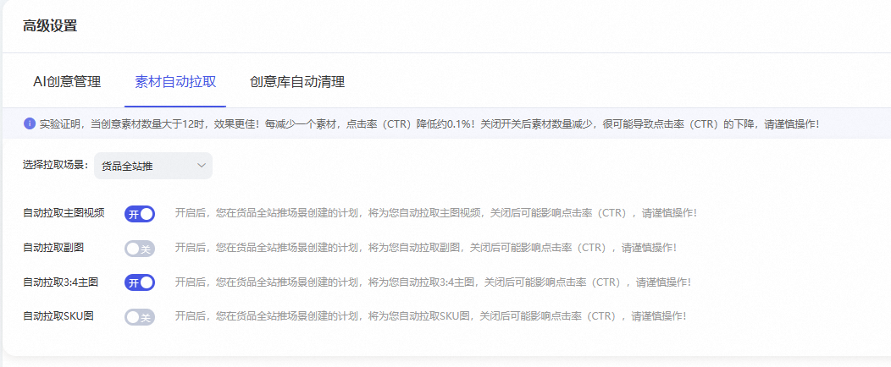

# 创意【高级设置-素材自动拉取】指南

> 来源：https://alidocs.dingtalk.com/i/nodes/ZX6GRezwJlzeYoPLFyBrAAb2WdqbropQ

创意升级后，为方便用户添加素材，提高创意多样性，在添加创意时系统会自动拉取商品主图、副图、3:4图、SKU图、主图视频，但不少用户表示，平时可能用不到某种类型的素材，导致每次都要删除，很不方便。
为此，我们开发了**素材自动拉取的高级设置**，您可以**自己决定需要系统拉取哪些素材**啦！
**目前本功能【货品全站推广】、****【精准人群】场景****已全量**

**操作路径：创意-高级设置-素材自动拉取-选择场景(货品全站推广)**

**注意：**
1/若开关开启，则会自动拉取相应的素材；若关闭，则不会自动拉取~

2/设置后长期有效！无需反复操作~

**3/按钮开启和关闭，****仅对新增计划生效****。历史计划需要停止投放，新建一个哦 ~ **

4/经实验验证，素材数量越多，点击率越高，系统鼓励上传更多的素材！

**举个例子：**

|  | 设置示意图 | 添加创意时的效果 |
| --- | --- | --- |
| 【自动拉取SKU图】打开 |  |  |
| 【自动拉取SKU图】关闭 |  |  |
