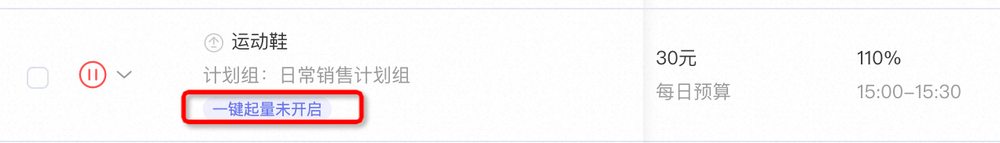
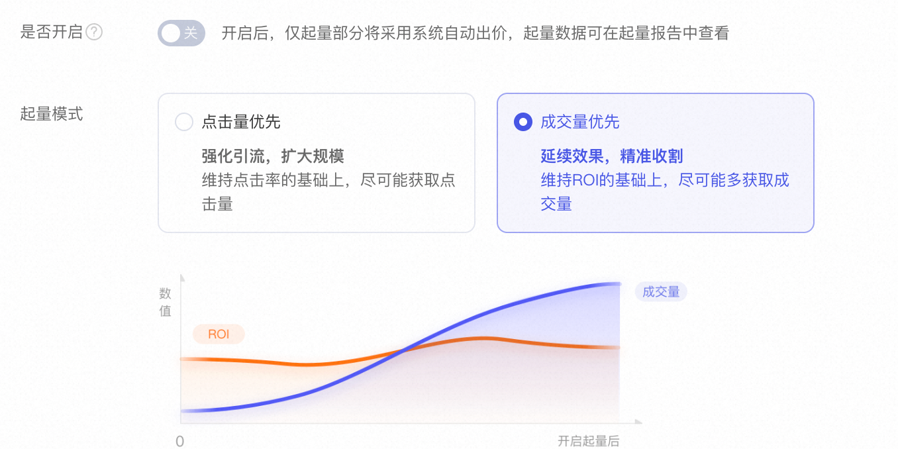
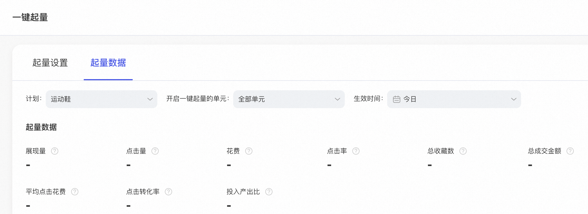

# 一键起量

> 来源：https://alidocs.dingtalk.com/i/nodes/ZX6GRezwJlzeYoPLFyBrAoZZWdqbropQ

**原语雀文档链接：**https://yuque.antfin.com/chenchun.chen/gqhty9/pi3f1b3fiowv5147

---

# **功能背景**

在过去一段时间，对于时效性要求很强的场景下拿量，比如季节性货品/大促期等等，并没有特别好的手段解决。

另外一个养好的计划如何能稳定的持续投放目前并没有特别高效的手段，过去出现过可能因市场波动等各类原因导致点击率或者投产出现波动，导致花费了大量心血养成的计划报废。

# **功能价值**

一键起量，给关键词推广手动计划配上了“自适应巡航”的能力。在投放手动出价计划时设置一键起量开关，即可进入起量模式。**一句话来说，一键起量是维持手动出价原买词设置不变的基础上，额外拿量，提升计划点击量/成交量。**

一键起量有三个特点：

**1. 不换道。**开启一键起量的手动出价计划的词路就是起量的词路，遵循计划的买词设置，不额外扩词；

**2. 不抢量。**开启一键起量的手动出价优先，不抢量，做的是增量；

**3. 双模式满足不同诉求。**维持点击率/roi下的拿量模式，可提升计划的拿量能力。

# **常见玩法介绍**

1.计划养成

当点击率达到自身目标时，通过一键起量高效的维持计划指标，保障计划的核心指标的稳定性。

2.季节性产品快速起量

新品冷启动+一键起量

3.大促场景下的短时间内拿量

在不同时间点，可以根据自身投放的目标采用高效的流量模式。需要成交量的时候使用成交量模式，需要点击量的时候使用点击量模式。

# **相关概念介绍**

| 名词 | 解释 |
| --- | --- |
| 一键起量 | 一键起量是基于关键词推广手动计划提供的推广模式 开启一键起量后，系统会基于原手动出价计划设置的词，围绕点击量优先或成交量优先等目标进行拿量，最终生成一份起量的报告。 |
| 一键起量-点击量优先模式 | 在维持点击率的基础上尽可能获取点击量。点击率是该计划开启起量前1日的点击率； |
| 一键起量-成交量优先模式 | 在维持ROI的基础上，尽可能获取成交量。ROI是该计划开启起量前1日的ROI； |
| 一键起量生效 | 一键起量需要计划满足条件后，才可以生效。否则即使开启了一键起量，不满足以下条件也不会生效。 **一键起量启动的条件：** 1.开启一键起量按钮且达到生效条件 **生效条件如下:** 1.开启前1日，日消耗20以上的准计划才可以生效 |

# **逻辑说明**

一键起量是基于商家原有计划的投放模式，可以简单理解为原手动出价计划是主计划，一键起量是子计划。但是子计划不会喧宾夺主，不会抢主计划的量。

| 类别 | 手动出价计划 | 一键起量 |
| --- | --- | --- |
| 词 | √ | √，沿用主计划设置的词 |
| 创意 | √ | √，沿用主计划设置的创意 |
| 人群 | √ | 智能调整 |
| 出价 | √ | 智能调整 |

一键起量提供了点击量优先模式（在维持计划点击率的情况下拿量）和成交量优先模式（在维持计划ROI的情况下拿量）

# **如何操作**

1）找到要开起量模式的计划，点击一键起量设置

2）设置一键起量的模式，提供了点击量优先和成交量优先两种模式

3）查看数据报告

# **注意事项**

1.什么时候可以开启？

建议计划优化到自己满意的程度后，可以通过开启一键起量，提升计划的拿量能力。

2.开启一键起量的计划门槛是什么？

开启前1日，日消耗20以上的计划

3、一键起量开启后为什么扣费较高？

一键起量产品定位是在一定时间范围内保障ctr/roi水准的前提下，尽可能的帮客户拿更多的量。这种前提下需要提高ppc，争取在优质流量上提高出价，所以出价可能大于客户原始设置出价。建议客户开启一键起量的周期长些，多观察下效果

4、一键起量开启后预算设置问题 建议客户开启一键起量之前，将计划日预算设置在合理范围，一键起量花费的比例和预算相关，预算设置越高，一键起量花费的也越多

# **联系方式**

商家群-钉钉号：31685016877
