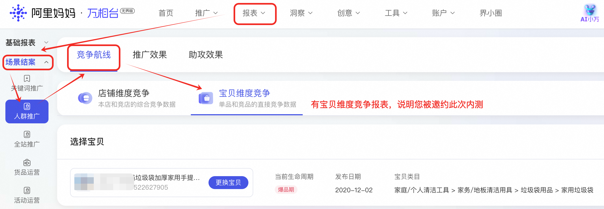
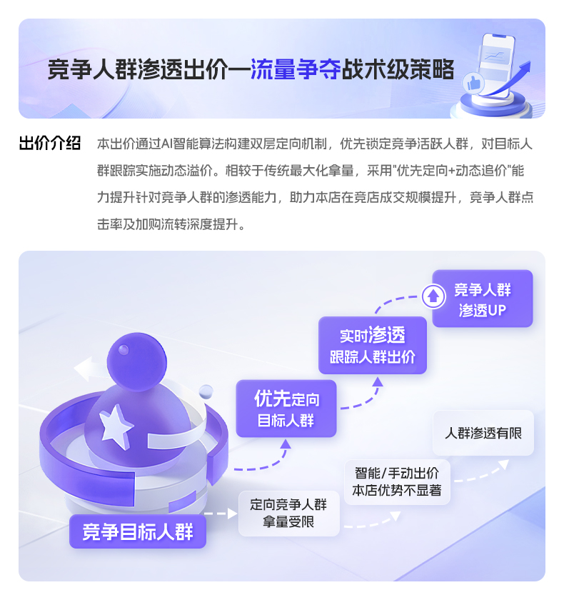

# 🔥竞争航线2.0：全链路竞争策略上线！0门槛开放自定义竞争！

> 来源：https://alidocs.dingtalk.com/i/nodes/ZgpG2NdyVXRmQ0jgC3LykyOP8MwvDqPk

## **复制头部经验，大促竞争快人一步！**

---

## **「竞争航线2.2」能力升级&大促攻略**

---

## **「竞争航线2.0」能力简介：**

👍 **竞争航线2.0再升级！2.1版本全面强化【自定义竞争】玩法！**

**🧮 量化竞争优劣势，知已&知彼，方可攻守兼备。**

| **知己：新增本店****「竞争力宝贝」****推荐** **点位**：竞店拉新*方案下，新增「竞争力宝贝」选品推荐； * 竞店拉新仅支持**M3以上**商家申请，填写右侧问卷**《申请竞店拉新权限》** **推荐原理**：将宝贝与同类目商品池进行竞争优劣势评估，并量化竞争力分数，分数高的宝贝更具竞争优势。 **投放锦囊**：推荐您优先采纳竞争力排名靠前的宝贝，用于竞争拉新推广更高效。 | **知彼：新增****「竞品探测」****与****「竞店流失风险」****预警** **点位**：种子人群-竞争航线-**自定义竞争宝贝/店铺**： **推荐原理**： **竞品探测：**基于同类目宝贝竞争力排名，每日为您探测最需关注的竞品；按竞争力排名排序。 **竞店流失风险：**近30天通过「自定义竞店」追踪本店人群的同/跨类目店铺，基于近30天的流失成交金额量级排序。 **投放锦囊**：推荐您取竞争优势宝贝，搭配推荐竞品/竞店人群，最大化竞争拉新效能，轻松拿下竞争目标的摇摆未购人群！ |
| --- | --- |

| **体验优化**：告别某店铺/商品因推广数据稀疏，无法在自定义竞争中检索选中的问题。 对竞争宝贝/店铺数据库全面扩展！数十亿淘系**在售商品现均可自由检索，并锚定投放**。 |
| --- |

**📣 2.1版本现已全量****！！！答疑请加钉群**：**128800014154**

## **‼️****「竞争航线2.0」****现已全量开放****‼️**

*重点攻克以下1.0时期难题**：*

*· 我适合玩竞争吗？ · 怎么解锁自定义竞争？ · 我最应该和谁竞争？ · 竞争人群投放效果更好吗？*

👋 👋 👋

全新AI大模型驱动，打造**竞争专属****【解决方案-选品-选人-出价-报表】****投放链路**。

全量**取消自定义竞争门槛**，打造公平竞争新战场！

「竞争航线2.0：全链路竞争策略」助力您玩转竞争人群，市场竞争稳操胜券！

**📣「竞争航线2.0：全链路竞争策略」即日全量开放****，答疑请加钉群**： **81615032823**

注：我怎么知道自己升级成功？若您的竞争航线报表有【宝贝维度竞争】，说明您已升级至2.0。

---

| 🎉 **「竞争航线2.0：全链路竞争策略」**升级点一览～～ |  |  |
| --- | --- | --- |
|  | **竞争航线2.0：全链路竞争策略** | **竞争航线1.0：竞争人群策略** |
| **​营销方案**** ****NEW**** ** | 新增**竞争专属营销方案**：竞争机会品+竞争人群+竞争出价，轻松锁定高价值竞店新客！ 入口：新版人群推广--高效拉新--**竞店拉新**（ps：仅妈妈m3以上客户有此权限） | *无 * |
| **选对人** | **取消自定义竞争门槛**！！全量商家可投自定义竞店/竞品！！ 入口：新建计划--种子人群--竞争航线--**自定义竞店/竞品** | *全量商家可投智能竞店/竞品人群*；*人群推广***双周花费满 5k***，可解锁下一双周***自定义竞争人群。** |
| **选对竞品 ****NEW** | **AI洞察宝贝竞争力**：基于竞争成交/竞争成本/竞争渗透，评估本店宝贝竞争排名，并为您识别最具威胁的竞品！ 入口1：报表--人群推广--竞争航线报表--**宝贝维度竞争**--**货品竞争力洞察** 入口2：人群推广计划管理页--计划详情--推广解读--**竞争解读--****货品竞争力洞察** 入口3** NEW**：种子人群--竞争航线--自定义竞品--推荐竞品 | *无* |
| **出价 ****NEW** | 全新**竞争渗透出价**：对竞争人群截流锁定→预估转化→动态溢价，大幅提升竞争人群渗透！ 入口：新建计划--高效拉新--竞店拉新/自定义新客--**选择竞争人群****（必选）**--**竞争渗透出价** | *无* |
| **数据报表 ****NEW** | 全方位**竞争追踪结案**：追踪竞店/竞品数据全息呈现+被竞争流失预警，帮您实时掌控竞争战局！ 入口1：报表--人群推广--竞争航线报表--**店铺维度竞争/宝贝维度竞争** 入口2：人群推广计划管理页--计划详情--推广解读--**竞争解读****（仅竞争出价计划）** | *投放***自定义竞店/竞品***后，可在报表查看**指定竞店/竞品人群投放汇总数据**；少量商家可解锁***被竞争数据***。* |

---

# **「竞争渗透出价」能力简介：**

## **‼️**** ****「竞争渗透出价」****重磅上线 ****‼️**

🤔 竞争航线效果还不错，但是我在竞争人群的渗透如何呢？

🤨 智能出价转化的都是本店深度行为人群，手动出价又抢不过竞对？怎么出价竞争效果更好？

**🎉 全新****「竞争渗透出价」****现已上线人群推广！**

** 🔍 产品点位如下：**

| **「高效拉新」**新增 **竞争人群渗透出价** 注：仅**高效拉新**-**竞店拉新**/**自定义拉新**，及**自定义推广**支持选择「竞争人群渗透」出价。 | **「常客转化」**新增 **竞店重合人群渗透出价** 注：仅**常客转化**-**人群资产转化**/**自定义老客**支持选择「竞店重合人群渗透」出价。 |
| --- | --- |

** 👏 ****小二准备了以下竞争方案，助力您高效竞店突围，兼顾本店防守！****👏 **

**竞店突围**：**高效拉新**+**竞争航线**+**竞争人群渗透出价****= ****渗透竞争新客，贡献更多新客成交**

**本店防守**：**常客转化**+**竞争航线**+**竞店重合人群渗透出价****=****稳扎本店成交，防止老客流出竞店**

---

## **竞争航线1.0操作指引见：**
