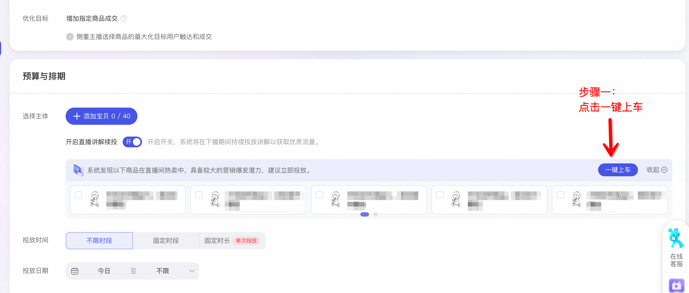
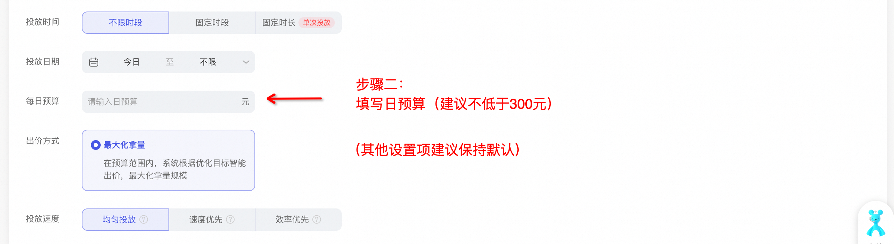
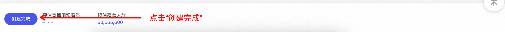

# 商品打爆“热播好货”投放说明（内测中）

> 来源：https://alidocs.dingtalk.com/i/nodes/ZgpG2NdyVXRmQ0jgCEwGleaZ8MwvDqPk

**原语雀文档链接：**https://yuque.antfin.com/chenchun.chen/gqhty9/gaeya3qm7r1p9cb0

---

### 🔥天猫双11 · 让好货 更热播🔥

#### “热播好货”功能介绍

「超级直播-商品打爆」推出**直播间好货识别与一键下单**功能，助力商家**激发更多优质货品的成交潜力**，利用直播间热销氛围优势**提升货品转化ROI**，实现**更多货品热销爆卖**！双11期间投放“热播好货”，可享受最高**50万PV**的超直券流量奖励！

**什么是“热播好货”？**

系统为您优选出 “直播间内近7天销量和GMV达到一定标准，并且在直播渠道转化表现更出色，同时剔除了购物金、小样、赠品等链接” 的商品，这些商品具有较强的货品力和营销潜力。

**为什么要投放“热播好货”？**

一个直播间可能会有数十件甚至上百件商品，分散营销不利于发挥 “拳头产品” 的竞争力优势。投放“热播好货”可以将预算集中在竞争力最强的10~20款商品上，提升引流效率与成交转化！

**我已经投放了3~5款核心货品，为什么要投放更多“热播好货”？**

单一货品的潜在购买人群是有限的，过度的预算集中可能会带来ROI的下滑。投放更多“二梯队货品”，充分激发营销潜力，能够为直播间带来显著的ROI提升与成交增量！

#### “热播好货”投放指南

方法一：进入超级直播首页，根据下方提示创建计划。直达链接>>

方法二：进入超级直播计划创建页，根据下方提示创建计划。直达链接>>

#### 双11“热播好货”投放奖励（即将上线）

【活动时间】10月8日-11月11日

【面向人群】直播间内至少有1件 “热播好货” 的天猫商家（淘宝商家及达人需单独申请开白）

【参与方式】本活动无需手动报名，满足条件的商家自动参与，活动钉群99520002800

【活动入口】万相台无界版-超级直播首页

【入口链接】https://one.alimama.com/index.html#!/manage/content

【活动规则】10月8日-11月11日，通过超级直播商品打爆工具，投放“热播好货”：

金额满100元，发放超直券PV=300观看

金额满1万元但小于10万元，发放超直券PV=投放金额*15%

金额满10万元但小于100万元，发放超直券PV=投放金额*20%

金额满100万元，发放超直券PV=投放金额*25%，封顶奖励50万PV

【奖励说明】

发放时间：达成目标后，平台将在11月20日前发放超直券奖励，有效期30天。

发放形式：超直券是超级直播面向商家发放的「流量激励卡」。商家通过完成各类投放任务，可以获得任务对应面额的超直券奖励。商家开播期间，在超级直播后台花费1元下单使用超直券，即可向直播间引入面额对应的观看量，2小时内引流完毕。超直券流量以泛精准种草人群为主，有助于提升场观数、直播间互动。

注意事项：①由于客户未开播、提前下播等主观原因导致超直券投放结束，未释放的流量不退还；②逾期未使用的超直券将自动作废，平台不予补发。
