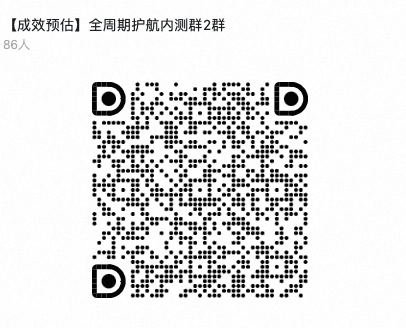
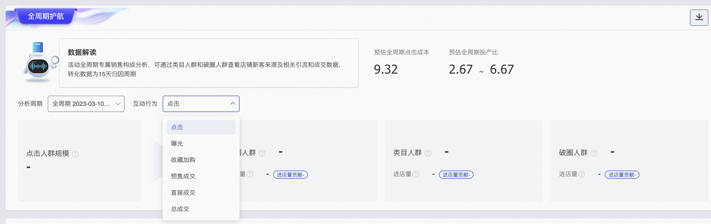

# 05-2-1、交付活动周期PPC和ROI，上线持续推广能力，接入更多渠道，限量邀约中

> 来源：https://alidocs.dingtalk.com/i/nodes/a9E05BDRVQRkezKGCEwyxDnqJ63zgkYA

**原语雀文档链接：**https://yuque.antfin.com/chenchun.chen/gqhty9/ushw1dkzoaqu48ai

---

双目标交付进店规模&投产效率，投放效果更可控！

持续推广能力覆盖活动全周期，大促爆发更确定 ！

# 一、招商时间：10月10日～11月11日

# 二、投放时间：10月10日～11月11日

# 三、投放细则（投前必看，内测名单限量邀约中）：

| ​ | **算法策略保障** |
| --- | --- |
| **报名时间** | 限量邀约中 |
| **报名方式** | **加入钉群：群号：32010028118，群文件填表报名** |
| **可投放时间** | 限量邀约中 |
| **可投放档位** | 单计划最低**5000**起 |
| **可投放商品** | 算法入围商品，**推荐双十一报名商品**，单计划可支持1-10个商品 |
| **确定性保障** | 预估活动全周期进店成本保障预估活动全周期ROI范围计划支持自动延期 针对商家选择的投放商品和蓄水/爆发期费比，提供针对该金额、该投放范围内的PPC和ROI范围预估，算法会保障在设置的时间内完成投放效果指标 |

# 四、报名方式：**加入钉群：**32010028118**，群文件填表报名**

“【成效预估】全周期护航内测群2群”群的钉钉群号： 32010028118

**​**

# 五、操作介绍

### 1.选择场景

万相台首页选择“新建推广计划”，并在营销场景中选择“活动场景 - 全周期护航”**（仅开放给受邀商家）**

### 2.选择商品（未入池宝贝不可投放）

单计划可支持添加最多10个商品

### 3.设置活动全周期预算并调整蓄水/爆发期费用比例

### 4.获取全周期点击成本和投入产出比（调整投放宝贝和蓄水/爆发占比会影响到预估效果）

### 5.计划数据页面可查看不同人群的行为数据和效果数据（人群数据T+1更新）

# 六、商家案例

## 1、婴童用品-babycare旗舰店

618期间投放万相台「活动加速 - 全周期护航」升级场景，接入UD渠道后，进店成本较目标降低40%，全域蓄水极致爆发，超目标150%交付投放效率！

#

## 2、美容护肤- Olay官方旗舰店

olay官方旗舰店618投放万相台「活动加速 - 全周期护航」升级场景，接入UD渠道后，进店成本较目标降低40%+，全域蓄水极致爆发，超目标200%交付投放效率！

## 3、珠宝- 曼卡龙珠宝旗舰店

曼卡龙珠宝旗舰店618投放万相台「活动加速 - 全周期护航」场景，进店成本较目标降低10%，全域蓄水极致爆发，ROI超目标10倍交付！

#

## 4、大家电- ao史密斯官方旗舰店

ao史密斯官方旗舰店618投放万相台「活动加速 - 全周期护航」场景，进店成本较目标降低40%，全域蓄水极致爆发，投放效率提升近5倍！

#

##

#

#

#

#
