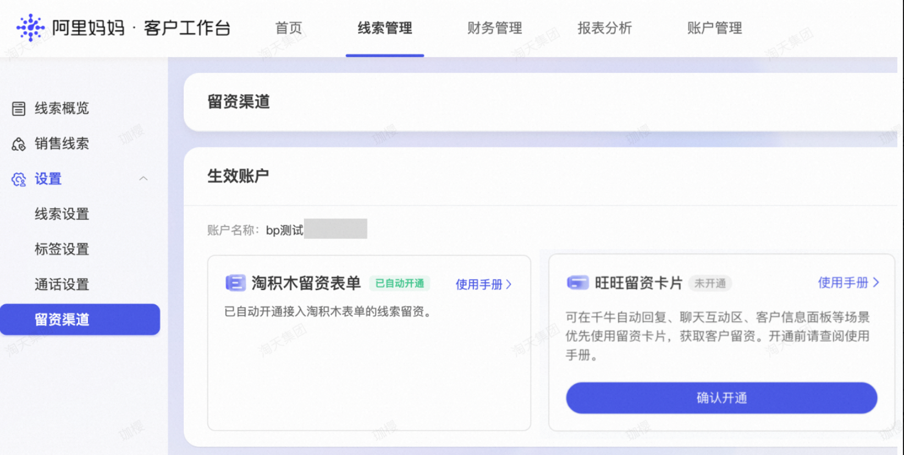
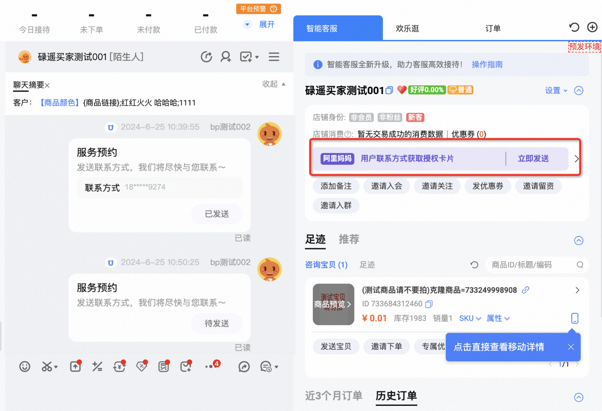
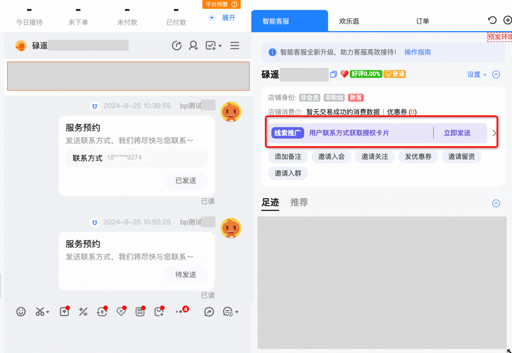
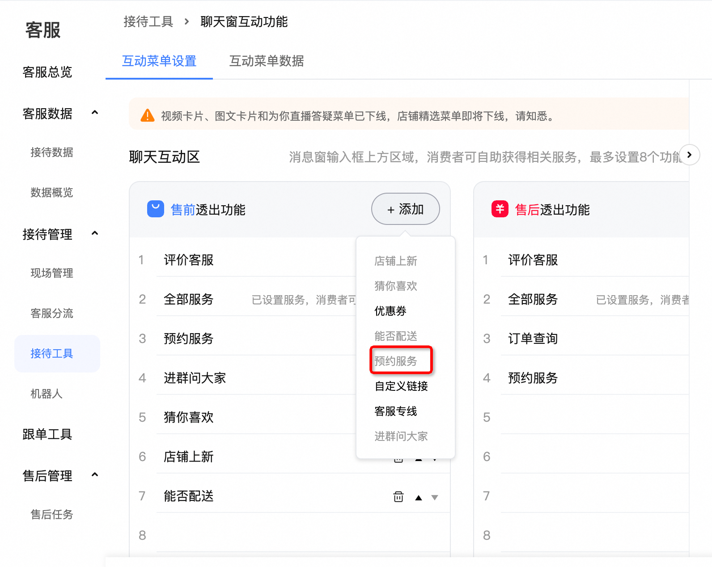
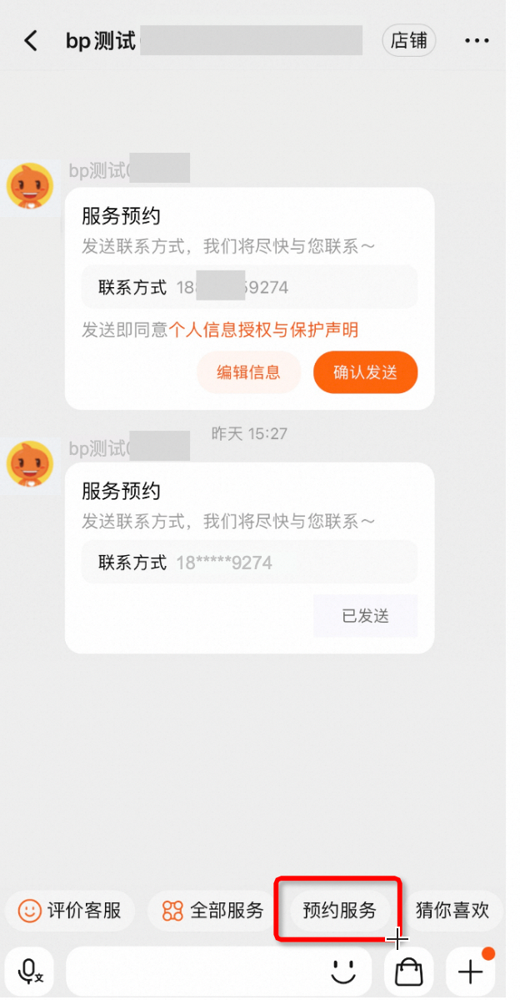
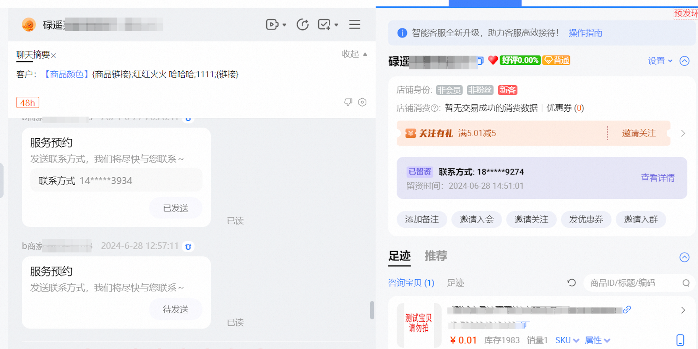
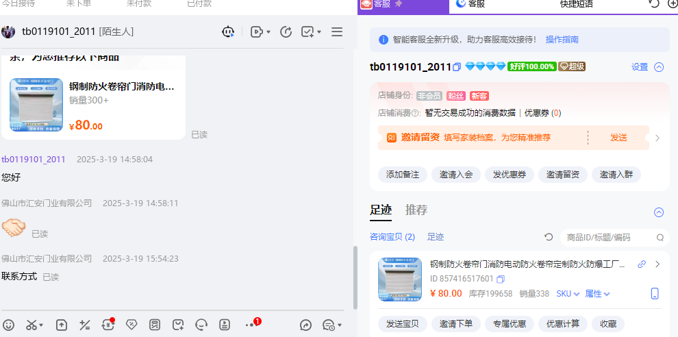

# 关于阿里妈妈线索推广商家对诱导第三方规则的常见问题解答

> 来源：https://alidocs.dingtalk.com/i/nodes/a9E05BDRVQRkezKGCjr2Xw92J63zgkYA

各位商家好，目前淘宝网正在严格治理“诱导第三方”违规行为，旨在营造更为良好的营商环境，保障交易安全、防范欺诈风险、维护诚信卖家及消费者的权益，后续将不允许在旺旺种引导发送微信、电话、外部链接，请各位商家自行排查，若有违规行为，及时调整，触发相关都有可能受到严重处罚。阿里妈妈-线索推广提供官方留资渠道（智能单品页、旺旺留资卡片），消费者通过这些渠道留下的手机号，全部签署过消费者信息授权协议，均为合规获取。只有使用线索推广的旺咨卡片/智能单品页，不会命中处罚，其余直接在旺旺语聊里直接要微信、电话均有违规风险！

请各位商家尽早配置旺旺留资卡片、智能单品页！

具体配置文档：

# **一、旺咨卡片如何开通权限？**

1）商家已经开通了客户工作台【线索管理】功能（报名链接：https://survey.taobao.com/apps/zhiliao/VENIUcIwa）

2）在阿里妈妈-【线索推广】场景消耗>0，次日12点生效，可以自动在客户工作台开通权限，进入【线索管理】-【设置】-【留资渠道】页面。在旺旺留资卡片下点击【确认开通】即可完成开通。

注意：开通后暂不支持取消开通，并会在千牛旺旺自动生效相应能力。请开通前确认。

线索推广新建计划入口：https://one.alimama.com/index.html#!/main/index?bizCode=onebpAdStrategyLiuZi

# **二、如何配置旺旺留资卡片？**

---

完成功能开通后，部分能力需要在千牛进一步配置生效。具体流程如下：

## 方式1：商家手动发送

是否需要在千牛配置：不需要、开通后自动生效

能力介绍：商家可以在客服聊天窗口手动向消费者发送留资卡片。消费者完成留资后，将在客户面板展示留资内容。点击查看详情即可跳转阿里妈妈客户工作台查看明文线索

消费者留资前：点击立即发送，消费者即可收到留资卡片。

消费者留资后：**聊天窗内的留资卡片**展示密文联系方式。**右侧客户面板**展示密文留资信息（留资后需要刷新）。点击查看详情，可以跳转客户工作台使用明文线索。

## 方式2：消费者手动触发

是否需要在千牛配置：是

能力介绍：消费者可以在聊天框点击【预约服务】，可以触发留资卡片。

**商家配置**

商家需要在千牛工作台【客服】-【接待工具】-【聊天窗互动功能】，售前和售后场景下，配置【预约服务】按钮。

**消费者使用**

商家完成配置后，消费者可以在客服聊天框点击【预约服务】，就可以触发留资卡片。

## 方式3：消费者语义识别

是否需要在千牛配置：不需要、开通后自动生效

能力介绍：消费者发送的话语里面包含“如何预约”、“如何联系”、“获取报价”、“获取资料”、“获取方案”这几个关键词时，会自动给消费者发送留资卡片。关键词暂不支持配置修改。

# **三、卡片的使用流程**

---

## **3.1消费者发送留资**

通过**商家手动触发、消费者手动触发、消费者语义识别**这3种方式，消费者都可以收到留资卡片并通过卡片留下线索数据。

| **step1:收到留资卡片** 默认填写消费者绑定的手机号码，提升留资效率 | **step2:修改联系方式** 默认手机号有误，可以点击编辑信息，在弹出的表单种修改信息。 | **step3:确认发送** 确认号码无误，点击发送，即可向商家发送手机号码。 |
| --- | --- | --- |
|  |  |  |

## **3.2商家查看留资**

消费者发送完线索后，商家可以在**千牛工作台**确认留资情况，在**阿里妈妈客户工作台**使用留资线索。

**千牛工作台**

如果消费者刚刚留资，右侧面板需要刷新才能显示留资结果

**客户工作台**

# **四、常见问题**

## **1、通过阿里妈妈「线索推广」工具留资后还能在聊天过程中要电话/联系方式吗？**

不可以，建议所有要电话的动作全部用旺旺留资卡片代替，语聊内容/欢迎语中不允许出现电话/联系方式/微信的文案内容，文案引导上可以试试说您预约下服务，我们安排技术和您对接。

目前在使用「线索推广」提供的官方留资渠道（旺旺留资卡片、智能单品页）获取消费者联系方式，不属于违规处罚的类型，其余其他通过任何非官方留资方式（如直接在旺旺语聊页面索要微信/手机号、通过外链引导到私域、发布其他付款方式，诱导消费者去第三方平台交易）将有可能命中平台违规类型。

消费者通过这些渠道留下的手机号，全部签署过消费者信息授权协议，均为合规获取。

*注：您通过阿里妈妈「线索推广」获取到的消费者信息均需在合理范围内使用，对违规使用行为，平台将加严加重处置。*

## 2、为什么在客户工作台看不到留资卡片的开通入口？

您刚刚才开始进行【线索收集】推广，需要在产生消耗的第二天12点后才能识别到您的消耗行为。请等到第二天再来开通。

## 3、是否支持在千牛手机端发送卡片？

暂不支持，会考虑后续迭代

## 4、是否支持消费者在飞猪收到卡片？

暂不支持，会考虑后续迭代

## 5、为什么我的旺咨卡片展示的是「邀请留资」？

邀请留资为特定行业提供的卡片，目前行业卡片和【线索推广】旺旺留资的卡片只会二选一展示。但是如果是从广告点击进来，使用新零售卡片的数据，会同步记录到妈妈客户工作台后台的。

## **6、其他问题咨询钉**群**：126565010742**
