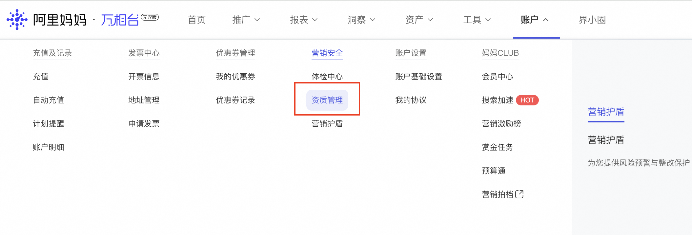

# 店铺直达商家准入要求&店铺资质相关

> 来源：https://alidocs.dingtalk.com/i/nodes/a9E05BDRVQRkezKGCy4o5zqQJ63zgkYA

#### **1、店铺直达商家准入有哪些要求？**

专营店、供应商账号、叉乘账号暂时不支持投放店铺直达。

**2、淘宝商家和天猫商家需满足以下规则：**

| **淘宝商家** | **天猫商家** |
| --- | --- |
| 店铺信用等级**三星级及以上**，如下图 淘宝店铺投放店铺直达时，需提供**商标注册证（R标）** 店铺每项DSR在4.4及以上； 其他规则见链接 | 旗舰店、专卖店 店铺每项DSR在4.4以上 其他规则见链接 |
| 店铺状态、用户状态正常且店铺主营类目在支持投放的范围内； |  |

3、店铺直达暂无权限如何申请？

各位商家好，店铺直达现已全量开客，后续无需申请开通场景权限。投放前请上传品牌资质（品销宝和天猫的资质会自动同步）没有品牌资质就没有词包可以投放。

若您未展现店铺直达入口，请排查：

1）先看有没有「用主账号登陆」，首次开通需主账号登陆万相台无界；

2）店铺需满足DSR在4.4及以上，店铺综合体验分在4.1及以上，淘宝店铺信用分3星及以上；

3）店铺需满足近1年无界消耗>0（新店重点关注）；

4）暂不支持专营店、叉乘账号；

5）部分类目暂不准入（如处方药、计生），具体类目请查询，若显示展示场景不准入，则无法准入投放：https://rule.alimama.com/#/detail?id=11005606

6）如何上传品牌资质？没有品牌资质就没有词包吗？

是的，词包是依据店铺上传的品牌资质自动生成并进行拓展的。**有资质->有词包->可投放**。

上传品牌资质步骤：

链接：https://one.alimama.com/index.html#!/account/qualification/index?bizCode=universalBP

需要商家在无界-账户-资质管理-新增资质-上传品牌资质，一般资质审核通过后4-6天生成词包~（注意：特殊情况下如果授权品牌词相关性较差将无法生成词包）。品牌资质要求如下：

a、商标注册证；

b、商标持有者的主体证明：若主体是公司就是营业执照，若主体是个人就是身份证正反面。

c、商标使用授权书：商标权利人(商标注册人)给店铺的销售及商标使用推广授权书。

**品牌资质具体的说明和示例参见：**https://rule.alimama.com/?spm=a2e117.13868764.0.da0f51bf8.193620305Kk3qC#!/product/index?spm=a2e117.13868764.0.da0f51bf8.193620305Kk3qC&type=detail&id=1074&knowledgeId=11003937

