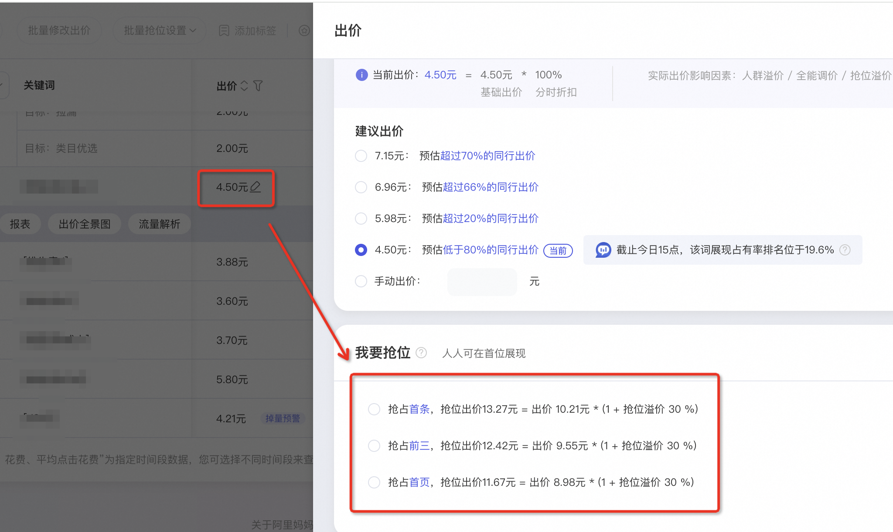

# 关键词推广【手动出价建议&抢位建议】升级

> 来源：https://alidocs.dingtalk.com/i/nodes/amweZ92PV6DbOdgzUZpKnwRw8xEKBD6p

**原语雀文档链接：**https://yuque.antfin.com/chenchun.chen/gqhty9/bo63rvbmab5v2zdc

---

关键词推广【手动出价建议&抢位建议】升级，近期正在内测中，感兴趣的商家请进群填写内测报名表，内测名额有限，先到先得~内测钉钉群号：103850002400

# 一、出价建议

操作路径：关键词推广-手动出价计划-进入单元-选择一个关键词，点击修改出价，会出现出价建议

| 升级前【预估排名】 | 升级后【预估同行出价】 |
| --- | --- |
|  |  |

# 二、抢位建议

可抢位的位置有变化

升级前：抢占首条、抢占前二、抢占前三、抢占前六

升级后：抢占首条、抢占前三、抢占首页

​
