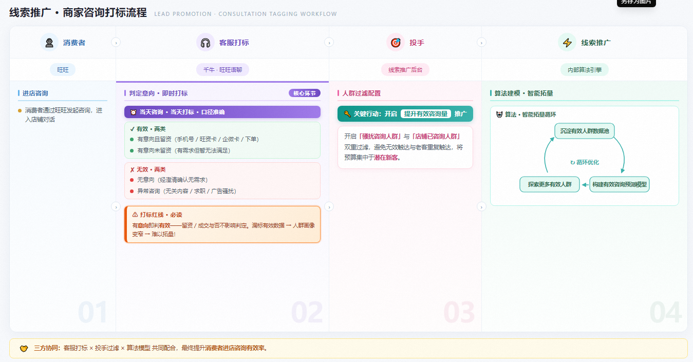
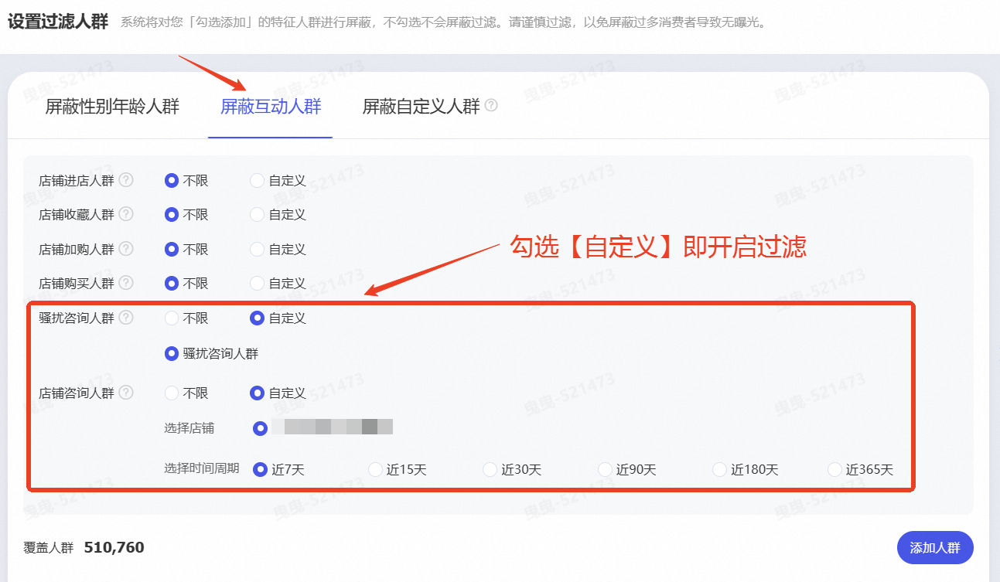
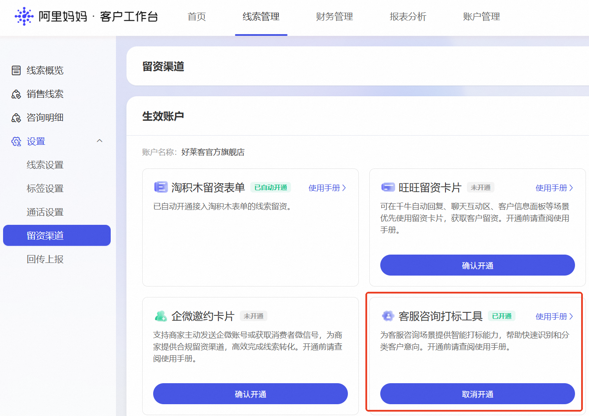
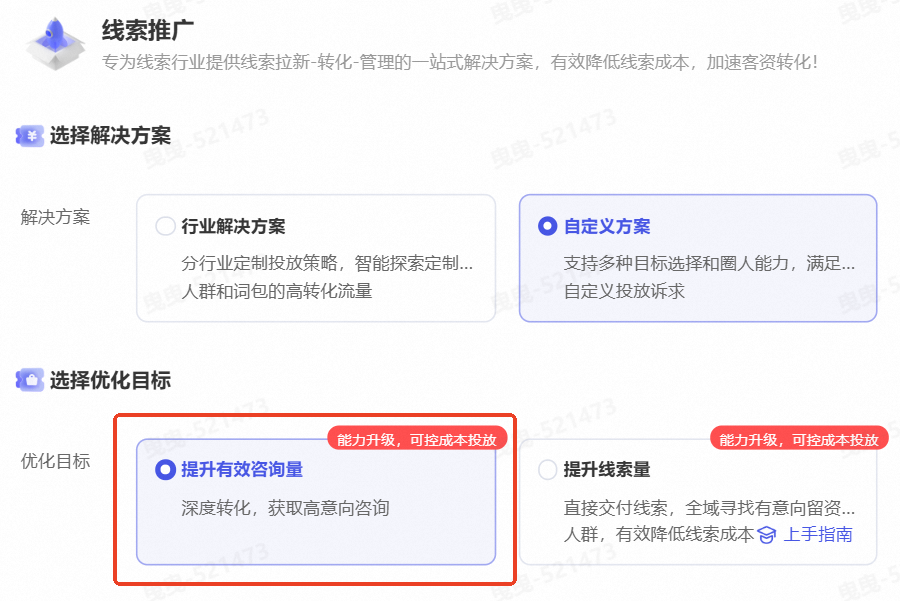

# 「提升有效咨询量」优化目标上线

> 来源：https://alidocs.dingtalk.com/i/nodes/dQPGYqjpJYZnRbNYCBXAw2198akx1Z5N

## 一、产品能力简介

## 一图读懂「千牛客服打标」与「提升有效咨询量」的关系

**千牛客服打标****——告诉平台哪类咨询人群是有效的****：**

**核心功能：**支持客服在千牛-旺旺语聊页面-右侧客户信息下方**【添加备注】**进行咨询打标。

**商家关键行动：当日咨询，当日打标，有意向即判有效。**

**提升有效咨询量——平台帮您找更多有效咨询人群****：**

**核心功能：**是线索推广场景新增的深度转化优化目标。该功能基于店铺专属有效咨询数据构建有效咨询预测模型，将广告投放的优化重心从“获取咨询数量”升级为**“获取符合商家质量标准的有效咨询”**，提升线索质量。

**商家关键行动：必须有咨询打标数据积累才能开启****「提升有效咨询量」****，打标数据才能应用到算法模型训练！！！**（若您的店铺从未进行过有效咨询打标，或打标数据量过少，不建议切换该目标。）

## **自定义人群过滤：新增【店铺咨询人群】及【骚扰咨询人群】**

**能力介绍：**支持商家定向过滤【店铺咨询人群】和【骚扰咨询人群】，避免对历史咨询老客和无效客户触达，将预算集中投向未咨询的潜在新客，提升线索质量和投放效率。

**操作路径：**万相台AI·无界—线索推广—新建计划/老计划—设置过滤人群—屏蔽互动人群—勾选【店铺咨询人群】及【骚扰咨询人群】

# **二、产品使用手册**

## **如何打标？**

**前置准备：**

**操作说明：****第一次使用，必须提前开通【客服咨询打标工具】功能！！！**

**操作路径：**线索管理 — 留资渠道 — 客服咨询打标工具（客户工作台线索管理入口：线索管理）

**千牛客服打标：**当消费者发起旺旺咨询时，客服人员可按以下流程完成咨询打标：

| **第一步：进入打标入口** | **第二步：选择标签** | **第三步：提交保存** |
| --- | --- | --- |
| 于千牛平台旺旺语聊页面右侧，客户信息模块下方，点击**【添加备注】**按钮。 | 系统浮层将展示商家于客户工作台预设的有效标签与无效标签。客服人员根据实际沟通情况，**勾选对应标签**。 | 点击**【保存提交】**按钮完成打标。客户信息模块将新增标签展示项，显示已打标签内容，打标结果实时同步至客户工作台。 |
|  |  |  |

**客服打标手册（至关重要 ⭐）：**

**！！！必须打标有效性，当日咨询，当日打标！！！**操作手册

**打标准确性决定效果上限：**模型完全基于您的打标数据学习。若您将无效咨询误标为有效，模型会学习到错误特征，导致后续投放人群偏移、成本飙升。准确打标是该功能生效的生命线。

**保持打标习惯：**模型需要持续的新鲜数据进行迭代。若停止打标，模型会逐渐老化，无法适应用户意向和市场环境的变化，投放效果会逐步衰减。

## **如何开启投放？**

**计划创建：**在万相台无界版·线索推广新建计划时，您将在优化目标中看到全新选项：【提升有效咨询量】，开启投放

## 如何看数？

实时指标看沟通热度，T+1指标看投放质量。

**⚠️ 重要提示：**
**“有效咨询”相关指标（②③④）均为 T+1 更新。**
**归因截止时间：以 当日24:00 前的最终标记状态为准。**
**例如：5月8日的有效咨询数据，取决于您在5月8日24:00前对咨询的最终标记结果。**

| **指标名称** | **更新频率** | **业务含义** | **备注** |
| --- | --- | --- | --- |
| ① 旺旺咨询率 | 实时更新 | 吸引用户发起咨询的能力 | 仅反映旺资效率，不反映质量 |
| ② 有效咨询量 | T+1 (次日) | 被您认可的高质量潜客数量 | 核心结果指标 |
| ③ 有效咨询率 | T+1 (次日) | 吸引高质量潜客发起咨询的能力 | 核心质量指标 |
| ④ 有效咨询成本 | T+1 (次日) | 获取一个高质量潜客的平均花费 | 核心成本指标 |

## 3. 您的打标操作如何影响数据？

您的每一次打标，产生双重影响：既改变昨天的报表数据，又实时修正明天的算法方向。

| **您的操作动作** | **1. 对【昨日数据】的影响** **(T+1报表)** | **2. 对【算法模型】的影响** **(实时生效)** | **何时在报表看到数据变化？** |
| --- | --- | --- | --- |
| 标记为“有效” | ✅ 有效咨询量 +1 | 🧠 模型学习特征： “这类人是好客户，请多找类似的人。” 👉 后续流量变精准 | T+1日 (即第二天) |
| 标记为“无效” (或把“有效”改为“无效”) | ❌ 有效咨询量不计入 | 🚫 模型排除特征： “这类人不是目标，减少此类推送。” 👉 避免预算浪费 | T+1日 (即第二天) |
| 在 次日 修改 | ⏳ 不影响前一天数据 | 🔄 模型仍会学习： 虽然不改昨天报表，但模型已接收到最新的状态信号，用于指导未来的投放。 | T+2日 （即第三天） |

### 💡 简单案例演示（以5月8日咨询为例）

场景A（补标有效）：
您在 5月8日 24:00 前将5月8日的某客户标记为【有效】。
👉 结果：5月8日报表中，有效咨询量 +1。

场景B（改标无效）：
您先在5月8日 18:00 标记为【有效】，后发现误判，于 5月8日 23:50 改回【无效】。
👉 结果：系统以最后一次操作为准。5月8日报表中，该客户不计入有效咨询量。

场景C（操作过晚）：
您在 5月9日 12:00 后才去标记。
👉 结果：5月8日的数据不会变化。该标记状态将延续至后续周期，但无法修正5月8日的历史报表。

## 4. 打标规则详解：标记一次，管多久？

为避免重复劳动，系统遵循 “30天状态延续” 原则：

状态生效：标记“有效”或“无效”后，该状态在 30天内持续有效。

自动延续：30天内若未操作，该用户再次来访，系统自动沿用之前的标记。

随时覆盖：您可随时修改标记，新状态立即覆盖旧状态，并重新开启30天周期。

过期重置：30天后若无新操作，标记清空，恢复为“未标记”，需重新判断。

### 🖥️ 双端打标，使用场景不同

| **打标入口** | **适用场景** |
| --- | --- |
| 千牛客服端 | 日常接待，快速标记——**标记当日咨询** |
| 妈妈 CRM | 批量复盘，历史补标——**标记历史咨询** |

## 5. 给商家的“黄金操作法则”

**准确第一，速度第二**
👉 因为打标直接训练算法模型，请务必确保标记准确。错误的“有效”标记会导致模型去寻找大量低质流量，造成后续预算浪费。

**想明确有效数据？**
👉 **请务必在 咨询产生当日 24:00 前 完成所有补标和改标操作，即当日咨询，当日打标！！！**

**想看真实的投放质量？**
👉 请关注 T+1日 更新的“有效咨询量”和“有效咨询成本”，这才是最终定稿、可用于决策的数据。

**千牛 vs CRM 怎么选？**

接待时：用千牛随手标，快速标记当前客户有效状态。**（平台建议此方案 ⭐）**

复盘时：用 CRM 批量标，能追溯历史，确保前一天的数据准确无误，同时建立长期的用户画像。

咨询打标操作手册见：

# **三、常见问题 Q&A**

**Q：为什么要精准打标？（至关重要 ⭐）：**打标不仅是为了看报表，更是为了教算法模型如何找对人。

A：您每一次打标，都是在给算法模型下达“寻找这类人”的指令。打标质量直接决定未来的流量质量。

实时学习：您的每一次打标数据，都会实时进入线索推广算法模型。

人群探索：模型会基于您标记为“有效”的客户特征（如年龄、兴趣、行为等）进行学习，并在后续的投放中，自动寻找具备相似特征的潜在客户。

后果：

✅ 打标准确 = 模型学得准 = 后续推流更精准 = 获客成本更低。

❌ 打标随意/错误 = 模型学偏了 = 后续推流不精准 = 浪费预算，成本飙升。

**Q：为什么我刚才标记了有效，报表里没马上变？**

A：“有效咨询量/率/成本”是 T+1 离线指标，需等到次日后才会按最终状态更新。只有“旺旺咨询率”是实时的。

**Q：30天后标记清空了，我需要重新标记吗？**

A：视情况而定。30天后系统不再保留历史标记，若该客户再次咨询，请根据其当下最新意向重新判断并打标；若客户未再次咨询，则无需二次标记。

**Q：我在千牛标记了，为什么CRM里以前的记录没变？**

A：千牛端标记仅同步当天会话。如需修正历史记录的状态及对应的有效咨询量，请直接前往妈妈 CRM 操作，那里的标记具有追溯力。

**Q：****「提升有效咨询量」与「增加有效咨询量」有什么区别？**

A：这两个功能就是一个功能！平台将「增加有效咨询量」升级为「提升有效咨询量」优化目标，主要是借优化目标靠前位置，帮助商家直接看到功能入口。
