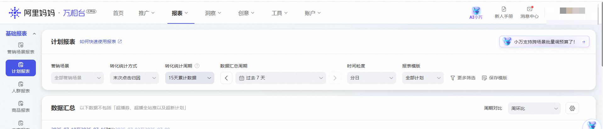
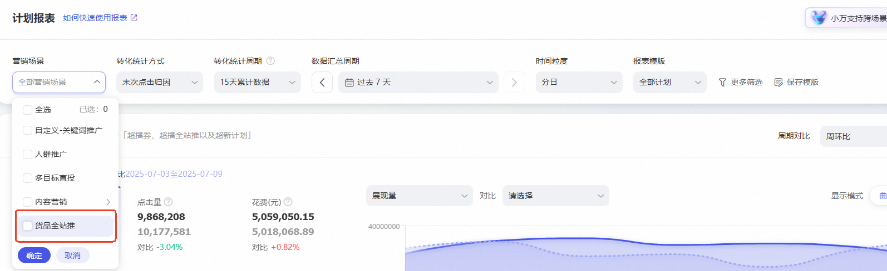
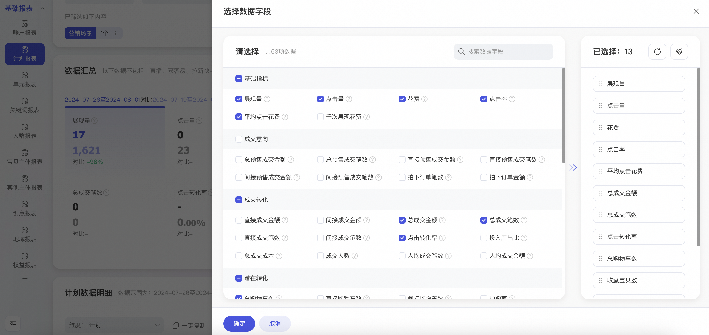

# 【控投产比】能力升级，助力成交增量提升

> 来源：https://alidocs.dingtalk.com/i/nodes/dQPGYqjpJYZnRbNYCEQZMkP18akx1Z5N

**三大核心升级点**

**ROI交付更充分**——> 归因周期由7天升级至15天！

**大促全店拿量更强**——>直接成交升级为全店成交！​

**推广放量能力更快**——> 店铺连带销售提升拿量效率！

## **二、线上产品展示**

|  | 升级点调整 | 页面点位 | 产品图示及说明 |
| --- | --- | --- | --- |
| 投放前 | 目标投产比设置 | 万相台无界-推广页-货品全站推广-新建计划-设置宝贝推广方案 | 目标投产比=推广商品在15日内引导用户产生的所有交易金额/花费 |
| 投放中 | 计划列表默认锚定展示核心投放效果指标：实际投产比、花费、总成交金额 | 万相台无界-推广页-货品全站推广-计划列表 | 实际投产比：实际投产比 = 总成交金额 / 花费，反映花费在15日内带来支付宝成交金额的比例 花费：推广内容被用户点击或发生其他约定计费的行为所花费的金额。说明：如存在报表和实际结算数据不一致，请以财务记录中实际扣款为准。 总成交金额：总成交金额 = 推广商品在15日内引导用户产生的所有支付宝交易的总成交金额 |
| 投放后 | 15天数据归因口径 | 万相台无界-推广页-货品全站推广 |  |
|  |  | 万相台无界-报表-货品全站推广结案 |  |
|  | 货品全站推广结案数据 | 万相台无界-报表-货品全站推广结案 | 精简货品全站推广数据指标，聚焦核心投放目标相关数据。 |

​

注：如果您想查看更多货品全站推广计划相关的数据指标，可以按照以下流程操作：

1、点击「报表」，进入「计划报表」页面

2、在计划报表中将默认的归因周期修改为「15天累计数据」

3、点击「更多筛选」，在营销场景这里选择「货品全站推广」

4、在选择数据字段这里，选中您关注的数据字段进行查看。

