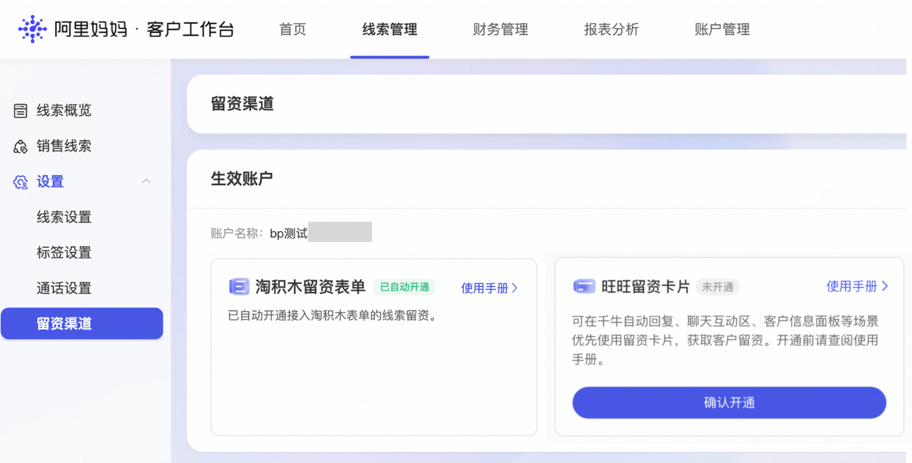
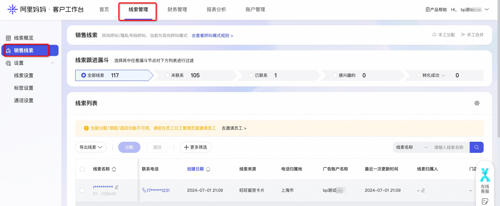
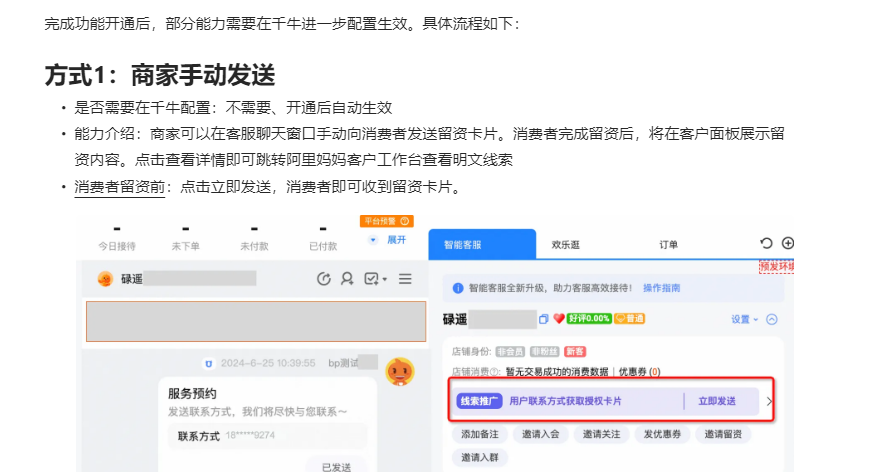

# 【旺资卡片】线索推广旺旺留资卡片介绍

> 来源：https://alidocs.dingtalk.com/i/nodes/dQPGYqjpJYZnRbNYCY5mzad78akx1Z5N

各位商家好，目前淘宝网正在严格治理“诱导第三方”违规行为，旨在营造更为良好的营商环境，保障交易安全、防范欺诈风险、维护诚信卖家及消费者的权益，后续将不允许在旺旺种引导发送微信、电话、外部链接，请各位商家自行排查，若有违规行为，及时调整，触发相关都有可能受到严重处罚。阿里妈妈-线索推广提供官方留资渠道（旺旺留资卡片），消费者通过这些渠道留下的手机号，全部签署过消费者信息授权协议，均为合规获取。

请各位商家尽早配置！

# 1.什么是旺旺留资卡片？

旺旺留资卡片是为投放阿里妈妈【线索推广】的商家提供的线索收集工具。主要解决旺旺咨询场景下，消费者联系方式填写低效，商家无线索收集能力的问题。商家在阿里妈妈客户工作台和千牛工作台完成开通配置后，可以通过**商家手动触发****、****消费者手动触发**、**消费者语义识别**这3种方式，完成对消费者的卡片投送。提升旺旺咨询场景下的留资效率。（2025年9月5日后将支持手机发送旺咨卡片）

| **卡片样式-消费者视角** | **卡片样式-商家视角** |
| --- | --- |

# 2.如何开通旺旺留资卡片？

---

## 2.1 开通条件

**1）商家已经开通了客户工作台【线索管理】功能（报名链接：****https://survey.taobao.com/apps/zhiliao/VENIUcIwa****）**

**2）在【线索推广】场景消耗大于0次日12点生效，**可以自动在阿里妈妈客户工作台开通权限，进入【线索管理】-【设置】-【留资渠道】页面。在旺旺留资卡片下点击【确认开通】即可完成开通。

为进一步优化资源分配，提升服务效率，**自6月30日起**，系统将根据商家近180天在线索推广中的投放消耗情况，智能判断并自动回收旺咨卡片的使用权限。若商家连续180天未在线索推广中产生消耗，卡片权限将暂时回收，待后续重新投放后可再次激活使用。

我们希望通过这一调整，让资源更精准地服务于正在积极获客的商家，也请您根据自身经营节奏合理安排投放计划。如有任何疑问或需要协助，欢迎随时联系我们的客服团队，我们将竭诚为您服务。再次感谢您的理解与支持，祝您生意兴隆，客户不断！

| **项目** | **原规则（6月30日前）** | **新规则升级（7月1日后）** |
| --- | --- | --- |
| **回收触发条件** | 连续 7 天无线索推广场景消耗 | **近 180 天无线索推广场景消耗** |
| **回收生效时间** | 次日回收卡片发送权限 | 次日回收卡片发送权限 |
| **权限恢复方式** | 产生消耗后次日自动恢复 | 产生消耗后次日自动恢复 |

## 2.2 在哪里开通

若商家满足开通条件，登录客户工作台后，进入【线索管理】-【设置】-【留资渠道】页面。在旺旺留资卡片下点击【确认开通】即可完成开通。注意：开通后若连续180天没有线索推广消耗，卡片权限将暂时回收，待后续重新投放后可再次激活使用。

客户工作台线索管理入口：线索管理

**（要点击确认开通才会开！！！）**

# 3.如何配置旺旺留资卡片？

---

完成功能开通后，部分能力需要在千牛进一步配置生效。具体流程如下：

## 方式1：商家手动发送

是否需要在千牛配置：不需要、开通后自动生效

能力介绍：商家可以在客服聊天窗口手动向消费者发送留资卡片。消费者完成留资后，将在客户面板展示留资内容。点击查看详情即可跳转阿里妈妈客户工作台查看明文线索

消费者留资前：点击立即发送，消费者即可收到留资卡片。

消费者留资后：**聊天窗内的留资卡片**展示密文联系方式。**右侧客户面板**展示密文留资信息（留资后需要刷新）。点击查看详情，可以跳转客户工作台使用明文线索。

## 方式2：消费者手动触发

是否需要在千牛配置：是

能力介绍：消费者可以在聊天框点击【预约服务】，可以触发留资卡片。

**商家配置**

商家需要在千牛工作台【客服】-【接待工具】-【聊天窗互动功能】，售前和售后场景下，配置【预约服务】按钮。

**消费者使用**

商家完成配置后，消费者可以在客服聊天框点击【预约服务】，就可以触发留资卡片。

## 方式3：消费者语义识别

是否需要在千牛配置：不需要、开通后自动生效

能力介绍：消费者发送的话语里面包含“如何预约”、“如何联系”、“获取报价”、“获取资料”、“获取方案”这几个关键词时，会自动给消费者发送留资卡片。关键词暂不支持配置修改。

# 4.卡片的使用流程

---

## 4.1消费者发送留资

通过**商家手动触发、消费者手动触发、消费者语义识别**这3种方式，消费者都可以收到留资卡片并通过卡片留下线索数据。

| **step1:收到留资卡片** 默认填写消费者绑定的手机号码，提升留资效率 | **step2:修改联系方式** 默认手机号有误，可以点击编辑信息，在弹出的表单种修改信息。 | **step3:确认发送** 确认号码无误，点击发送，即可向商家发送手机号码。 |
| --- | --- | --- |
|  |  |  |

## 4.2商家查看留资

消费者发送完线索后，商家可以在**千牛工作台**确认留资情况，在**阿里妈妈客户工作台**使用留资线索。

**千牛工作台**

如果消费者刚刚留资，右侧面板需要刷新才能显示留资结果

**客户工作台**

# 5.常见问题

## 1、为什么在客户工作台看不到线索管理入口？

线索管理能力只对部分符合条件的线索行业商家开放。行业要求详见：规则中心。其他请填写问卷进行报名（报名链接：https://survey.taobao.com/apps/zhiliao/VENIUcIwa）

## 2、为什么在客户工作台看不到留资卡片的开通入口？

您刚刚才开始进行【线索收集】推广，需要在产生消耗的第二天12点后才能识别到您的消耗行为。请等到第二天再来开通。

## 3、是否支持在千牛手机端发送卡片？

支持手机端发送，详见文档介绍：

## 4、是否支持消费者在飞猪收到卡片？

暂不支持，会考虑后续迭代

## 5、为什么我的旺咨卡片展示的是「邀请留资」？

邀请留资为特定行业提供的卡片，目前行业卡片和【线索推广】旺旺留资的卡片只会二选一展示。但是如果是从广告点击进来，使用新零售卡片的数据，会同步记录到妈妈客户工作台后台的。

## **6、其他问题咨询钉**群：162575037562
