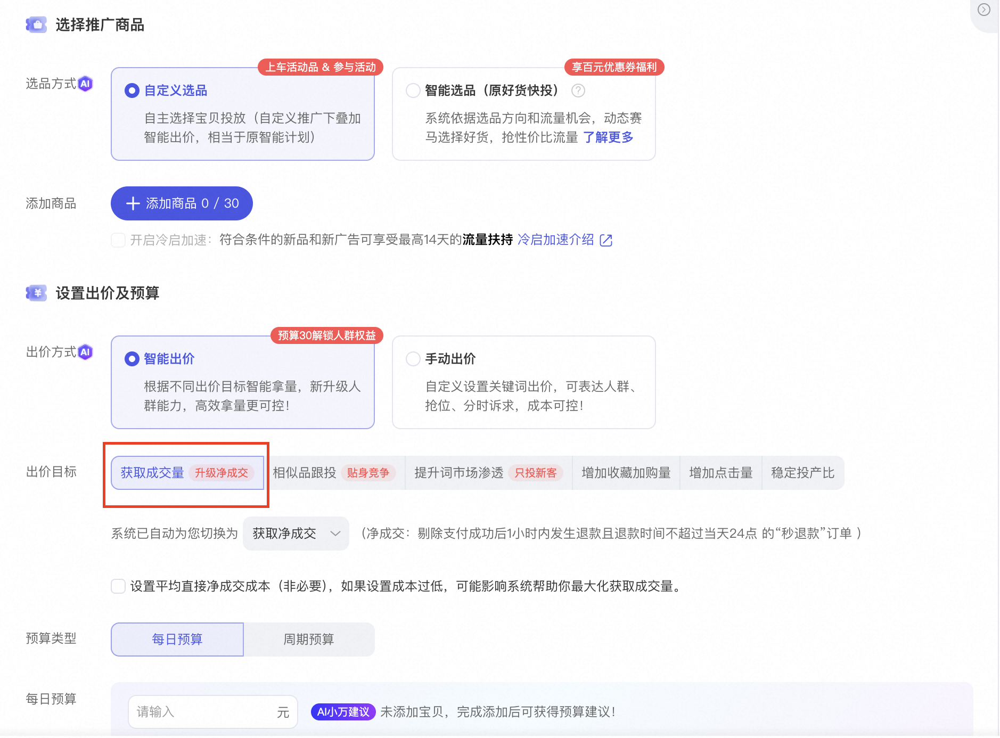
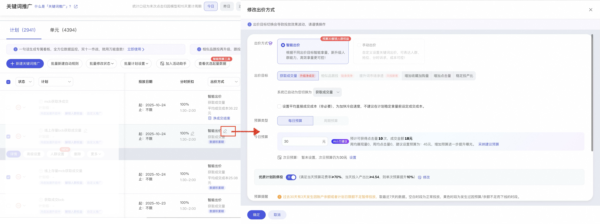
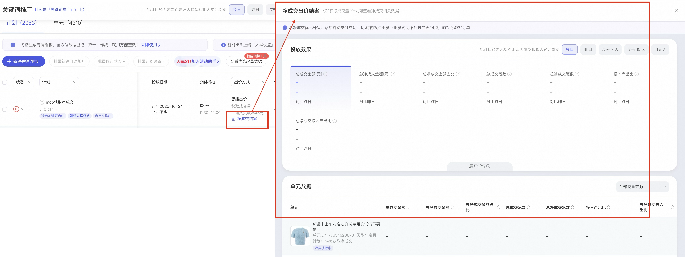
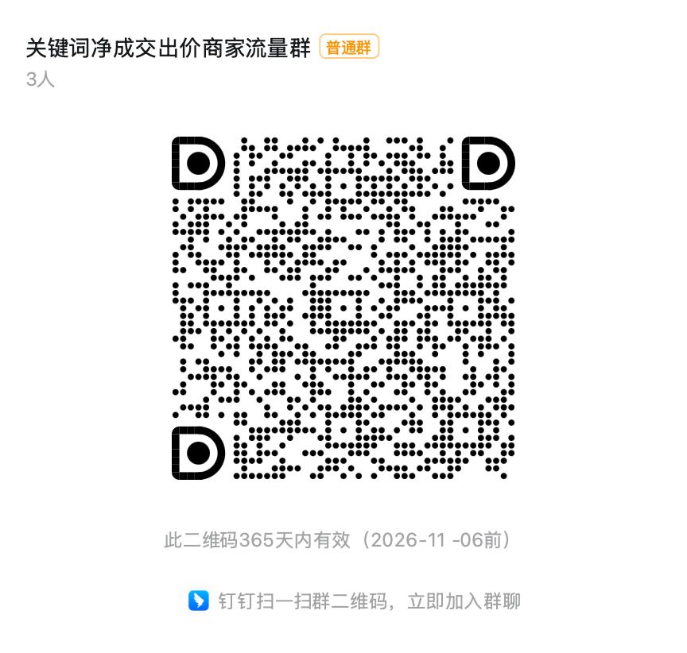

# 智能出价获取成交量 上线「净成交优化目标」（内测中）

> 来源：https://alidocs.dingtalk.com/i/nodes/gvNG4YZ7Jnxop15OCEBa27kvW2LD0oRE

***20260519将原仅支持「获取成交量」设置「净成交目标」升级会支持「获取成交量」、「稳定投产比」两个目标。*

***原已开通净成交设置的商家保持不变。*

***新净成交能力内测中，暂不支持商家报名。请关注产品后台更新进展*

为了降低“秒退款订单”对商家在投放中的影响，并提升智能计划的可控性，关键词自定推广-智能出价「获取成交量」、「稳定投产比」目标的出价能力，**上新「净成交出价」**，支持商家以净成交GMV为出价目标，系统根据商家设定的净成交成本和预算帮助商家投放，提升商家确收GMV。

**请关注 ：**净成交出价**仅支持「获取成交量」、****「稳定投产比」****目标**！

**3 大核心价值**

净成交出价提升计划“真实成交”流量的竞争力，保障拿量质量；

净成交GMV预估，出价调优效果更准确、真实成交更可控；

净成交结案能力，结案更简单、投放效果更直观易读；

💻操作指南：

###### **新建计划：**关键词推广->自定义推广 ->智能出价->获取成交量/稳定投产比

--点我直接去投放 --

*系统已自动为您切换为净成交口径

###### **存量计划切换：**计划列表下 ->出价目标(仅支持 「获成交量」/「稳定投产比」目标) ->一键升级“净成交优化”目标

###### **数据结案查看：**计划列表下 ->出价目标(仅支持 「获成交量」目标/「稳定投产比」目标) ->净成交结案，点击可查看结案数据

# 关键词净成交出价交流群： 165765000637

