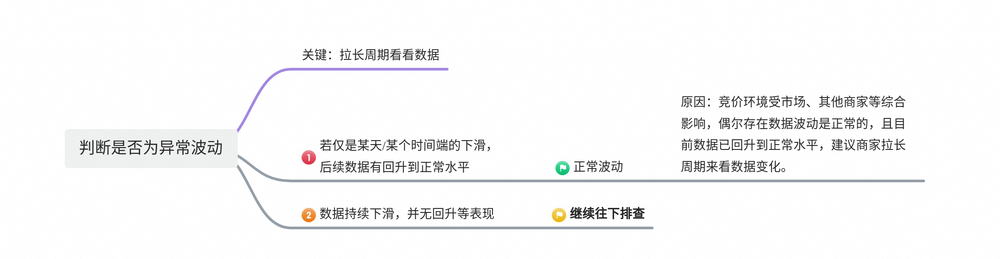
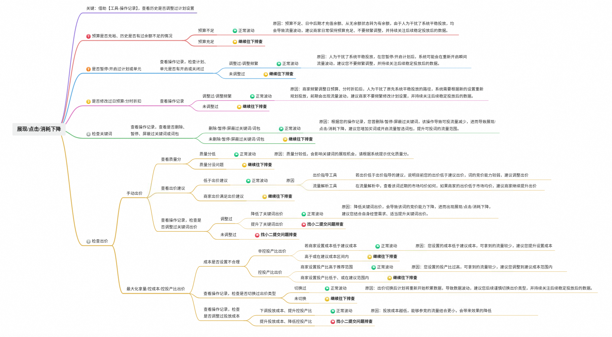
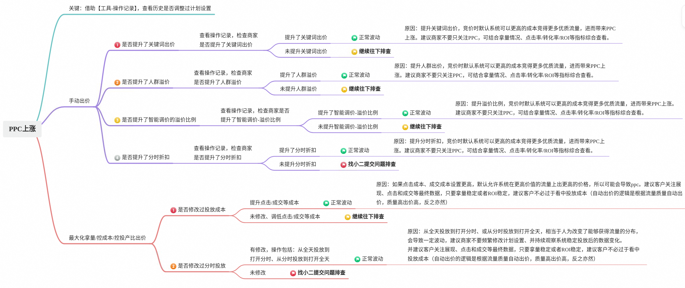
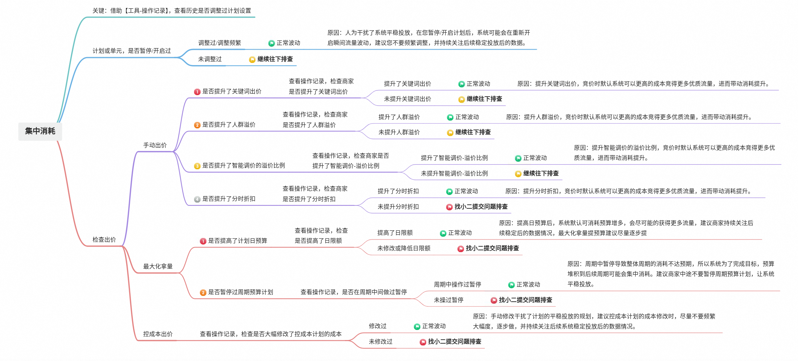
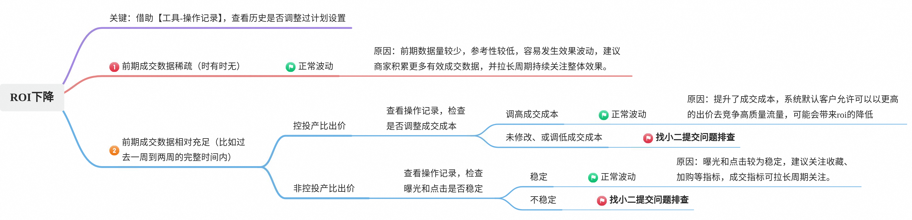
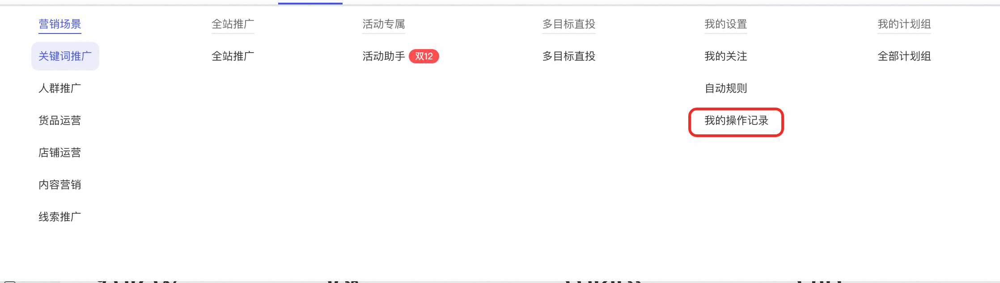
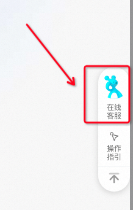
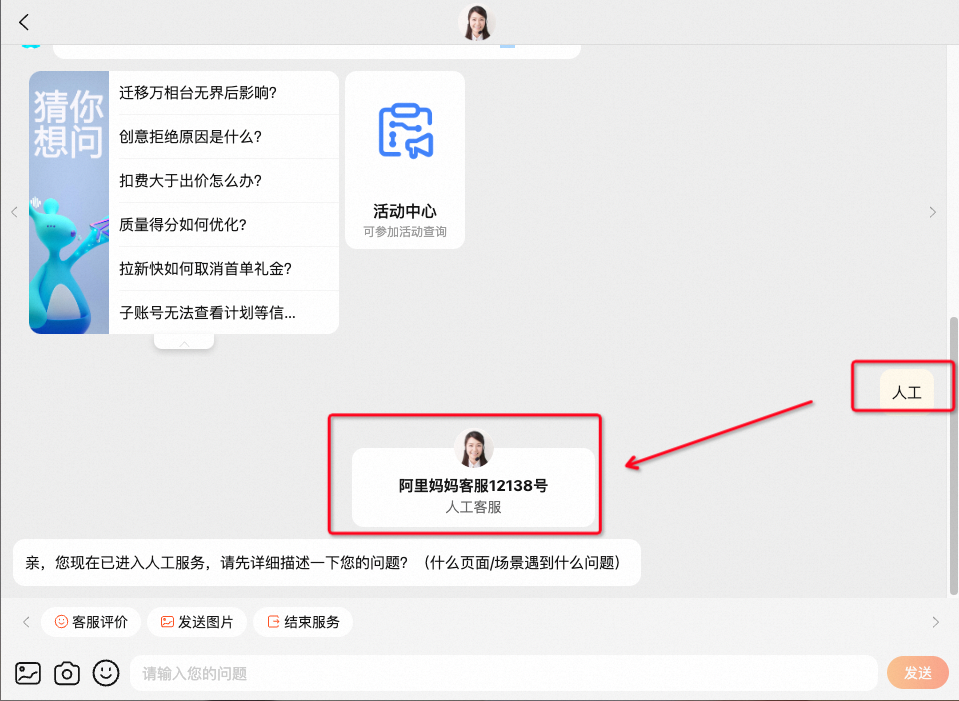

# 效果波动类问题 | 值得收藏的5分钟高效自查手册！

> 来源：https://alidocs.dingtalk.com/i/nodes/gvNG4YZ7Jnxop15OCnK9gbD1W2LD0oRE

**原语雀文档链接：**https://yuque.antfin.com/chenchun.chen/gqhty9/vnxy1sa0dgchn9p0

---

日常广告投放过程中，出现了效果波动类问题怎么办？如『**展现/点击/消耗下降**』、『**PPC上涨**』、『**集中消耗**』、『**ROI下降**』等

为提升问题解决效率，小二为您推荐以下自查手册，并针对不同的情况给出优化建议。

可在5分钟内帮您完成自查，快跟小二一起来看看吧~

# 一、商家自查SOP

## step1：判断是否为异常波动

## step2：分场景进行排查

目前共包括：『展现/点击/消耗下降』、『PPC上涨』、『集中消耗』、『ROI下降』

### 1、展现/点击/消耗下降

### 2、PPC上涨

### 3、集中消耗

### 4、ROI下降

# 二、常见QA

### 1、如何查看操作记录？

操作路径：推广-我的设置-我的操作记录，如下图：

​

### 2、如何找小二提交问题排查

**注意：给小二提交问题排查前，请务必先按照文档自查**

**（1）方式一：商家钉钉群**

在邀请商家迁移万相台无界时，消息里有商家钉钉群的群号，商家可在群里【按照群公告格式】反馈问题。

**（2）方式二：****袋小蜜****在线客服**

登录万相台无界版后台，在右下角可找到在线客服（如下图），商家可

