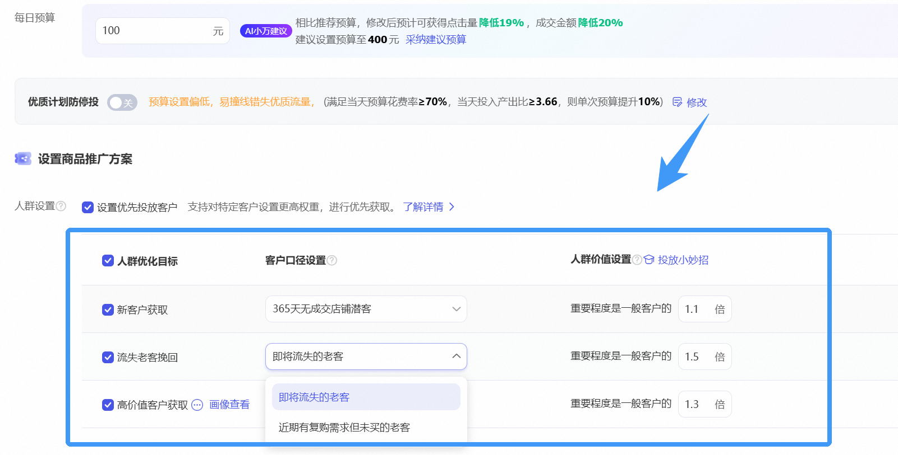
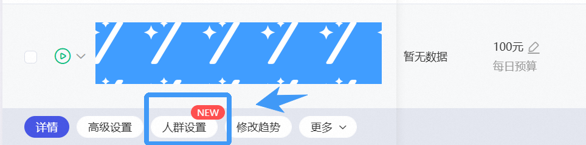
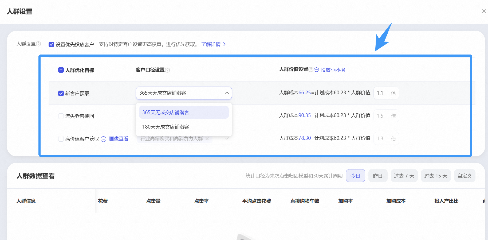

# 「趋势明星」支持人群定向啦，更低成本获取趋势高价值人群！

> 来源：https://alidocs.dingtalk.com/i/nodes/gwva2dxOW4vRkd9DU7LLRvRYJbkz3BRL

# **一、背景**

关键词自定义推广计划-智能出价下目前已实现人群定向，商家朋友表示希望在趋势明星也可以增加人群表达，便于更好的获取精准趋势流量。

# **二、升级简介**

**趋势明星X新建计划：**在趋势明星新建计划流程中，当计划日预算**≥100元**，会出现**【人群设置】**模块

目前支持** [新客、流失老客、行业高价值客户]**三类人群设置

人群价值系数支持**1.1~ 3.0**之间任选，支持多类人群叠加

**趋势明星X存量计划：**符合预算要求的趋势明星存量计划可见**【人群设置】**按钮，点击拉起人群设置浮层，设置优先投放人群

点击打开「人群设置」抽屉，可以设置/修改人群设置配置，可以查看人群数据

