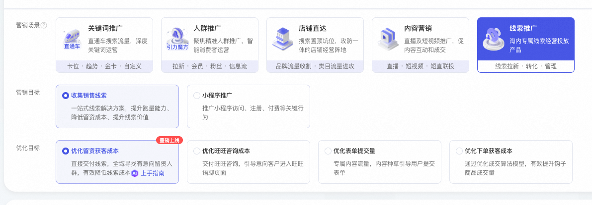
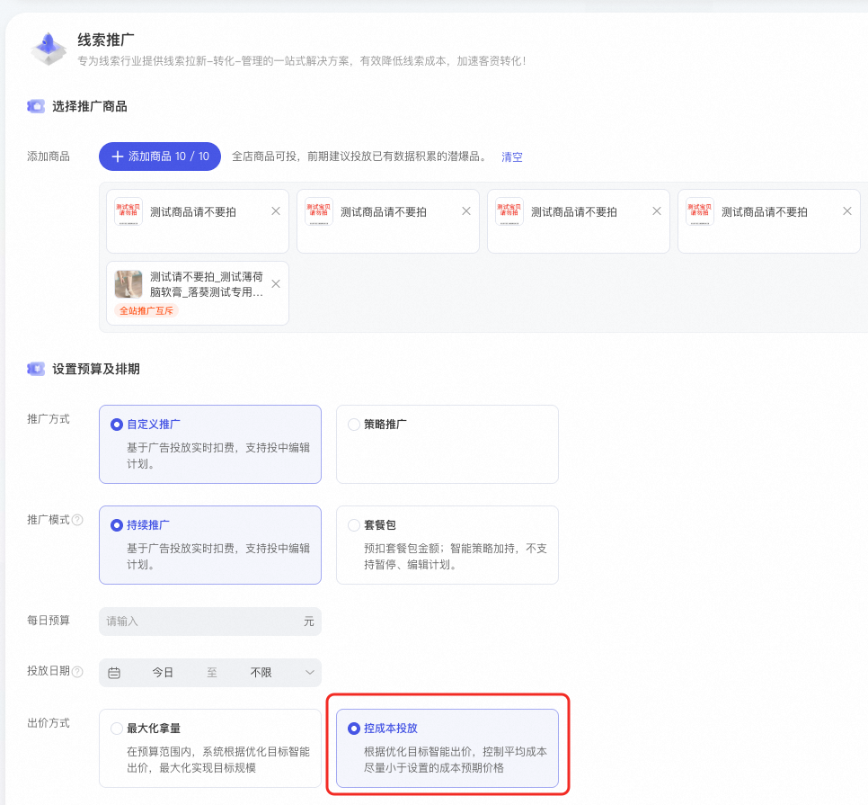
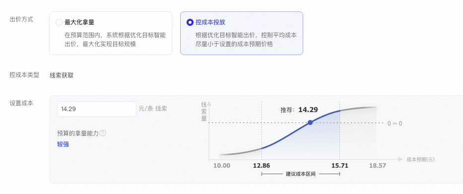
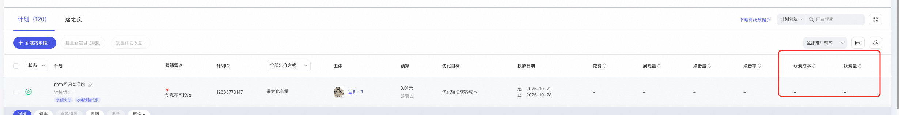
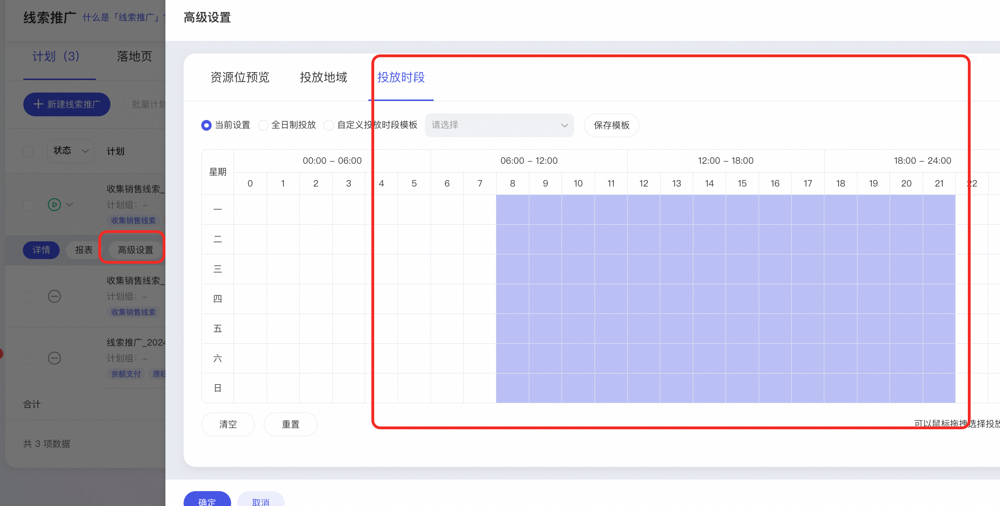

# 线索推广-「优化留资获客」支持控成本投放啦

> 来源：https://alidocs.dingtalk.com/i/nodes/gwva2dxOW4vRkd9DU7vapDByJbkz3BRL

亲爱的商家您好！

为更好满足商家稳定获取客资的诉求，线索推广针对**「优化留资获客」新增控成本出价，线索成本更稳定可控**！

​

## 一、**【优化留资获客】控**成本投放是什么？有什么优势？

**产品介绍**

**【优化留资获客】目标下，新增控成本投放**，是「线索推广」全新上线的出价方式，**可直接交付线索成本（包含旺旺留资+表单留资+下单留资3种渠道的留资）**，帮助商家在全域寻找高意向留资人群，有效提升留资率，降低获客成本！

**🎯产品优势**

**🔥****更可控的线索成本****：算法基于线索预估成交概率出价，在您设置的线索成本一定范围内，****有效触达高意愿留资人群**，针对低意向人群降低出价，减少广告费用的无效使用，把钱花在刀刃上，成本更加可控

**🔥****一键全域获客：**「优化留资获客」目标**可交付多种线索**，线索来源包含旺旺语聊留资、旺咨卡片留资、表单提交留资和商品订单（一个订单也是一条线索），**轻松简单高效！**

**线索留资的定义：在市场营销或销售过程中，潜在客户（即线索）主动提供自己的联系方式（手机号）或个人信息的行为，方便获取进一步信息、服务或优惠，从而成为企业可跟进的潜在客户资源。*

**淘系获取线索的方式：旺旺语聊留资（在旺旺聊天过程中直接发送联系方式）、旺旺卡片留资（通过旺咨卡片获取）、表单留资、商品下单留资（订单信息中也包含电话号码）*

## 二、**操作步骤**

第一步：无界-线索推广，选择“优化留资获客成本”

第二步：添加商品后，设置每日预算，建议在200元及以上；选择自定义推广-持续推广-控成本投放

第三步：设置预期线索成本

第四步：查看计划投放数据，线索成本和线索量

## 三、**常见问题**

### **1、为什么我的店铺还没有升级更新？**

在逐步扩量中

### **2、如果我的线索成本波动，应该怎么优化**

### **3、优化留资和优化旺咨有什么区别？**

【优化留资获客成本】是重点优化线索成本的，【优化旺旺咨询成本】是重点优化旺旺咨询成本的。**如果您要低的旺旺咨询成本，就投「优化旺旺咨询成本」优化目标；如果要低的线索成本，就投「优化留资获客成本」优化目标，请有效取舍哦～​**

### **4、算法智能人群能关闭吗？**

现在暂时不支持，因为有时候黑盒人群的转化效率可能比白盒人群还好～如果觉得黑盒人群和店铺历史行为人群有偏移的话，可以用达摩盘白盒人群进行校准。还有一个原因是，如果关闭的话，白盒人群触达范围是有上限的，可能会存在放不出量的情况。算法黑盒人群会从全网帮你捕捉更多潜客的。

有部分客户智能算法人群表现效果较差，可能是因为算法在推荐场域探索兴趣人群的时候稍稍有些激进，这时需要商家通过绑定达摩盘人群进行校准，同时不断优化主图、商详页，提高承接效率，甚至可以基于不同人群设置不同主图/落地页，利用差异化利益点进行承接。

### **5、分时投放怎么设置？**

线索推广页面中找到计划-高级设置-投放时效

### **6、****我投了这个优化目标，其他的目标还需要投吗？**

由于该优化目标交付指标更偏后链路，因此可能会出现放量受限制的情况，建议您可以在保留原有计划的同时，新建单独的计划进行测试。

​

​**7、其他常见问题：**

​
