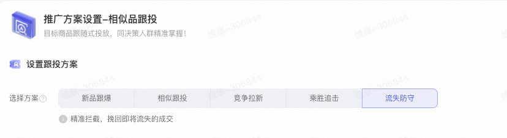
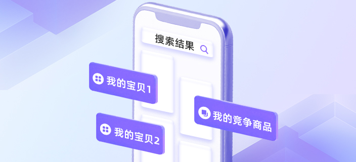
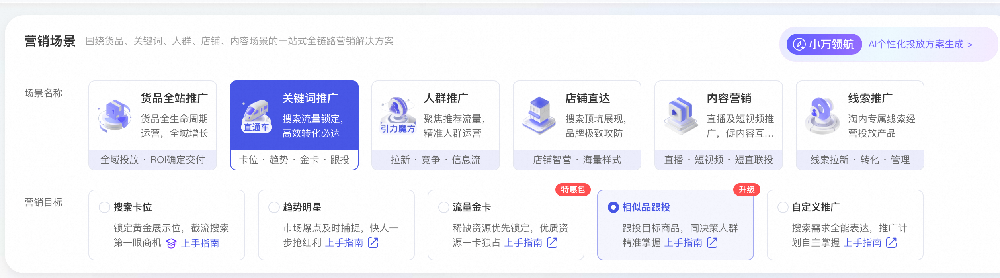
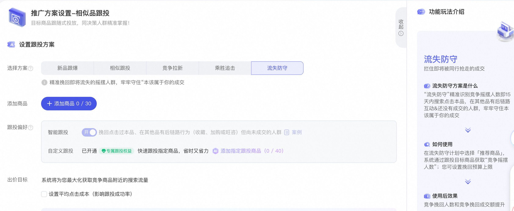
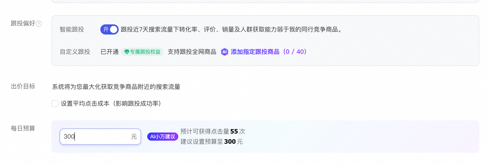
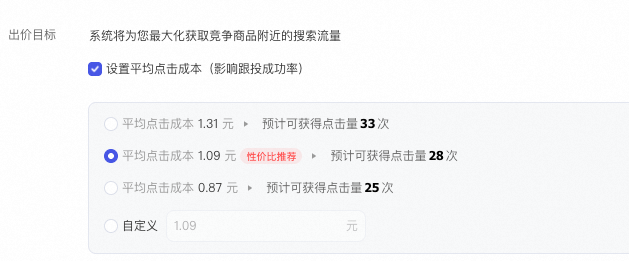
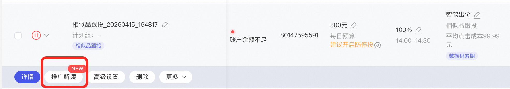
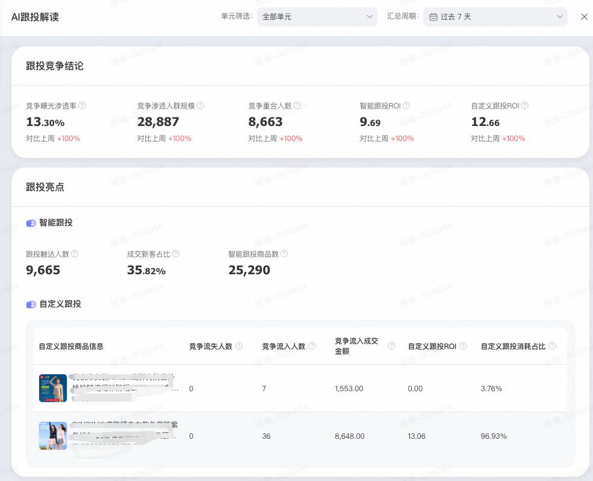

# 「相似品跟投」精准跟投竞争商品流量，让增长主动发生

> 来源：https://alidocs.dingtalk.com/i/nodes/gwva2dxOW4vRkd9DUAMQk0oXJbkz3BRL

🔍 流量红利见顶、获客成本持续攀升，商家普遍面临三大困局：
🔹 流量焦虑：自然搜索流量分散，传统关键词投放难以触达“正在比对竞争商品”的高意向用户
🔹 决策流失：大多数消费者会在购买前主动搜索/浏览竞争商品，但商家缺乏干预能力
🔹 竞争被动：竞争商品截流频发，自身爆品流量被蚕食，缺乏防守与反制手段

相似品跟投这一竞争解决方案，通过锁定用户浏览/搜索竞争商品的关键决策时刻，将您的商品精准推送到高意向人群面前，**实现流量截获、转化提速、份额获取三重突破！**

## 产品核心价值

**新品冷启动“助力”，精准打标**

借力爆品流量池，快速打标、积累权重、助力起量，告别“无人问津”

**拉新竞争商品人群，为店铺获取新客增量**

快速获取高转化新客，突破增长瓶颈

**投放商品摇摆人群，挽回即将流失的成交**

直接挽回潜在成交，提升当日GMV

**跟投自主选择商品，贴身竞争**

锁定用户搜索/浏览竞争商品的高意向时刻，在竞争商品结果页附近精准曝光

## 产品能力

**🔆将您的商品投放和展现在跟投商品的搜索结果附近位置，赢得目标人群关注度****，影响用户决策路径****，带来更精准的流量与转化；支持****五大竞争解决策略，包括新品跟爆、相似跟投、竞争拉新、乘胜追击、流失防守，均支持设置****智能跟投和自定义跟投****。**

**1、五大竞争解决策略 · 按需组合，全域增长**

🚀 **新品跟爆****-****NEW**

**产品能力**：针对新品冷启动难、缺乏人群标签和搜索权重的痛点，“新品跟爆”方案通过AI智能识别店内或行业高转化爆品，自动继承其历史高营销价值人群画像及精准搜索关键词标签，帮助新品实现从0到1成长；支持筛选是否跟投本店爆品，自主可控

**适用场景**：新品上新，无流量、无标签、难起量

🌱 **竞争拉新****-****NEW**

**产品能力**：聚焦解决爆品增长瓶颈，通过实时追踪行业竞争商品的活跃人群，精准筛选其中从未在本店成交的新客，实现“从竞争商品里扩大店铺新客池“。通过同类目竞争商品和跨类目关联商品协同拉新，支持自定义新客口径

**适用场景**：爆品遇到瓶颈，寻求增量市场，希望从竞争商品人群中获取新客

🛡️  **流失防守****-****NEW**

**产品能力**：“流失防守”精准识别竞争摇摆人数即15天内搜索点击本品，在其他品有后链路互动&还没有成交的人群，牢牢守住“本该属于你的成交”。精准触达加购未付等摇摆人群，决策临界点挽回流失，稳固份额

**适用场景**：

商品加购/收藏转化率偏低，存在高流失风险

大促期间需防守核心客群，避免被竞争商品截流

竞争商品频繁降价/发券，需主动稳固用户心智

⚔️ **乘胜追击（原竞争优势跟投）**

**产品能力**：当您的爆品在点击率、转化率、评价等维度显著优于竞争商品时，“乘胜追击”方案将主动识别这些表现弱势的核心同行，在其搜索曝光位加大投放力度，获取其搜索流量与成交份额，放大自身优势

**适用场景**：

店铺已有成熟爆品，需进一步扩大优势

同行商品发起进攻，需主动反击守住份额

大促期间需提升爆品成交规模

**相似跟投**

**产品能力**：精准锁定与本品高度相似的商品（如类目、价格带、功能卖点），主动截取其高转化搜索流量，帮助商品快速成长

**适用场景**：

行业竞争白热化（如美妆、3C、家居），流量高度分散

无明确单一竞争商品，需广覆盖拦截潜在用户

需维持店铺爆品在类目搜索中的稳定排名

**2、**🎯 **仅开启自****定义跟投**

**产品能力**：自主添加目标商品，定向获取指定商品搜索流量，实现“指哪打哪”的精准竞争（关键词场景月消耗≥3万元，每月初自动开通）

**适用场景**：

核心竞争商品定向跟投：锁定3-5个需重点拦截的竞争商品爆款（如竞争商品主推款、对标款），需长期精准跟投

大促抢量：定向跟投竞争商品高流量商品，获取更多大促流量入口，实现销量爆发

**3、新增控成本出价能力-****NEW（少量开放）**

**产品能力**：在相似品跟投计划中（新品跟爆除外），商家可自主设置目标点击成本，系统智能动态调控出价，实际PPC会尽可能稳定在目标值附近

**适用场景**：

起量期：建议关闭，快速积累转化数据，建立精准模型

稳定期：如果您对PPC要求严格，可以开启控成本，PPC更可控

🔆**产品原理：**算法根据根据预估跟投成功率（跟投成功展现量 / 跟投展现量）动态出价，预估跟投成功率越高，出价越高，反之则降低出价，精准获取跟投商品流量。

##

## **玩法建议**

| 策略 | 核心玩法 | 组合建议 |
| --- | --- | --- |
| 🚀 新品跟爆 | ✅ 优先跟投本店爆品 ✅ 选择“同风格+同价格带±20%"爆品 | 💡搭配“相似跟投”扩大曝光 |
| 🔍 相似跟投 | ✅ 设置“价格区间”筛选 ✅ 每周淘汰点击率差的的跟投商品，保持流量精准度 | 💡 与“流失防守”联动：对跟投商品中即将流失用户定向挽回 |
| 🌱 竞争拉新 | ✅ 新客口径选“365天未购” ✅ 创意突出差异化优势（“同配置低20元”“赠品加赠”） | 💡 定向竞争商品主推款和流量爆款，确保新客流量规模 |
| ⚔️ 乘胜追击 | ✅ 聚焦店铺TOP10“高流入度爆品”，预算集中投放 ✅ 大促/竞争商品上新节点，提升出价和预算 | 💡 与“相似跟投”组合：全域覆盖竞争商品流量入口 |
| 🛡️ 流失防守 | ✅ 建议结合优惠券一起挽回，效果更优 | 💡 与“竞争拉新”联合开启 |

## 操作手册

**第一步：关键词场景--新建计划--相似品跟投**

**第二步：根据当前诉求，选择投放方案**

新品希望快速起量和打标：新品跟爆

希望为店铺拉新拓流，获取竞争商品里的店铺新客：竞争拉新

希望放大自身商品优势：乘胜追击

希望挽回摇摆人群：流失防守

希望跟投相似商品：相似跟投

**第三步：选择目标商品**

可以参考系统推荐，建议选择目标商品

**第四步：设置跟投方式、出价和预算**

**1、跟投方式**

新品跟爆：支持在跟投偏好里设置是否跟投本店爆品

相似跟投：支持在跟投偏好里设置价格范围、跟投范围、价格区间

竞争拉新：支持选择新客口径包括90天未购人群、180天未购人群、365天未购人群

**2、出价**

除新品跟爆解决方案外，其余4个解决方案均支持设置点击成本（注意，开启后拿量能力会下降）

**第五步：查看投放数据，在计划列表页点击--推广解读**

## 产品QA

Q：跟投会误伤自家商品或关联店铺吗？
A：新品跟爆计划，在“跟投偏好”支持选择是否跟投本店商品，此外后续会支持在智能跟投里设置商品屏蔽

Q：设置点击成本出价后拿量变少，如何平衡？
A：建议分阶段策略：

起量期：暂不设点击成本，快速积累数据

稳定期：参考【推广解读】中“建议出价”，设置合理成本

Q：非标品（如服饰、家居）适用吗？
A：非常适用！精准锁定目标商品，避免泛流量浪费。

Q：与“竞争拉新”“乘胜追击”如何搭配使用？
A：组合拳效果更佳！

日常防御：相似品跟投（主攻）+ 流失防守（挽回）

大促爆发：相似品跟投（占据跟投品附近搜索位置）+ 乘胜追击（放大优势商品）

拉新专项：竞争拉新（定向新客）+ 相似品跟投（精准场景触达）

**Q：相似品跟投是跟投哪些商品呢？**

A：首先，**计划**默认是智能跟投，系统动态筛选跟投商品，投放在其附近坑位上；其次，您可以额外进行自定义跟投，自主添加希望跟投的商品

**通过智能+自定义共同获取跟投品附近的流量位**

**Q：相似品跟投是否支持仅跟投手动圈选的商品呢？**

**A：**2025年2月后，我们面向符合要求商家开放（关键词月消耗3万及以上商家），如果您有需求，可以加群填表*（群号：63365037566），符合消耗要求的商家可以开通使用*

**Q：相似品跟投是否查看跟投了哪些商品？**

**A：**针对自定义跟投部分，增加具体跟投品，以及跟投品和自身品的点击率对比、转化率对比、竞争流入度、投产等指标；智能跟投部分数据在逐步开放

**Q：智能跟投和自定义跟投选择商品会不会重复？**

**A：**会优先自定义跟投

**Q：相似品跟投是怎么出价的？**

**A：**选定相似品的出价目标后，无需选择设置成本，系统会根据预估跟投成功率，进行动态智能出价，同时兼顾考虑成交因素

**Q：自定义圈选目标相似品时，建议添加多少个宝贝？**

**A：跟投数量越多，获取精准流量的能力越多，通过输入商品标题或商品ID来添加自定义跟投商品。**

**Q：自定义圈选目标相似品时，如何找到宝贝ID？**

**A：**如果您有具体想要跟投的商品，可在PC端淘宝链接的“id=”后查找商品ID；更多操作见：https://www.yuque.com/guoguan-0d07u/ddk8bn/tpexf50tbiszx1qx?singleDoc#《如何查找商品ID》

**Q：跟投成功率是什么？**

**A：**跟投成功率=跟投成功量 / 跟投总展现量

跟投成功是指：1）竞价后，最终你的品展现在相似品附近位置；2）竞价过程中，你的品因为做了出价调整，把相似品位置挤占了，你的品展现了，相似品没展现；

跟投总展现量：包括跟投成功和跟投失败，跟投失败是指：因为当次竞价过程中，受限于和相似品差异过大导致提出价也未获取相似品附近的位置，但是展现在了其他位置

**Q：相似品跟投成功率为什么不是100%？**

A：跟投失败是指：因为当次竞价过程中，受限于和相似品差异过大导致提出价也未获取相似品附近的位置，但是展现在了其他位置

**Q：为什么计划无法只开启自定义跟投？**

A：拥有专属跟投权益后可以仅自定义跟投，要求关键词场景月消耗3万及以上自动开通；没有专属跟投权益的商家，需要在开启自定义跟投的同时开启智能跟投
